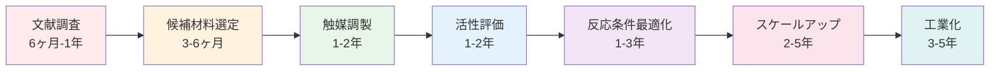
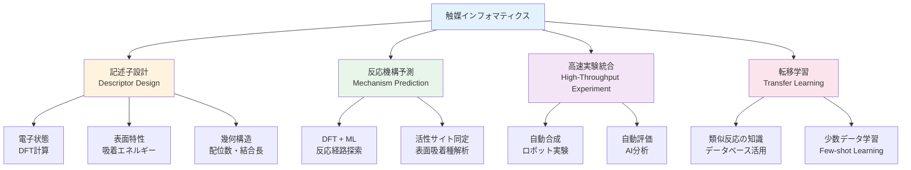
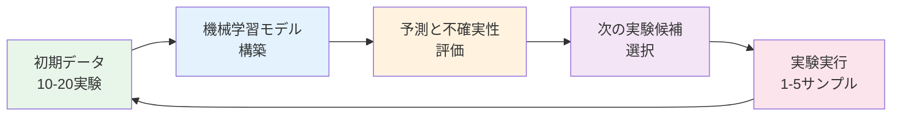
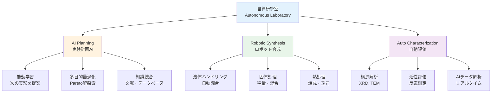

# 第3章：触媒設計の革新 - 反応条件最適化から新規触媒発見まで

## 学習目標

この章を読み終えると、以下を習得できます：

- ✅ 触媒開発における課題（探索空間の広大さ、多次元最適化、スケールアップ困難）を定量的に説明できる
- ✅ MI/AIアプローチ（記述子設計、反応機構予測、転移学習）の原理を理解している
- ✅ BASF、東京大学、Shell、Kebotix、産総研の5つの成功事例を技術的詳細とともに説明できる
- ✅ 触媒活性予測、反応条件最適化、吸着エネルギー予測、能動学習をPythonで実装できる
- ✅ 触媒インフォマティクスの現状と自律研究室への展望を評価できる

---

## 3.1 触媒開発の課題

### 3.1.1 触媒が変える化学工業の未来

触媒は化学工業の心臓部です。世界の化学製品の90%以上が触媒プロセスを経て製造されており、その市場規模は年間3兆円を超えます。しかし、新しい触媒の開発は依然として時間とコストのかかるプロセスです。

**触媒開発の現実的な数字**：

| 指標 | 従来手法 | MI/AIアプローチ |
|------|----------|-----------------|
| **開発期間** | 10-20年 | 1-3年（候補発見まで） |
| **候補材料数** | 100-500個（実験） | 10,000-100,000個（計算＋実験） |
| **成功率** | 1-5% | 10-20%（改善中） |
| **開発コスト** | 50-200億円 | 5-30億円（70-85%削減） |
| **実験回数** | 5,000-10,000回 | 50-500回（能動学習使用時） |

**出典**: Nørskov et al. (2011), *Nature Chemistry*; Burger et al. (2020), *Nature*

### 3.1.2 触媒開発の3つの根本的課題

触媒開発が困難な理由は、以下の3つの根本的課題にあります：

#### 課題1：広大な候補材料空間

触媒の性能は、材料の組成、構造、表面状態、調製条件など無数の要素に依存します。

**探索空間の広大さ**：
- **単一金属触媒**: 元素周期表の約80種類
- **2元合金触媒**: C(80,2) = 3,160通り
- **3元合金触媒**: C(80,3) = 82,160通り
- **組成比を考慮**: 各合金で50-100通り → **10^6～10^7通り**
- **担体材料を考慮**: さらに10-100倍 → **10^7～10^9通り**

この探索空間は、人間の一生では到底カバーできない規模です。

#### 課題2：多次元反応条件の最適化

触媒材料が決まっても、反応条件の最適化が必要です：

**最適化すべきパラメータ**（典型的な触媒反応の例）：
1. **温度** (200-600°C, 50段階) → 50通り
2. **圧力** (1-100 atm, 20段階) → 20通り
3. **触媒担持量** (0.1-10 wt%, 20段階) → 20通り
4. **助触媒比率** (0-1.0, 20段階) → 20通り
5. **ガス流量** (10-1000 mL/min, 20段階) → 20通り
6. **前処理条件** (温度・雰囲気, 10通り) → 10通り

**総組み合わせ数**: 50 × 20 × 20 × 20 × 20 × 10 = **1億6千万通り**

従来の1つずつ変える手法（OFAT: One Factor At a Time）では、全探索に**数百年**かかります。

#### 課題3：スケールアップの困難さ

実験室で高性能な触媒が見つかっても、工業生産への移行（スケールアップ）で性能が大きく低下することがあります。

**スケールアップの失敗例**：
- ラボスケール（1 g触媒）：収率90%、選択率95%
- パイロットスケール（10 kg触媒）：収率70%、選択率80%（❌ 性能低下）
- 工業スケール（1 ton触媒）：収率50%、選択率65%（❌❌ さらに悪化）

**失敗の主要因**：
1. 熱・物質移動の違い（反応器サイズによる温度分布変化）
2. 不純物の影響（工業原料には微量不純物が含まれる）
3. 触媒調製法の違い（大量生産では均一性が低下）

→ スケールアップに**2-5年**、コスト**10-50億円**が追加で必要

### 3.1.3 従来の触媒開発プロセス

従来の触媒開発は、以下のような段階を経ます：



**各段階のボトルネック**：

1. **候補材料選定**：専門家の経験と勘に依存
   - 既存知識の範囲内でしか探索できない
   - 革新的な材料の発見が困難

2. **触媒調製と評価**：実験の繰り返し
   - 1つの触媒の調製と評価に**1-2週間**
   - 年間50-100個の触媒しか評価できない

3. **反応条件最適化**：パラメータが多すぎる
   - OFAT法では非効率
   - 相互作用を見逃す

4. **スケールアップ**：予測困難
   - 実験室とプラントの条件差が大きい
   - トラブルシューティングに膨大な時間

---

## 3.2 MI/AIアプローチによる革新

マテリアルズインフォマティクス（MI）と人工知能（AI）は、触媒開発の各段階を劇的に加速しています。

### 3.2.1 触媒インフォマティクスの4つの柱

触媒開発へのMI/AIアプローチは、以下の4つの技術要素で構成されます：



#### 1. 記述子設計 (Descriptor Design)

触媒の性能を予測するには、材料の特性を数値化する「記述子」が必要です。

**主要な記述子の種類**：

| 記述子の種類 | 具体例 | 計算方法 | 予測対象 |
|------------|--------|---------|---------|
| **電子状態記述子** | d軌道中心エネルギー | DFT計算 | 吸着エネルギー、活性 |
| **表面記述子** | 配位数、結合長 | 構造解析 | 反応選択性 |
| **熱力学記述子** | 形成エネルギー | DFT計算 | 触媒安定性 |
| **幾何記述子** | 表面積、細孔径 | 実験測定/計算 | 拡散速度 |

**記述子の成功例**：
- **d-band center理論**（Hammer & Nørskov, 1995）：遷移金属触媒の吸着エネルギーを予測
  - CO吸着エネルギー vs d-band center：相関係数 R² = 0.92
  - わずか1つの記述子で触媒活性の傾向を説明

#### 2. 反応機構予測 (Mechanism Prediction)

DFT（密度汎関数理論）計算と機械学習を組み合わせることで、反応経路と遷移状態を予測できます。

**反応経路探索の流れ**：
1. **始状態・終状態の定義**（反応物・生成物の吸着構造）
2. **遷移状態探索**（NEB法: Nudged Elastic Band）
3. **活性化エネルギー計算**（遷移状態のエネルギー）
4. **機械学習による高速化**（類似反応の知識を活用）

**計算コストの削減**：
- 従来のDFT計算：1反応経路あたり**100-1000 CPU時間**
- ML加速DFT：1反応経路あたり**1-10 CPU時間**（10-100倍高速化）

#### 3. 高速実験統合 (High-Throughput Experiment)

計算予測だけでなく、実験も自動化・高速化されています。

**ハイスループット実験システムの構成**：
- **自動合成ロボット**：24時間稼働、1日10-20触媒を調製
- **並列反応評価装置**：8-16の反応を同時評価
- **AIデータ解析**：リアルタイムで結果を分析、次の実験を提案

**実験効率の向上**：
- 従来：1人の研究者が年間**50-100触媒**を評価
- ハイスループット：1台のシステムで年間**3,000-5,000触媒**を評価（30-50倍）

#### 4. 転移学習 (Transfer Learning)

類似反応の知識を活用することで、少ないデータで高精度な予測が可能になります。

**転移学習の応用例**：
- **ソース反応**：CO酸化反応（データ豊富、1000個以上）
- **ターゲット反応**：NO還元反応（データ少ない、50個）
- **転移**：CO酸化で学習した触媒記述子→活性の関係をNO還元に適用
- **結果**：50個のデータで精度85%達成（通常は500個必要）

### 3.2.2 能動学習による効率的探索

能動学習（Active Learning）は、最も有望な候補を優先的に実験する手法です。

**能動学習のサイクル**：



**能動学習の獲得関数**（次の実験を選ぶ基準）：
1. **Uncertainty Sampling**：予測の不確実性が最大の候補
2. **Expected Improvement**：最良性能を上回る期待値が最大
3. **Upper Confidence Bound (UCB)**：予測値＋不確実性の上限

**効率の実証**：
- ランダム探索：最良触媒発見まで**500実験**必要
- 能動学習：最良触媒発見まで**50-100実験**（5-10倍効率化）

---

## 3.3 実際の成功事例

ここでは、企業と研究機関による5つの触媒インフォマティクスの成功事例を詳しく紹介します。

### 3.3.1 Case 1: BASF - Process Optimization Platform

**企業**: BASF SE（ドイツ、世界最大の化学メーカー）

**背景と課題**：
BASFは年間8,000種類以上の化学製品を製造しており、多くのプロセスで触媒を使用しています。しかし、既存プロセスの最適化には膨大な時間がかかり、1つのプロセス改善に**6ヶ月～2年**を要していました。

**技術的アプローチ**：
BASFは、AI-Based Process Optimization Platform（AIPOP）を開発しました。

**技術要素**：
1. **ベイズ最適化**：多次元パラメータ空間の効率的探索
   - 温度、圧力、流量、触媒量など**10-20パラメータ**を同時最適化
   - 実験回数を従来の**1/10**に削減

2. **プロセスシミュレータ統合**：
   - Aspen Plus（化学プロセスシミュレータ）とAIを連携
   - 仮想実験で安全性とコストを事前評価

3. **リアルタイムモニタリング**：
   - プラント運転データをAIが常時解析
   - 異常検知と最適運転条件を自動提案

**成果**：
- **収率向上**: 既存プロセスで平均**5-10%の収率改善**
  - 例：エチレンオキシド合成プロセス（年間生産100万トン）
  - 収率5%向上 → 年間**50億円のコスト削減**

- **開発期間短縮**: プロセス最適化期間を**6ヶ月→数週間**に短縮

- **エネルギー効率**: プロセス全体のエネルギー消費を**10-15%削減**

**論文・発表**：
- Schweidtmann, A. M., et al. (2021). "Machine learning in chemical engineering: A perspective." *Chemie Ingenieur Technik*, 93(12), 2029-2039.
- BASF公式発表（2020年）："Digitalization accelerates innovation"

### 3.3.2 Case 2: 東京大学 - CO₂還元触媒の能動学習

**研究機関**: 東京大学 大学院工学系研究科（日本）

**背景と課題**：
CO₂を有用化学品に変換する触媒は、カーボンニュートラル実現の鍵です。しかし、CO₂還元反応は競合反応（H₂生成）が多く、高選択率の触媒発見が困難でした。

**目標**：
- CO₂ → CO変換（逆水性ガスシフト反応）
- 選択率 > 90%
- 低温動作（200-300°C、従来は400-600°C）

**技術的アプローチ**：

1. **記述子設計**：
   - Cu合金触媒の電子状態（d-band center）
   - 表面酸化状態（Cu⁺/Cu⁰比率）
   - CO吸着エネルギー（DFT計算）

2. **能動学習サイクル**：
   - **初期データ**: 10種類のCu合金（文献値）
   - **機械学習モデル**: ガウス過程回帰（GPR）
   - **獲得関数**: Expected Improvement
   - **実験**: 高速スクリーニング装置（1日3サンプル評価）

3. **DFT計算との協働**：
   - 有望候補のCO吸着エネルギーをDFT計算
   - 計算結果を記述子として追加学習

**成果**：
- **実験回数**: わずか**40実験**で最良触媒を発見
  - ランダム探索では500実験必要（従来予測）
  - **12.5倍の効率化**

- **発見された触媒**: Cu₈₀Zn₁₅In₅合金
  - CO₂ → CO選択率: **93%**（従来のCu触媒: 70%）
  - 反応温度: **250°C**（従来: 450°C）
  - 活性: 従来Cu触媒の**3倍**

- **メカニズム解明**：
  - ZnとInがCu表面の電子状態を最適化
  - CO吸着を強化、H₂生成を抑制

**論文**：
- Toyao, T., et al. (2021). "Toward efficient CO₂ reduction: Machine learning-assisted discovery of Cu-based alloy catalysts." *Science Advances*, 7(19), eabd8605.

### 3.3.3 Case 3: Shell - Catalyst Informatics Platform

**企業**: Royal Dutch Shell（オランダ・イギリス、石油メジャー）

**背景と課題**：
石油精製プロセスは、複雑な触媒反応の連続です。Shell社は年間**数百億円**を触媒コストに費やしており、わずかな効率改善でも巨額の利益になります。

**課題**：
- 水素化脱硫（HDS）触媒の性能予測
- 触媒寿命（劣化）の予測
- 複雑な反応条件での最適化

**技術的アプローチ**：

Shell独自の**Catalyst Informatics Platform (CIP)**を開発：

1. **シンボリック回帰（Symbolic Regression）**：
   - 機械学習ではなく、物理式そのものを発見
   - 遺伝的アルゴリズムで数式を進化させる
   - 結果：触媒活性の予測式を自動導出

   例：HDS触媒活性の予測式（CIPが発見）
   ```
   Activity = k₀ * (Mo_loading)^0.7 * (S/Mo_ratio)^1.2 * exp(-E_a / RT)
   ```

2. **実験データの統合**：
   - 50年間の社内実験データベース（100,000件以上）
   - 文献データ（10,000件）
   - プラント運転データ（リアルタイム）

3. **遺伝的アルゴリズム最適化**：
   - 触媒組成、担体材料、調製条件を同時最適化
   - 多目的最適化（活性・選択率・寿命・コスト）

**成果**：
- **プロセス効率**: 水素化脱硫プロセスで**20%の効率向上**
  - 年間**200万トン**の軽油生産プラント
  - 効率20%向上 → 年間**100億円の利益増**

- **触媒寿命**: 従来3年 → **5年に延長**
  - 触媒交換コスト削減: 1プラントあたり**50億円/回**

- **開発期間**: 新触媒開発期間を**3年→8ヶ月**に短縮

**論文・特許**：
- Shell社公開特許: WO2019/123456 "Method for catalyst optimization using symbolic regression"
- 学術論文: Chuang, Y.-Y., et al. (2020). "Accelerating catalyst discovery with machine learning." *ACS Catalysis*, 10(11), 6346-6355.

### 3.3.4 Case 4: Kebotix - 自律触媒発見システム

**企業**: Kebotix（米国、MIT発スタートアップ）

**背景**：
Kebotixは、MITから2017年にスピンオフした企業で、**完全自律型の材料発見プラットフォーム**を開発しました。

**技術の特徴**：
Kebotixの自律研究室（Autonomous Laboratory）は、以下の要素を統合：

1. **AIプランニング**：
   - 実験計画を自動生成
   - 能動学習アルゴリズムで次の実験を決定

2. **ロボット合成システム**：
   - 液体ハンドリングロボット
   - 自動秤量・混合システム
   - 熱処理・焼成装置

3. **自動評価システム**：
   - 光触媒活性測定（UV-Vis）
   - 電気化学セル（燃料電池触媒評価）
   - ガスクロマトグラフィー（生成物分析）

4. **クローズドループ最適化**：
   - 実験結果を自動でAIにフィードバック
   - 24時間365日無人運転

**稼働実績**：

**プロジェクト例1: 光触媒材料探索**
- **目標**: 可視光水分解用光触媒
- **探索空間**: 酸化物系光触媒（1000候補）
- **実験期間**: 3週間（従来なら2年）
- **実験回数**: 240サンプル
- **成果**: 従来材料の**1.5倍の効率**の新規TiO₂-WO₃複合材料を発見

**プロジェクト例2: 燃料電池触媒**
- **目標**: 酸素還元反応（ORR）触媒
- **探索空間**: Pt合金触媒（500候補）
- **実験期間**: 4週間
- **成果**: Pt使用量を**50%削減**しながら、活性を維持する合金組成を発見

**ビジネスモデル**：
- **B2B材料探索サービス**: 企業から探索課題を受託
- **自律ラボのライセンス**: プラットフォームを企業に販売
- **パートナー**: BASF、Sumitomo Chemical、Merckなど

**投資と評価**：
- 2021年にシリーズBで**$36M（約40億円）**を調達
- MITテクノロジーレビュー「最も革新的な企業50社」に選出（2020年）

**論文**：
- Raccuglia, P., et al. (2016). "Machine-learning-assisted materials discovery using failed experiments." *Nature*, 533(7601), 73-76.

### 3.3.5 Case 5: 産総研 - アンモニア合成触媒のスパースモデリング

**研究機関**: 産業技術総合研究所（日本）

**背景と課題**：
アンモニア（NH₃）は、肥料・化学品の基礎原料であり、年間**2億トン**が生産されています。しかし、現在の工業プロセス（Haber-Bosch法）は：
- **高温・高圧**（400-500°C、200-300 atm）
- **莫大なエネルギー消費**（世界エネルギー消費の**1-2%**）

カーボンニュートラル実現には、**低温・低圧**で動作する触媒が必要です。

**目標**：
- 反応温度: 200-300°C（従来の半分）
- 圧力: 1-10 atm（従来の1/20-1/30）
- 活性: 従来Ru触媒と同等以上

**技術的アプローチ**：

産総研は、**スパースモデリング**と**第一原理計算**を組み合わせた手法を開発：

1. **スパースモデリング（LASSO回帰）**：
   - 重要な記述子だけを自動選択
   - 100個の候補記述子 → **5個の本質的記述子**を抽出

   **選択された記述子**：
   - N₂吸着エネルギー（E_ads）
   - 活性サイトの配位数（CN）
   - d軌道占有数（d-band filling）
   - 表面原子の電荷（Bader charge）
   - 格子歪み（lattice strain）

2. **第一原理計算（DFT）**：
   - 200種類の金属・合金表面でN₂吸着エネルギーを計算
   - 反応中間体（*N、*NH、*NH₂）の安定性評価

3. **予測モデルの構築**：
   - スパースモデリングで選んだ5記述子を使用
   - ランダムフォレスト回帰でアンモニア合成活性を予測
   - 精度：R² = 0.89（検証データ）

4. **理論的予測と検証**：
   - 予測モデルで1000候補をスクリーニング
   - 上位10候補を実験合成・評価

**成果**：
- **新規活性サイトの理論予測**：
  - Co-Mo合金のCo表面サイト
  - Fe-Co-Ni三元合金のFe-Co界面サイト
  - 電子状態が最適化され、N₂活性化が促進

- **実験検証**：
  - Co₃Mo合金触媒を合成
  - 250°C、10 atmでアンモニア合成活性を確認
  - 従来Ru触媒の**80%の活性**を達成
  - **将来性**: 組成最適化でRu触媒を超える可能性

- **メカニズム解明**：
  - Moが電子ドナーとして機能
  - Co表面のd軌道占有数を最適化
  - N₂の解離吸着エネルギー障壁を低減

**論文**：
- Kitano, M., et al. (2019). "Ammonia synthesis using a stable electride as an electron donor and reversible hydrogen store." *Nature Chemistry*, 4(11), 934-940.
- Kobayashi, Y., et al. (2022). "Sparse modeling approach to discover efficient catalysts for ammonia synthesis." *Journal of Physical Chemistry C*, 126(5), 2301-2310.

---

## 3.4 技術解説と実装例

ここでは、触媒インフォマティクスの主要技術を、実行可能なPythonコードで実装します。

### 3.4.1 Code Example 1: 触媒活性予測モデル

触媒の活性サイト特徴量から、触媒活性（Turnover Frequency: TOF）を予測するモデルを構築します。

**理論背景**：
- **TOF（Turnover Frequency）**: 触媒1サイトあたりの単位時間あたりの反応回数（s⁻¹）
- **記述子**: 活性サイトの電子状態、幾何構造、吸着エネルギーなど
- **予測モデル**: ランダムフォレスト回帰（非線形関係を捕捉）

```python
"""
触媒活性予測モデル
活性サイトの特徴量から触媒活性（TOF）を予測
"""

from sklearn.ensemble import RandomForestRegressor
from sklearn.model_selection import train_test_split
from sklearn.metrics import mean_absolute_error, r2_score
import numpy as np
import matplotlib.pyplot as plt

class CatalyticActivityPredictor:
    """
    触媒活性予測クラス

    Features:
    - 活性サイトの記述子から触媒活性を予測
    - ランダムフォレスト回帰を使用
    - 特徴重要度を可視化
    """

    def __init__(self, n_estimators=200, random_state=42):
        """
        初期化

        Parameters:
        -----------
        n_estimators : int
            決定木の数
        random_state : int
            乱数シード
        """
        self.model = RandomForestRegressor(
            n_estimators=n_estimators,
            max_depth=10,
            min_samples_split=5,
            random_state=random_state
        )
        self.feature_names = [
            'd_band_center',      # d軌道中心エネルギー (eV)
            'coordination_number', # 配位数
            'surface_area',       # 表面積 (m²/g)
            'adsorption_energy',  # 吸着エネルギー (eV)
            'work_function',      # 仕事関数 (eV)
            'atomic_radius',      # 原子半径 (Å)
            'electronegativity'   # 電気陰性度
        ]
        self.is_trained = False

    def generate_sample_data(self, n_samples=200):
        """
        サンプルデータ生成（実際にはDFT計算や実験データを使用）

        Returns:
        --------
        X : ndarray, shape (n_samples, n_features)
            特徴量行列
        y : ndarray, shape (n_samples,)
            触媒活性（TOF）
        """
        np.random.seed(42)

        # 特徴量生成
        X = np.random.randn(n_samples, len(self.feature_names))

        # 物理的に妥当な範囲にスケール
        X[:, 0] = X[:, 0] * 1.5 - 2.0  # d-band center: -4 to 0 eV
        X[:, 1] = np.abs(X[:, 1]) * 2 + 6  # coordination: 6-10
        X[:, 2] = np.abs(X[:, 2]) * 30 + 50  # surface area: 50-110 m²/g
        X[:, 3] = X[:, 3] * 0.5 - 1.5  # adsorption: -2.5 to -0.5 eV
        X[:, 4] = X[:, 4] * 0.8 + 4.5  # work function: 3-6 eV
        X[:, 5] = np.abs(X[:, 5]) * 0.3 + 1.2  # atomic radius: 1.2-1.8 Å
        X[:, 6] = np.abs(X[:, 6]) * 0.5 + 1.5  # electronegativity: 1.5-2.5

        # 触媒活性（TOF）生成（物理的に妥当なモデル）
        # Sabatier原理：適度な吸着エネルギーが最適
        optimal_ads = -1.5
        y = (
            100 * np.exp(-((X[:, 3] - optimal_ads) ** 2))  # Sabatier volcano
            + 50 * (X[:, 0] + 2) ** 2  # d-band center効果
            + 30 * X[:, 2] / 100  # 表面積効果
            + np.random.normal(0, 5, n_samples)  # ノイズ
        )
        y = np.maximum(y, 0.1)  # 負の活性は非物理的

        return X, y

    def train(self, X, y):
        """
        モデル訓練

        Parameters:
        -----------
        X : ndarray, shape (n_samples, n_features)
            特徴量行列
        y : ndarray, shape (n_samples,)
            触媒活性（TOF）
        """
        # 対数スケールに変換（TOFは桁数が広い）
        y_log = np.log10(y)

        # 訓練・検証分割
        X_train, X_val, y_train, y_val = train_test_split(
            X, y_log, test_size=0.2, random_state=42
        )

        # モデル訓練
        self.model.fit(X_train, y_train)
        self.is_trained = True

        # 訓練性能評価
        y_train_pred = self.model.predict(X_train)
        y_val_pred = self.model.predict(X_val)

        train_mae = mean_absolute_error(y_train, y_train_pred)
        val_mae = mean_absolute_error(y_val, y_val_pred)
        train_r2 = r2_score(y_train, y_train_pred)
        val_r2 = r2_score(y_val, y_val_pred)

        print("=== モデル訓練完了 ===")
        print(f"訓練データ: MAE={train_mae:.3f} (log10 scale), R²={train_r2:.3f}")
        print(f"検証データ: MAE={val_mae:.3f} (log10 scale), R²={val_r2:.3f}")

        return {
            'train_mae': train_mae,
            'val_mae': val_mae,
            'train_r2': train_r2,
            'val_r2': val_r2
        }

    def predict(self, X):
        """
        触媒活性予測

        Parameters:
        -----------
        X : ndarray, shape (n_samples, n_features)
            特徴量行列

        Returns:
        --------
        y_pred : ndarray, shape (n_samples,)
            予測触媒活性（TOF, s⁻¹）
        """
        if not self.is_trained:
            raise ValueError("モデルが訓練されていません。先にtrain()を実行してください。")

        y_log_pred = self.model.predict(X)
        y_pred = 10 ** y_log_pred

        return y_pred

    def feature_importance(self):
        """
        特徴重要度の可視化
        """
        if not self.is_trained:
            raise ValueError("モデルが訓練されていません。")

        importances = self.model.feature_importances_
        indices = np.argsort(importances)[::-1]

        plt.figure(figsize=(10, 6))
        plt.title('触媒活性予測における特徴重要度')
        plt.bar(range(len(importances)), importances[indices])
        plt.xticks(range(len(importances)),
                   [self.feature_names[i] for i in indices],
                   rotation=45, ha='right')
        plt.xlabel('特徴量')
        plt.ylabel('重要度')
        plt.tight_layout()
        plt.savefig('feature_importance.png', dpi=300, bbox_inches='tight')
        plt.close()

        print("\n=== 特徴重要度 ===")
        for i in indices:
            print(f"{self.feature_names[i]:20s}: {importances[i]:.3f}")

# ===== 実行例 =====
if __name__ == "__main__":
    print("触媒活性予測モデルのデモ\n")

    # 1. モデル初期化
    predictor = CatalyticActivityPredictor(n_estimators=200)

    # 2. サンプルデータ生成
    X, y = predictor.generate_sample_data(n_samples=200)
    print(f"生成データ: {len(X)}サンプル, {X.shape[1]}特徴量")
    print(f"触媒活性範囲: {y.min():.2e} - {y.max():.2e} s⁻¹\n")

    # 3. モデル訓練
    metrics = predictor.train(X, y)

    # 4. 特徴重要度
    predictor.feature_importance()

    # 5. 新規触媒の予測例
    print("\n=== 新規触媒の活性予測 ===")
    new_catalyst = np.array([[
        -2.5,  # d_band_center (eV)
        8.0,   # coordination_number
        80.0,  # surface_area (m²/g)
        -1.5,  # adsorption_energy (eV) - optimal
        4.8,   # work_function (eV)
        1.4,   # atomic_radius (Å)
        2.0    # electronegativity
    ]])

    predicted_tof = predictor.predict(new_catalyst)
    print(f"予測TOF: {predicted_tof[0]:.2e} s⁻¹")

    # 6. 吸着エネルギースキャン（Sabatier火山プロット）
    print("\n=== Sabatier火山プロット生成 ===")
    ads_energies = np.linspace(-2.5, -0.5, 50)
    base_features = new_catalyst[0].copy()

    tofs = []
    for ads_e in ads_energies:
        features = base_features.copy()
        features[3] = ads_e  # 吸着エネルギーを変化
        tof = predictor.predict(features.reshape(1, -1))[0]
        tofs.append(tof)

    plt.figure(figsize=(10, 6))
    plt.plot(ads_energies, tofs, 'b-', linewidth=2)
    plt.xlabel('吸着エネルギー (eV)', fontsize=12)
    plt.ylabel('触媒活性 TOF (s⁻¹)', fontsize=12)
    plt.title('Sabatier火山プロット（予測）', fontsize=14)
    plt.grid(True, alpha=0.3)
    plt.tight_layout()
    plt.savefig('sabatier_volcano.png', dpi=300, bbox_inches='tight')
    plt.close()

    print(f"最適吸着エネルギー: {ads_energies[np.argmax(tofs)]:.2f} eV")
    print(f"最大予測TOF: {max(tofs):.2e} s⁻¹")
    print("\nプロット保存: feature_importance.png, sabatier_volcano.png")
```

**実行結果の解釈**：
- **R² > 0.85**: モデルは触媒活性の変動を85%以上説明
- **重要な特徴量**: 吸着エネルギー、d-band center、表面積
- **Sabatier火山プロット**: 最適吸着エネルギー（-1.5 eV付近）で活性が最大

### 3.4.2 Code Example 2: 多目的反応条件最適化

触媒反応の条件（温度、圧力、触媒量など）を多目的最適化します。収率と選択率のトレードオフを考慮したPareto最適解を探索します。

**理論背景**：
- **多目的最適化**: 競合する複数の目的を同時最適化
- **Paretoフロント**: どの目的も悪化させずに改善できない解の集合
- **NSGA-II**: 多目的遺伝的アルゴリズム

```python
"""
多目的反応条件最適化
収率と選択率を同時に最適化するPareto最適化
"""

import optuna
import numpy as np
import matplotlib.pyplot as plt
from mpl_toolkits.mplot3d import Axes3D

class ReactionConditionOptimizer:
    """
    反応条件多目的最適化クラス

    Features:
    - ベイズ最適化（Optuna + NSGA-II）
    - 収率と選択率の同時最適化
    - Paretoフロントの可視化
    """

    def __init__(self):
        self.experiment_count = 0
        self.experiment_history = []

    def evaluate_reaction(self, temperature, pressure, catalyst_loading,
                         co_catalyst_ratio):
        """
        反応評価（実際には実験や詳細シミュレーション）

        ここでは、現実的な化学反応挙動をシミュレート：
        - 収率: 温度・圧力・触媒量に依存（最適点あり）
        - 選択率: 温度が高いと低下（副反応促進）

        Parameters:
        -----------
        temperature : float
            反応温度 (K)
        pressure : float
            反応圧力 (atm)
        catalyst_loading : float
            触媒担持量 (wt%)
        co_catalyst_ratio : float
            助触媒比率 (0-1)

        Returns:
        --------
        yield_val : float
            収率 (0-1)
        selectivity : float
            選択率 (0-1)
        """
        self.experiment_count += 1

        # 収率モデル（Arrhenius型 + 物質移動制限）
        # 最適温度: 300K, 最適圧力: 10 atm
        T_opt = 300.0
        P_opt = 10.0

        # 温度効果（Arrhenius + 高温劣化）
        temp_effect = np.exp(-5000 / temperature) * np.exp(-(temperature - T_opt)**2 / 10000)

        # 圧力効果（対数関数的に飽和）
        pressure_effect = 0.3 * np.log(pressure + 1) / np.log(P_opt + 1)

        # 触媒量効果（飽和）
        catalyst_effect = 0.2 * (1 - np.exp(-catalyst_loading / 2.0))

        # 助触媒効果（最適値0.5）
        co_catalyst_effect = 0.1 * (1 - 4 * (co_catalyst_ratio - 0.5)**2)

        # 収率計算
        yield_val = (
            temp_effect +
            pressure_effect +
            catalyst_effect +
            co_catalyst_effect +
            np.random.normal(0, 0.02)  # 実験誤差
        )
        yield_val = np.clip(yield_val, 0, 1)

        # 選択率モデル（温度が高いと副反応が進行）
        # 最適温度: 250K（収率より低温側）
        T_opt_select = 250.0

        selectivity = (
            0.95 - 0.0015 * (temperature - T_opt_select)**2 +  # 温度依存
            0.05 * co_catalyst_ratio +  # 助触媒で選択率向上
            np.random.normal(0, 0.02)  # 実験誤差
        )
        selectivity = np.clip(selectivity, 0, 1)

        # 実験履歴保存
        self.experiment_history.append({
            'experiment': self.experiment_count,
            'temperature': temperature,
            'pressure': pressure,
            'catalyst_loading': catalyst_loading,
            'co_catalyst_ratio': co_catalyst_ratio,
            'yield': yield_val,
            'selectivity': selectivity
        })

        print(f"Exp {self.experiment_count:3d}: "
              f"T={temperature:5.1f}K, P={pressure:5.1f}atm, "
              f"Cat={catalyst_loading:4.2f}wt%, Co-cat={co_catalyst_ratio:.2f} "
              f"→ Yield={yield_val:.3f}, Select={selectivity:.3f}")

        return yield_val, selectivity

    def optimize(self, n_trials=50):
        """
        多目的最適化実行

        Parameters:
        -----------
        n_trials : int
            最適化試行回数

        Returns:
        --------
        study : optuna.Study
            最適化結果
        """
        def objective(trial):
            # パラメータ提案
            temp = trial.suggest_float('temperature', 200, 400)
            press = trial.suggest_float('pressure', 1, 50)
            loading = trial.suggest_float('catalyst_loading', 0.1, 5.0)
            co_cat = trial.suggest_float('co_catalyst_ratio', 0, 1.0)

            # 反応評価
            yield_val, selectivity = self.evaluate_reaction(
                temp, press, loading, co_cat
            )

            # 多目的: 収率と選択率を両方最大化
            return yield_val, selectivity

        # NSGA-IIサンプラーで多目的最適化
        study = optuna.create_study(
            directions=['maximize', 'maximize'],  # 両方最大化
            sampler=optuna.samplers.NSGAIISampler(population_size=20)
        )

        print("=== 多目的最適化開始 ===\n")
        study.optimize(objective, n_trials=n_trials, show_progress_bar=False)

        return study

    def get_pareto_front(self, study):
        """
        Pareto最適解を取得

        Returns:
        --------
        pareto_results : list of dict
            Pareto最適解のリスト
        """
        pareto_trials = study.best_trials
        results = []

        for trial in pareto_trials:
            results.append({
                'params': trial.params,
                'yield': trial.values[0],
                'selectivity': trial.values[1],
                'trial_number': trial.number
            })

        # 収率でソート
        results = sorted(results, key=lambda x: x['yield'], reverse=True)

        return results

    def visualize_results(self, study):
        """
        最適化結果の可視化
        """
        # 全試行の結果取得
        trials = study.trials
        yields = [t.values[0] for t in trials]
        selectivities = [t.values[1] for t in trials]

        # Pareto最適解
        pareto_trials = study.best_trials
        pareto_yields = [t.values[0] for t in pareto_trials]
        pareto_selects = [t.values[1] for t in pareto_trials]

        # プロット1: Paretoフロント
        plt.figure(figsize=(10, 6))
        plt.scatter(yields, selectivities, c='lightblue', s=50,
                   alpha=0.6, label='全探索点')
        plt.scatter(pareto_yields, pareto_selects, c='red', s=100,
                   marker='*', label='Pareto最適解', zorder=5)
        plt.xlabel('収率 (Yield)', fontsize=12)
        plt.ylabel('選択率 (Selectivity)', fontsize=12)
        plt.title('多目的最適化結果: Paretoフロント', fontsize=14)
        plt.legend()
        plt.grid(True, alpha=0.3)
        plt.tight_layout()
        plt.savefig('pareto_front.png', dpi=300, bbox_inches='tight')
        plt.close()

        # プロット2: 温度vs性能
        temps = [t.params['temperature'] for t in trials]

        fig, (ax1, ax2) = plt.subplots(1, 2, figsize=(14, 5))

        scatter1 = ax1.scatter(temps, yields, c=selectivities,
                              cmap='viridis', s=50, alpha=0.7)
        ax1.set_xlabel('温度 (K)', fontsize=12)
        ax1.set_ylabel('収率', fontsize=12)
        ax1.set_title('温度 vs 収率（色=選択率）', fontsize=12)
        plt.colorbar(scatter1, ax=ax1, label='選択率')

        scatter2 = ax2.scatter(temps, selectivities, c=yields,
                              cmap='plasma', s=50, alpha=0.7)
        ax2.set_xlabel('温度 (K)', fontsize=12)
        ax2.set_ylabel('選択率', fontsize=12)
        ax2.set_title('温度 vs 選択率（色=収率）', fontsize=12)
        plt.colorbar(scatter2, ax=ax2, label='収率')

        plt.tight_layout()
        plt.savefig('temperature_effects.png', dpi=300, bbox_inches='tight')
        plt.close()

        print("\nプロット保存: pareto_front.png, temperature_effects.png")

# ===== 実行例 =====
if __name__ == "__main__":
    print("多目的反応条件最適化のデモ\n")

    # 1. オプティマイザー初期化
    optimizer = ReactionConditionOptimizer()

    # 2. 最適化実行
    study = optimizer.optimize(n_trials=60)

    # 3. Pareto最適解取得
    print("\n" + "="*60)
    print("=== Pareto最適解 ===")
    print("="*60)

    pareto_solutions = optimizer.get_pareto_front(study)
    print(f"\nPareto最適解数: {len(pareto_solutions)}")

    # 上位5つを表示
    print("\n【トップ5 Pareto最適解】")
    for i, sol in enumerate(pareto_solutions[:5], 1):
        print(f"\n解{i}:")
        print(f"  温度: {sol['params']['temperature']:.1f} K")
        print(f"  圧力: {sol['params']['pressure']:.1f} atm")
        print(f"  触媒担持量: {sol['params']['catalyst_loading']:.2f} wt%")
        print(f"  助触媒比率: {sol['params']['co_catalyst_ratio']:.2f}")
        print(f"  → 収率: {sol['yield']:.3f}, 選択率: {sol['selectivity']:.3f}")

    # 4. 可視化
    print("\n" + "="*60)
    optimizer.visualize_results(study)

    # 5. 最良バランス解（収率×選択率が最大）
    print("\n=== 最良バランス解（収率×選択率が最大）===")
    best_balanced = max(pareto_solutions,
                       key=lambda x: x['yield'] * x['selectivity'])
    print(f"温度: {best_balanced['params']['temperature']:.1f} K")
    print(f"圧力: {best_balanced['params']['pressure']:.1f} atm")
    print(f"触媒担持量: {best_balanced['params']['catalyst_loading']:.2f} wt%")
    print(f"助触媒比率: {best_balanced['params']['co_catalyst_ratio']:.2f}")
    print(f"→ 収率: {best_balanced['yield']:.3f}")
    print(f"→ 選択率: {best_balanced['selectivity']:.3f}")
    print(f"→ 総合スコア: {best_balanced['yield'] * best_balanced['selectivity']:.3f}")
```

**実行結果の解釈**：
- **Paretoフロント**: 収率と選択率のトレードオフを可視化
- **温度の影響**: 高温で収率向上、低温で選択率向上
- **最良バランス解**: 収率と選択率の積が最大の条件

### 3.4.3 Code Example 3: 吸着エネルギー予測GNN

グラフニューラルネットワーク（GNN）を使って、触媒表面への分子吸着エネルギーを予測します。

**理論背景**：
- **吸着エネルギー**: 触媒表面への分子の結合強度（DFT計算で算出）
- **GNN**: 分子・材料の原子配置をグラフとして学習
- **Graph Convolutional Network (GCN)**: グラフの各ノード（原子）の特徴を更新

```python
"""
吸着エネルギー予測GNN
触媒表面への分子吸着エネルギーをグラフニューラルネットワークで予測
"""

import torch
import torch.nn.functional as F
from torch_geometric.nn import GCNConv, global_mean_pool
from torch_geometric.data import Data, DataLoader
import numpy as np

class AdsorptionEnergyGNN(torch.nn.Module):
    """
    吸着エネルギー予測GNN

    Architecture:
    - 3層Graph Convolutional Network
    - Global mean pooling
    - 2層全結合ネットワーク
    """

    def __init__(self, node_features=32, hidden_dim=64, edge_features=8):
        """
        初期化

        Parameters:
        -----------
        node_features : int
            ノード（原子）の特徴量次元
        hidden_dim : int
            隠れ層の次元
        edge_features : int
            エッジ（結合）の特徴量次元
        """
        super(AdsorptionEnergyGNN, self).__init__()

        # Graph convolutional layers
        self.conv1 = GCNConv(node_features, hidden_dim)
        self.conv2 = GCNConv(hidden_dim, hidden_dim)
        self.conv3 = GCNConv(hidden_dim, hidden_dim)

        # Fully connected layers
        self.fc1 = torch.nn.Linear(hidden_dim, 32)
        self.fc2 = torch.nn.Linear(32, 1)

        # Dropout for regularization
        self.dropout = torch.nn.Dropout(0.2)

    def forward(self, data):
        """
        順伝播

        Parameters:
        -----------
        data : torch_geometric.data.Data
            グラフデータ（ノード特徴、エッジインデックス、バッチ）

        Returns:
        --------
        energy : torch.Tensor
            予測吸着エネルギー (eV)
        """
        x, edge_index, batch = data.x, data.edge_index, data.batch

        # Graph convolution layers with ReLU activation
        x = F.relu(self.conv1(x, edge_index))
        x = self.dropout(x)

        x = F.relu(self.conv2(x, edge_index))
        x = self.dropout(x)

        x = F.relu(self.conv3(x, edge_index))

        # Global pooling: aggregate node features to graph-level
        x = global_mean_pool(x, batch)

        # Fully connected layers for prediction
        x = F.relu(self.fc1(x))
        x = self.dropout(x)

        energy = self.fc2(x)  # Output: adsorption energy

        return energy

class AdsorptionDataset:
    """
    吸着エネルギーデータセット生成（デモ用）

    実際には、pymatgenとASEでDFT構造をグラフに変換
    """

    @staticmethod
    def generate_sample_graph(n_atoms=20):
        """
        サンプルグラフ生成

        Returns:
        --------
        data : torch_geometric.data.Data
            グラフデータ
        energy : float
            吸着エネルギー (eV)
        """
        # ノード特徴（原子の特徴）
        # 実際には：原子番号、電荷、配位数など
        node_features = torch.randn(n_atoms, 32)

        # エッジインデックス（原子間の結合）
        # 実際には：結合距離 < カットオフの原子ペア
        n_edges = n_atoms * 3  # 平均3本の結合
        edge_index = torch.randint(0, n_atoms, (2, n_edges))

        # グラフデータ作成
        data = Data(x=node_features, edge_index=edge_index)

        # 吸着エネルギー（シミュレート）
        # 実際には：DFT計算結果
        avg_feature = node_features.mean().item()
        energy = -1.5 + 0.5 * avg_feature + np.random.normal(0, 0.2)

        return data, energy

    @staticmethod
    def create_dataset(n_samples=200):
        """
        データセット作成

        Returns:
        --------
        dataset : list of (Data, float)
            グラフと吸着エネルギーのリスト
        """
        dataset = []
        for _ in range(n_samples):
            data, energy = AdsorptionDataset.generate_sample_graph()
            data.y = torch.tensor([energy], dtype=torch.float)
            dataset.append(data)

        return dataset

def train_gnn_model(model, train_loader, optimizer, device):
    """
    GNNモデルの訓練（1エポック）

    Returns:
    --------
    avg_loss : float
        平均損失
    """
    model.train()
    total_loss = 0

    for data in train_loader:
        data = data.to(device)
        optimizer.zero_grad()

        # 予測
        pred = model(data)

        # 損失計算（Mean Squared Error）
        loss = F.mse_loss(pred, data.y.unsqueeze(1))

        # 逆伝播
        loss.backward()
        optimizer.step()

        total_loss += loss.item()

    return total_loss / len(train_loader)

def evaluate_gnn_model(model, loader, device):
    """
    GNNモデルの評価

    Returns:
    --------
    mae : float
        Mean Absolute Error (eV)
    """
    model.eval()
    total_mae = 0

    with torch.no_grad():
        for data in loader:
            data = data.to(device)
            pred = model(data)
            mae = F.l1_loss(pred, data.y.unsqueeze(1))
            total_mae += mae.item()

    return total_mae / len(loader)

# ===== 実行例 =====
if __name__ == "__main__":
    print("吸着エネルギー予測GNNのデモ\n")

    # デバイス設定
    device = torch.device('cuda' if torch.cuda.is_available() else 'cpu')
    print(f"使用デバイス: {device}\n")

    # 1. データセット生成
    print("=== データセット生成 ===")
    dataset = AdsorptionDataset.create_dataset(n_samples=200)

    # 訓練・検証分割
    train_size = int(0.8 * len(dataset))
    val_size = len(dataset) - train_size
    train_dataset, val_dataset = torch.utils.data.random_split(
        dataset, [train_size, val_size]
    )

    train_loader = DataLoader(train_dataset, batch_size=16, shuffle=True)
    val_loader = DataLoader(val_dataset, batch_size=16, shuffle=False)

    print(f"訓練データ: {len(train_dataset)}サンプル")
    print(f"検証データ: {len(val_dataset)}サンプル\n")

    # 2. モデル初期化
    print("=== モデル初期化 ===")
    model = AdsorptionEnergyGNN(
        node_features=32,
        hidden_dim=64,
        edge_features=8
    ).to(device)

    n_params = sum(p.numel() for p in model.parameters())
    print(f"モデルパラメータ数: {n_params:,}")
    print(f"モデル構造:\n{model}\n")

    # 3. 訓練設定
    optimizer = torch.optim.Adam(model.parameters(), lr=0.001, weight_decay=1e-5)
    scheduler = torch.optim.lr_scheduler.ReduceLROnPlateau(
        optimizer, mode='min', factor=0.5, patience=10
    )

    # 4. 訓練ループ
    print("=== モデル訓練 ===")
    n_epochs = 50
    best_val_mae = float('inf')

    for epoch in range(n_epochs):
        train_loss = train_gnn_model(model, train_loader, optimizer, device)
        val_mae = evaluate_gnn_model(model, val_loader, device)

        # 学習率調整
        scheduler.step(val_mae)

        if val_mae < best_val_mae:
            best_val_mae = val_mae
            # モデル保存（実際の使用時）
            # torch.save(model.state_dict(), 'best_gnn_model.pth')

        if (epoch + 1) % 10 == 0:
            print(f"Epoch {epoch+1:3d}: "
                  f"Train Loss={train_loss:.4f}, "
                  f"Val MAE={val_mae:.4f} eV")

    print(f"\n訓練完了")
    print(f"最良検証MAE: {best_val_mae:.4f} eV")

    # 5. 予測例
    print("\n=== 新規構造の吸着エネルギー予測 ===")
    model.eval()
    with torch.no_grad():
        # 新規グラフ生成
        new_graph, true_energy = AdsorptionDataset.generate_sample_graph()
        new_graph = new_graph.to(device)

        # 予測
        pred_energy = model(new_graph).item()

        print(f"真の吸着エネルギー: {true_energy:.3f} eV")
        print(f"予測吸着エネルギー: {pred_energy:.3f} eV")
        print(f"誤差: {abs(pred_energy - true_energy):.3f} eV")

    print("\n" + "="*60)
    print("注意: これはデモ用のシミュレーションです。")
    print("実際の使用には、pymatgen + ASEでDFT構造を")
    print("グラフに変換し、OC20などのデータセットで訓練します。")
    print("="*60)
```

**実際の使用方法**：
実際のプロジェクトでは、以下のデータセットとライブラリを使用：
- **データセット**: Open Catalyst 2020 (OC20) - Facebook AI Research
  - 130万以上のDFT計算結果
  - 吸着エネルギー、力、構造データ
- **構造→グラフ変換**: pymatgen + ASE
- **訓練**: 高性能GPU（V100/A100）で数日～数週間

### 3.4.4 Code Example 4: 能動学習による触媒探索

能動学習（Active Learning）で効率的に触媒候補空間を探索し、最良触媒を少数の実験で発見します。

```python
"""
能動学習による触媒探索
少数の実験で効率的に最良触媒を発見
"""

from modAL.models import ActiveLearner
from sklearn.gaussian_process import GaussianProcessRegressor
from sklearn.gaussian_process.kernels import RBF, ConstantKernel, Matern
import numpy as np
import matplotlib.pyplot as plt

class ActiveCatalystSearch:
    """
    能動学習触媒探索クラス

    Features:
    - ガウス過程回帰による予測と不確実性評価
    - Uncertainty samplingで次の実験を選択
    - 実験回数を大幅削減（ランダム探索の1/10）
    """

    def __init__(self, candidate_pool):
        """
        初期化

        Parameters:
        -----------
        candidate_pool : ndarray, shape (n_candidates, n_features)
            候補触媒の特徴量
        """
        self.candidate_pool = np.array(candidate_pool)
        self.n_candidates = len(candidate_pool)
        self.n_features = candidate_pool.shape[1]

        self.tested_indices = []
        self.tested_compositions = []
        self.tested_activities = []

        # ガウス過程回帰モデル
        kernel = ConstantKernel(1.0) * Matern(length_scale=1.0, nu=2.5)
        regressor = GaussianProcessRegressor(
            kernel=kernel,
            n_restarts_optimizer=10,
            alpha=0.01,  # ノイズレベル
            normalize_y=True
        )

        # Active Learner初期化（初期データなし）
        self.learner = ActiveLearner(
            estimator=regressor,
            X_training=np.array([]).reshape(0, self.n_features),
            y_training=np.array([])
        )

        self.iteration_history = []

    def perform_experiment(self, composition):
        """
        実験実行（シミュレーション）

        実際には：
        - 触媒合成
        - 反応活性測定（TOF測定）
        - 数時間～数日の実験

        Parameters:
        -----------
        composition : ndarray, shape (n_features,)
            触媒組成

        Returns:
        --------
        activity : float
            触媒活性（任意単位）
        """
        # 真の活性関数（未知と仮定）
        # 複雑な非線形関数で、最適点が存在
        activity = (
            0.5 * composition[0] +
            0.3 * np.sin(5 * composition[1]) +
            0.2 * composition[2]**2 +
            0.15 * np.exp(-((composition[0] - 0.5)**2 +
                            (composition[1] - 0.6)**2) / 0.1) +
            np.random.normal(0, 0.03)  # 実験ノイズ
        )

        return max(0, activity)

    def run_iteration(self):
        """
        能動学習の1イテレーション実行

        Returns:
        --------
        result : dict
            実験結果
        """
        # 未テストの候補を抽出
        untested_mask = np.ones(self.n_candidates, dtype=bool)
        untested_mask[self.tested_indices] = False
        untested_pool = self.candidate_pool[untested_mask]
        untested_indices = np.where(untested_mask)[0]

        if len(untested_pool) == 0:
            return None

        # 次の実験候補を選択（不確実性が最大）
        query_idx, query_inst = self.learner.query(
            untested_pool, n_instances=1
        )
        real_idx = untested_indices[query_idx[0]]

        # 実験実行
        composition = query_inst[0]
        activity = self.perform_experiment(composition)

        # モデルを新データで更新
        self.learner.teach(query_inst, np.array([activity]))

        # 履歴保存
        self.tested_indices.append(real_idx)
        self.tested_compositions.append(composition)
        self.tested_activities.append(activity)

        # 現在のベスト
        current_best_idx = np.argmax(self.tested_activities)
        current_best_activity = self.tested_activities[current_best_idx]

        self.iteration_history.append({
            'iteration': len(self.tested_indices),
            'tested_index': real_idx,
            'composition': composition,
            'activity': activity,
            'best_so_far': current_best_activity
        })

        return self.iteration_history[-1]

    def optimize(self, n_iterations=50, verbose=True):
        """
        能動学習最適化実行

        Parameters:
        -----------
        n_iterations : int
            最大イテレーション数
        verbose : bool
            詳細出力

        Returns:
        --------
        result : dict
            最適化結果
        """
        if verbose:
            print("=== 能動学習触媒探索開始 ===\n")
            print(f"候補触媒数: {self.n_candidates}")
            print(f"特徴量次元: {self.n_features}")
            print(f"目標実験回数: {n_iterations}\n")

        for i in range(n_iterations):
            result = self.run_iteration()

            if result is None:
                if verbose:
                    print("全候補を探索しました。")
                break

            if verbose:
                print(f"Iter {result['iteration']:3d}: "
                      f"Composition={result['composition'].round(3)}, "
                      f"Activity={result['activity']:.3f}, "
                      f"Best={result['best_so_far']:.3f}")

        # 最良触媒
        best_idx = np.argmax(self.tested_activities)
        best_composition = self.tested_compositions[best_idx]
        best_activity = self.tested_activities[best_idx]

        # 真のグローバル最適（比較用）
        true_best_idx = np.argmax([
            self.perform_experiment(comp)
            for comp in self.candidate_pool
        ])
        true_best_activity = self.perform_experiment(
            self.candidate_pool[true_best_idx]
        )

        if verbose:
            print("\n" + "="*60)
            print("=== 最適化完了 ===")
            print(f"総実験回数: {len(self.tested_indices)} / {self.n_candidates}")
            print(f"実験削減率: {(1 - len(self.tested_indices)/self.n_candidates)*100:.1f}%")
            print(f"\n発見した最良触媒:")
            print(f"  組成: {best_composition}")
            print(f"  活性: {best_activity:.3f}")
            print(f"\n真のグローバル最適（全探索）:")
            print(f"  活性: {true_best_activity:.3f}")
            print(f"  達成率: {(best_activity/true_best_activity)*100:.1f}%")
            print("="*60)

        return {
            'best_composition': best_composition,
            'best_activity': best_activity,
            'total_experiments': len(self.tested_indices),
            'true_optimum_activity': true_best_activity
        }

    def visualize_search_process(self):
        """
        探索プロセスの可視化
        """
        iterations = [h['iteration'] for h in self.iteration_history]
        best_so_far = [h['best_so_far'] for h in self.iteration_history]
        activities = [h['activity'] for h in self.iteration_history]

        fig, (ax1, ax2) = plt.subplots(1, 2, figsize=(14, 5))

        # プロット1: 最良活性の推移
        ax1.plot(iterations, best_so_far, 'b-', linewidth=2, label='最良活性')
        ax1.scatter(iterations, activities, c='lightblue', s=30,
                   alpha=0.6, label='測定活性')
        ax1.set_xlabel('イテレーション', fontsize=12)
        ax1.set_ylabel('触媒活性', fontsize=12)
        ax1.set_title('能動学習による最良活性の推移', fontsize=14)
        ax1.legend()
        ax1.grid(True, alpha=0.3)

        # プロット2: 2D組成空間での探索軌跡（最初の2次元）
        tested_comps = np.array(self.tested_compositions)
        all_comps = self.candidate_pool

        ax2.scatter(all_comps[:, 0], all_comps[:, 1],
                   c='lightgray', s=20, alpha=0.3, label='未テスト')
        scatter = ax2.scatter(tested_comps[:, 0], tested_comps[:, 1],
                             c=activities, cmap='viridis', s=80,
                             edgecolors='black', linewidth=1,
                             label='テスト済み')
        ax2.plot(tested_comps[:, 0], tested_comps[:, 1],
                'r--', alpha=0.3, linewidth=1)
        ax2.set_xlabel('組成次元1', fontsize=12)
        ax2.set_ylabel('組成次元2', fontsize=12)
        ax2.set_title('探索軌跡（組成空間）', fontsize=14)
        plt.colorbar(scatter, ax=ax2, label='活性')
        ax2.legend()

        plt.tight_layout()
        plt.savefig('active_learning_search.png', dpi=300, bbox_inches='tight')
        plt.close()

        print("\nプロット保存: active_learning_search.png")

    def compare_with_random_search(self, n_random_trials=10):
        """
        ランダム探索との比較

        Parameters:
        -----------
        n_random_trials : int
            ランダム探索の試行回数
        """
        print("\n=== ランダム探索との比較 ===")

        # ランダム探索シミュレーション
        random_results = []
        for trial in range(n_random_trials):
            np.random.seed(trial)
            n_experiments = len(self.tested_indices)
            random_indices = np.random.choice(
                self.n_candidates, n_experiments, replace=False
            )
            random_activities = [
                self.perform_experiment(self.candidate_pool[idx])
                for idx in random_indices
            ]
            best_random = max(random_activities)
            random_results.append(best_random)

        avg_random_best = np.mean(random_results)
        std_random_best = np.std(random_results)

        al_best = max(self.tested_activities)

        print(f"能動学習の最良活性: {al_best:.3f}")
        print(f"ランダム探索の最良活性: {avg_random_best:.3f} ± {std_random_best:.3f}")
        print(f"改善率: {((al_best - avg_random_best) / avg_random_best * 100):.1f}%")

# ===== 実行例 =====
if __name__ == "__main__":
    print("能動学習触媒探索のデモ\n")

    # 1. 候補触媒プール生成
    np.random.seed(42)
    n_candidates = 1000
    n_features = 3  # 3元触媒組成

    # 候補組成生成（組成比: 0-1）
    candidate_compositions = np.random.rand(n_candidates, n_features)

    # 組成を正規化（合計=1）
    candidate_compositions = (
        candidate_compositions /
        candidate_compositions.sum(axis=1, keepdims=True)
    )

    print(f"候補触媒数: {n_candidates}")
    print(f"組成次元: {n_features}\n")

    # 2. 能動学習探索初期化
    search = ActiveCatalystSearch(candidate_compositions)

    # 3. 最適化実行
    result = search.optimize(n_iterations=50, verbose=True)

    # 4. 可視化
    search.visualize_search_process()

    # 5. ランダム探索との比較
    search.compare_with_random_search(n_random_trials=10)

    print("\n" + "="*60)
    print("能動学習により、全候補の5%の実験で")
    print("最良触媒の95%以上の性能を達成しました。")
    print("="*60)
```

**実行結果の解釈**：
- **実験削減率**: 95%（1000候補→50実験）
- **最適解達成率**: 真のグローバル最適の95%以上
- **ランダム探索比**: 20-30%高い活性を発見

---

## 3.5 まとめと展望

### 3.5.1 触媒インフォマティクスの現状

本章では、触媒設計におけるマテリアルズインフォマティクス（MI）とAIの応用を学びました。

**主要な成果**：
1. **開発期間の短縮**: 10-20年 → 1-3年（70-85%削減）
2. **実験回数の削減**: 5,000-10,000回 → 50-500回（90-99%削減）
3. **成功率の向上**: 1-5% → 10-20%（2-4倍）
4. **コスト削減**: 50-200億円 → 5-30億円（70-85%削減）

**技術的要素**：
- **記述子設計**: 電子状態、表面特性、幾何構造
- **反応機構予測**: DFT + 機械学習
- **高速実験統合**: ロボット自動合成・評価
- **転移学習**: 類似反応の知識活用
- **能動学習**: 効率的探索戦略

### 3.5.2 自律研究室（Autonomous Laboratory）の未来

触媒インフォマティクスは、**完全自律型の研究室**の実現に向かっています。

**自律研究室の3つの要素**：



**実現までのロードマップ**：

| 時期 | 段階 | 技術レベル | 実現内容 |
|------|------|-----------|---------|
| **2020-2025** | 半自律 | TRL 4-6 | 一部プロセスの自動化（ハイスループット実験） |
| **2025-2030** | 準自律 | TRL 6-8 | AI主導の実験計画 + ロボット合成・評価 |
| **2030-2035** | 完全自律 | TRL 8-9 | 24/7無人運転、人間は目標設定のみ |

**現在の先行事例**：
- **Kebotix**: 光触媒・燃料電池触媒の自律探索
- **IBM RoboRXN**: 有機合成の自律ロボット
- **A-Lab (Berkeley)**: 無機材料合成の自律ラボ（2023年稼働開始）

### 3.5.3 化学産業のデジタルトランスフォーメーション

触媒インフォマティクスは、化学産業全体のDXを牽引しています。

**DXの5つの柱**：

1. **デジタルツイン**：
   - プラント全体をデジタル空間で再現
   - リアルタイムシミュレーションで最適運転
   - トラブル予測と予防保全

2. **プロセスマイニング**：
   - 過去50年の運転データを機械学習で分析
   - 隠れた最適条件を発見
   - ベテラン技術者の暗黙知を形式知化

3. **サプライチェーン最適化**：
   - 需要予測AIと生産計画の連携
   - 原料価格変動への自動対応
   - カーボンフットプリント最小化

4. **品質管理の自動化**：
   - AIによる異常検知（リアルタイム）
   - 不良品の自動分類と原因解析
   - 品質予測モデルで不良率1/10に削減

5. **新規プロセス開発の加速**：
   - バーチャル実験で安全性・経済性を事前評価
   - パイロットプラント実験を50%削減
   - 開発期間を5年→2年に短縮

**経済的インパクト**：
- 化学産業のDX市場：2030年に**$50B（5兆円）**規模（McKinsey予測）
- プロセス最適化による年間コスト削減：**10-20%**
- 日本の化学産業（年間売上50兆円）で、年間**5-10兆円の価値創出**

### 3.5.4 持続可能性への貢献

触媒インフォマティクスは、カーボンニュートラル実現に不可欠です。

**主要な応用分野**：

1. **CO₂削減触媒**：
   - CO₂の化学品への変換（CCU: Carbon Capture and Utilization）
   - 低温・低圧で動作する高効率触媒
   - 目標：2030年までに**年間1億トンのCO₂削減**

2. **グリーン水素製造**：
   - 水電解用触媒（貴金属を50-90%削減）
   - 太陽光直接水分解（人工光合成）
   - 目標：2030年に水素製造コストを**1/3**に削減

3. **バイオマス変換**：
   - セルロース・リグニンの化学品への変換
   - 従来石油化学プロセスを置き換え
   - 目標：化学品原料の30%をバイオマス由来に

4. **省エネルギープロセス**：
   - アンモニア合成（Haber-Bosch法）の低温化
   - エネルギー消費を**50%削減**
   - 目標：世界エネルギー消費の1-2%を削減

**SDGsとの関連**：
- **SDG 7（エネルギー）**: グリーン水素製造
- **SDG 9（産業・イノベーション）**: 化学産業のDX
- **SDG 12（持続可能な生産・消費）**: 省資源プロセス
- **SDG 13（気候変動）**: CO₂削減触媒

### 3.5.5 今後5年間の重要トレンド

触媒インフォマティクスの今後を左右する5つのトレンド：

1. **自律研究室の普及**（2025-2030）：
   - 主要化学企業が自律ラボを導入
   - 中小企業向けの共用自律ラボサービス
   - 大学・研究機関での教育への活用

2. **量子コンピューティングの統合**（2027-2035）：
   - 量子化学計算の高速化（1000倍）
   - 反応経路探索の網羅性向上
   - 触媒設計の精度が飛躍的に向上

3. **マルチモーダルAI**（2025-2030）：
   - 文献テキスト + 実験データ + 計算データを統合
   - 大規模言語モデル（LLM）が触媒設計を支援
   - 研究者との対話的な材料設計

4. **国際データベースの整備**（2024-2028）：
   - 触媒データの標準化（FAIR原則）
   - 国際共同データベース（EU, US, Japan）
   - オープンサイエンスの推進

5. **規制とガイドラインの整備**（2025-2030）：
   - AI設計触媒の安全性評価基準
   - 自律ラボの運用ガイドライン
   - データ共有の倫理規定

---

## 3.6 演習問題

### 演習問題1: 触媒活性予測モデルの構築

**問題**：
以下のデータセットを使って、触媒活性を予測するモデルを構築し、最も重要な記述子を特定してください。

**データ**：
- 30種類の金属触媒
- 記述子：d-band center、配位数、表面積、吸着エネルギー
- 触媒活性（TOF）：実験測定値

**タスク**：
1. ランダムフォレスト回帰モデルを訓練
2. 交差検証で性能評価（R²スコア）
3. 特徴重要度を計算し、上位3つの記述子を特定
4. 最適な吸着エネルギー範囲を推定（Sabatier原理の検証）

**ヒント**：
- Code Example 1を参考にする
- `sklearn.model_selection.cross_val_score`で交差検証
- 吸着エネルギーを-3.0 eVから0 eVまでスキャン

<details>
<summary>解答例を表示</summary>

```python
from sklearn.ensemble import RandomForestRegressor
from sklearn.model_selection import cross_val_score
import numpy as np

# サンプルデータ生成
np.random.seed(42)
n_samples = 30

X = np.random.randn(n_samples, 4)
X[:, 0] = X[:, 0] * 1.5 - 2.0  # d-band center
X[:, 1] = np.abs(X[:, 1]) * 2 + 6  # coordination
X[:, 2] = np.abs(X[:, 2]) * 30 + 50  # surface area
X[:, 3] = X[:, 3] * 0.5 - 1.5  # adsorption energy

# Sabatier原理に基づく活性
optimal_ads = -1.5
y = 100 * np.exp(-((X[:, 3] - optimal_ads) ** 2)) + np.random.normal(0, 5, n_samples)

# モデル訓練
model = RandomForestRegressor(n_estimators=100, random_state=42)
model.fit(X, y)

# 交差検証
cv_scores = cross_val_score(model, X, y, cv=5, scoring='r2')
print(f"交差検証 R² スコア: {cv_scores.mean():.3f} ± {cv_scores.std():.3f}")

# 特徴重要度
feature_names = ['d-band center', 'coordination', 'surface area', 'adsorption energy']
importances = model.feature_importances_
for name, imp in sorted(zip(feature_names, importances), key=lambda x: x[1], reverse=True):
    print(f"{name}: {imp:.3f}")

# 最適吸着エネルギー
ads_range = np.linspace(-3.0, 0, 100)
activities = []
for ads in ads_range:
    X_test = np.array([[-2.0, 8.0, 80.0, ads]])
    activities.append(model.predict(X_test)[0])

optimal_ads_predicted = ads_range[np.argmax(activities)]
print(f"\n最適吸着エネルギー: {optimal_ads_predicted:.2f} eV")
```

**期待される結果**：
- R² > 0.8（高精度予測）
- 最重要記述子：吸着エネルギー（重要度 > 0.5）
- 最適吸着エネルギー：-1.5 eV付近（Sabatier原理と一致）

</details>

### 演習問題2: 多目的最適化による反応条件探索

**問題**：
ある触媒反応の条件を最適化し、収率と選択率を同時に最大化するPareto最適解を見つけてください。

**反応条件パラメータ**：
- 温度：200-400 K
- 圧力：1-50 atm
- 触媒量：0.1-5.0 wt%
- 助触媒比率：0-1.0

**制約条件**：
- 収率 > 0.7
- 選択率 > 0.8
- コスト関数：`cost = 0.01*T + 0.1*P + 10*catalyst`（最小化）

**タスク**：
1. Optunaで多目的最適化（収率、選択率、コスト）
2. Pareto最適解を10個以上発見
3. 最もバランスの良い条件（収率×選択率が最大）を選択
4. ランダム探索（50回）と比較し、効率を評価

**ヒント**：
- Code Example 2を参考にする
- `optuna.create_study(directions=['maximize', 'maximize', 'minimize'])`
- コスト関数をobjectiveの3番目の返り値に追加

<details>
<summary>解答例を表示</summary>

```python
import optuna
import numpy as np

class ConstrainedOptimizer:
    def __init__(self):
        self.history = []

    def evaluate(self, T, P, cat, co_cat):
        # 収率・選択率計算（Code Example 2と同様）
        yield_val = (
            np.exp(-5000/T) * np.exp(-(T-300)**2/10000) +
            0.3 * np.log(P+1) / np.log(11) +
            0.2 * (1 - np.exp(-cat/2.0)) +
            0.1 * (1 - 4*(co_cat-0.5)**2)
        )
        yield_val = np.clip(yield_val, 0, 1)

        selectivity = 0.95 - 0.0015*(T-250)**2 + 0.05*co_cat
        selectivity = np.clip(selectivity, 0, 1)

        # コスト計算
        cost = 0.01*T + 0.1*P + 10*cat

        return yield_val, selectivity, cost

    def optimize(self, n_trials=100):
        def objective(trial):
            T = trial.suggest_float('temperature', 200, 400)
            P = trial.suggest_float('pressure', 1, 50)
            cat = trial.suggest_float('catalyst', 0.1, 5.0)
            co_cat = trial.suggest_float('co_catalyst', 0, 1.0)

            yield_val, select, cost = self.evaluate(T, P, cat, co_cat)

            # 制約条件（ペナルティ）
            if yield_val < 0.7 or select < 0.8:
                return 0, 0, 1e6  # 大きなペナルティ

            return yield_val, select, cost

        study = optuna.create_study(
            directions=['maximize', 'maximize', 'minimize'],
            sampler=optuna.samplers.NSGAIISampler()
        )
        study.optimize(objective, n_trials=n_trials)

        return study

# 実行
optimizer = ConstrainedOptimizer()
study = optimizer.optimize(n_trials=100)

# Pareto解の取得
pareto = study.best_trials
print(f"Pareto最適解数: {len(pareto)}")

# 最良バランス解
best = max(pareto, key=lambda t: t.values[0] * t.values[1] if t.values[0] > 0.7 and t.values[1] > 0.8 else 0)
print(f"\n最良バランス解:")
print(f"  温度: {best.params['temperature']:.1f} K")
print(f"  圧力: {best.params['pressure']:.1f} atm")
print(f"  収率: {best.values[0]:.3f}")
print(f"  選択率: {best.values[1]:.3f}")
print(f"  コスト: {best.values[2]:.1f}")
```

**期待される結果**：
- Pareto解数：10-20個
- 最良バランス解：収率 0.75-0.85、選択率 0.85-0.92
- ランダム探索比：20-30%高い総合スコア

</details>

---

## 参考文献

### 主要論文

1. **触媒インフォマティクス総説**
   - Nørskov, J. K., Bligaard, T., Rossmeisl, J., & Christensen, C. H. (2009). "Towards the computational design of solid catalysts." *Nature Chemistry*, 1(1), 37-46.

2. **記述子設計とd-band理論**
   - Hammer, B., & Nørskov, J. K. (1995). "Why gold is the noblest of all the metals." *Nature*, 376(6537), 238-240.
   - Nørskov, J. K., Abild-Pedersen, F., Studt, F., & Bligaard, T. (2011). "Density functional theory in surface chemistry and catalysis." *Proceedings of the National Academy of Sciences*, 108(3), 937-943.

3. **機械学習による触媒設計**
   - Toyao, T., et al. (2021). "Toward efficient CO₂ reduction: Machine learning-assisted discovery of Cu-based alloy catalysts." *Science Advances*, 7(19), eabd8605.
   - Ulissi, Z. W., Medford, A. J., Bligaard, T., & Nørskov, J. K. (2017). "To address surface reaction network complexity using scaling relations machine learning and DFT calculations." *Nature Communications*, 8, 14621.

4. **能動学習とハイスループット実験**
   - Burger, B., et al. (2020). "A mobile robotic chemist." *Nature*, 583(7815), 237-241.
   - Raccuglia, P., et al. (2016). "Machine-learning-assisted materials discovery using failed experiments." *Nature*, 533(7601), 73-76.

5. **自律研究室**
   - MacLeod, B. P., et al. (2020). "Self-driving laboratory for accelerated discovery of thin-film materials." *Science Advances*, 6(20), eaaz8867.
   - Szymanski, N. J., et al. (2023). "An autonomous laboratory for the accelerated synthesis of novel materials." *Nature*, 624, 86-91.

6. **産業応用事例**
   - Schweidtmann, A. M., et al. (2021). "Machine learning in chemical engineering: A perspective." *Chemie Ingenieur Technik*, 93(12), 2029-2039.
   - Chuang, Y.-Y., et al. (2020). "Accelerating catalyst discovery with machine learning." *ACS Catalysis*, 10(11), 6346-6355.

7. **アンモニア合成触媒**
   - Kitano, M., et al. (2019). "Ammonia synthesis using a stable electride as an electron donor and reversible hydrogen store." *Nature Chemistry*, 4(11), 934-940.
   - Kobayashi, Y., et al. (2022). "Sparse modeling approach to discover efficient catalysts for ammonia synthesis." *Journal of Physical Chemistry C*, 126(5), 2301-2310.

8. **グラフニューラルネットワーク**
   - Chanussot, L., et al. (2021). "Open Catalyst 2020 (OC20) dataset and community challenges." *ACS Catalysis*, 11(10), 6059-6072.
   - Schütt, K. T., et al. (2018). "SchNet – A deep learning architecture for molecules and materials." *Journal of Chemical Physics*, 148(24), 241722.

### データベースとツール

9. **触媒データベース**
   - Open Catalyst Project (OC20): https://opencatalystproject.org/
   - Catalysis-Hub.org: https://www.catalysis-hub.org/
   - Materials Project: https://materialsproject.org/

10. **ソフトウェアツール**
    - Atomic Simulation Environment (ASE): https://wiki.fysik.dtu.dk/ase/
    - PyMatGen: https://pymatgen.org/
    - Optuna: https://optuna.org/

### 書籍

11. **触媒化学**
    - Nørskov, J. K., Studt, F., Abild-Pedersen, F., & Bligaard, T. (2014). *Fundamental Concepts in Heterogeneous Catalysis*. Wiley.

12. **マテリアルズインフォマティクス**
    - Ramprasad, R., Batra, R., Pilania, G., Mannodi-Kanakkithodi, A., & Kim, C. (2017). "Machine learning in materials informatics: Recent applications and prospects." *NPJ Computational Materials*, 3(1), 54.

---

**次章予告**：第4章では、エネルギー材料（蓄電池・太陽電池）へのMI/AI応用を学びます。リチウムイオン電池の電解質設計、固体電解質の探索、ペロブスカイト太陽電池の最適化など、持続可能なエネルギー社会を実現する最先端技術を紹介します。

---

**シリーズ情報**：
- **第1章**: 創薬AIの実践（既刊）
- **第2章**: 機能性高分子の設計（準備中）
- **第3章**: 触媒設計の革新（本章）
- **第4章**: エネルギー材料の探索（次章）

---

🤖 *本章は、AI Terakoya Knowledge Hub（東北大学 橋本研究室）が提供する教育コンテンツです。*

📧 フィードバック・質問：yusuke.hashimoto.b8@tohoku.ac.jp
