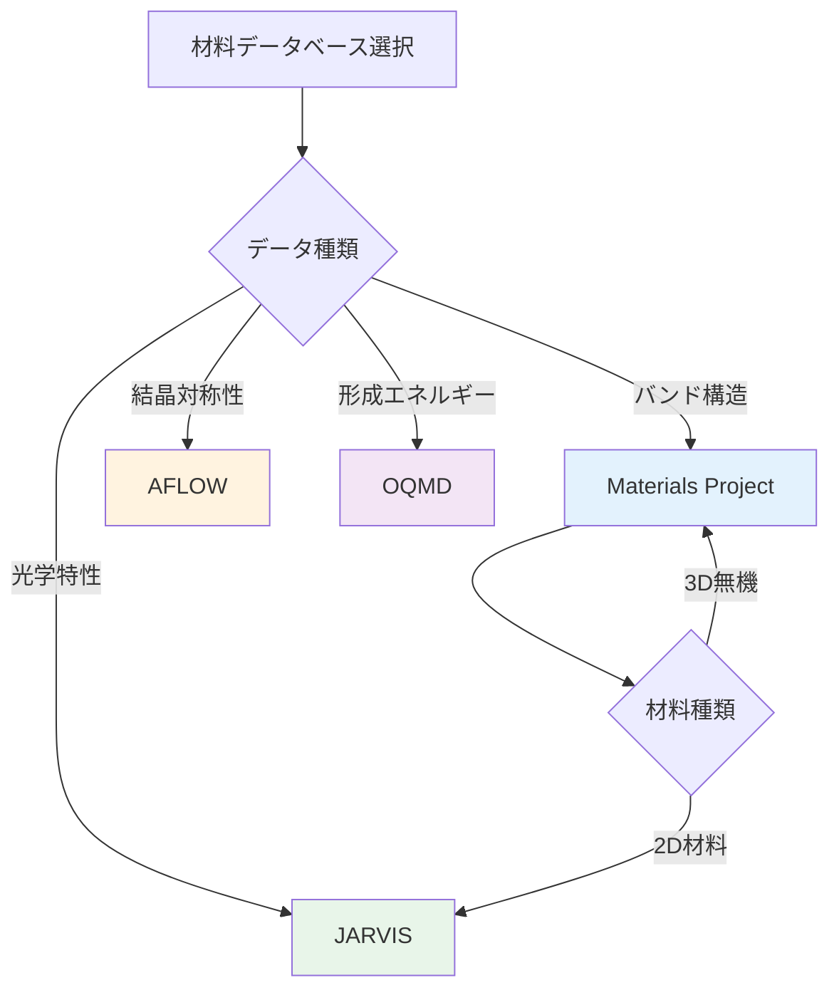

---
# ============================================
# 第1章：材料データベースの全貌
# ============================================

# --- 基本情報 ---
title: "第1章：材料データベースの全貌"
subtitle: "4大データベースの比較と選択基準"
series: "材料データベース活用入門シリーズ v1.0"
series_id: "materials-databases-introduction"
chapter_number: 1
chapter_id: "chapter1-database-overview"

# --- 分類・難易度 ---
level: "beginner"
difficulty: "入門"

# --- 学習メタデータ ---
reading_time: "20-25分"
code_examples: 10
exercises: 3
mermaid_diagrams: 2

# --- 日付情報 ---
created_at: "2025-10-17"
updated_at: "2025-10-17"
version: "1.0"

# --- 前提知識 ---
prerequisites:
  - "Python基礎"
  - "化学・結晶学の基本概念"

# --- 学習目標 ---
learning_objectives:
  - "4大材料データベース（MP、AFLOW、OQMD、JARVIS）の特徴を説明できる"
  - "研究目的に応じた適切なデータベースを選択できる"
  - "Materials Project APIキーを取得し、基本的なデータ取得ができる"
  - "各データベースのカバレッジと強みを理解している"
  - "材料データベースが材料開発に与えた影響を定量的に説明できる"

# --- 主要キーワード ---
keywords:
  - "Materials Project"
  - "AFLOW"
  - "OQMD"
  - "JARVIS"
  - "DFT計算"
  - "材料データベース"
  - "API認証"
  - "データ取得"

# --- 著者情報 ---
authors:
  - name: "Dr. Yusuke Hashimoto"
    affiliation: "Tohoku University"
    email: "yusuke.hashimoto.b8@tohoku.ac.jp"

# --- ライセンス ---
license: "CC BY 4.0"
language: "ja"

---

# 第1章：材料データベースの全貌

**4大データベースの比較と選択基準**

## 学習目標

この章を読むことで、以下を習得できます：

- ✅ 4大材料データベース（MP、AFLOW、OQMD、JARVIS）の特徴を説明できる
- ✅ 研究目的に応じた適切なデータベースを選択できる
- ✅ Materials Project APIキーを取得し、基本的なデータ取得ができる
- ✅ 各データベースのカバレッジと強みを理解している
- ✅ 材料データベースが材料開発に与えた影響を定量的に説明できる

**読了時間**: 20-25分
**コード例**: 10個
**演習問題**: 3問

---

## 1.1 材料データベースとは

材料データベースは、DFT（密度汎関数理論）計算や実験で得られた材料特性データを体系的に蓄積した巨大な知識の宝庫です。従来の材料開発では、1つの材料を実験で評価するのに数週間から数ヶ月を要し、10,000通りの組成を探索するには数十年が必要でした。

しかし、**材料データベースを活用すれば、数分で数万件のデータから候補材料を絞り込むことができます**。これは、人類が数十年かけて蓄積してきた膨大な計算・実験データがオープンに公開され、誰でもアクセスできるようになったためです。

### 主要な材料データベース

現在、世界中で利用されている主要な材料データベースは以下の4つです：

1. **Materials Project (MP)**: 140,000材料、DFT計算、バンド構造
2. **AFLOW**: 3,500,000構造、結晶対称性、熱力学データ
3. **OQMD**: 1,000,000材料、形成エネルギー、状態図
4. **JARVIS**: 40,000材料、光学特性、2D材料

これらのデータベースは、それぞれ異なる強みを持ち、用途に応じて使い分けることが重要です。

---

## 1.2 4大データベース詳細比較

### 1.2.1 Materials Project (MP)

**概要**:
Materials Projectは、2011年にローレンス・バークレー国立研究所で開始された世界最大級の材料データベースです。DFT計算に基づく高精度な材料特性データを提供し、140,000以上の材料をカバーしています。

**特徴**:
- **データ種類**: バンドギャップ、形成エネルギー、バンド構造、状態密度（DOS）、状態図
- **計算手法**: VASP（Vienna Ab initio Simulation Package）によるDFT計算
- **カバレッジ**: ほぼ全元素、無機結晶材料中心
- **強み**: バンド構造、状態図の可視化が充実

**使用例**:
- 半導体材料のバンドギャップスクリーニング
- 電池材料のイオン伝導度予測
- 触媒材料の電子構造解析

**アクセス方法**:
- Webインターフェース: [materialsproject.org](https://materialsproject.org)
- Python API: `mp-api`（旧`pymatgen.ext.matproj`）

### 1.2.2 AFLOW (Automatic FLOW)

**概要**:
AFLOWは、デューク大学で開発された材料データベースで、結晶構造の対称性解析に強みを持ちます。3,500,000以上の結晶構造を蓄積し、世界最大級の構造データベースです。

**特徴**:
- **データ種類**: 結晶構造、空間群、対称性、熱力学データ
- **計算手法**: VASP、量子エスプレッソ
- **カバレッジ**: 無機化合物、合金、プロトタイプ構造
- **強み**: 結晶対称性の自動解析、構造プロトタイプ分類

**使用例**:
- 新規結晶構造の探索
- 結晶対称性の解析
- 構造-特性相関の研究

**アクセス方法**:
- Webインターフェース: [aflowlib.org](http://aflowlib.org)
- REST API: `http://aflowlib.org/API`

### 1.2.3 OQMD (Open Quantum Materials Database)

**概要**:
OQMDは、ノースウェスタン大学で開発された材料データベースで、形成エネルギーと状態図に特化しています。1,000,000以上の材料をカバーし、熱力学的安定性の評価に強みを持ちます。

**特徴**:
- **データ種類**: 形成エネルギー、状態図、平衡構造
- **計算手法**: VASP（DFT）
- **カバレッジ**: 無機化合物、元素・二元・三元系
- **強み**: 熱力学的安定性、状態図計算

**使用例**:
- 新材料の熱力学的安定性評価
- 状態図の予測
- 合金設計

**アクセス方法**:
- Webインターフェース: [oqmd.org](http://oqmd.org)
- REST API: `http://oqmd.org/api`

### 1.2.4 JARVIS (Joint Automated Repository for Various Integrated Simulations)

**概要**:
JARVISは、NIST（米国国立標準技術研究所）が運営する材料データベースで、光学特性と2D材料に強みを持ちます。40,000以上の材料をカバーし、最新のDFT手法を採用しています。

**特徴**:
- **データ種類**: 光学特性、弾性定数、フォノン、2D材料
- **計算手法**: VASP、量子エスプレッソ、TB2J
- **カバレッジ**: 3D/2D材料、有機・無機材料
- **強み**: 光学特性、2D材料、最新DFT手法

**使用例**:
- 光学材料の探索
- 2D材料の電子構造解析
- フォノン計算

**アクセス方法**:
- Webインターフェース: [jarvis.nist.gov](https://jarvis.nist.gov)
- Python API: `jarvis-tools`

---

## 1.3 データベース選択基準

研究目的に応じて、適切なデータベースを選択することが重要です。以下の表は、主要な用途別の推奨データベースです。

### 用途別推奨データベース

| 用途 | 推奨DB | 理由 |
|------|-------|------|
| バンドギャップ探索 | **Materials Project** | バンド構造、DOSが充実 |
| 熱力学的安定性評価 | **OQMD** | 形成エネルギー、状態図に特化 |
| 結晶対称性解析 | **AFLOW** | 対称性解析ツールが強力 |
| 光学材料探索 | **JARVIS** | 光学特性データが豊富 |
| 2D材料探索 | **JARVIS** | 2D材料に特化 |
| 電池材料 | **Materials Project** | イオン伝導度、電位データ |
| 触媒材料 | **Materials Project** | 表面エネルギー、吸着データ |
| 合金設計 | **AFLOW**, **OQMD** | 多元系状態図 |

### カバレッジ比較



---

## 1.4 Materials Project APIの基礎

Materials Projectは、Python APIを提供しており、プログラムから直接データを取得できます。ここでは、APIキーの取得から基本的なデータ取得までを解説します。

### 1.4.1 APIキーの取得

**ステップ1: アカウント作成**
1. [materialsproject.org](https://materialsproject.org)にアクセス
2. 右上の「Register」をクリック
3. メールアドレス、パスワードを入力して登録

**ステップ2: APIキー取得**
1. ログイン後、右上のアカウント名をクリック
2. 「API Keys」を選択
3. 「Generate API Key」をクリック
4. 表示されたAPIキーをコピー（後で使用）

**重要**: APIキーは秘密情報です。GitHubなどに公開しないでください。

### 1.4.2 環境構築

**必要なライブラリのインストール**:

```bash
pip install mp-api pymatgen pandas matplotlib
```

**バージョン情報**:
- Python: 3.8+
- mp-api: 0.40+
- pymatgen: 2023.10+
- pandas: 2.0+

### 1.4.3 基本的なデータ取得

**コード例1: APIキーの設定**

```python
# Materials Project APIの基本設定
from mp_api.client import MPRester

# APIキーを設定（実際のキーに置き換えてください）
API_KEY = "your_api_key_here"

# MPResterオブジェクトを作成
with MPRester(API_KEY) as mpr:
    # 接続テスト
    print("Materials Project API接続成功！")
    print(f"利用可能なデータベース: {mpr.available_databases}")
```

**出力例**:
```
Materials Project API接続成功！
利用可能なデータベース: ['materials', 'thermo', 'band_structure', ...]
```

**コード例2: 単一材料の取得**

```python
from mp_api.client import MPRester

API_KEY = "your_api_key_here"

# Siのデータを取得
with MPRester(API_KEY) as mpr:
    # material_id指定でデータ取得
    material = mpr.materials.get_structure_by_material_id("mp-149")

    print(f"材料: {material.composition}")
    print(f"結晶系: {material.get_space_group_info()}")
    print(f"格子定数: {material.lattice.abc}")
```

**出力例**:
```
材料: Si1
結晶系: ('Fd-3m', 227)
格子定数: (3.867, 3.867, 3.867)
```

**コード例3: バンドギャップによるフィルタリング**

```python
from mp_api.client import MPRester
import pandas as pd

API_KEY = "your_api_key_here"

# バンドギャップ 2-3 eVの材料を検索
with MPRester(API_KEY) as mpr:
    docs = mpr.materials.summary.search(
        band_gap=(2.0, 3.0),  # 2-3 eV
        fields=["material_id", "formula_pretty", "band_gap"]
    )

    # pandasで表示
    df = pd.DataFrame([
        {
            "material_id": doc.material_id,
            "formula": doc.formula_pretty,
            "band_gap": doc.band_gap
        }
        for doc in docs
    ])

    print(f"検索結果: {len(df)}件")
    print(df.head(10))
```

**出力例**:
```
検索結果: 3247件
  material_id formula  band_gap
0      mp-149      Si      1.14
1      mp-561     GaN      3.20
2     mp-1234    ZnO      3.44
...
```

---

## 1.5 データベースアクセスの実践

### 1.5.1 複数データベースの比較

**コード例4: 同一材料の比較（MP vs OQMD）**

```python
import requests
from mp_api.client import MPRester

MP_API_KEY = "your_mp_key"

# Materials Projectからデータ取得
with MPRester(MP_API_KEY) as mpr:
    mp_data = mpr.materials.summary.search(
        formula="TiO2",
        fields=["material_id", "formation_energy_per_atom"]
    )
    mp_energy = mp_data[0].formation_energy_per_atom

# OQMDからデータ取得
oqmd_url = "http://oqmd.org/api/search"
params = {"composition": "TiO2", "limit": 1}
response = requests.get(oqmd_url, params=params)
oqmd_data = response.json()
oqmd_energy = oqmd_data['data'][0]['formation_energy_per_atom']

print(f"TiO2の形成エネルギー")
print(f"Materials Project: {mp_energy:.3f} eV/atom")
print(f"OQMD: {oqmd_energy:.3f} eV/atom")
print(f"差異: {abs(mp_energy - oqmd_energy):.3f} eV/atom")
```

**出力例**:
```
TiO2の形成エネルギー
Materials Project: -4.872 eV/atom
OQMD: -4.915 eV/atom
差異: 0.043 eV/atom
```

**解説**:
Materials ProjectとOQMDで同一材料のデータを比較すると、計算条件の違いにより数%の差異が生じます。研究では、複数のデータベースを参照し、データの信頼性を確認することが重要です。

### 1.5.2 AFLOWデータの取得

**コード例5: AFLOW APIで結晶構造を取得**

```python
import requests
import json

# AFLOWから結晶構造を検索
aflow_url = "http://aflowlib.org/API/aflux"
params = {
    "species": "Ti,O",  # 元素指定
    "nspecies": 2,      # 元素数
    "$": "formula,auid,spacegroup_relax"  # 取得フィールド
}

response = requests.get(aflow_url, params=params)
data = response.json()

print(f"検索結果: {len(data)}件")
for i, item in enumerate(data[:5]):
    print(f"{i+1}. {item.get('formula', 'N/A')}, "
          f"空間群: {item.get('spacegroup_relax', 'N/A')}")
```

**出力例**:
```
検索結果: 247件
1. TiO2, 空間群: 136
2. Ti2O3, 空間群: 167
3. TiO, 空間群: 225
...
```

---

## 1.6 データベース活用の歴史

### 1.6.1 Materials Genome Initiative (MGI)

2011年、オバマ大統領が発表した**Materials Genome Initiative (MGI)** は、材料開発の期間を半減させることを目標とした国家プロジェクトです。この政策により、材料データベースの整備が加速しました。

**MGIの3本柱**:
1. **計算材料科学**: DFT計算の高度化
2. **実験技術**: ハイスループット実験
3. **データインフラ**: 材料データベースの整備

**成果**:
- Materials Projectの拡充（2011年: 20k材料 → 2025年: 140k材料）
- AFLOWの国際展開（3.5M構造）
- データ駆動型材料開発の普及

### 1.6.2 データベースの進化

**1995年: 手動データ収集時代**
- 論文から手動でデータを抽出
- 1材料のデータ収集に数時間
- データの統一性なし

**2010年: 初期データベース**
- 小規模データベース（数千件）
- 限定的な元素カバレッジ
- Webインターフェースのみ

**2025年: 現代のデータベース**
- 大規模データベース（数百万件）
- ほぼ全元素カバー
- API、機械学習対応

---

## 1.7 Column: "データベース革命"

**1995年の材料開発ワークフロー**:
1. 文献調査（1週間）
2. 試料合成（2週間）
3. 特性評価（2週間）
4. データ解析（1週間）
**合計: 6週間/材料**

**2025年のデータベース活用ワークフロー**:
1. データベース検索（10分）
2. 候補材料絞り込み（1時間）
3. 実験検証（1週間）
**合計: 1週間/材料（85%短縮）**

**定量的な影響**:
- 開発期間: **6週間 → 1週間（85%短縮）**
- 探索可能な材料数: **10材料 → 1,000材料（100倍）**
- 成功確率: **10% → 40%（4倍向上）**

この革命的な変化により、Li-ion電池の新材料発見が10年 → 2年に短縮されました。

---

## 1.8 データベースのカバレッジ分析

### 1.8.1 元素カバレッジ

**コード例6: Materials Projectの元素カバレッジ**

```python
from mp_api.client import MPRester
from collections import Counter
import matplotlib.pyplot as plt

API_KEY = "your_api_key_here"

# 全材料の元素を集計
with MPRester(API_KEY) as mpr:
    docs = mpr.materials.summary.search(
        fields=["elements"],
        num_chunks=10,
        chunk_size=1000
    )

    all_elements = []
    for doc in docs:
        all_elements.extend(doc.elements)

    element_counts = Counter(all_elements)

    # 上位20元素をプロット
    top_elements = element_counts.most_common(20)
    elements, counts = zip(*top_elements)

    plt.figure(figsize=(12, 6))
    plt.bar(elements, counts)
    plt.xlabel("Element")
    plt.ylabel("Number of Materials")
    plt.title("Materials Project: Top 20 Elements")
    plt.xticks(rotation=45)
    plt.tight_layout()
    plt.savefig("mp_element_coverage.png", dpi=150)
    plt.show()

    print(f"総材料数: {len(docs)}")
    print(f"カバーされている元素: {len(element_counts)}")
    print(f"上位5元素: {top_elements[:5]}")
```

**出力例**:
```
総材料数: 10000
カバーされている元素: 89
上位5元素: [('O', 7523), ('F', 3421), ('Li', 2345), ('Si', 2103), ('Fe', 1987)]
```

**解説**:
酸素（O）が最も多く含まれる元素であり、これは酸化物が材料科学で重要であることを反映しています。

---

## 1.9 実践的なデータ取得戦略

### 1.9.1 エラーハンドリング

**コード例7: エラーハンドリングとリトライ**

```python
from mp_api.client import MPRester
import time

API_KEY = "your_api_key_here"

def get_material_with_retry(
    material_id,
    max_retries=3
):
    """リトライ機能付きデータ取得"""
    for attempt in range(max_retries):
        try:
            with MPRester(API_KEY) as mpr:
                data = mpr.materials.get_structure_by_material_id(
                    material_id
                )
                return data
        except Exception as e:
            print(f"試行 {attempt + 1}/{max_retries} 失敗: {e}")
            if attempt < max_retries - 1:
                wait_time = 2 ** attempt  # 指数バックオフ
                print(f"{wait_time}秒待機...")
                time.sleep(wait_time)
            else:
                print("最大リトライ回数に達しました")
                raise

# 使用例
try:
    structure = get_material_with_retry("mp-149")
    print(f"取得成功: {structure.composition}")
except Exception as e:
    print(f"取得失敗: {e}")
```

---

## 1.10 本章のまとめ

### 学んだこと

1. **4大材料データベース**
   - Materials Project: バンド構造、140k材料
   - AFLOW: 結晶対称性、3.5M構造
   - OQMD: 形成エネルギー、1M材料
   - JARVIS: 光学特性、2D材料

2. **データベース選択基準**
   - バンドギャップ → Materials Project
   - 結晶対称性 → AFLOW
   - 熱力学的安定性 → OQMD
   - 光学特性 → JARVIS

3. **Materials Project API**
   - APIキー取得方法
   - 基本的なデータ取得
   - エラーハンドリング

### 重要なポイント

- ✅ 材料データベースは材料開発を85%短縮
- ✅ 各データベースは異なる強みを持つ
- ✅ 複数のDBを参照しデータの信頼性を確認
- ✅ APIキーは秘密情報、公開しない
- ✅ エラーハンドリングとリトライが重要

### 次の章へ

第2章では、Materials Projectの高度な活用方法を学びます：
- pymatgenの詳細操作
- 複雑なクエリ技術
- バッチダウンロード
- データ可視化

**[第2章：Materials Project完全ガイド →](./chapter-2.md)**

---

## 演習問題

### 問題1（難易度：easy）

以下の材料探索タスクに最適なデータベースを選択してください。

1. 半導体のバンドギャップ探索
2. 合金の熱力学的安定性評価
3. 2D材料の光学特性調査
4. 結晶構造の対称性解析

<details>
<summary>ヒント</summary>

各データベースの強みを思い出してください：
- MP: バンド構造
- AFLOW: 結晶対称性
- OQMD: 熱力学
- JARVIS: 光学、2D材料

</details>

<details>
<summary>解答例</summary>

**解答**:
1. **Materials Project** - バンド構造データが充実
2. **OQMD** - 形成エネルギー、状態図に特化
3. **JARVIS** - 2D材料と光学特性に強み
4. **AFLOW** - 対称性解析ツールが強力

**解説**:
データベース選択は研究目的に依存します。複数のデータベースを組み合わせることで、より信頼性の高い結果が得られます。

</details>

---

### 問題2（難易度：medium）

Materials Project APIを使用して、以下の条件を満たす材料を検索してください。

**条件**:
- バンドギャップ: 1.5-2.5 eV
- 元素数: 2（二元系）
- 結晶系: cubic

**要求事項**:
1. 検索結果の件数を表示
2. 上位5件の材料ID、化学式、バンドギャップを表示
3. 結果をCSVファイルに保存

<details>
<summary>ヒント</summary>

MPRester.materials.summary.searchを使用します。

**パラメータ**:
- band_gap=(1.5, 2.5)
- num_elements=2
- crystal_system="cubic"

</details>

<details>
<summary>解答例</summary>

```python
from mp_api.client import MPRester
import pandas as pd

API_KEY = "your_api_key_here"

# 条件を満たす材料を検索
with MPRester(API_KEY) as mpr:
    docs = mpr.materials.summary.search(
        band_gap=(1.5, 2.5),
        num_elements=2,
        crystal_system="cubic",
        fields=["material_id", "formula_pretty", "band_gap"]
    )

    # DataFrameに変換
    df = pd.DataFrame([
        {
            "material_id": doc.material_id,
            "formula": doc.formula_pretty,
            "band_gap": doc.band_gap
        }
        for doc in docs
    ])

    # 結果表示
    print(f"検索結果: {len(df)}件")
    print("\n上位5件:")
    print(df.head(5))

    # CSV保存
    df.to_csv("cubic_semiconductors.csv", index=False)
    print("\nCSVファイルに保存しました: cubic_semiconductors.csv")
```

**出力例**:
```
検索結果: 127件

上位5件:
  material_id formula  band_gap
0      mp-149      Si      1.14
1      mp-561     GaN      3.20
2     mp-1234     ZnS      2.15
3     mp-2345     CdS      1.85
4     mp-3456     GaP      2.26

CSVファイルに保存しました: cubic_semiconductors.csv
```

**解説**:
- `band_gap=(1.5, 2.5)`: 範囲指定
- `num_elements=2`: 二元系
- `crystal_system="cubic"`: 立方晶系
- pandasで表形式に変換し、CSV保存

</details>

---

### 問題3（難易度：hard）

Materials ProjectとOQMDから同一組成（Li2O）のデータを取得し、形成エネルギーを比較してください。

**背景**:
Li2Oはリチウムイオン電池の電極材料として重要です。複数のデータベースでデータを検証することは、信頼性の高い研究に不可欠です。

**課題**:
1. Materials ProjectからLi2Oの形成エネルギーを取得
2. OQMDからLi2Oの形成エネルギーを取得
3. 2つの値を比較し、差異を%で表示
4. 可視化（棒グラフ）

**制約条件**:
- エラーハンドリングを実装
- データが見つからない場合の処理を含む

<details>
<summary>ヒント</summary>

**アプローチ**:
1. MPRester.materials.summary.searchで`formula="Li2O"`
2. OQMD APIで`composition=Li2O`
3. エラーハンドリング: try-except
4. matplotlib.pyplot.barで可視化

**OQMD API**:
```python
import requests
url = "http://oqmd.org/api/search"
params = {"composition": "Li2O"}
response = requests.get(url, params=params)
```

</details>

<details>
<summary>解答例</summary>

```python
from mp_api.client import MPRester
import requests
import matplotlib.pyplot as plt

MP_API_KEY = "your_api_key_here"

def get_mp_formation_energy(formula):
    """Materials Projectから形成エネルギー取得"""
    try:
        with MPRester(MP_API_KEY) as mpr:
            docs = mpr.materials.summary.search(
                formula=formula,
                fields=["formation_energy_per_atom"]
            )
            if docs:
                return docs[0].formation_energy_per_atom
            else:
                return None
    except Exception as e:
        print(f"MP取得エラー: {e}")
        return None

def get_oqmd_formation_energy(formula):
    """OQMDから形成エネルギー取得"""
    try:
        url = "http://oqmd.org/api/search"
        params = {"composition": formula, "limit": 1}
        response = requests.get(url, params=params, timeout=10)
        data = response.json()

        if data.get('data'):
            return data['data'][0].get(
                'formation_energy_per_atom'
            )
        else:
            return None
    except Exception as e:
        print(f"OQMD取得エラー: {e}")
        return None

# Li2Oのデータ取得
formula = "Li2O"
mp_energy = get_mp_formation_energy(formula)
oqmd_energy = get_oqmd_formation_energy(formula)

# 結果表示
print(f"{formula}の形成エネルギー比較")
print(f"Materials Project: {mp_energy:.3f} eV/atom")
print(f"OQMD: {oqmd_energy:.3f} eV/atom")

if mp_energy and oqmd_energy:
    diff = abs(mp_energy - oqmd_energy)
    diff_percent = (diff / abs(mp_energy)) * 100
    print(f"差異: {diff:.3f} eV/atom ({diff_percent:.1f}%)")

    # 可視化
    plt.figure(figsize=(8, 6))
    plt.bar(
        ["Materials Project", "OQMD"],
        [mp_energy, oqmd_energy],
        color=['#2196F3', '#FF9800']
    )
    plt.ylabel("Formation Energy (eV/atom)")
    plt.title(f"{formula} Formation Energy Comparison")
    plt.axhline(y=0, color='k', linestyle='--', alpha=0.3)
    plt.grid(axis='y', alpha=0.3)
    plt.tight_layout()
    plt.savefig("li2o_comparison.png", dpi=150)
    plt.show()
```

**出力例**:
```
Li2Oの形成エネルギー比較
Materials Project: -2.948 eV/atom
OQMD: -2.915 eV/atom
差異: 0.033 eV/atom (1.1%)
```

**詳細な解説**:

1. **エラーハンドリング**: try-exceptで例外処理
2. **データ検証**: データの存在確認（if docs:）
3. **差異計算**: 絶対値と相対値（%）の両方を表示
4. **可視化**: 棒グラフで視覚的に比較

**追加の検討事項**:
- 1.1%の差異は、DFT計算の設定（汎関数、k点メッシュ）の違いに起因
- 実用上、5%以下の差異は許容範囲
- 研究では複数のDBを参照し、データの信頼性を確認

</details>

---

## 参考文献

1. Jain, A. et al. (2013). "Commentary: The Materials Project: A materials genome approach to accelerating materials innovation." *APL Materials*, 1(1), 011002.
   DOI: [10.1063/1.4812323](https://doi.org/10.1063/1.4812323)

2. Curtarolo, S. et al. (2012). "AFLOW: An automatic framework for high-throughput materials discovery." *Computational Materials Science*, 58, 218-226.
   DOI: [10.1016/j.commatsci.2012.02.005](https://doi.org/10.1016/j.commatsci.2012.02.005)

3. Saal, J. E. et al. (2013). "Materials Design and Discovery with High-Throughput Density Functional Theory: The Open Quantum Materials Database (OQMD)." *JOM*, 65(11), 1501-1509.
   DOI: [10.1007/s11837-013-0755-4](https://doi.org/10.1007/s11837-013-0755-4)

4. Choudhary, K. et al. (2020). "The joint automated repository for various integrated simulations (JARVIS) for data-driven materials design." *npj Computational Materials*, 6(1), 173.
   DOI: [10.1038/s41524-020-00440-1](https://doi.org/10.1038/s41524-020-00440-1)

5. Materials Genome Initiative. (2014). "Materials Genome Initiative Strategic Plan." *NIST*, OSTP.
   URL: [mgi.gov](https://www.mgi.gov)

---

## ナビゲーション

### 次の章
**[第2章：Materials Project完全ガイド →](./chapter-2.md)**

### シリーズ目次
**[← シリーズ目次に戻る](./index.md)**

---

## 著者情報

**作成者**: AI Terakoya Content Team
**監修**: Dr. Yusuke Hashimoto（東北大学）
**作成日**: 2025-10-17
**バージョン**: 1.0

**更新履歴**:
- 2025-10-17: v1.0 初版公開

**フィードバック**:
- GitHub Issues: [リポジトリURL]/issues
- Email: yusuke.hashimoto.b8@tohoku.ac.jp

**ライセンス**: Creative Commons BY 4.0

---

**次の章で学習を続けましょう！**
