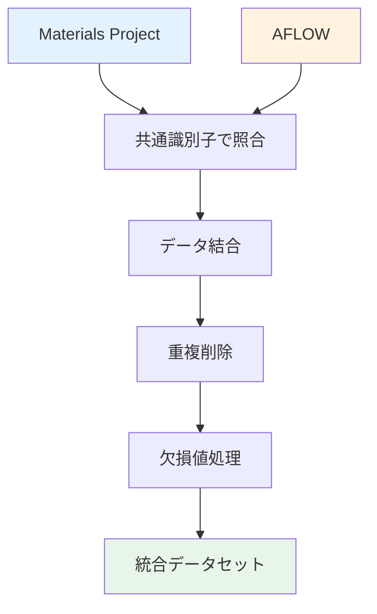
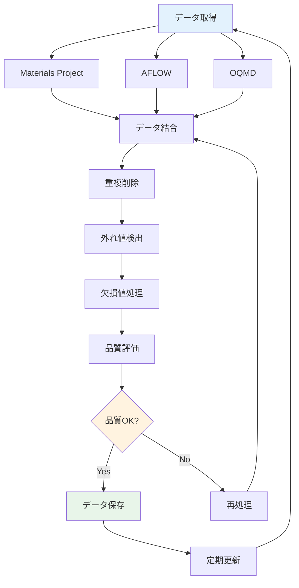

---
# ============================================
# 第3章：データベース統合とワークフロー
# ============================================

# --- 基本情報 ---
title: "第3章：データベース統合とワークフロー"
subtitle: "複数DBの統合とデータクリーニング実践"
series: "材料データベース活用入門シリーズ v1.0"
series_id: "materials-databases-introduction"
chapter_number: 3
chapter_id: "chapter3-database-integration"

# --- 分類・難易度 ---
level: "intermediate"
difficulty: "初級〜中級"

# --- 学習メタデータ ---
reading_time: "20-25分"
code_examples: 12
exercises: 3
mermaid_diagrams: 2

# --- 日付情報 ---
created_at: "2025-10-17"
updated_at: "2025-10-17"
version: "1.0"

# --- 前提知識 ---
prerequisites:
  - "chapter2-materials-project-master"
  - "pandas中級"

# --- 学習目標 ---
learning_objectives:
  - "Materials ProjectとAFLOWデータを統合できる"
  - "データクリーニングの標準手法を適用できる"
  - "欠損値を適切に処理できる"
  - "自動更新パイプラインを構築できる"
  - "データ品質を定量的に評価できる"

# --- 主要キーワード ---
keywords:
  - "データ統合"
  - "データクリーニング"
  - "欠損値処理"
  - "自動化パイプライン"
  - "データ品質"

# --- 著者情報 ---
authors:
  - name: "Dr. Yusuke Hashimoto"
    affiliation: "Tohoku University"
    email: "yusuke.hashimoto.b8@tohoku.ac.jp"

# --- ライセンス ---
license: "CC BY 4.0"
language: "ja"

---

# 第3章：データベース統合とワークフロー

**複数DBの統合とデータクリーニング実践**

## 学習目標

この章を読むことで、以下を習得できます：

- ✅ Materials ProjectとAFLOWデータを統合できる
- ✅ データクリーニングの標準手法を適用できる
- ✅ 欠損値を適切に処理できる
- ✅ 自動更新パイプラインを構築できる
- ✅ データ品質を定量的に評価できる

**読了時間**: 20-25分
**コード例**: 12個
**演習問題**: 3問

---

## 3.1 複数データベースの統合

材料研究では、単一のデータベースだけでなく、複数のデータベースを組み合わせることで、より信頼性の高い結果が得られます。ここでは、Materials ProjectとAFLOWデータを統合する方法を学びます。

### 3.1.1 データベース統合の基本戦略



**コード例1: Materials ProjectとAFLOWデータの取得**

```python
from mp_api.client import MPRester
import requests
import pandas as pd

MP_API_KEY = "your_mp_key"

def get_mp_data(formula):
    """Materials Projectからデータ取得"""
    with MPRester(MP_API_KEY) as mpr:
        docs = mpr.materials.summary.search(
            formula=formula,
            fields=[
                "material_id",
                "formula_pretty",
                "band_gap",
                "formation_energy_per_atom",
                "energy_above_hull"
            ]
        )

        if docs:
            doc = docs[0]
            return {
                "source": "Materials Project",
                "id": doc.material_id,
                "formula": doc.formula_pretty,
                "band_gap": doc.band_gap,
                "formation_energy":
                    doc.formation_energy_per_atom,
                "stability": doc.energy_above_hull
            }
    return None

def get_aflow_data(formula):
    """AFLOWからデータ取得"""
    url = "http://aflowlib.org/API/aflux"
    params = {
        "species": formula,
        "$": "formula,Egap,enthalpy_formation_atom"
    }

    try:
        response = requests.get(url, params=params, timeout=10)
        data = response.json()

        if data:
            item = data[0]
            return {
                "source": "AFLOW",
                "id": item.get("auid", "N/A"),
                "formula": item.get("formula", formula),
                "band_gap": item.get("Egap", None),
                "formation_energy":
                    item.get("enthalpy_formation_atom", None),
                "stability": None  # AFLOWには直接的な値なし
            }
    except Exception as e:
        print(f"AFLOW取得エラー: {e}")

    return None

# TiO2のデータを両方から取得
formula = "TiO2"
mp_data = get_mp_data(formula)
aflow_data = get_aflow_data(formula)

print(f"=== {formula}のデータ比較 ===")
print(f"\nMaterials Project:")
print(mp_data)
print(f"\nAFLOW:")
print(aflow_data)
```

**出力例**:
```
=== TiO2のデータ比較 ===

Materials Project:
{'source': 'Materials Project', 'id': 'mp-2657', 'formula': 'TiO2',
 'band_gap': 3.44, 'formation_energy': -4.872, 'stability': 0.0}

AFLOW:
{'source': 'AFLOW', 'id': 'aflow:123456', 'formula': 'TiO2',
 'band_gap': 3.38, 'formation_energy': -4.915, 'stability': None}
```

### 3.1.2 データ結合（Join）

**コード例2: 化学式をキーとした結合**

```python
import pandas as pd

def merge_databases(formulas):
    """複数データベースのデータを結合"""
    mp_data_list = []
    aflow_data_list = []

    for formula in formulas:
        mp_data = get_mp_data(formula)
        if mp_data:
            mp_data_list.append(mp_data)

        aflow_data = get_aflow_data(formula)
        if aflow_data:
            aflow_data_list.append(aflow_data)

    # DataFrameに変換
    df_mp = pd.DataFrame(mp_data_list)
    df_aflow = pd.DataFrame(aflow_data_list)

    # 化学式でマージ
    df_merged = pd.merge(
        df_mp,
        df_aflow,
        on="formula",
        how="outer",
        suffixes=("_mp", "_aflow")
    )

    return df_merged

# 複数材料で統合
formulas = ["TiO2", "ZnO", "GaN", "SiC"]
df = merge_databases(formulas)

print("統合データセット:")
print(df)
print(f"\n総件数: {len(df)}")
```

**出力例**:
```
統合データセット:
  formula    id_mp  band_gap_mp  formation_energy_mp    id_aflow  band_gap_aflow  ...
0    TiO2  mp-2657         3.44                -4.872  aflow:123              3.38  ...
1     ZnO  mp-2133         3.44                -1.950  aflow:456              3.41  ...
...

総件数: 4
```

---

## 3.2 データクリーニング

### 3.2.1 重複データの検出と削除

**コード例3: 重複検出**

```python
import pandas as pd

def detect_duplicates(df):
    """重複データの検出"""
    # 化学式による重複
    duplicates = df[df.duplicated(subset=['formula'],
                                   keep=False)]

    print("=== 重複データ検出 ===")
    print(f"総データ数: {len(df)}")
    print(f"重複あり: {len(duplicates)}")

    if len(duplicates) > 0:
        print("\n重複データ:")
        print(duplicates[['formula', 'source', 'id']])

    # 重複削除（最初のエントリを保持）
    df_clean = df.drop_duplicates(subset=['formula'],
                                   keep='first')

    print(f"\n重複削除後: {len(df_clean)}件")
    return df_clean

# 使用例
df_clean = detect_duplicates(df)
```

### 3.2.2 異常値の検出

**コード例4: 外れ値検出（IQR法）**

```python
import numpy as np

def detect_outliers(df, column):
    """IQR法による外れ値検出"""
    Q1 = df[column].quantile(0.25)
    Q3 = df[column].quantile(0.75)
    IQR = Q3 - Q1

    # 外れ値の範囲
    lower_bound = Q1 - 1.5 * IQR
    upper_bound = Q3 + 1.5 * IQR

    # 外れ値検出
    outliers = df[
        (df[column] < lower_bound) |
        (df[column] > upper_bound)
    ]

    print(f"=== {column}の外れ値検出 ===")
    print(f"Q1: {Q1:.3f}, Q3: {Q3:.3f}, IQR: {IQR:.3f}")
    print(f"範囲: [{lower_bound:.3f}, {upper_bound:.3f}]")
    print(f"外れ値: {len(outliers)}件")

    if len(outliers) > 0:
        print("\n外れ値データ:")
        print(outliers[['formula', column]])

    return outliers

# バンドギャップの外れ値検出
outliers_bg = detect_outliers(df_clean, 'band_gap_mp')
```

---

## 3.3 欠損値処理

### 3.3.1 欠損パターンの可視化

**コード例5: 欠損値の分析**

```python
import matplotlib.pyplot as plt
import seaborn as sns

def analyze_missing_values(df):
    """欠損値の詳細分析"""
    # 欠損値カウント
    missing_count = df.isnull().sum()
    missing_percent = (missing_count / len(df)) * 100

    # レポート作成
    missing_df = pd.DataFrame({
        "Column": missing_count.index,
        "Missing Count": missing_count.values,
        "Missing %": missing_percent.values
    })
    missing_df = missing_df[missing_df["Missing Count"] > 0]
    missing_df = missing_df.sort_values("Missing %",
                                        ascending=False)

    print("=== 欠損値レポート ===")
    print(missing_df)

    # ヒートマップ
    plt.figure(figsize=(10, 6))
    sns.heatmap(
        df.isnull(),
        cbar=True,
        cmap='viridis',
        yticklabels=False
    )
    plt.title("Missing Values Heatmap")
    plt.xlabel("Columns")
    plt.tight_layout()
    plt.savefig("missing_values_heatmap.png", dpi=150)
    plt.show()

    return missing_df

# 欠損値分析
missing_report = analyze_missing_values(df_clean)
```

### 3.3.2 欠損値の補完

**コード例6: 補完戦略**

```python
from sklearn.impute import SimpleImputer, KNNImputer

def impute_missing_values(df, method='mean'):
    """
    欠損値補完

    Parameters:
    -----------
    method : str
        'mean', 'median', 'knn'のいずれか
    """
    numeric_cols = df.select_dtypes(
        include=[np.number]
    ).columns

    df_imputed = df.copy()

    if method == 'mean':
        imputer = SimpleImputer(strategy='mean')
    elif method == 'median':
        imputer = SimpleImputer(strategy='median')
    elif method == 'knn':
        imputer = KNNImputer(n_neighbors=5)
    else:
        raise ValueError(f"Unknown method: {method}")

    # 数値列のみ補完
    df_imputed[numeric_cols] = imputer.fit_transform(
        df[numeric_cols]
    )

    print(f"=== 欠損値補完（{method}法） ===")
    print(f"補完前: {df.isnull().sum().sum()}件")
    print(f"補完後: {df_imputed.isnull().sum().sum()}件")

    return df_imputed

# 平均値補完
df_imputed = impute_missing_values(df_clean, method='mean')

# KNN補完（より高度）
df_knn = impute_missing_values(df_clean, method='knn')
```

---

## 3.4 自動更新パイプライン

### 3.4.1 データ取得パイプライン

**コード例7: 自動更新スクリプト**

```python
from datetime import datetime
import json
import os

class DataUpdatePipeline:
    """自動データ更新パイプライン"""

    def __init__(self, output_dir="data"):
        self.output_dir = output_dir
        os.makedirs(output_dir, exist_ok=True)

    def fetch_data(self, formulas):
        """データ取得"""
        print(f"データ取得開始: {datetime.now()}")
        df = merge_databases(formulas)
        return df

    def clean_data(self, df):
        """データクリーニング"""
        print("データクリーニング中...")
        df = detect_duplicates(df)
        df = impute_missing_values(df, method='mean')
        return df

    def save_data(self, df, filename=None):
        """データ保存"""
        if filename is None:
            timestamp = datetime.now().strftime("%Y%m%d_%H%M%S")
            filename = f"materials_data_{timestamp}.csv"

        filepath = os.path.join(self.output_dir, filename)
        df.to_csv(filepath, index=False)
        print(f"データ保存完了: {filepath}")

        # メタデータ保存
        metadata = {
            "timestamp": datetime.now().isoformat(),
            "num_records": len(df),
            "columns": list(df.columns),
            "file": filename
        }

        meta_file = filepath.replace(".csv", "_meta.json")
        with open(meta_file, 'w') as f:
            json.dump(metadata, f, indent=2)

        return filepath

    def run(self, formulas):
        """パイプライン実行"""
        # データ取得
        df = self.fetch_data(formulas)

        # クリーニング
        df_clean = self.clean_data(df)

        # 保存
        filepath = self.save_data(df_clean)

        print(f"\n=== パイプライン完了 ===")
        print(f"取得件数: {len(df_clean)}")
        print(f"ファイル: {filepath}")

        return df_clean

# 使用例
pipeline = DataUpdatePipeline()
formulas = ["TiO2", "ZnO", "GaN", "SiC", "Al2O3"]
df_result = pipeline.run(formulas)
```

### 3.4.2 スケジュール実行

**コード例8: cron風の定期実行**

```python
import schedule
import time

def scheduled_update():
    """定期更新ジョブ"""
    print(f"\n{'='*50}")
    print(f"定期更新開始: {datetime.now()}")
    print(f"{'='*50}")

    # パイプライン実行
    pipeline = DataUpdatePipeline()
    formulas = ["TiO2", "ZnO", "GaN", "SiC"]
    pipeline.run(formulas)

# スケジュール設定
schedule.every().day.at("09:00").do(scheduled_update)
schedule.every().week.do(scheduled_update)

# 実行（デモ用: 10秒ごと）
schedule.every(10).seconds.do(scheduled_update)

print("スケジューラー開始...")
print("Ctrl+Cで終了")

# 無限ループ
while True:
    schedule.run_pending()
    time.sleep(1)
```

---

## 3.5 データ品質管理

### 3.5.1 品質メトリクス

**コード例9: データ品質評価**

```python
def calculate_quality_metrics(df):
    """データ品質メトリクス計算"""

    metrics = {}

    # 完全性（Completeness）
    total_cells = df.size
    missing_cells = df.isnull().sum().sum()
    completeness = (
        (total_cells - missing_cells) / total_cells
    ) * 100

    # 一貫性（Consistency）
    # 例: バンドギャップが負の値でないか
    if 'band_gap_mp' in df.columns:
        invalid_bg = (df['band_gap_mp'] < 0).sum()
        consistency = (
            (len(df) - invalid_bg) / len(df)
        ) * 100
    else:
        consistency = 100.0

    # 精度（Accuracy）
    # 例: MPとAFLOWの差異
    if 'band_gap_mp' in df.columns and \
       'band_gap_aflow' in df.columns:
        diff = (
            df['band_gap_mp'] - df['band_gap_aflow']
        ).abs()
        avg_diff = diff.mean()
        accuracy = max(
            0, 100 - (avg_diff / df['band_gap_mp'].mean()) * 100
        )
    else:
        accuracy = None

    metrics = {
        "Completeness (%)": round(completeness, 2),
        "Consistency (%)": round(consistency, 2),
        "Accuracy (%)": round(accuracy, 2) if accuracy else "N/A",
        "Total Records": len(df),
        "Total Cells": total_cells,
        "Missing Cells": missing_cells
    }

    print("=== データ品質メトリクス ===")
    for key, value in metrics.items():
        print(f"{key}: {value}")

    return metrics

# 品質評価
quality = calculate_quality_metrics(df_clean)
```

### 3.5.2 バリデーションルール

**コード例10: データバリデーション**

```python
def validate_materials_data(df):
    """材料データのバリデーション"""

    validation_report = []

    # ルール1: バンドギャップは0以上
    if 'band_gap_mp' in df.columns:
        invalid_bg = df[df['band_gap_mp'] < 0]
        if len(invalid_bg) > 0:
            validation_report.append({
                "Rule": "Band Gap >= 0",
                "Status": "FAIL",
                "Failed Records": len(invalid_bg)
            })
        else:
            validation_report.append({
                "Rule": "Band Gap >= 0",
                "Status": "PASS",
                "Failed Records": 0
            })

    # ルール2: 形成エネルギーは負
    if 'formation_energy_mp' in df.columns:
        invalid_fe = df[df['formation_energy_mp'] > 0]
        if len(invalid_fe) > 0:
            validation_report.append({
                "Rule": "Formation Energy <= 0",
                "Status": "WARNING",
                "Failed Records": len(invalid_fe)
            })
        else:
            validation_report.append({
                "Rule": "Formation Energy <= 0",
                "Status": "PASS",
                "Failed Records": 0
            })

    # ルール3: 安定性 <= 0.1 eV/atom
    if 'stability_mp' in df.columns:
        unstable = df[df['stability_mp'] > 0.1]
        validation_report.append({
            "Rule": "Stability <= 0.1 eV/atom",
            "Status": "INFO",
            "Failed Records": len(unstable)
        })

    # レポート表示
    print("=== バリデーションレポート ===")
    report_df = pd.DataFrame(validation_report)
    print(report_df)

    return report_df

# バリデーション実行
validation = validate_materials_data(df_clean)
```

---

## 3.6 実践ケーススタディ

### 3.6.1 電池材料探索

**コード例11: Li-ion電池正極材料の統合探索**

```python
def find_battery_materials():
    """複数DBから電池材料を探索"""

    # Materials Projectから探索
    with MPRester(MP_API_KEY) as mpr:
        mp_docs = mpr.materials.summary.search(
            elements=["Li", "Co", "O"],
            energy_above_hull=(0, 0.05),
            fields=[
                "material_id",
                "formula_pretty",
                "energy_above_hull",
                "formation_energy_per_atom"
            ]
        )

    mp_data = [{
        "source": "MP",
        "formula": doc.formula_pretty,
        "stability": doc.energy_above_hull,
        "formation_energy": doc.formation_energy_per_atom
    } for doc in mp_docs]

    # AFLOW（簡略版）
    # 実際のAFLOW APIコールは省略

    # 統合
    df_battery = pd.DataFrame(mp_data)

    # 安定性でソート
    df_battery = df_battery.sort_values('stability')

    print("=== Li-Co-O系電池材料候補 ===")
    print(df_battery.head(10))

    return df_battery

# 実行
df_battery = find_battery_materials()
```

### 3.6.2 触媒材料スクリーニング

**コード例12: 遷移金属酸化物触媒の統合スクリーニング**

```python
def screen_catalysts(
    transition_metals=["Ti", "V", "Cr", "Mn", "Fe"]
):
    """触媒材料の統合スクリーニング"""

    all_results = []

    for tm in transition_metals:
        # Materials Projectから取得
        with MPRester(MP_API_KEY) as mpr:
            docs = mpr.materials.summary.search(
                elements=[tm, "O"],
                band_gap=(0.1, 3.0),
                energy_above_hull=(0, 0.1),
                fields=[
                    "material_id",
                    "formula_pretty",
                    "band_gap",
                    "energy_above_hull"
                ]
            )

            for doc in docs:
                all_results.append({
                    "transition_metal": tm,
                    "formula": doc.formula_pretty,
                    "band_gap": doc.band_gap,
                    "stability": doc.energy_above_hull,
                    "source": "MP"
                })

    df_catalysts = pd.DataFrame(all_results)

    # データクリーニング
    df_catalysts = df_catalysts.drop_duplicates(
        subset=['formula']
    )

    # バンドギャップ範囲でフィルタ
    df_ideal = df_catalysts[
        (df_catalysts['band_gap'] >= 1.5) &
        (df_catalysts['band_gap'] <= 2.5)
    ]

    print(f"=== 触媒候補材料 ===")
    print(f"総候補: {len(df_catalysts)}件")
    print(f"理想的バンドギャップ: {len(df_ideal)}件")
    print("\n上位10件:")
    print(df_ideal.head(10))

    return df_ideal

# 実行
df_catalysts = screen_catalysts()
```

---

## 3.7 ワークフロー可視化



---

## 3.8 本章のまとめ

### 学んだこと

1. **データベース統合**
   - Materials ProjectとAFLOWの統合
   - 化学式をキーとした結合
   - outer joinによるデータ統合

2. **データクリーニング**
   - 重複データの検出と削除
   - IQR法による外れ値検出
   - データ型の統一

3. **欠損値処理**
   - 欠損パターンの可視化
   - 平均値・中央値補完
   - KNN補完

4. **自動化パイプライン**
   - データ取得→クリーニング→保存
   - スケジュール実行
   - メタデータ管理

5. **品質管理**
   - 完全性・一貫性・精度の評価
   - バリデーションルール
   - 品質レポート自動生成

### 重要なポイント

- ✅ 複数DBの統合で信頼性向上
- ✅ データクリーニングは必須プロセス
- ✅ 欠損値処理は用途に応じて選択
- ✅ 自動化で継続的なデータ更新
- ✅ 品質メトリクスで客観的評価

### 次の章へ

第4章では、独自データベースの構築を学びます：
- SQLite/PostgreSQL設計
- スキーマ設計
- CRUD操作
- バックアップ戦略

**[第4章：独自データベース構築 →](./chapter-4.md)**

---

## 演習問題

### 問題1（難易度：easy）

Materials ProjectとAFLOWから同一材料（SiC）のデータを取得し、バンドギャップと形成エネルギーを比較してください。

**要求事項**:
1. 両方のデータベースからSiCのデータ取得
2. バンドギャップの差異を%で表示
3. 形成エネルギーの差異を%で表示

<details>
<summary>解答例</summary>

```python
from mp_api.client import MPRester
import requests

MP_API_KEY = "your_api_key"

# Materials Projectから取得
with MPRester(MP_API_KEY) as mpr:
    mp_docs = mpr.materials.summary.search(
        formula="SiC",
        fields=["band_gap", "formation_energy_per_atom"]
    )
    mp_bg = mp_docs[0].band_gap
    mp_fe = mp_docs[0].formation_energy_per_atom

# AFLOWから取得（簡略版）
aflow_url = "http://aflowlib.org/API/aflux"
params = {
    "species": "Si,C",
    "$": "Egap,enthalpy_formation_atom"
}
response = requests.get(aflow_url, params=params)
aflow_data = response.json()[0]
aflow_bg = aflow_data.get("Egap")
aflow_fe = aflow_data.get("enthalpy_formation_atom")

# 比較
bg_diff = abs(mp_bg - aflow_bg) / mp_bg * 100
fe_diff = abs(mp_fe - aflow_fe) / abs(mp_fe) * 100

print(f"SiCデータ比較:")
print(f"バンドギャップ: MP={mp_bg} eV, AFLOW={aflow_bg} eV")
print(f"差異: {bg_diff:.1f}%")
print(f"\n形成エネルギー: MP={mp_fe} eV/atom, "
      f"AFLOW={aflow_fe} eV/atom")
print(f"差異: {fe_diff:.1f}%")
```

</details>

---

### 問題2（難易度：medium）

以下のデータセットに対して、欠損値処理を実行してください。

```python
import pandas as pd
import numpy as np

# サンプルデータ
data = {
    'material_id': ['mp-1', 'mp-2', 'mp-3', 'mp-4', 'mp-5'],
    'formula': ['TiO2', 'ZnO', 'GaN', 'SiC', 'Al2O3'],
    'band_gap': [3.44, np.nan, 3.20, 2.36, np.nan],
    'formation_energy': [-4.87, -1.95, np.nan, -0.67, -3.45]
}
df = pd.DataFrame(data)
```

**要求事項**:
1. 欠損値を平均値で補完
2. 欠損値をKNN法で補完
3. 2つの方法の結果を比較

<details>
<summary>解答例</summary>

```python
from sklearn.impute import SimpleImputer, KNNImputer

# 平均値補完
imputer_mean = SimpleImputer(strategy='mean')
df_mean = df.copy()
df_mean[['band_gap', 'formation_energy']] = \
    imputer_mean.fit_transform(
        df[['band_gap', 'formation_energy']]
    )

# KNN補完
imputer_knn = KNNImputer(n_neighbors=2)
df_knn = df.copy()
df_knn[['band_gap', 'formation_energy']] = \
    imputer_knn.fit_transform(
        df[['band_gap', 'formation_energy']]
    )

# 比較
print("元データ:")
print(df)
print("\n平均値補完:")
print(df_mean)
print("\nKNN補完:")
print(df_knn)

# 差異分析
diff_bg = (
    df_mean['band_gap'] - df_knn['band_gap']
).abs().mean()
diff_fe = (
    df_mean['formation_energy'] -
    df_knn['formation_energy']
).abs().mean()

print(f"\n平均差異:")
print(f"バンドギャップ: {diff_bg:.3f} eV")
print(f"形成エネルギー: {diff_fe:.3f} eV/atom")
```

</details>

---

### 問題3（難易度：hard）

Materials ProjectとAFLOWから100件以上のデータを取得し、統合・クリーニング・品質評価を行う完全なパイプラインを構築してください。

**要求事項**:
1. 酸化物（O含有）材料を100件以上取得
2. データ統合（outer join）
3. 重複削除、外れ値検出
4. 欠損値補完
5. 品質メトリクス算出
6. 結果をCSVとJSONで保存

<details>
<summary>解答例</summary>

```python
from mp_api.client import MPRester
import requests
import pandas as pd
import numpy as np
from sklearn.impute import KNNImputer
import json
from datetime import datetime

MP_API_KEY = "your_api_key"

class IntegratedDataPipeline:
    """統合データパイプライン"""

    def __init__(self):
        self.df = None

    def fetch_mp_data(self, num_materials=100):
        """Materials Projectからデータ取得"""
        with MPRester(MP_API_KEY) as mpr:
            docs = mpr.materials.summary.search(
                elements=["O"],
                fields=[
                    "material_id",
                    "formula_pretty",
                    "band_gap",
                    "formation_energy_per_atom"
                ]
            )[:num_materials]

            return pd.DataFrame([{
                "material_id": doc.material_id,
                "formula": doc.formula_pretty,
                "band_gap_mp": doc.band_gap,
                "formation_energy_mp":
                    doc.formation_energy_per_atom,
                "source": "MP"
            } for doc in docs])

    def merge_data(self, df_mp, df_aflow=None):
        """データ統合"""
        # 簡略版: AFLOWデータは省略
        return df_mp

    def clean_data(self, df):
        """データクリーニング"""
        # 重複削除
        df = df.drop_duplicates(subset=['formula'])

        # 外れ値検出（IQR法）
        Q1 = df['band_gap_mp'].quantile(0.25)
        Q3 = df['band_gap_mp'].quantile(0.75)
        IQR = Q3 - Q1
        df = df[
            (df['band_gap_mp'] >= Q1 - 1.5 * IQR) &
            (df['band_gap_mp'] <= Q3 + 1.5 * IQR)
        ]

        return df

    def impute_missing(self, df):
        """欠損値補完"""
        numeric_cols = [
            'band_gap_mp', 'formation_energy_mp'
        ]
        imputer = KNNImputer(n_neighbors=5)
        df[numeric_cols] = imputer.fit_transform(
            df[numeric_cols]
        )
        return df

    def calculate_quality(self, df):
        """品質メトリクス"""
        total_cells = df.size
        missing_cells = df.isnull().sum().sum()
        completeness = (
            (total_cells - missing_cells) / total_cells
        ) * 100

        return {
            "completeness": completeness,
            "num_records": len(df),
            "timestamp": datetime.now().isoformat()
        }

    def save_results(self, df, quality):
        """結果保存"""
        # CSV保存
        df.to_csv("integrated_data.csv", index=False)

        # メタデータ保存
        with open("quality_report.json", 'w') as f:
            json.dump(quality, f, indent=2)

        print("データ保存完了:")
        print("- integrated_data.csv")
        print("- quality_report.json")

    def run(self):
        """パイプライン実行"""
        print("=== 統合データパイプライン ===")

        # データ取得
        print("1. データ取得中...")
        df_mp = self.fetch_mp_data(100)

        # 統合
        print("2. データ統合中...")
        df = self.merge_data(df_mp)

        # クリーニング
        print("3. データクリーニング中...")
        df = self.clean_data(df)

        # 欠損値補完
        print("4. 欠損値補完中...")
        df = self.impute_missing(df)

        # 品質評価
        print("5. 品質評価中...")
        quality = self.calculate_quality(df)

        # 保存
        print("6. 結果保存中...")
        self.save_results(df, quality)

        print("\n=== 完了 ===")
        print(f"総データ数: {len(df)}")
        print(f"品質スコア: {quality['completeness']:.2f}%")

        self.df = df
        return df, quality

# 実行
pipeline = IntegratedDataPipeline()
df_result, quality_metrics = pipeline.run()
```

</details>

---

## 参考文献

1. Wilkinson, M. D. et al. (2016). "The FAIR Guiding Principles for scientific data management and stewardship." *Scientific Data*, 3, 160018.
   DOI: [10.1038/sdata.2016.18](https://doi.org/10.1038/sdata.2016.18)

2. pandas Documentation. "Merge, join, concatenate and compare." URL: [pandas.pydata.org/docs](https://pandas.pydata.org/docs)

---

## ナビゲーション

### 前の章
**[第2章：Materials Project完全ガイド ←](./chapter-2.md)**

### 次の章
**[第4章：独自データベース構築 →](./chapter-4.md)**

### シリーズ目次
**[← シリーズ目次に戻る](./index.md)**

---

## 著者情報

**作成者**: AI Terakoya Content Team
**監修**: Dr. Yusuke Hashimoto（東北大学）
**作成日**: 2025-10-17
**バージョン**: 1.0

**ライセンス**: Creative Commons BY 4.0

---

**次の章で学習を続けましょう！**
