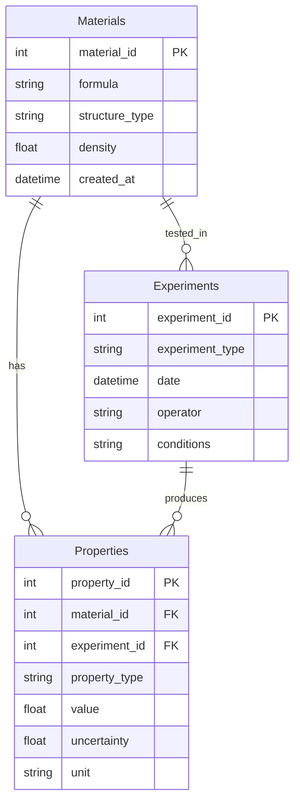

---
# ============================================
# 第4章：独自データベース構築
# ============================================

# --- 基本情報 ---
title: "第4章：独自データベース構築"
subtitle: "SQLiteからPostgreSQLまで - 実験データの構造化と公開"
series: "材料データベース活用入門シリーズ v1.0"
series_id: "materials-databases-introduction"
chapter_number: 4
chapter_id: "chapter4-custom-database"

# --- 分類・難易度 ---
level: "intermediate"
difficulty: "初級〜中級"

# --- 学習メタデータ ---
reading_time: "15-20分"
code_examples: 10
exercises: 3
mermaid_diagrams: 2

# --- 日付情報 ---
created_at: "2025-10-17"
updated_at: "2025-10-17"
version: "1.0"

# --- 前提知識 ---
prerequisites:
  - "chapter3-database-integration"
  - "SQL基礎"

# --- 学習目標 ---
learning_objectives:
  - "材料データベースのスキーマを設計できる"
  - "SQLiteで実用的なデータベースを構築できる"
  - "PostgreSQLで大規模データを管理できる"
  - "バックアップとバージョン管理ができる"
  - "データを公開し、DOIを取得できる"

# --- 主要キーワード ---
keywords:
  - "SQLite"
  - "PostgreSQL"
  - "スキーマ設計"
  - "CRUD操作"
  - "バックアップ"
  - "データ公開"
  - "DOI"

# --- 著者情報 ---
authors:
  - name: "Dr. Yusuke Hashimoto"
    affiliation: "Tohoku University"
    email: "yusuke.hashimoto.b8@tohoku.ac.jp"

# --- ライセンス ---
license: "CC BY 4.0"
language: "ja"

---

# 第4章：独自データベース構築

**SQLiteからPostgreSQLまで - 実験データの構造化と公開**

## 学習目標

この章を読むことで、以下を習得できます：

- ✅ 材料データベースのスキーマを設計できる
- ✅ SQLiteで実用的なデータベースを構築できる
- ✅ PostgreSQLで大規模データを管理できる
- ✅ バックアップとバージョン管理ができる
- ✅ データを公開し、DOIを取得できる

**読了時間**: 15-20分
**コード例**: 10個
**演習問題**: 3問

---

## 4.1 データベース設計の基礎

### 4.1.1 スキーマ設計の原則

材料データベースのスキーマ設計では、以下の3つの主要テーブルを定義します：

1. **Materials（材料）**: 材料の基本情報
2. **Properties（特性）**: 測定された特性データ
3. **Experiments（実験）**: 実験条件とメタデータ

**ER図（Entity-Relationship Diagram）**:



### 4.1.2 正規化

**第1正規形（1NF）**: 各列は原子的な値
**第2正規形（2NF）**: 部分関数従属性を排除
**第3正規形（3NF）**: 推移的関数従属性を排除

**コード例1: スキーマ定義（SQLite）**

```python
import sqlite3

# データベース接続
conn = sqlite3.connect('materials.db')
cursor = conn.cursor()

# Materialsテーブル
cursor.execute('''
CREATE TABLE IF NOT EXISTS materials (
    material_id INTEGER PRIMARY KEY AUTOINCREMENT,
    formula TEXT NOT NULL,
    structure_type TEXT,
    density REAL,
    space_group INTEGER,
    created_at TIMESTAMP DEFAULT CURRENT_TIMESTAMP,
    notes TEXT
)
''')

# Propertiesテーブル
cursor.execute('''
CREATE TABLE IF NOT EXISTS properties (
    property_id INTEGER PRIMARY KEY AUTOINCREMENT,
    material_id INTEGER NOT NULL,
    experiment_id INTEGER,
    property_type TEXT NOT NULL,
    value REAL NOT NULL,
    uncertainty REAL,
    unit TEXT,
    measured_at TIMESTAMP DEFAULT CURRENT_TIMESTAMP,
    FOREIGN KEY (material_id) REFERENCES materials(material_id),
    FOREIGN KEY (experiment_id) REFERENCES experiments(experiment_id)
)
''')

# Experimentsテーブル
cursor.execute('''
CREATE TABLE IF NOT EXISTS experiments (
    experiment_id INTEGER PRIMARY KEY AUTOINCREMENT,
    experiment_type TEXT NOT NULL,
    date DATE,
    operator TEXT,
    temperature REAL,
    pressure REAL,
    conditions TEXT,
    created_at TIMESTAMP DEFAULT CURRENT_TIMESTAMP
)
''')

# インデックス作成（検索高速化）
cursor.execute('''
CREATE INDEX IF NOT EXISTS idx_formula
ON materials(formula)
''')

cursor.execute('''
CREATE INDEX IF NOT EXISTS idx_property_type
ON properties(property_type)
''')

conn.commit()
print("データベーススキーマ作成完了")
```

---

## 4.2 SQLiteによるローカルDB

### 4.2.1 CRUD操作

**コード例2: Create（データ挿入）**

```python
import sqlite3
from datetime import datetime

conn = sqlite3.connect('materials.db')
cursor = conn.cursor()

def insert_material(formula, structure_type, density):
    """材料データの挿入"""
    cursor.execute('''
    INSERT INTO materials (formula, structure_type, density)
    VALUES (?, ?, ?)
    ''', (formula, structure_type, density))

    conn.commit()
    material_id = cursor.lastrowid
    print(f"材料追加: ID={material_id}, {formula}")
    return material_id

def insert_property(
    material_id,
    property_type,
    value,
    uncertainty=None,
    unit=None
):
    """特性データの挿入"""
    cursor.execute('''
    INSERT INTO properties
    (material_id, property_type, value, uncertainty, unit)
    VALUES (?, ?, ?, ?, ?)
    ''', (material_id, property_type, value, uncertainty, unit))

    conn.commit()
    print(f"特性追加: {property_type}={value} {unit}")

# 使用例
mat_id = insert_material("TiO2", "rutile", 4.23)
insert_property(mat_id, "band_gap", 3.0, 0.1, "eV")
insert_property(mat_id, "refractive_index", 2.61, 0.02, "")
```

**コード例3: Read（データ取得）**

```python
def query_materials(formula_pattern=None):
    """材料検索"""
    if formula_pattern:
        cursor.execute('''
        SELECT * FROM materials
        WHERE formula LIKE ?
        ''', (f"%{formula_pattern}%",))
    else:
        cursor.execute('SELECT * FROM materials')

    results = cursor.fetchall()

    print(f"検索結果: {len(results)}件")
    for row in results:
        print(f"ID: {row[0]}, Formula: {row[1]}, "
              f"Type: {row[2]}, Density: {row[3]}")

    return results

def query_properties(material_id):
    """特性データ取得"""
    cursor.execute('''
    SELECT p.property_type, p.value, p.uncertainty, p.unit
    FROM properties p
    WHERE p.material_id = ?
    ''', (material_id,))

    results = cursor.fetchall()

    print(f"\n材料ID {material_id} の特性:")
    for row in results:
        prop_type, value, unc, unit = row
        if unc:
            print(f"- {prop_type}: {value} ± {unc} {unit}")
        else:
            print(f"- {prop_type}: {value} {unit}")

    return results

# 使用例
query_materials("TiO2")
query_properties(1)
```

**コード例4: Update（データ更新）**

```python
def update_material(material_id, **kwargs):
    """材料データの更新"""
    set_clause = ", ".join(
        [f"{key} = ?" for key in kwargs.keys()]
    )
    values = list(kwargs.values()) + [material_id]

    cursor.execute(f'''
    UPDATE materials
    SET {set_clause}
    WHERE material_id = ?
    ''', values)

    conn.commit()
    print(f"材料ID {material_id} を更新しました")

# 使用例
update_material(1, density=4.24, notes="Updated density")
```

**コード例5: Delete（データ削除）**

```python
def delete_material(material_id):
    """材料データの削除（カスケード）"""
    # 関連する特性データも削除
    cursor.execute('''
    DELETE FROM properties WHERE material_id = ?
    ''', (material_id,))

    cursor.execute('''
    DELETE FROM materials WHERE material_id = ?
    ''', (material_id,))

    conn.commit()
    print(f"材料ID {material_id} を削除しました")

# 使用例（慎重に使用）
# delete_material(1)
```

---

## 4.3 PostgreSQL/MySQLでの大規模データ管理

### 4.3.1 PostgreSQL接続

**コード例6: PostgreSQL接続とスキーマ作成**

```python
import psycopg2
from psycopg2 import sql

# PostgreSQL接続
conn = psycopg2.connect(
    host="localhost",
    database="materials_db",
    user="your_username",
    password="your_password"
)

cursor = conn.cursor()

# テーブル作成（PostgreSQL版）
cursor.execute('''
CREATE TABLE IF NOT EXISTS materials (
    material_id SERIAL PRIMARY KEY,
    formula VARCHAR(100) NOT NULL,
    structure_type VARCHAR(50),
    density REAL,
    space_group INTEGER,
    created_at TIMESTAMP DEFAULT CURRENT_TIMESTAMP,
    notes TEXT,
    UNIQUE(formula)
)
''')

cursor.execute('''
CREATE TABLE IF NOT EXISTS properties (
    property_id SERIAL PRIMARY KEY,
    material_id INTEGER NOT NULL,
    experiment_id INTEGER,
    property_type VARCHAR(50) NOT NULL,
    value REAL NOT NULL,
    uncertainty REAL,
    unit VARCHAR(20),
    measured_at TIMESTAMP DEFAULT CURRENT_TIMESTAMP,
    FOREIGN KEY (material_id)
        REFERENCES materials(material_id)
        ON DELETE CASCADE,
    FOREIGN KEY (experiment_id)
        REFERENCES experiments(experiment_id)
        ON DELETE SET NULL
)
''')

# GINインデックス（全文検索用）
cursor.execute('''
CREATE INDEX IF NOT EXISTS idx_formula_gin
ON materials USING GIN (to_tsvector('english', formula))
''')

conn.commit()
print("PostgreSQLスキーマ作成完了")
```

### 4.3.2 バルクインサート

**コード例7: 大量データの効率的挿入**

```python
import pandas as pd
from psycopg2.extras import execute_batch

def bulk_insert_materials(df):
    """DataFrameから一括挿入"""
    data = [
        (
            row['formula'],
            row['structure_type'],
            row['density']
        )
        for _, row in df.iterrows()
    ]

    insert_query = '''
    INSERT INTO materials (formula, structure_type, density)
    VALUES (%s, %s, %s)
    ON CONFLICT (formula) DO NOTHING
    '''

    execute_batch(cursor, insert_query, data, page_size=1000)
    conn.commit()

    print(f"{len(data)}件のデータを挿入しました")

# 使用例
df = pd.DataFrame({
    'formula': ['TiO2', 'ZnO', 'GaN', 'SiC'],
    'structure_type': ['rutile', 'wurtzite', 'wurtzite', 'zincblende'],
    'density': [4.23, 5.61, 6.15, 3.21]
})

bulk_insert_materials(df)
```

---

## 4.4 バックアップ戦略

### 4.4.1 定期バックアップ

**コード例8: 自動バックアップスクリプト**

```python
import sqlite3
import shutil
from datetime import datetime
import os

class DatabaseBackup:
    """データベースバックアップ管理"""

    def __init__(self, db_path, backup_dir="backups"):
        self.db_path = db_path
        self.backup_dir = backup_dir
        os.makedirs(backup_dir, exist_ok=True)

    def create_backup(self):
        """バックアップ作成"""
        timestamp = datetime.now().strftime("%Y%m%d_%H%M%S")
        backup_name = f"materials_db_{timestamp}.db"
        backup_path = os.path.join(
            self.backup_dir, backup_name
        )

        # データベースをコピー
        shutil.copy2(self.db_path, backup_path)

        # 圧縮（オプション）
        import gzip
        with open(backup_path, 'rb') as f_in:
            with gzip.open(f"{backup_path}.gz", 'wb') as f_out:
                shutil.copyfileobj(f_in, f_out)

        os.remove(backup_path)  # 非圧縮版を削除

        print(f"バックアップ作成: {backup_path}.gz")
        return f"{backup_path}.gz"

    def restore_backup(self, backup_file):
        """バックアップから復元"""
        import gzip

        # 解凍
        temp_db = "temp_restored.db"
        with gzip.open(backup_file, 'rb') as f_in:
            with open(temp_db, 'wb') as f_out:
                shutil.copyfileobj(f_in, f_out)

        # 現在のDBをバックアップ
        self.create_backup()

        # 復元
        shutil.move(temp_db, self.db_path)
        print(f"データベース復元完了: {backup_file}")

    def list_backups(self):
        """バックアップ一覧"""
        backups = sorted(
            [f for f in os.listdir(self.backup_dir)
             if f.endswith('.gz')]
        )

        print("=== バックアップ一覧 ===")
        for i, backup in enumerate(backups, 1):
            size = os.path.getsize(
                os.path.join(self.backup_dir, backup)
            ) / 1024  # KB
            print(f"{i}. {backup} ({size:.1f} KB)")

        return backups

# 使用例
backup_mgr = DatabaseBackup('materials.db')
backup_mgr.create_backup()
backup_mgr.list_backups()
```

### 4.4.2 バージョン管理（Git LFS）

**コード例9: Git LFSでデータバージョン管理**

```bash
# Git LFSセットアップ
git lfs install

# 大容量ファイルを追跡
git lfs track "*.db"
git lfs track "*.db.gz"

# .gitattributesに自動追加される
cat .gitattributes
# *.db filter=lfs diff=lfs merge=lfs -text
# *.db.gz filter=lfs diff=lfs merge=lfs -text

# コミット
git add materials.db .gitattributes
git commit -m "Add materials database"
git push origin main
```

---

## 4.5 データ公開とDOI取得

### 4.5.1 Zenodoへのアップロード

**コード例10: Zenodo APIでデータ公開**

```python
import requests
import json

ZENODO_TOKEN = "your_zenodo_token"
ZENODO_URL = "https://zenodo.org/api/deposit/depositions"

def create_zenodo_deposit(
    title,
    description,
    creators,
    keywords
):
    """Zenodoにデポジット作成"""

    headers = {
        "Content-Type": "application/json"
    }
    params = {"access_token": ZENODO_TOKEN}

    # メタデータ
    data = {
        "metadata": {
            "title": title,
            "upload_type": "dataset",
            "description": description,
            "creators": creators,
            "keywords": keywords,
            "access_right": "open",
            "license": "cc-by-4.0"
        }
    }

    # デポジット作成
    response = requests.post(
        ZENODO_URL,
        params=params,
        json=data,
        headers=headers
    )

    if response.status_code == 201:
        deposition = response.json()
        deposition_id = deposition['id']
        bucket_url = deposition['links']['bucket']

        print(f"デポジット作成成功: ID={deposition_id}")
        return deposition_id, bucket_url
    else:
        print(f"エラー: {response.status_code}")
        print(response.text)
        return None, None

def upload_file_to_zenodo(bucket_url, file_path):
    """ファイルアップロード"""
    params = {"access_token": ZENODO_TOKEN}

    with open(file_path, 'rb') as f:
        response = requests.put(
            f"{bucket_url}/{os.path.basename(file_path)}",
            params=params,
            data=f
        )

    if response.status_code == 200:
        print(f"ファイルアップロード成功: {file_path}")
        return True
    else:
        print(f"アップロードエラー: {response.status_code}")
        return False

def publish_zenodo_deposit(deposition_id):
    """デポジット公開（DOI取得）"""
    params = {"access_token": ZENODO_TOKEN}
    url = f"{ZENODO_URL}/{deposition_id}/actions/publish"

    response = requests.post(url, params=params)

    if response.status_code == 202:
        result = response.json()
        doi = result['doi']
        print(f"公開成功！ DOI: {doi}")
        return doi
    else:
        print(f"公開エラー: {response.status_code}")
        return None

# 使用例
deposition_id, bucket_url = create_zenodo_deposit(
    title="Materials Database - Experimental Data",
    description="Experimental materials properties dataset",
    creators=[
        {"name": "Hashimoto, Yusuke",
         "affiliation": "Tohoku University"}
    ],
    keywords=["materials science", "database",
              "properties"]
)

if deposition_id:
    # ファイルアップロード
    upload_file_to_zenodo(bucket_url, "materials.db.gz")

    # 公開（DOI取得）
    doi = publish_zenodo_deposit(deposition_id)
    print(f"\nDOI: https://doi.org/{doi}")
```

---

## 4.6 実践プロジェクト

### 4.6.1 実験データの構造化


---

## 4.7 本章のまとめ

### 学んだこと

1. **データベース設計**
   - ER図によるスキーマ設計
   - 正規化（1NF、2NF、3NF）
   - インデックス戦略

2. **SQLite実装**
   - CRUD操作（Create、Read、Update、Delete）
   - トランザクション管理
   - クエリ最適化

3. **PostgreSQL**
   - 大規模データ対応
   - バルクインサート
   - 全文検索インデックス

4. **バックアップ**
   - 定期バックアップ自動化
   - 圧縮ストレージ
   - Git LFSによるバージョン管理

5. **データ公開**
   - Zenodo APIでアップロード
   - DOI取得
   - オープンライセンス選択

### 重要なポイント

- ✅ スキーマ設計は最初が肝心
- ✅ SQLiteは小〜中規模に最適
- ✅ PostgreSQLは大規模データに対応
- ✅ バックアップは必須（3-2-1ルール）
- ✅ データ公開でDOI取得、引用可能に

### シリーズ完了！

おめでとうございます！材料データベース活用入門シリーズを完了しました。

**習得したスキル**:
- 4大材料データベースの活用
- Materials Project APIの完全マスター
- 複数DBの統合とクリーニング
- 独自データベースの構築と公開

**次のステップ**:
- [MI入門シリーズ](../mi-introduction/index.md)で機械学習を学ぶ
- [ベイズ最適化入門](../bayesian-optimization/index.md)で効率的探索
- 独自の研究プロジェクトに応用

**[← シリーズ目次に戻る](./index.md)**

---

## 演習問題

### 問題1（難易度：easy）

SQLiteで材料データベースを作成し、以下のデータを挿入してください。

**データ**:
- TiO2: rutile, 密度4.23 g/cm³, バンドギャップ3.0 eV
- ZnO: wurtzite, 密度5.61 g/cm³, バンドギャップ3.4 eV

**要求事項**:
1. materials、propertiesテーブル作成
2. データ挿入
3. 全データ取得して表示

<details>
<summary>解答例</summary>

```python
import sqlite3

conn = sqlite3.connect('materials_practice.db')
cursor = conn.cursor()

# テーブル作成
cursor.execute('''
CREATE TABLE materials (
    material_id INTEGER PRIMARY KEY,
    formula TEXT,
    structure_type TEXT,
    density REAL
)
''')

cursor.execute('''
CREATE TABLE properties (
    property_id INTEGER PRIMARY KEY,
    material_id INTEGER,
    property_type TEXT,
    value REAL,
    unit TEXT,
    FOREIGN KEY (material_id) REFERENCES materials(material_id)
)
''')

# データ挿入
materials_data = [
    ('TiO2', 'rutile', 4.23),
    ('ZnO', 'wurtzite', 5.61)
]

for formula, struct, density in materials_data:
    cursor.execute('''
    INSERT INTO materials (formula, structure_type, density)
    VALUES (?, ?, ?)
    ''', (formula, struct, density))

# バンドギャップ追加
cursor.execute('''
INSERT INTO properties (material_id, property_type, value, unit)
VALUES (1, 'band_gap', 3.0, 'eV')
''')

cursor.execute('''
INSERT INTO properties (material_id, property_type, value, unit)
VALUES (2, 'band_gap', 3.4, 'eV')
''')

conn.commit()

# データ取得
cursor.execute('''
SELECT m.formula, m.structure_type, m.density, p.value
FROM materials m
JOIN properties p ON m.material_id = p.material_id
WHERE p.property_type = 'band_gap'
''')

print("=== データベース内容 ===")
for row in cursor.fetchall():
    print(f"{row[0]}: {row[1]}, {row[2]} g/cm³, "
          f"Eg={row[3]} eV")

conn.close()
```

</details>

---

### 問題2（難易度：medium）

バックアップシステムを構築してください。

**要求事項**:
1. 日次バックアップ（圧縮）
2. 最新5世代のみ保持
3. バックアップ一覧表示機能

<details>
<summary>解答例</summary>

```python
import os
import shutil
import gzip
from datetime import datetime

class BackupManager:
    def __init__(self, db_path, backup_dir="backups",
                 max_backups=5):
        self.db_path = db_path
        self.backup_dir = backup_dir
        self.max_backups = max_backups
        os.makedirs(backup_dir, exist_ok=True)

    def create_backup(self):
        """バックアップ作成"""
        timestamp = datetime.now().strftime("%Y%m%d_%H%M%S")
        backup_name = f"backup_{timestamp}.db.gz"
        backup_path = os.path.join(self.backup_dir,
                                   backup_name)

        # 圧縮バックアップ
        with open(self.db_path, 'rb') as f_in:
            with gzip.open(backup_path, 'wb') as f_out:
                shutil.copyfileobj(f_in, f_out)

        print(f"バックアップ作成: {backup_name}")

        # 古いバックアップ削除
        self.cleanup_old_backups()

    def cleanup_old_backups(self):
        """古いバックアップ削除"""
        backups = sorted(
            [f for f in os.listdir(self.backup_dir)
             if f.endswith('.db.gz')]
        )

        if len(backups) > self.max_backups:
            to_delete = backups[:-self.max_backups]
            for backup in to_delete:
                os.remove(
                    os.path.join(self.backup_dir, backup)
                )
                print(f"削除: {backup}")

    def list_backups(self):
        """バックアップ一覧"""
        backups = sorted(
            [f for f in os.listdir(self.backup_dir)
             if f.endswith('.db.gz')]
        )

        print("=== バックアップ一覧 ===")
        for backup in backups:
            size = os.path.getsize(
                os.path.join(self.backup_dir, backup)
            ) / 1024
            print(f"{backup} ({size:.1f} KB)")

# 使用例
backup_mgr = BackupManager('materials_practice.db',
                           max_backups=5)
backup_mgr.create_backup()
backup_mgr.list_backups()
```

</details>

---

### 問題3（難易度：hard）

実験データをSQLiteに格納し、Zenodoに公開する完全なワークフローを構築してください。

**要求事項**:
1. Excelファイルから実験データ読み込み
2. SQLiteに格納
3. データ品質チェック
4. バックアップ作成
5. Zenodoメタデータ準備（公開は任意）

<details>
<summary>解答例</summary>

```python
import pandas as pd
import sqlite3
import json
from datetime import datetime

class ExperimentalDataPipeline:
    """実験データ公開パイプライン"""

    def __init__(self, db_path='experimental_data.db'):
        self.db_path = db_path
        self.conn = sqlite3.connect(db_path)
        self.setup_database()

    def setup_database(self):
        """データベース初期化"""
        cursor = self.conn.cursor()

        cursor.execute('''
        CREATE TABLE IF NOT EXISTS experiments (
            experiment_id INTEGER PRIMARY KEY,
            material_formula TEXT,
            experiment_type TEXT,
            date DATE,
            operator TEXT
        )
        ''')

        cursor.execute('''
        CREATE TABLE IF NOT EXISTS measurements (
            measurement_id INTEGER PRIMARY KEY,
            experiment_id INTEGER,
            property_type TEXT,
            value REAL,
            uncertainty REAL,
            unit TEXT,
            FOREIGN KEY (experiment_id)
                REFERENCES experiments(experiment_id)
        )
        ''')

        self.conn.commit()

    def load_excel_data(self, file_path):
        """Excelからデータ読み込み"""
        df = pd.read_excel(file_path)
        print(f"データ読み込み: {len(df)}件")
        return df

    def insert_data(self, df):
        """データ挿入"""
        cursor = self.conn.cursor()

        for _, row in df.iterrows():
            # 実験データ挿入
            cursor.execute('''
            INSERT INTO experiments
            (material_formula, experiment_type, date, operator)
            VALUES (?, ?, ?, ?)
            ''', (
                row['formula'],
                row['experiment_type'],
                row['date'],
                row['operator']
            ))

            exp_id = cursor.lastrowid

            # 測定値挿入
            cursor.execute('''
            INSERT INTO measurements
            (experiment_id, property_type, value,
             uncertainty, unit)
            VALUES (?, ?, ?, ?, ?)
            ''', (
                exp_id,
                row['property'],
                row['value'],
                row.get('uncertainty'),
                row['unit']
            ))

        self.conn.commit()
        print(f"{len(df)}件のデータを挿入")

    def quality_check(self):
        """品質チェック"""
        cursor = self.conn.cursor()

        # データ件数
        cursor.execute('SELECT COUNT(*) FROM experiments')
        exp_count = cursor.fetchone()[0]

        cursor.execute('SELECT COUNT(*) FROM measurements')
        meas_count = cursor.fetchone()[0]

        # 欠損値チェック
        cursor.execute('''
        SELECT COUNT(*) FROM measurements
        WHERE uncertainty IS NULL
        ''')
        missing_unc = cursor.fetchone()[0]

        print("=== 品質レポート ===")
        print(f"実験数: {exp_count}")
        print(f"測定数: {meas_count}")
        print(f"不確かさ欠損: {missing_unc}件")

    def prepare_zenodo_metadata(self, output_file='zenodo_metadata.json'):
        """Zenodoメタデータ準備"""
        metadata = {
            "title": "Experimental Materials Database",
            "upload_type": "dataset",
            "description": "Experimental data from lab measurements",
            "creators": [
                {
                    "name": "Your Name",
                    "affiliation": "Your Institution"
                }
            ],
            "keywords": [
                "materials science",
                "experimental data",
                "properties"
            ],
            "access_right": "open",
            "license": "cc-by-4.0",
            "version": "1.0",
            "publication_date": datetime.now().strftime("%Y-%m-%d")
        }

        with open(output_file, 'w') as f:
            json.dump(metadata, f, indent=2)

        print(f"メタデータ保存: {output_file}")

    def run(self, excel_file):
        """パイプライン実行"""
        print("=== 実験データ公開パイプライン ===")

        # データ読み込み
        df = self.load_excel_data(excel_file)

        # データ挿入
        self.insert_data(df)

        # 品質チェック
        self.quality_check()

        # バックアップ
        backup_mgr = BackupManager(self.db_path)
        backup_mgr.create_backup()

        # Zenodoメタデータ準備
        self.prepare_zenodo_metadata()

        print("\n=== 完了 ===")
        print("次のステップ:")
        print("1. データベース確認")
        print("2. Zenodoにアップロード")
        print("3. DOI取得")

# 使用例（Excelファイルが必要）
# pipeline = ExperimentalDataPipeline()
# pipeline.run('experimental_data.xlsx')
```

</details>

---

## 参考文献

1. Wilkinson, M. D. et al. (2016). "The FAIR Guiding Principles." *Scientific Data*, 3, 160018.
   DOI: [10.1038/sdata.2016.18](https://doi.org/10.1038/sdata.2016.18)

2. Zenodo Documentation. "Developers." URL: [developers.zenodo.org](https://developers.zenodo.org)

3. SQLite Documentation. URL: [sqlite.org/docs](https://sqlite.org/docs.html)

4. PostgreSQL Documentation. URL: [postgresql.org/docs](https://www.postgresql.org/docs/)

---

## ナビゲーション

### 前の章
**[第3章：データベース統合とワークフロー ←](./chapter-3.md)**

### シリーズ目次
**[← シリーズ目次に戻る](./index.md)**

---

## 著者情報

**作成者**: AI Terakoya Content Team
**監修**: Dr. Yusuke Hashimoto（東北大学）
**作成日**: 2025-10-17
**バージョン**: 1.0

**ライセンス**: Creative Commons BY 4.0

---

**材料データベース活用入門シリーズを完了しました！おめでとうございます！**

**次のステップ**: [MI入門シリーズ](../mi-introduction/index.md)で機械学習の世界へ
