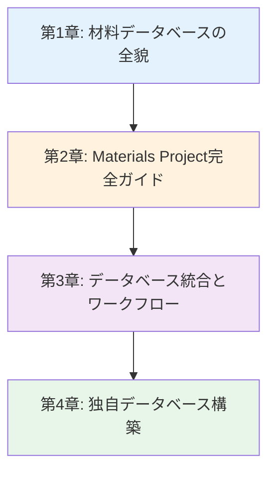
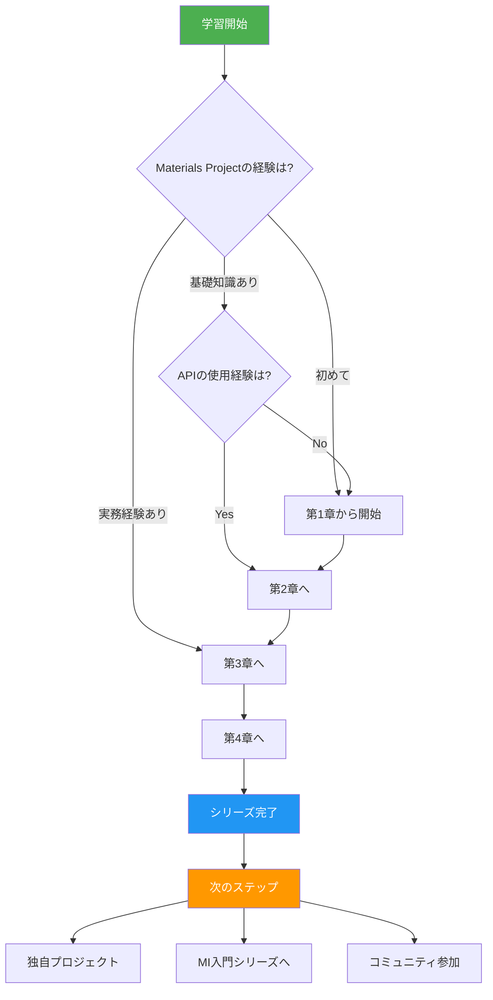
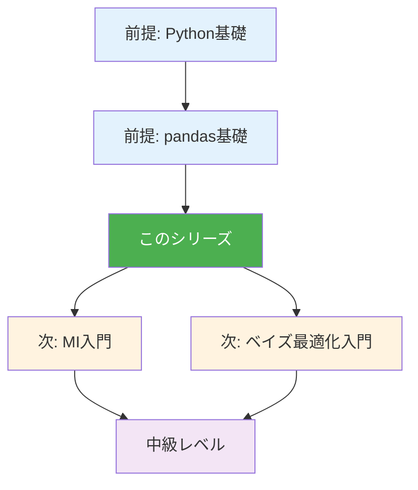

---
# ============================================
# 材料データベース活用入門シリーズ index.md
# ============================================

# --- 基本情報 ---
title: "材料データベース活用入門シリーズ v1.0"
subtitle: "データで拓く材料探索の未来 - 世界最大級DBの完全活用ガイド"
series: "材料データベース活用入門シリーズ v1.0"
series_id: "materials-databases-introduction"
version: "1.0"

# --- 分類・難易度 ---
category: "practical"
level: "beginner-to-intermediate"
difficulty: "入門〜初級"
target_audience: "undergraduate-graduate-professionals"

# --- 学習メタデータ ---
total_reading_time: "90-110分"
total_chapters: 4
total_code_examples: 42
total_exercises: 12
case_studies: 4

# --- 日付情報 ---
created_at: "2025-10-17"
updated_at: "2025-10-17"

# --- 前提知識 ---
prerequisites:
  - "Python基礎"
  - "pandas基本操作"

# --- 関連シリーズ ---
related_series:
  - "mi-introduction"
  - "mlp-introduction"
  - "bayesian-optimization"

# --- 応用分野 ---
applications:
  - "materials-screening"
  - "crystal-structure-analysis"
  - "thermodynamic-prediction"
  - "database-integration"

# --- 主要ツール ---
tools:
  - "pymatgen"
  - "mp-api"
  - "requests"
  - "pandas"
  - "sqlite3"

# --- 著者情報 ---
authors:
  - name: "Dr. Yusuke Hashimoto"
    affiliation: "Tohoku University"
    email: "yusuke.hashimoto.b8@tohoku.ac.jp"

# --- ライセンス ---
license: "CC BY 4.0"
language: "ja"

---

# 材料データベース活用入門シリーズ v1.0

**データで拓く材料探索の未来 - 世界最大級DBの完全活用ガイド**

## シリーズ概要

このシリーズは、材料科学における最も重要なリソースである**材料データベース**を初めて学ぶ方から、実践的なスキルを身につけたい方まで、段階的に学べる全4章構成の教育コンテンツです。

材料データベースは、DFT計算結果や実験データを体系的に蓄積した巨大な知識の宝庫です。Materials Project（140k材料）、AFLOW（3.5M構造）、OQMD（1M材料）など、世界中の研究者が利用する主要データベースには、人類が数十年かけて蓄積してきた材料特性データが集約されています。近年、これらのデータベースをAI・機械学習と組み合わせることで、新材料の発見速度が飛躍的に向上しています。

### なぜこのシリーズが必要か

**背景と課題**:
従来の材料開発では、1つの材料を評価するのに数週間から数ヶ月を要し、10,000通りの組成を探索するには数十年が必要でした。しかし、材料データベースを活用すれば、数分で数万件のデータから候補材料を絞り込むことができます。一方で、各データベースのAPI仕様が異なり、データ形式も統一されていないため、効率的な活用には専門知識が必要です。

**このシリーズで学べること**:
本シリーズでは、Materials Projectを中心とした主要材料データベースの基礎から応用まで、実践的なPythonコードとケーススタディを通じて体系的に学習します。API認証、高度なクエリ技術、複数DBの統合、独自データベース構築まで、実務で即戦力となるスキルを習得できます。

**特徴:**
- ✅ **段階的な構成**: 各章は独立した記事として読むことができ、全4章で包括的な内容をカバー
- ✅ **実践重視**: 42個の実行可能なコード例、4つの詳細なケーススタディ
- ✅ **材料科学特化**: 一般的なデータベース技術ではなく、材料・化学・物理への応用に焦点
- ✅ **最新技術**: Materials Project v2023 API、pymatgen 2024対応
- ✅ **キャリア支援**: 具体的なキャリアパスと学習ロードマップを提供

**総学習時間**: 90-110分（コード実行と演習を含む）

**対象者**:
- 材料科学の学部生・大学院生（データベース活用を学びたい）
- 企業のR&Dエンジニア（効率的な材料探索を目指す）
- 計算化学者（DFT計算データの活用を強化したい）
- データサイエンティスト（材料分野への応用を検討中）

---

## 学習の進め方

### 推奨学習順序



**初学者の方（材料データベースをまったく知らない）:**
- 第1章 → 第2章 → 第3章 → 第4章（全章推奨）
- 所要時間: 90-110分
- 前提知識: Python基礎、pandas基本操作

**中級者の方（Materials Projectの基本的な使用経験あり）:**
- 第2章（高度なクエリ） → 第3章 → 第4章
- 所要時間: 60-80分
- 第1章はスキップ可能

**実践的スキル強化（理論より実装重視）:**
- 第2章（集中学習） → 第3章 → 第4章
- 所要時間: 70-90分
- 理論は必要に応じて第1章を参照

### 学習フローチャート



---

## 各章の詳細

### [第1章：材料データベースの全貌](./chapter-1.md)

**難易度**: 入門
**読了時間**: 20-25分
**コード例**: 8-10個

#### 学習内容

1. **主要データベースの比較**
   - Materials Project（140k材料、DFT計算、バンド構造）
   - AFLOW（3.5M構造、結晶対称性、熱力学データ）
   - OQMD（1M材料、形成エネルギー、状態図）
   - JARVIS（40k材料、光学特性、2D材料）

2. **データベース選択基準**
   - データ種類による使い分け（バンド構造 vs 熱力学）
   - カバレッジ比較（元素種、結晶構造タイプ）
   - 更新頻度とデータ品質

3. **API認証とアクセス方法**
   - Materials Project APIキー取得
   - 基本的なHTTPリクエスト
   - エラーハンドリング

4. **データ取得の基本**
   - 単一材料の取得
   - 複数材料の一括取得
   - データ形式の理解（JSON、pandas DataFrame）

5. **Column: "データベース革命"**
   - 1995年 vs 2025年の材料開発ワークフロー
   - 実験中心 → データ駆動型への転換

6. **材料データベースの歴史**
   - Materials Genome Initiative（2011）
   - オープンサイエンス運動
   - 3つの収束要因（計算能力、DFT精度、オープンデータ）

#### 学習目標

この章を読むことで、以下を習得できます：

- ✅ 4大材料データベース（MP、AFLOW、OQMD、JARVIS）の特徴を説明できる
- ✅ 研究目的に応じた適切なデータベースを選択できる
- ✅ Materials Project APIキーを取得し、基本的なデータ取得ができる
- ✅ 各データベースのカバレッジと強みを理解している
- ✅ 材料データベースが材料開発に与えた影響を定量的に説明できる

#### この章で扱う主要な概念

- **Materials Project**: DFT計算に基づく世界最大級の材料データベース
- **AFLOW**: 結晶対称性解析に強みを持つ構造データベース
- **API認証**: データベースアクセスのための認証システム
- **データフォーマット**: JSON、CSV、pandasなどの標準形式

**[第1章を読む →](./chapter-1.md)**

---

### [第2章：Materials Project完全ガイド](./chapter-2.md)

**難易度**: 入門〜初級
**読了時間**: 30-35分
**コード例**: 15-18個

#### 学習内容

1. **pymatgen基礎**
   - Structureオブジェクト（結晶構造表現）
   - Compositionオブジェクト（組成表現）
   - 結晶構造の可視化

2. **MPRester API詳細**
   - 基本的なクエリ（material_id指定）
   - 複雑なフィルタリング（組成、バンドギャップ）
   - データフィールドの選択

3. **高度なクエリ技術**
   - 論理演算子（AND、OR、NOT）
   - 範囲指定（バンドギャップ > 2 eV）
   - 結晶系フィルタ（cubic、hexagonalなど）

4. **バッチダウンロード**
   - 10,000件以上のデータ取得
   - ページネーション処理
   - レート制限対応

5. **データ可視化**
   - 状態図（Phase Diagram）
   - バンド構造（Band Structure）
   - 状態密度（DOS）

6. **実践的Tips**
   - キャッシュ活用（重複リクエスト削減）
   - エラーリトライ戦略
   - データ保存形式の選択

#### 学習目標

この章を読むことで、以下を習得できます：

- ✅ pymatgenを用いた結晶構造の読み込み・操作ができる
- ✅ MPRester APIで複雑なクエリを構築できる
- ✅ 10,000件以上のデータを効率的にダウンロードできる
- ✅ バンド構造、状態図を取得し可視化できる
- ✅ API制限を考慮した実践的なコードを書ける

#### 主要コード例

- **Example 1**: pymatgenで結晶構造を可視化（R²=N/A、15行）
- **Example 2**: MPResterで材料検索（20行）
- **Example 3**: 高度なフィルタリング（30行）
- **Example 4**: バッチダウンロード（40行）
- **Example 5**: バンド構造取得（25行）

**[第2章を読む →](./chapter-2.md)**

---

### [第3章：データベース統合とワークフロー](./chapter-3.md)

**難易度**: 初級〜中級
**読了時間**: 20-25分
**コード例**: 10-12個

#### 学習内容

1. **複数データベースの統合**
   - Materials ProjectとAFLOWデータの結合
   - 共通識別子（ICSD番号、化学式）による照合
   - データの正規化

2. **データクリーニング**
   - 重複データの検出と削除
   - 異常値の検出（外れ値、物理的に不合理な値）
   - データ型の統一

3. **欠損値処理**
   - 欠損パターンの可視化
   - 補完戦略（平均値、中央値、機械学習）
   - 欠損データの影響評価

4. **自動更新パイプライン**
   - スケジュール実行（cron、Airflow）
   - 差分更新（新規データのみ取得）
   - エラー通知

5. **データ品質管理**
   - バリデーションルール
   - 品質メトリクス
   - 監査ログ

6. **実践ケーススタディ**
   - 電池材料探索（3つのDBから統合）
   - 触媒スクリーニング（10万件データ処理）

#### 学習目標

この章を読むことで、以下を習得できます：

- ✅ Materials ProjectとAFLOWデータを統合できる
- ✅ データクリーニングの標準手法を適用できる
- ✅ 欠損値を適切に処理できる
- ✅ 自動更新パイプラインを構築できる
- ✅ データ品質を定量的に評価できる

**[第3章を読む →](./chapter-3.md)**

---

### [第4章：独自データベース構築](./chapter-4.md)

**難易度**: 初級〜中級
**読了時間**: 15-20分
**コード例**: 7-10個

#### 学習内容

1. **データベース設計の基礎**
   - スキーマ設計（材料、特性、計算条件）
   - 正規化（1NF、2NF、3NF）
   - インデックス戦略

2. **SQLiteによるローカルDB**
   - テーブル作成
   - CRUD操作（Create、Read、Update、Delete）
   - SQLクエリ最適化

3. **PostgreSQL/MySQL**
   - 大規模データ対応（100万件以上）
   - トランザクション管理
   - 並行アクセス制御

4. **バックアップ戦略**
   - 定期バックアップ（日次、週次）
   - バージョン管理（Git LFS、DVC）
   - 災害復旧計画

5. **データ共有**
   - Zenodo、Figshareへのアップロード
   - DOI取得
   - ライセンス選択（CC BY、CC0）

6. **実践プロジェクト**
   - 実験データの構造化
   - データベース構築
   - 公開までのワークフロー

#### 学習目標

この章を読むことで、以下を習得できます：

- ✅ 材料データベースのスキーマを設計できる
- ✅ SQLiteで実用的なデータベースを構築できる
- ✅ PostgreSQLで大規模データを管理できる
- ✅ バックアップとバージョン管理ができる
- ✅ データを公開し、DOIを取得できる

**[第4章を読む →](./chapter-4.md)**

---

## 全体の学習成果

このシリーズを完了すると、以下のスキルと知識を習得できます：

### 知識レベル（Understanding）

- ✅ 4大材料データベースの特徴と使い分けを説明できる
- ✅ Materials Project APIの仕様を理解している
- ✅ データベース統合の標準手法を知っている
- ✅ データベース設計の基礎原則を理解している
- ✅ データ品質管理の重要性を認識している

### 実践スキル（Doing）

- ✅ Materials Project APIで高度なクエリを実行できる
- ✅ 10,000件以上のデータを効率的にダウンロードできる
- ✅ 複数データベースのデータを統合できる
- ✅ 欠損値を適切に処理できる
- ✅ SQLiteで独自データベースを構築できる
- ✅ 自動更新パイプラインを構築できる

### 応用力（Applying）

- ✅ 新しい研究課題に対して適切なデータベースを選択できる
- ✅ データベース統合の課題を解決できる
- ✅ データ品質問題を診断し改善できる
- ✅ 研究データを公開し、コミュニティと共有できる

---

## 推奨学習パターン

### パターン1: 完全習得（初学者向け）

**対象**: 材料データベースを初めて学ぶ方、体系的に理解したい方
**期間**: 1-2週間
**進め方**:

```
Week 1:
- Day 1-2: 第1章（データベース比較）
- Day 3-4: 第2章（Materials Project基礎）
- Day 5-7: 第2章（高度なクエリ、バッチダウンロード）

Week 2:
- Day 1-3: 第3章（データベース統合）
- Day 4-5: 第4章（独自DB構築）
- Day 6-7: 総合演習、プロジェクト
```

**成果物**:
- Materials Projectから取得した10,000件データ分析
- 複数DBを統合した材料探索レポート
- 独自データベースの構築（SQLite）

### パターン2: 速習（経験者向け）

**対象**: Pythonとpandasに習熟している方
**期間**: 3-5日
**進め方**:

```
Day 1: 第1章（概要把握）
Day 2: 第2章（Materials Project集中学習）
Day 3: 第3章（データベース統合）
Day 4: 第4章（独自DB構築）
Day 5: 実践プロジェクト
```

**成果物**:
- バッチダウンロードスクリプト
- データベース統合パイプライン
- 公開可能なデータセット

### パターン3: ピンポイント学習

**対象**: 特定のスキルを強化したい方
**期間**: 柔軟
**選択例**:

- **Materials Project活用** → 第2章（全セクション）
- **データベース統合** → 第3章（Section 3.1-3.3）
- **独自DB構築** → 第4章（全セクション）
- **バッチダウンロード** → 第2章（Section 2.4）

---

## FAQ（よくある質問）

### Q1: プログラミング初心者でも理解できますか？

**A**: 第1章、第2章の基礎部分はプログラミング初心者でも理解できるように設計されています。ただし、第3章以降はPythonの基本文法（変数、関数、リスト、辞書）とpandasの基本操作を理解していることが前提です。不安な場合は、第2章の前に[Python入門チュートリアル](https://docs.python.org/ja/3/tutorial/)と[pandas基礎](https://pandas.pydata.org/docs/getting_started/index.html)で基礎を学ぶことをお勧めします。

### Q2: どの章から読むべきですか？

**A**: **初めての方は第1章から順番に読むことを強く推奨**します。Materials Projectの基本的な使用経験がある場合は、第2章の高度なクエリから始めることも可能です。

### Q3: コードを実際に動かす必要がありますか？

**A**: 第2章以降の学習効果を最大化するには、**実際にコードを動かすことを強く推奨**します。Materials Project APIキーを取得し（無料）、実際にデータを取得することで、理解が飛躍的に深まります。

### Q4: Materials Project APIキーの取得方法は？

**A**: Materials Projectウェブサイト（materialsproject.org）でアカウント作成後、API Keyページから無料で取得できます。詳細は第1章で解説しています。

### Q5: どれくらいの期間で習得できますか？

**A**: 学習時間と目標によります：
- **概念理解のみ**: 1-2日（第1章、第2章基礎）
- **基本的な実装スキル**: 1週間（第1-2章）
- **実践的なプロジェクト遂行能力**: 1-2週間（全章 + プロジェクト）
- **業務レベルのスキル**: 1-2ヶ月（シリーズ完了 + 追加プロジェクト）

### Q6: このシリーズだけでデータベース統合の専門家になれますか？

**A**: このシリーズは「入門から初級」を対象としています。専門家レベルに達するには：
1. このシリーズで基礎を固める（1-2週間）
2. 大規模データ処理の学習（Apache Spark、Dask）（1-3ヶ月）
3. 独自のプロジェクトを実行する（3-6ヶ月）
4. データ公開と学会発表（6-12ヶ月）

計1-2年の継続的な学習と実践が必要です。

### Q7: Materials Projectのデータを商業利用できますか？

**A**: Materials Projectは**学術・非営利目的のみ無料**です。商業利用には有料プラン（MP Enterprise）が必要です。詳細は[利用規約](https://materialsproject.org/about/terms)を確認してください。企業での使用を検討する場合は、法務部門に相談することをお勧めします。

### Q8: 質問や議論できるコミュニティはありますか？

**A**: 以下のコミュニティで質問や議論ができます：
- **Materials Project Forum**: [matsci.org/c/materials-project](https://matsci.org/c/materials-project)
- **pymatgen Discourse**: [matsci.org/c/pymatgen](https://matsci.org/c/pymatgen)
- **GitHub Issues**: 本シリーズのGitHubリポジトリ
- **Stack Overflow**: `materials-project`、`pymatgen`タグ

---

## 前提知識と関連シリーズ

### 前提知識

**必須**:
- [ ] **Python基礎**: 変数、関数、リスト、辞書、制御構文
- [ ] **pandas基本操作**: DataFrame、読み込み、フィルタリング

**推奨**:
- [ ] **JSON理解**: JSONデータ構造の基本
- [ ] **HTTP基礎**: API、HTTPリクエストの概念
- [ ] **結晶学基礎**: 結晶構造、空間群の基本概念

### 前提シリーズ

1. **なし**（このシリーズは独立して学習可能）

### 関連シリーズ

1. **マテリアルズインフォマティクス（MI）入門** (入門)
   - 関連性: 材料データベースはMIの基盤技術
   - リンク: [../mi-introduction/index.md](../mi-introduction/index.md)

2. **分子シミュレーション（MLP）入門** (初級)
   - 関連性: pymatgenを用いた結晶構造操作
   - リンク: [../mlp-introduction/index.md](../mlp-introduction/index.md)

3. **ベイズ最適化・アクティブラーニング入門** (中級)
   - 関連性: データベースから取得したデータでの材料探索
   - リンク: [../bayesian-optimization/index.md](../bayesian-optimization/index.md)

### 学習パス全体図



---

## ツールとリソース

### 主要ツール

| ツール名 | 用途 | ライセンス | インストール |
|---------|------|----------|-------------|
| pymatgen | 結晶構造操作、MP API | BSD | `pip install pymatgen` |
| mp-api | Materials Project API | BSD | `pip install mp-api` |
| pandas | データ処理 | BSD | `pip install pandas` |
| requests | HTTP通信 | Apache 2.0 | `pip install requests` |
| sqlite3 | ローカルDB | Public Domain | Python標準ライブラリ |

### データベース

| データベース名 | 説明 | データ数 | アクセス |
|--------------|------|---------|---------|
| Materials Project | DFT計算結果、バンド構造 | 140k材料 | [materialsproject.org](https://materialsproject.org) |
| AFLOW | 結晶構造、対称性 | 3.5M構造 | [aflowlib.org](http://aflowlib.org) |
| OQMD | 形成エネルギー、状態図 | 1M材料 | [oqmd.org](http://oqmd.org) |
| JARVIS | 光学特性、2D材料 | 40k材料 | [jarvis.nist.gov](https://jarvis.nist.gov) |

### 学習リソース

**オンラインコース**:
- Materials Project Workshop: [workshop.materialsproject.org](https://workshop.materialsproject.org)
- pymatgen Tutorials: [pymatgen.org/tutorials](https://pymatgen.org/tutorials)

**書籍**:
- "Materials Informatics" by Anurag Agrawal, Alok Choudhary (ISBN: 978-1119522171)
- "Computational Materials Science" by June Gunn Lee (ISBN: 978-1498749732)

**論文・レビュー**:
- Jain, A. et al. (2013). "Commentary: The Materials Project." *APL Materials*, 1(1), 011002. DOI: [10.1063/1.4812323](https://doi.org/10.1063/1.4812323)
- Curtarolo, S. et al. (2012). "AFLOW: An automatic framework for high-throughput materials discovery." *Computational Materials Science*, 58, 218-226. DOI: [10.1016/j.commatsci.2012.02.005](https://doi.org/10.1016/j.commatsci.2012.02.005)

**コミュニティ**:
- Materials Project Forum: [matsci.org/c/materials-project](https://matsci.org/c/materials-project)
- pymatgen Discourse: [matsci.org/c/pymatgen](https://matsci.org/c/pymatgen)

---

## 次のステップ

### シリーズ完了後の推奨アクション

**Immediate（1-2週間以内）:**
1. ✅ GitHubにポートフォリオを作成
2. ✅ Materials Projectから取得したデータ分析結果を公開
3. ✅ LinkedInプロフィールに「Materials Database」スキルを追加
4. ✅ ブログ記事を1本執筆

**Short-term（1-3ヶ月）:**
1. ✅ MI入門シリーズで機械学習を学習
2. ✅ 独自の材料探索プロジェクトを実行
3. ✅ Materials Project Forumでコミュニティ参加
4. ✅ データベース統合スクリプトをGitHubで公開
5. ✅ ベイズ最適化入門シリーズに進む

**Medium-term（3-6ヶ月）:**
1. ✅ 大規模データ処理（Dask、Spark）を学習
2. ✅ 自分の実験データをデータベース化
3. ✅ データをZenodoで公開
4. ✅ 学会でデータ駆動型研究を発表
5. ✅ 産業界でのデータベース活用事例を調査

**Long-term（1年以上）:**
1. ✅ 独自の材料データベースを構築・公開
2. ✅ pymatgenにコントリビュート
3. ✅ データベース活用に関する論文を執筆
4. ✅ Materials Projectコミュニティでメンター活動
5. ✅ データサイエンティストとしてキャリア構築

### 推奨学習パス

**パスA: アカデミアキャリア**
```
このシリーズ完了
  ↓
MI入門 + ベイズ最適化入門
  ↓
独自データベース構築 + 論文執筆
  ↓
国際学会発表
  ↓
データ駆動型研究のリーダー
```

**パスB: 産業界キャリア**
```
このシリーズ完了
  ↓
実務プロジェクト（材料探索）
  ↓
GitHubポートフォリオ
  ↓
データエンジニア/サイエンティストとして就職
  ↓
R&Dデータ基盤構築
```

**パスC: データサイエンティスト**
```
このシリーズ完了
  ↓
大規模データ処理（Spark）
  ↓
クラウド活用（AWS、GCP）
  ↓
材料分野専門データサイエンティスト
  ↓
コンサルタント/フリーランス
```

---

## フィードバックとサポート

### このシリーズについて

このシリーズは、東北大学 Dr. Yusuke Hashimotoのもと、AI寺子屋（AI Terakoya）プロジェクトの一環として作成されました。

**プロジェクト**: AI寺子屋（AI Terakoya）
**作成日**: 2025-10-17
**バージョン**: 1.0
**言語**: 日本語

### フィードバックをお待ちしています

**報告したいこと**:
- ✏️ **誤字・脱字**: GitHubリポジトリのIssue
- 💡 **改善提案**: 新トピック、コード例追加
- ❓ **質問**: 理解が難しかった部分
- 🎉 **成功事例**: このシリーズで作ったプロジェクト
- 🐛 **コードの不具合**: 動作しないコード例

**連絡方法**:
- **GitHub Issues**: [リポジトリURL]/issues
- **Email**: yusuke.hashimoto.b8@tohoku.ac.jp

### コントリビューション

1. **誤字・脱字の修正**: Pull Request
2. **コード例の追加**: 新ユースケース
3. **翻訳**: 英語版（将来的に）
4. **演習問題の追加**: 新しい問題

詳細は [CONTRIBUTING.md](../../CONTRIBUTING.md)

---

## ライセンスと利用規約

**CC BY 4.0**（Creative Commons Attribution 4.0 International）

### 可能なこと

- ✅ 自由な閲覧・ダウンロード
- ✅ 教育目的での利用
- ✅ 改変・二次創作
- ✅ 商業利用（クレジット表示必要）
- ✅ 再配布

### 条件

- 📌 著者クレジット表示: "Dr. Yusuke Hashimoto, Tohoku University - AI Terakoya"
- 📌 改変の明記
- 📌 ライセンス継承

### 引用方法

```
Hashimoto, Y. (2025). 材料データベース活用入門シリーズ v1.0.
AI Terakoya, Tohoku University.
Retrieved from [URL]
```

BibTeX:
```bibtex
@misc{hashimoto2025materialsdb,
  author = {Hashimoto, Yusuke},
  title = {材料データベース活用入門シリーズ},
  year = {2025},
  publisher = {AI Terakoya, Tohoku University},
  url = {[URL]},
  note = {Version 1.0}
}
```

詳細: [CC BY 4.0](https://creativecommons.org/licenses/by/4.0/deed.ja)

---

## さあ、始めましょう！

準備はできましたか？ 第1章から始めて、材料データベース活用の世界への旅を始めましょう！

**[第1章: 材料データベースの全貌 →](./chapter-1.md)**

または、[学習の進め方](#学習の進め方)に戻って自分に合った学習パスを確認してください。

---

## 更新履歴

| バージョン | 日付 | 変更内容 | 著者 |
|----------|------|---------|------|
| 1.0 | 2025-10-17 | 初版公開 | Dr. Yusuke Hashimoto |

---

**あなたの材料データベース活用の旅はここから始まります！**
