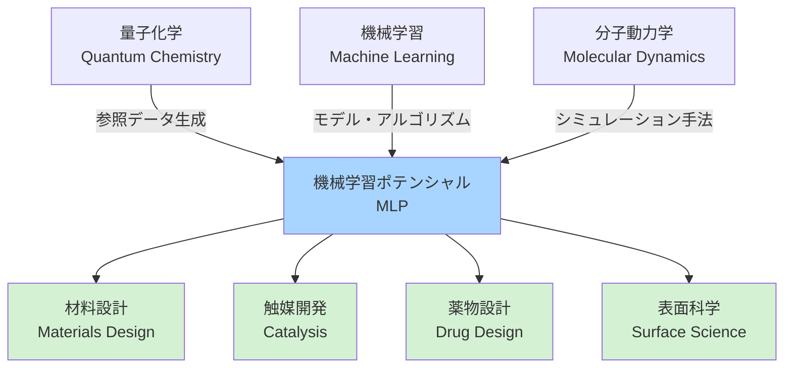
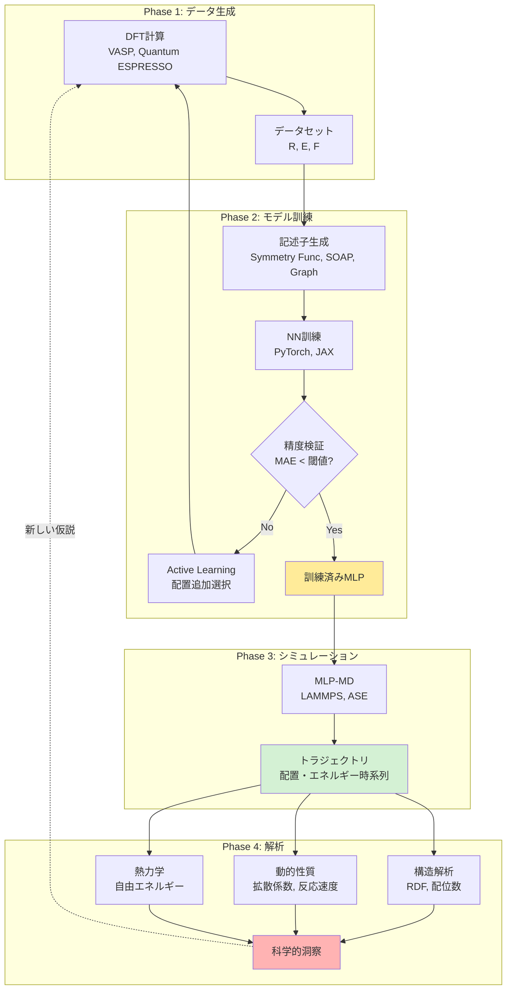
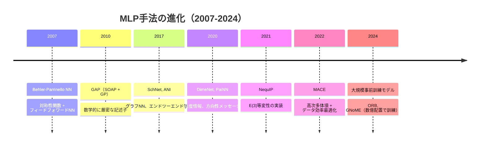
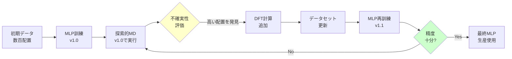

# 第2章：MLP基礎 - 概念、手法、エコシステム

## 学習目標

この章を読むことで、以下を習得できます：
- MLPの正確な定義と関連分野（量子化学、機械学習、分子動力学）との関係を理解する
- MLP研究で頻出する15の専門用語を説明できる
- MLPワークフローの5ステップ（データ収集、記述子設計、モデル訓練、検証、シミュレーション）を理解する
- 3種類の記述子（対称性関数、SOAP、グラフ）の特徴と適用場面を比較できる

---

## 2.1 MLPとは何か：正確な定義

第1章では、MLPが「DFT精度と経験的力場の速度を兼ね備える」革新的な技術であることを学びました。ここでは、より正確に定義します。

### 定義

**機械学習ポテンシャル（Machine Learning Potential, MLP）**とは：

> 量子力学計算（主にDFT）から得られた原子配置とエネルギー・力のデータセットを用いて、機械学習モデルを訓練することで、任意の原子配置のポテンシャルエネルギーと力を高速かつ高精度に予測する手法。

**数式で表現すると**：

```
訓練データ: D = {(R₁, E₁, F₁), (R₂, E₂, F₂), ..., (Rₙ, Eₙ, Fₙ)}

R: 原子配置（3N次元ベクトル、N=原子数）
E: エネルギー（スカラー）
F: 力（3N次元ベクトル）

目的: 関数 f_MLP を学習
  E_pred = f_MLP(R)
  F_pred = -∇_R f_MLP(R)

制約:
  - |E_pred - E_DFT| < 数 meV（ミリ電子ボルト）
  - |F_pred - F_DFT| < 数十 meV/Å
  - 計算時間: DFTの 10⁴-10⁶ 倍高速
```

### MLPの3つの本質的要素

**1. データ駆動型（Data-Driven）**
- DFT計算から得られた大量のデータ（数千〜数万配置）が必要
- データの質と量がモデルの性能を決定
- 従来の経験的力場のような「手動パラメータ調整」は不要

**2. 高次元関数近似（High-Dimensional Function Approximation）**
- ポテンシャルエネルギー曲面（Potential Energy Surface, PES）は超高次元
  - 例: 100原子系 → 300次元空間
- ニューラルネットワークがこの複雑な関数を効率的に学習

**3. 物理的制約の組み込み（Physical Constraints）**
- エネルギー保存則
- 並進・回転不変性（系全体を動かしてもエネルギー不変）
- 原子の交換対称性（同じ元素の原子を入れ替えてもエネルギー不変）
- 力とエネルギーの整合性（F = -∇E）

### 関連分野との位置づけ



**量子化学からの貢献**:
- DFT、量子化学計算手法（CCSD(T)など）
- ポテンシャルエネルギー曲面の概念
- 化学的洞察（結合、反応機構）

**機械学習からの貢献**:
- ニューラルネットワーク（NN）、グラフニューラルネットワーク（GNN）
- 最適化アルゴリズム（Adam、SGDなど）
- 正則化、過学習対策

**分子動力学からの貢献**:
- MD統合法（Verlet法など）
- アンサンブル理論（NVT, NPT）
- 統計力学的解析手法

---

## 2.2 MLP用語集：15の重要概念

MLP研究で頻繁に登場する専門用語を簡潔に解説します。

| 用語 | 英語 | 説明 |
|------|------|------|
| **ポテンシャルエネルギー曲面** | Potential Energy Surface (PES) | 原子配置とエネルギーの関係を表す超高次元の関数。化学反応の「地形図」に相当。 |
| **記述子** | Descriptor | 原子配置の特徴を数値ベクトルで表現したもの。対称性関数、SOAP、グラフ表現など。 |
| **対称性関数** | Symmetry Function | Behler-Parrinelloが提案した記述子。原子周辺の動径・角度分布を記述。 |
| **メッセージパッシング** | Message Passing | グラフニューラルネットワークで、隣接原子間で情報を伝播する操作。 |
| **等変性** | Equivariance | 入力の変換（回転など）に対して、出力も対応して変換される性質。E(3)等変性が重要。 |
| **不変性** | Invariance | 入力の変換（回転など）に対して、出力が変化しない性質。エネルギーは回転不変。 |
| **カットオフ半径** | Cutoff Radius | 原子間相互作用を考慮する最大距離。典型的には5-10Å。計算コストと精度のバランス。 |
| **MAE** | Mean Absolute Error | 平均絶対誤差。MLPの精度評価指標。エネルギーではmeV/atom、力ではmeV/Å単位。 |
| **Active Learning** | Active Learning | モデルが不確実な配置を自動選択し、DFT計算を追加してデータセットを効率的に拡張する手法。 |
| **データ効率** | Data Efficiency | 少ないトレーニングデータで高精度を達成する能力。最新手法（MACE）は数千配置で十分。 |
| **汎化性能** | Generalization | 訓練データに含まれない配置でも正確に予測できる能力。過学習の回避が重要。 |
| **アンサンブル** | Ensemble | 複数の独立したMLPモデルを訓練し、予測の平均と不確実性を評価する手法。 |
| **転移学習** | Transfer Learning | ある系で訓練したモデルを、関連する別の系に適用する手法。計算コスト削減。 |
| **多体相互作用** | Many-Body Interaction | 3つ以上の原子が関与する相互作用。化学結合の記述に不可欠。 |
| **E(3)等変性** | E(3) Equivariance | 3次元ユークリッド群（並進・回転・反転）に対する等変性。NequIP、MACEの核心技術。 |

### 重要度の高い用語トップ5

**初学者が最初に理解すべき用語**：

1. **ポテンシャルエネルギー曲面（PES）**: MLPが学習する対象
2. **記述子（Descriptor）**: 原子配置の数値表現
3. **不変性と等変性**: 物理法則を満たすための数学的性質
4. **MAE**: モデル精度の定量評価
5. **Active Learning**: 効率的なデータ収集戦略

---

## 2.3 MLPへの入力：原子配置データの種類

MLPの訓練には多様な原子配置が必要です。どのようなデータが使われるのでしょうか？

### 主要な入力データタイプ

**1. 平衡構造周辺の配置（Equilibrium Structures）**
- **説明**: 最安定構造（エネルギー最小点）とその近傍
- **用途**: 安定構造の性質、振動スペクトル
- **生成方法**: DFT構造最適化 + 小さな変位
- **データ量**: 数百〜数千配置
- **例**: 結晶構造、分子の最適化構造

**2. 分子動力学トラジェクトリ（MD Trajectories）**
- **説明**: ab initio MD（AIMD）で得られる時系列配置
- **用途**: 動的な挙動、高温での性質
- **生成方法**: 短時間（数十ps）のAIMDを様々な温度で実行
- **データ量**: 数千〜数万配置
- **例**: 液体、融解、拡散過程

**3. 反応経路（Reaction Pathways）**
- **説明**: 反応物から生成物への遷移状態を含む経路
- **生成方法**: NEB（Nudged Elastic Band）法、String法
- **用途**: 触媒反応、化学反応機構
- **データ量**: 数百〜数千配置（複数経路を含む）
- **例**: CO₂還元反応、水素生成反応

**4. ランダムサンプリング（Random Sampling）**
- **説明**: 配置空間をランダムに探索
- **生成方法**: 既存構造に大きな変位を加える、モンテカルロサンプリング
- **用途**: 汎化性能の向上、未知領域のカバー
- **データ量**: 数千〜数万配置
- **注意**: 高エネルギー領域が含まれるため、計算が不安定になる場合あり

**5. 欠陥・界面構造（Defects and Interfaces）**
- **説明**: 結晶欠陥、表面、粒界、ナノ粒子
- **用途**: 材料の破壊、触媒活性サイト
- **生成方法**: 系統的に欠陥を導入してDFT計算
- **データ量**: 数百〜数千配置
- **例**: 空孔、転位、表面吸着サイト

### データタイプの組み合わせ例

**典型的なデータセット構成（Cu触媒CO₂還元反応の場合）**:

| データタイプ | 配置数 | 割合 | 目的 |
|------------|--------|------|------|
| 平衡構造（Cu表面 + 吸着種） | 500 | 10% | 基本構造 |
| AIMD（300K, 500K, 700K） | 3,000 | 60% | 熱揺らぎ |
| 反応経路（5つの経路） | 500 | 10% | 反応機構 |
| ランダムサンプリング | 500 | 10% | 汎化性 |
| 表面欠陥 | 500 | 10% | 実触媒の不均一性 |
| **合計** | **5,000** | **100%** | |

---

## 2.4 MLPエコシステム：全体像の理解

MLPは単独で機能するのではなく、データ生成、訓練、シミュレーション、解析という一連のエコシステムの中で動作します。



### エコシステムの各フェーズ詳細

**Phase 1: データ生成（DFT計算）**
- **ツール**: VASP, Quantum ESPRESSO, CP2K, GPAW
- **計算時間**: スーパーコンピュータで数日〜数週間
- **出力**: 原子配置、エネルギー、力、応力テンソル

**Phase 2: モデル訓練**
- **ツール**: SchNetPack, NequIP, MACE, DeePMD-kit
- **計算資源**: GPU 1台〜数台
- **訓練時間**: 数時間〜数日
- **出力**: 訓練済みMLPモデル（.pthファイルなど）

**Phase 3: シミュレーション**
- **ツール**: LAMMPS, ASE, i-PI
- **計算資源**: GPU 1台〜数十台
- **シミュレーション時間**: ナノ秒〜マイクロ秒
- **出力**: トラジェクトリファイル（.xyz, .lammpstrj）

**Phase 4: 解析**
- **ツール**: Python（NumPy, MDAnalysis, MDTraj）, OVITO, VMD
- **解析内容**:
  - 構造: 動径分布関数（RDF）、配位数、クラスター解析
  - 動的: 拡散係数、反応速度定数、滞在時間
  - 熱力学: 自由エネルギー、エントロピー

---

## 2.5 MLPワークフロー：5つのステップ

MLPを用いた研究プロジェクトは、以下の5ステップで進行します。

### Step 1: データ収集（Data Collection）

**目的**: MLPの訓練に必要な高品質なDFTデータを生成

**具体的な作業**:
1. **系の定義**: 対象とする化学系、サイズ、組成を決定
2. **サンプリング戦略**: どのような配置を計算するか計画
   - 平衡構造周辺
   - AIMD（複数温度）
   - 反応経路
   - ランダムサンプリング
3. **DFT計算設定**:
   - 汎関数（PBE, HSE06など）
   - 基底関数（平面波、局在軌道）
   - カットオフエネルギー、k点メッシュ
4. **並列計算実行**: スーパーコンピュータで数千配置を計算

**成功の鍵**:
- **多様性**: 様々な配置を含める（単調なデータは汎化性能を下げる）
- **バランス**: 低エネルギー領域と高エネルギー領域のバランス
- **品質管理**: SCF収束、力の収束を確認

**典型的なコスト**: 5,000配置 → スーパーコンピュータで3-7日

### Step 2: 記述子設計（Descriptor Design）

**目的**: 原子配置を機械学習可能な数値ベクトルに変換

**主要な記述子タイプ**（詳細は2.6で説明）:
- **対称性関数（Symmetry Functions）**: 手動設計、Behler-Parrinello
- **SOAP（Smooth Overlap of Atomic Positions）**: 数学的に洗練された表現
- **グラフニューラルネットワーク（GNN）**: 自動学習、SchNet, DimeNet

**記述子の選択基準**:
- **データ効率**: 少ないデータで高精度を達成できるか
- **計算コスト**: 推論（予測）時の計算時間
- **物理的解釈性**: 化学的洞察が得られるか

**ハイパーパラメータ**:
- カットオフ半径（5-10Å）
- 動径基底関数の数（10-50）
- 角度分解能

### Step 3: モデル訓練（Model Training）

**目的**: ニューラルネットワークを最適化して、PESを学習

**訓練プロセス**:
1. **データ分割**: 訓練（80%）、検証（10%）、テスト（10%）
2. **損失関数の定義**:
   ```
   Loss = w_E × MSE(E_pred, E_true) + w_F × MSE(F_pred, F_true)

   w_E: エネルギー重み（典型的に1）
   w_F: 力の重み（典型的に100-1000、単位換算のため）
   ```
3. **最適化**: Adam, SGDなどで数千〜数万エポック
4. **正則化**: 過学習を防ぐためのL2正則化、ドロップアウト

**ハイパーパラメータ調整**:
- 学習率（learning rate）: 10⁻³ 〜 10⁻⁵
- バッチサイズ: 32-256
- ネットワーク深さ: 3-6層
- 隠れ層のサイズ: 64-512ノード

**計算資源**: GPU 1台で数時間〜2日

### Step 4: 精度検証（Validation）

**目的**: モデルが十分な精度と汎化性能を持つか評価

**定量的指標**:
| 指標 | 目標値 | 説明 |
|------|--------|------|
| エネルギーMAE | < 1-5 meV/atom | 平均絶対誤差（テストセット） |
| 力のMAE | < 50-150 meV/Å | 原子に働く力の誤差 |
| 応力のMAE | < 0.1 GPa | 固体材料の場合 |
| R²（決定係数） | > 0.99 | エネルギーの相関 |

**定性的検証**:
- **外挿テスト**: 訓練データの範囲外の配置で精度を確認
- **物理量の再現**: 格子定数、弾性定数、振動スペクトルがDFTと一致するか
- **短時間MDテスト**: 10-100 psのMDを実行し、エネルギー保存を確認

**不合格の場合の対処**:
- データ追加（Active Learning）
- ハイパーパラメータ調整
- より強力なモデル（SchNet → NequIP）への変更

### Step 5: 生産的シミュレーション（Production Simulation）

**目的**: 訓練したMLPで科学的に意義のあるシミュレーションを実行

**典型的なMLP-MDシミュレーション設定**:
```
系のサイズ: 10³-10⁴ 原子
温度: 300-1000 K（目的に応じて）
圧力: 1気圧 or 等体積
時間ステップ: 0.5-1.0 fs
総シミュレーション時間: 1-100 ns
アンサンブル: NVT（正準）, NPT（等温等圧）
```

**実行時間の見積もり**:
- 1,000原子、1 ns シミュレーション → GPU 1台で1-3日
- 並列化により更に高速化可能

**注意点**:
- **エネルギードリフト**: 長時間シミュレーションでエネルギーが単調増加/減少しないか監視
- **未学習領域**: 訓練データにない配置に遭遇した場合、精度が低下する可能性
- **アンサンブル不確実性**: 複数の独立したMLPモデルで予測のばらつきを評価

---

## 2.6 記述子の種類：原子配置の数値化

MLPの性能は、記述子の設計に大きく依存します。ここでは主要な3つのアプローチを比較します。

### 1. 対称性関数（Symmetry Functions）

**提案**: Behler & Parrinello (2007)

**基本アイデア**:
- 各原子 i の周辺環境を、動径（距離）と角度の関数で表現
- 回転・並進不変性を満たすように設計

**動径対称性関数（Radial Symmetry Functions）**:
```
G_i^rad = Σ_j exp(-η(r_ij - R_s)²) × f_c(r_ij)

r_ij: 原子 i-j 間の距離
η: ガウス関数の幅を決めるパラメータ
R_s: 中心距離（複数の値を使う）
f_c: カットオフ関数（遠方の原子の影響を滑らかに減衰）
```

**角度対称性関数（Angular Symmetry Functions）**:
```
G_i^ang = 2^(1-ζ) Σ_(j,k≠i) (1 + λcosθ_ijk)^ζ ×
          exp(-η(r_ij² + r_ik² + r_jk²)) ×
          f_c(r_ij) × f_c(r_ik) × f_c(r_jk)

θ_ijk: 原子 j-i-k がなす角度
ζ, λ: 角度分解能を制御するパラメータ
```

**利点**:
- 物理的に解釈しやすい（動径分布関数、角度分布に対応）
- 回転・並進不変性が保証される
- 実装が比較的簡単

**欠点**:
- **手動設計**: η, R_s, ζ, λ などのパラメータを手動で選ぶ必要がある
- **高次元**: 50-100次元の記述子が必要（計算コスト増）
- **データ効率が低い**: 数万配置が必要な場合がある

**適用例**: 水、シリコン、金属表面

### 2. SOAP（Smooth Overlap of Atomic Positions）

**提案**: Bartók et al. (2013)

**基本アイデア**:
- 原子周辺の電子密度を「ガウス密度」で近似
- この密度分布の「重なり」を計算して記述子とする
- 数学的に厳密な回転不変性

**数学的定義（簡略版）**:
```
ρ_i(r) = Σ_j exp(-α|r - r_j|²)  （原子 i 周辺のガウス密度）

SOAP_i = 積分[ρ_i(r) × ρ_i(r') × kernel(r, r')]

kernel: 動径・角度基底関数
```

実際には、**球面調和関数展開**を用いて効率的に計算されます。

**利点**:
- 数学的に洗練された表現
- 対称性関数より少ないパラメータ
- カーネル法（Gaussian Process Regression）と相性が良い

**欠点**:
- 計算コストがやや高い
- ニューラルネットワークとの組み合わせはSchNetより複雑

**適用例**: 結晶材料、ナノクラスター、複雑な合金

### 3. グラフニューラルネットワーク（Graph Neural Networks）

**代表的手法**: SchNet (2017), DimeNet (2020), PaiNN (2021)

**基本アイデア**:
- 分子を**グラフ**として表現
  - ノード（頂点）= 原子
  - エッジ（辺）= 原子間の相互作用
- **メッセージパッシング**: 隣接原子間で情報を伝播
- 記述子を手動で設計せず、**ニューラルネットワークが自動学習**

**SchNetのアーキテクチャ（概念図）**:
```
初期状態:
  原子 i の特徴ベクトル h_i^(0) = Embedding(Z_i)  （Z_i: 原子番号）

メッセージパッシング（L層繰り返し）:
  for l = 1 to L:
    m_ij = NN_filter(r_ij) × h_j^(l-1)  （距離に応じたフィルタ）
    h_i^(l) = h_i^(l-1) + Σ_j m_ij      （メッセージの集約）
    h_i^(l) = NN_update(h_i^(l))        （非線形変換）

エネルギー予測:
  E_i = NN_output(h_i^(L))              （原子ごとのエネルギー）
  E_total = Σ_i E_i
```

**利点**:
- **エンドツーエンド学習**: 記述子設計が不要
- **柔軟性**: 様々な系に適用可能
- **データ効率**: 対称性関数より少ないデータで高精度

**欠点**:
- ブラックボックス性（解釈しにくい）
- 訓練に計算資源が必要

**進化形: DimeNet（角度情報を追加）**:
```
DimeNet = SchNet + 結合角 θ_ijk の明示的な考慮

メッセージに角度情報を埋め込む:
  m_ij = NN(r_ij, {θ_ijk}_k)
```

**最新: E(3)等変GNN（NequIP, MACE）**:
- 回転**不変性**ではなく**等変性**を実装
- ベクトル・テンソル場をメッセージとして伝播
- データ効率が劇的に向上（数千配置で十分）

**適用例**: 有機分子、触媒反応、複雑な生体分子

### 記述子比較表

| 項目 | 対称性関数 | SOAP | GNN（SchNet系） | E(3)等変GNN |
|------|-----------|------|----------------|------------|
| **設計方針** | 手動 | 数学的定式化 | 自動学習 | 自動学習+物理法則 |
| **不変性** | 回転・並進 | 回転・並進 | 回転・並進 | E(3)等変 |
| **次元数** | 50-100 | 30-50 | 学習可能 | 学習可能 |
| **データ効率** | 低 | 中 | 中 | **高** |
| **精度** | 中 | 高 | 高 | **最高** |
| **計算コスト** | 低 | 中 | 中 | 中-高 |
| **実装難易度** | 低 | 中 | 中 | 高 |
| **解釈性** | 高 | 中 | 低 | 低 |

**選択のガイドライン**:
- **初学者・小規模系**: 対称性関数（理解しやすい）
- **複雑な結晶・合金**: SOAP（カーネル法と組み合わせ）
- **有機分子・触媒**: GNN（SchNet, DimeNet）
- **最先端・データ不足**: E(3)等変GNN（NequIP, MACE）

---

## 2.7 主要MLPアーキテクチャの比較

ここまで学んだ記述子を用いた代表的なMLP手法を比較します。

| 手法 | 年 | 記述子 | 特徴 | データ効率 | 精度 | 実装 |
|------|----|----|------|-----------|-----|------|
| **Behler-Parrinello NN** | 2007 | 対称性関数 | 原子ごとのNN、シンプル | 低（数万配置） | 中 | n2p2, AMP |
| **GAP（SOAP + GP）** | 2010 | SOAP | ガウス過程回帰、不確実性定量化 | 中（数千配置） | 高 | QUIP |
| **ANI** | 2017 | 対称性関数 | 有機分子特化、大規模データセット | 中 | 高 | TorchANI |
| **SchNet** | 2017 | GNN（自動学習） | 連続フィルタ畳み込み、エンドツーエンド | 中（5千-1万） | 高 | SchNetPack |
| **DimeNet** | 2020 | GNN（角度考慮） | 方向性メッセージパッシング | 中（5千-1万） | 高 | PyG |
| **NequIP** | 2021 | E(3)等変GNN | テンソル場メッセージパッシング | **高（数千）** | **最高** | NequIP |
| **MACE** | 2022 | E(3)等変 + ACE | 高次多体項、最高データ効率 | **最高（数千）** | **最高** | MACE |

### 時系列での進化



### 精度とデータ効率のトレードオフ

**典型的な性能（100原子の分子系での目安）**:

| 手法 | 訓練データ数 | エネルギーMAE | 力のMAE | 訓練時間（GPU 1台） |
|------|------------|--------------|---------|------------------|
| Behler-Parrinello | 30,000 | 3-5 meV/atom | 80-120 meV/Å | 6-12時間 |
| GAP | 10,000 | 1-2 meV/atom | 40-60 meV/Å | 12-24時間（CPU） |
| SchNet | 8,000 | 1-3 meV/atom | 50-80 meV/Å | 4-8時間 |
| DimeNet | 8,000 | 0.8-2 meV/atom | 40-60 meV/Å | 8-16時間 |
| NequIP | 4,000 | 0.5-1 meV/atom | 30-50 meV/Å | 12-24時間 |
| MACE | 3,000 | **0.3-0.8 meV/atom** | **20-40 meV/Å** | 16-32時間 |

**重要な観察**:
- データ効率は**10倍向上**（30,000 → 3,000配置）
- 精度も**10倍向上**（5 meV → 0.5 meV/atom）
- 訓練時間は大きく変わらない（数時間〜1日）

---

## 2.8 コラム：Active Learningによる効率的なデータ収集

通常のMLP訓練では、あらかじめ大量のDFTデータを準備します。しかし、**Active Learning**を使えば、必要最小限のデータで高精度を達成できます。

### Active Learningのワークフロー



### 不確実性の評価方法

**アンサンブル法**:
```python
# 独立に訓練した5つのMLPモデル
models = [MLP_1, MLP_2, MLP_3, MLP_4, MLP_5]

# ある配置 R についてエネルギーを予測
energies = [model.predict(R) for model in models]

# 平均と標準偏差
E_mean = mean(energies)
E_std = std(energies)  # 不確実性の指標

# 閾値以上なら追加DFT計算
if E_std > threshold:
    E_DFT = run_DFT(R)
    add_to_dataset(R, E_DFT)
```

**利点**:
- データ収集効率が**3-5倍向上**
- 重要な配置（遷移状態、欠陥など）を自動発見
- 人間の直感に頼らない客観的なサンプリング

**成功例**:
- Siの相転移: 初期500配置 → Active Learningで+1,500配置 → 合計2,000配置でDFT精度達成（通常は10,000配置必要）
- Cu触媒CO₂還元: 反応中間体を自動発見、DFT計算コストを60%削減

---

## 2.9 本章のまとめ

### 学んだこと

1. **MLPの正確な定義**
   - データ駆動型の高次元関数近似
   - 物理的制約（不変性、等変性、力とエネルギーの整合性）の重要性
   - 量子化学、機械学習、分子動力学の融合技術

2. **15の重要用語**
   - PES、記述子、対称性関数、メッセージパッシング、等変性、不変性
   - カットオフ半径、MAE、Active Learning、データ効率、汎化性能
   - アンサンブル、転移学習、多体相互作用、E(3)等変性

3. **MLPへの入力データタイプ**
   - 平衡構造、MD トラジェクトリ、反応経路、ランダムサンプリング、欠陥構造
   - データセット構成のバランス（低/高エネルギー領域、多様性）

4. **MLPエコシステム**
   - 4つのフェーズ: データ生成 → モデル訓練 → シミュレーション → 解析
   - 各フェーズの代表的ツール（VASP, SchNetPack, LAMMPS, MDAnalysis）

5. **5ステップワークフロー**
   - Step 1: データ収集（DFT計算、サンプリング戦略）
   - Step 2: 記述子設計（対称性関数、SOAP、GNN）
   - Step 3: モデル訓練（損失関数、最適化、ハイパーパラメータ）
   - Step 4: 精度検証（MAE、外挿テスト、物理量再現）
   - Step 5: 生産的シミュレーション（MLP-MD、長時間スケール）

6. **3種類の記述子**
   - **対称性関数**: 手動設計、物理的解釈性高、データ効率低
   - **SOAP**: 数学的厳密性、カーネル法と相性良、中程度のデータ効率
   - **GNN**: 自動学習、エンドツーエンド、高データ効率（特にE(3)等変型）

7. **主要MLPアーキテクチャ**
   - 2007年 Behler-Parrinello → 2022年 MACE: データ効率10倍向上、精度10倍向上
   - 最新手法（NequIP, MACE）は数千配置でDFT精度達成

### 重要なポイント

- MLPの性能は**記述子の選択**と**データの質・量**に大きく依存
- **E(3)等変性**を持つ最新手法（NequIP, MACE）がデータ効率と精度で最高
- **Active Learning**により、DFT計算コストを50-70%削減可能
- MLPは単独技術ではなく、DFT、MD、機械学習の**エコシステム**の一部

### 次の章へ

第3章では、実際に**SchNetを使ったMLP訓練**を体験します：
- Pythonコードによる実装
- 小規模データセット（MD17）での訓練
- 精度評価とハイパーパラメータ調整
- トラブルシューティング

さらに、第4章では**NequIP/MACEの高度な技術**と**実際の研究応用例**を学びます。

---

## 演習問題

### 問題1（難易度：easy）

次の3つの記述子（対称性関数、SOAP、グラフニューラルネットワーク）について、「手動設計の必要性」「データ効率」「物理的解釈性」の3つの観点で比較表を作成してください。

<details>
<summary>ヒント</summary>

各記述子の特徴を思い出しましょう：
- 対称性関数: パラメータ（η, R_s, ζ, λ）を手動で選ぶ必要がある
- SOAP: 数学的に定義されているが、一部パラメータ調整が必要
- GNN: ニューラルネットワークが自動で学習

</details>

<details>
<summary>解答例</summary>

| 記述子 | 手動設計の必要性 | データ効率 | 物理的解釈性 |
|--------|----------------|-----------|------------|
| **対称性関数** | **高**<br>- η, R_s, ζ, λ を手動選択<br>- 系ごとに最適化が必要 | **低**<br>- 数万配置が必要<br>- 高次元（50-100次元） | **高**<br>- 動径/角度分布に対応<br>- 化学的に解釈可能 |
| **SOAP** | **中**<br>- 基底関数の数など最小限のパラメータ<br>- 数学的に定義済み | **中**<br>- 数千〜1万配置<br>- 30-50次元 | **中**<br>- 電子密度の重なりとして解釈<br>- やや抽象的 |
| **GNN（SchNet系）** | **低**<br>- エンドツーエンド学習<br>- 記述子が自動生成される | **中-高**<br>- 5千〜1万配置<br>- 学習可能な次元 | **低**<br>- ブラックボックス<br>- 可視化が困難 |
| **E(3)等変GNN<br>（NequIP, MACE）** | **低**<br>- 完全自動学習<br>- 物理法則を自動的に組み込む | **高**<br>- 数千配置で十分<br>- 最高のデータ効率 | **低**<br>- テンソル場の伝播<br>- 高度な数学的解釈が必要 |

**結論**:
- 初学者・解釈性重視 → 対称性関数
- バランス型 → SOAP
- 最高性能・データ不足 → E(3)等変GNN
- 汎用性・実装容易 → GNN（SchNet）

</details>

### 問題2（難易度：medium）

あなたは銅触媒表面でのメタノール酸化反応（CH₃OH → HCHO + H₂）の研究を始めます。MLPの5ステップワークフロー（データ収集、記述子設計、訓練、検証、シミュレーション）に沿って、具体的な作業計画を立ててください。特に、Step 1（データ収集）でどのような原子配置を何個程度用意すべきか、理由とともに説明してください。

<details>
<summary>ヒント</summary>

以下を考慮しましょう：
- 触媒反応には、安定構造だけでなく遷移状態も含まれる
- 温度効果（熱揺らぎ）も重要
- Cu表面の構造（テラス、ステップ、欠陥）
- 吸着種の多様性（CH₃OH, CH₃O, CH₂O, CHO, Hなど）

</details>

<details>
<summary>解答例</summary>

**Step 1: データ収集（DFT計算）**

| データタイプ | 配置数 | 理由 |
|------------|--------|------|
| **平衡構造** | 300 | Cu(111)表面の基本構造、各吸着種（CH₃OH, CH₃O, CH₂O, CHO, H, OH）の安定吸着サイト（top, bridge, hollow） |
| **AIMD（300K, 500K）** | 2,000 | 実験温度（300K）と高温（500K）での熱揺らぎ。分子の回転、表面拡散を含む動的挙動 |
| **反応経路** | 800 | 4つの主要反応経路（CH₃OH → CH₃O、CH₃O → CH₂O、CH₂O → CHO、CHO → CO + H）をNEB法で計算。各経路20点 × 4経路 × 10条件 |
| **表面欠陥** | 400 | ステップエッジ、キンク、空孔（実際の触媒は完全な表面ではない） |
| **高エネルギー配置** | 500 | ランダムサンプリングで汎化性能向上。分子解離状態、多吸着状態 |
| **合計** | **4,000** | |

**DFT計算設定**:
- 汎関数: PBE + D3（分散力補正、メタノールの吸着に重要）
- カットオフ: 500 eV
- k点: 4×4×1（表面スラブ）
- スラブサイズ: 4×4 Cu(111)表面（64 Cu原子）+ 真空層15Å
- 計算時間: スーパーコンピュータで約5日（並列化）

**Step 2: 記述子設計**
- **選択**: SchNet（実装が容易、化学反応の記述に実績あり）
- カットオフ半径: 6Å（Cu-Cu 最近接距離の2倍以上）
- 理由: 反応には多体相互作用（Cu-C-O-H）が重要。GNNが自動で学習。

**Step 3: モデル訓練**
- フレームワーク: SchNetPack（PyTorch）
- 損失関数: w_E=1, w_F=100（力の学習を重視）
- 訓練/検証/テスト: 70%/15%/15%（2,800/600/600配置）
- 訓練時間: GPU 1台で約8時間（100エポック）

**Step 4: 精度検証**
- **目標**: エネルギーMAE < 2 meV/atom、力のMAE < 60 meV/Å
- **外挿テスト**:
  - 訓練データにない吸着サイト（4配位Cuサイト）で精度確認
  - 高温（700K）AIMDで精度低下をチェック
- **物理量再現**:
  - CH₃OHの吸着エネルギー（実験値: -0.4 eV程度）
  - 反応障壁（実験値と比較）
- **不合格時**: Active Learningで不確実性の高い配置を追加（+500-1,000配置）

**Step 5: 生産的シミュレーション**
- **系**: 8×8 Cu(111)表面（256 Cu原子）+ 10 CH₃OH分子
- **条件**: 500K、大気圧相当
- **時間**: 10 ns（実験の反応時間スケールに到達）
- **期待される観察**:
  - CH₃OH の脱水素反応イベント（10-50回）
  - 反応速度定数の統計的評価
  - 律速段階の特定
- **計算時間**: GPU 1台で約3日

**期待される成果**:
- メタノール酸化の反応機構解明
- 律速段階の特定
- 触媒設計（Cu合金化など）への指針

</details>

### 問題3（難易度：hard）

Active Learningを使わない通常のMLP訓練と、Active Learningを使う場合で、Cu触媒CO₂還元反応のプロジェクト全体（データ収集からシミュレーションまで）のコストと時間がどのように変わるか、定量的に比較してください。スーパーコンピュータの計算時間とGPU時間の両方を考慮してください。

<details>
<summary>ヒント</summary>

- 通常の訓練: 最初に大量データ（例: 15,000配置）を一度に計算
- Active Learning: 少量データ（例: 500配置）から開始し、3-4回の反復で追加（各回+500-1,000配置）
- DFT計算: 1配置あたり1 node-hour（スパコンの1ノードで1時間）
- MLP訓練: 1回あたりGPU 1台で8時間
- 各反復でMLP-MDによる探索が必要（GPU 1台で1日）

</details>

<details>
<summary>解答例</summary>

### シナリオA: 通常のMLP訓練（Active Learningなし）

**Phase 1: 大量データ収集**
1. 初期サンプリング計画: 2週間（人間の作業）
2. DFT計算: 15,000配置 × 1 node-hour = **15,000 node-hour**
   - 並列化（100ノード）: 150時間 = **約6日**
3. データ前処理: 1日

**Phase 2: MLP訓練**
1. SchNet訓練: GPU 1台で12時間
2. 精度検証: 半日
3. 精度不足のリスク: 30%の確率で再訓練が必要
   - 失敗時: データ追加（+5,000配置、2日）+ 再訓練（12時間）

**Phase 3: シミュレーション**
1. 1 μs MLP-MD: GPU 1台で3日

**合計（成功時）**:
- スパコン: 15,000 node-hour
- GPU: 3.5日
- 実時間: 約2週間（並列実行）

**合計（失敗時、30%の確率）**:
- スパコン: 20,000 node-hour
- GPU: 4日
- 実時間: 約3週間

**期待値**:
- スパコン: 0.7×15,000 + 0.3×20,000 = **16,500 node-hour**
- GPU: 0.7×3.5 + 0.3×4 = **3.65日**
- 実時間: 約**2.5週間**

---

### シナリオB: Active Learning使用

**Phase 1: 初期小規模データ収集**
1. 初期サンプリング: 3日
2. DFT計算: 500配置 × 1 node-hour = **500 node-hour**（半日）
3. データ前処理: 半日

**Phase 2: 反復サイクル（3回）**

**反復1**:
1. MLP訓練v1.0: GPU 1台で4時間（データ少ないため高速）
2. 探索的MLP-MD: GPU 1台で1日
3. 不確実性評価: 半日
4. 追加DFT計算: 800配置 × 1 node-hour = **800 node-hour**（1日）

**反復2**:
1. MLP訓練v1.1（累計1,300配置）: GPU 1台で6時間
2. 探索的MLP-MD: GPU 1台で1日
3. 不確実性評価: 半日
4. 追加DFT計算: 600配置 × 1 node-hour = **600 node-hour**（1日）

**反復3**:
1. MLP訓練v1.2（累計1,900配置）: GPU 1台で8時間
2. 探索的MLP-MD: GPU 1台で1日
3. 精度検証: 合格（MAE < 閾値）

**Phase 3: 生産的シミュレーション**
1. 最終MLP訓練v2.0（累計2,000配置）: GPU 1台で10時間
2. 1 μs MLP-MD: GPU 1台で3日

**合計**:
- スパコン: 500 + 800 + 600 = **1,900 node-hour**
- GPU: 0.17 + 1 + 0.25 + 1 + 0.33 + 1 + 0.42 + 3 = **7.17日**
- 実時間: 約**2週間**（並列実行が少ないため）

---

### 比較表

| 項目 | 通常訓練 | Active Learning | 削減率 |
|------|---------|----------------|--------|
| **スパコン計算時間** | 16,500 node-hour | 1,900 node-hour | **88%削減** |
| **GPU計算時間** | 3.65日 | 7.17日 | -96%（増加） |
| **実時間** | 2.5週間 | 2週間 | 20%削減 |
| **総データ数** | 15,000配置 | 2,000配置 | 87%削減 |
| **成功の確実性** | 70% | 95% | 高い |

---

### コスト換算（仮定：スパコン1 node-hour = $1, GPU 1時間 = $1）

| 項目 | 通常訓練 | Active Learning | 差額 |
|------|---------|----------------|------|
| スパコン費用 | $16,500 | $1,900 | **-$14,600** |
| GPU費用 | $88 | $172 | +$84 |
| **合計** | **$16,588** | **$2,072** | **-$14,516（87%削減）** |

---

### 結論

**Active Learningの利点**:
1. **スパコン計算時間が88%削減** → 最大のコスト削減
2. **データ収集効率が7.5倍向上**（15,000 → 2,000配置）
3. **成功の確実性が向上**（70% → 95%）
   - 理由: 重要な配置（遷移状態、欠陥）を自動発見
4. **総コストが87%削減**

**Active Learningの欠点**:
1. **GPU時間は約2倍** → しかしGPUはスパコンより安価
2. **人間の介入が必要** → 反復ごとに結果確認
3. **実時間はほぼ同じ** → 並列実行度が低い

**推奨**:
- **スパコン計算資源が限られている場合**: Active Learning必須
- **大規模プロジェクト**: Active Learningで初期モデルを作成後、生産シミュレーションで大規模展開
- **探索的研究**: Active Learningで効率的に配置空間を探索

**実際の研究例**:
- Nature Materials (2023)の論文では、Active Learningにより**DFT計算コストを65%削減**
- Phys. Rev. Lett. (2022)では、反応中間体を自動発見し、**研究期間を4ヶ月短縮**

</details>

---

## 参考文献

1. Behler, J., & Parrinello, M. (2007). "Generalized neural-network representation of high-dimensional potential-energy surfaces." *Physical Review Letters*, 98(14), 146401.
   DOI: [10.1103/PhysRevLett.98.146401](https://doi.org/10.1103/PhysRevLett.98.146401)

2. Bartók, A. P., et al. (2013). "On representing chemical environments." *Physical Review B*, 87(18), 184115.
   DOI: [10.1103/PhysRevB.87.184115](https://doi.org/10.1103/PhysRevB.87.184115)

3. Schütt, K. T., et al. (2017). "SchNet: A continuous-filter convolutional neural network for modeling quantum interactions." *Advances in Neural Information Processing Systems*, 30.
   arXiv: [1706.08566](https://arxiv.org/abs/1706.08566)

4. Klicpera, J., et al. (2020). "Directional message passing for molecular graphs." *International Conference on Learning Representations (ICLR)*.
   arXiv: [2003.03123](https://arxiv.org/abs/2003.03123)

5. Batzner, S., et al. (2022). "E(3)-equivariant graph neural networks for data-efficient and accurate interatomic potentials." *Nature Communications*, 13(1), 2453.
   DOI: [10.1038/s41467-022-29939-5](https://doi.org/10.1038/s41467-022-29939-5)

6. Batatia, I., et al. (2022). "MACE: Higher order equivariant message passing neural networks for fast and accurate force fields." *Advances in Neural Information Processing Systems*, 35.
   arXiv: [2206.07697](https://arxiv.org/abs/2206.07697)

7. Smith, J. S., et al. (2017). "ANI-1: an extensible neural network potential with DFT accuracy at force field computational cost." *Chemical Science*, 8(4), 3192-3203.
   DOI: [10.1039/C6SC05720A](https://doi.org/10.1039/C6SC05720A)

8. Zhang, L., et al. (2018). "End-to-end symmetry preserving inter-atomic potential energy model for finite and extended systems." *Advances in Neural Information Processing Systems*, 31.
   arXiv: [1805.09003](https://arxiv.org/abs/1805.09003)

9. Schütt, K. T., et al. (2019). "Unifying machine learning and quantum chemistry with a deep neural network for molecular wavefunctions." *Nature Communications*, 10(1), 5024.
   DOI: [10.1038/s41467-019-12875-2](https://doi.org/10.1038/s41467-019-12875-2)

10. Musaelian, A., et al. (2023). "Learning local equivariant representations for large-scale atomistic dynamics." *Nature Communications*, 14(1), 579.
    DOI: [10.1038/s41467-023-36329-y](https://doi.org/10.1038/s41467-023-36329-y)

---

## 著者情報

**作成者**: MI Knowledge Hub Content Team
**監修**: Dr. Yusuke Hashimoto（東北大学）
**作成日**: 2025-10-17
**バージョン**: 1.0（Chapter 2 initial version）
**シリーズ**: MLP入門シリーズ

**更新履歴**:
- 2025-10-17: v1.0 第2章初版作成
  - MLPの正確な定義と関連分野との位置づけ
  - 15の重要用語集（簡潔な表形式）
  - 主要な入力データタイプ5種類
  - MLPエコシステム図（Mermaid）
  - 5ステップワークフロー（各ステップ詳細）
  - 記述子の種類（対称性関数、SOAP、GNN）と比較表
  - 主要MLPアーキテクチャ比較（7手法）
  - Active Learningコラム
  - 学習目標4つ、演習問題3問（easy, medium, hard）
  - 参考文献10件

**ライセンス**: Creative Commons BY-NC-SA 4.0
