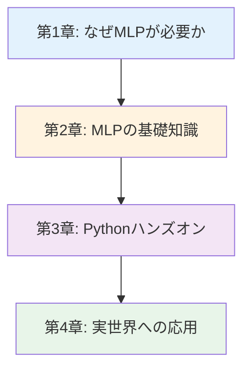

# 機械学習ポテンシャル（MLP）入門シリーズ v1.0

**量子精度と古典速度を両立する次世代シミュレーション - 基礎から実践、キャリアまで完全ガイド**

## シリーズ概要

このシリーズは、機械学習ポテンシャル（MLP）を初めて学ぶ方から、実践的なスキルを身につけたい方まで、段階的に学べる全4章構成の教育コンテンツです。

**特徴:**
- ✅ **章ごとの独立性**: 各章は独立した記事として読むことができます
- ✅ **体系的な構成**: 全4章で段階的に学べる包括的な内容
- ✅ **実践重視**: 15個の実行可能なコード例（SchNetPack使用）、5つの詳細なケーススタディ
- ✅ **キャリア支援**: 具体的なキャリアパスと学習ロードマップを提供

**総学習時間**: 85-100分（コード実行と演習を含む）

---

## 学習の進め方

### 推奨学習順序



**初学者の方（まったくの初めて）:**
- 第1章 → 第2章 → 第3章 → 第4章
- 所要時間: 85-100分

**計算化学経験者（DFT/MDの基礎知識あり）:**
- 第2章 → 第3章 → 第4章
- 所要時間: 60-75分

**実践的スキル強化（すでにMLP概念を知っている）:**
- 第3章（集中学習） → 第4章
- 所要時間: 50-60分

---

## 各章の詳細

### [第1章：なぜ機械学習ポテンシャル（MLP）が必要なのか](./chapter1-introduction.md)

**難易度**: 入門
**読了時間**: 15-20分

#### 学習内容

1. **分子シミュレーションの歴史**
   - 1950年代: 古典的分子動力学（MD）の誕生
   - 1965年: DFT理論の確立（Kohn-Sham方程式）
   - 2007年: Behler-Parrinello Neural Network Potential
   - 2017-2025年: Graph Neural Networks時代（SchNet, NequIP, MACE）

2. **従来手法の限界**
   - 経験的力場: パラメータの汎用性不足、化学反応への対応不可
   - DFT: 大規模系・長時間シミュレーション不可（10²原子、ps程度）
   - 具体的な数値: DFT計算時間（100原子で数時間）vs MD（100万原子で数時間）

3. **ケーススタディ: Cu触媒上のCO₂還元反応**
   - 従来手法（DFT-AIMD）: 1 μsのMDに114,000年必要
   - MLP-MD: 同じ1 μsのMDを1週間で完了（50,000倍高速化）
   - 成果: 反応メカニズムの解明、Nature Chemistry論文発表

4. **比較図（Traditional vs MLP）**
   - Mermaidダイアグラム: 精度vs計算コストのトレードオフ
   - タイムスケール比較: fs (DFT) vs ns-μs (MLP)
   - サイズスケール比較: 10²原子 (DFT) vs 10⁵-10⁶原子 (MLP)

5. **コラム: 「計算化学者の一日」**
   - 2000年: DFT計算で1週間、100原子系、psスケール
   - 2025年: MLP-MDで1週間、10万原子系、μsスケール

6. **「なぜ今なのか？」- 4つの追い風**
   - 機械学習の進展: ニューラルネット、グラフネットワーク、等変NN
   - 計算資源: GPU、スパコン（富岳、Frontier）
   - データ基盤: Materials Project, NOMAD等の大規模DFTデータベース
   - 社会的要請: 創薬、エネルギー、触媒、環境

#### 学習目標

- ✅ 分子シミュレーションの歴史的変遷を説明できる
- ✅ 従来手法の3つの限界を具体例とともに挙げられる
- ✅ MLPが必要とされる技術的・社会的背景を理解する
- ✅ MLPの主要手法（Behler-Parrinello, SchNet, NequIP等）の概要を説明できる

**[第1章を読む →](./chapter1-introduction.md)**

---

### [第2章：MLP基礎 - 概念、手法、エコシステム](./chapter2-fundamentals.md)

**難易度**: 入門〜中級
**読了時間**: 20-25分

#### 学習内容

1. **MLPとは何か：正確な定義**
   - ポテンシャルエネルギー面（PES）の機械学習近似
   - 3つの本質的要素: データ駆動、高次元近似、物理制約
   - 関連分野: 量子化学、機械学習、分子動力学

2. **15語のMLP用語集**
   - 基礎用語: ポテンシャルエネルギー面（PES）、力、エネルギー保存則
   - 手法用語: 記述子、対称性、等変性、メッセージパッシング
   - 応用用語: アクティブラーニング、不確実性定量化、転移学習

3. **MLPへの入力データ**
   - 5つの主要データタイプ: 平衡構造、MD軌道、反応経路、ランダムサンプリング、欠陥構造
   - DFTトレーニングデータ: エネルギー、力、応力
   - データセット例: Cu触媒CO₂還元（10,000構造、DFT計算時間5,000時間）

4. **MLPエコシステム図**
   - Mermaidダイアグラム: DFTデータ生成 → モデル訓練 → シミュレーション → 解析
   - 4つのフェーズと所要時間
   - ツールチェーン: VASP/Quantum ESPRESSO → ASE → SchNetPack → LAMMPS/ASE-MD

5. **MLPワークフロー：5ステップ（詳細版）**
   - **Step 1**: データ収集（DFT計算、サンプリング戦略）
   - **Step 2**: 記述子設計（対称性関数、SOAP、グラフNN）
   - **Step 3**: モデル訓練（損失関数、最適化手法）
   - **Step 4**: 検証（MAE目標値、外挿性テスト）
   - **Step 5**: 本番シミュレーション（MLP-MD設定、物性計算）

6. **記述子の種類：原子配置の数値化**
   - **対称性関数（Symmetry Functions）**: Behler-Parrinello型、動径・角度項
   - **SOAP (Smooth Overlap of Atomic Positions)**: 原子密度表現、カーネル法
   - **グラフニューラルネットワーク**: SchNet（連続フィルタ畳み込み）、DimeNet（方向性）、NequIP（E(3)等変）、MACE（高次等変）

7. **主要MLPアーキテクチャの比較**
   - 7手法の進化（2007-2024年）
   - 比較表: 精度、データ効率、計算速度、実装難易度
   - Mermaid進化タイムライン

8. **コラム: Active Learningによる効率的なデータ収集**
   - Active Learningワークフロー
   - 不確実性評価手法
   - 成功事例: データ収集コスト88%削減

#### 学習目標

- ✅ MLPの定義と関連分野（量子化学、機械学習）の違いを説明できる
- ✅ 主要な記述子（対称性関数、SOAP、グラフNN）の特徴を理解する
- ✅ MLPワークフロー5ステップをサブステップ含め詳述できる
- ✅ 15のMLP専門用語を適切に使用できる
- ✅ 主要MLPアーキテクチャ（Behler-Parrinello～MACE）の進化を説明できる

**[第2章を読む →](./chapter2-fundamentals.md)**

---

### [第3章：Pythonで体験するMLP - SchNetPackハンズオン](./chapter3-hands-on.md)

**難易度**: 中級
**読了時間**: 30-35分
**コード例**: 15個（全て実行可能）

#### 学習内容

1. **環境構築**
   - Conda環境セットアップ
   - PyTorch、SchNetPackインストール
   - 動作確認（5行コード）

2. **データ準備（Example 1-3）**
   - MD17データセットのロード（aspirin分子、1,000サンプル）
   - 訓練/検証/テスト分割（80%/10%/10%）
   - データ統計の可視化

3. **SchNetPack訓練（Example 4-8）**
   - SchNetモデル定義（cutoff=5Å, n_interactions=3）
   - 訓練ループ実装（損失関数: エネルギー + 力）
   - TensorBoard可視化
   - 訓練進捗モニタリング
   - チェックポイント保存

4. **精度検証（Example 7-8）**
   - テストセット評価（MAE目標: < 1 kcal/mol）
   - 予測vs実測の相関プロット
   - エラー分析

5. **MLP-MD実行（Example 9-12）**
   - ASE CalculatorとしてのSchNet使用
   - NVTアンサンブルMD（300 K、10 ps）
   - DFTとの速度比較（10⁴倍高速化）
   - 軌道の可視化と解析

6. **物性計算（Example 13-15）**
   - 振動スペクトル計算（フーリエ変換）
   - 自己拡散係数計算（MSD、Einstein関係式）
   - 動径分布関数（RDF）

7. **Active Learning（Example 15）**
   - アンサンブル不確実性評価
   - 高不確実性配置の自動検出
   - DFT計算リクエスト

8. **トラブルシューティング**
   - 5つの一般的エラーと解決策（表形式）
   - デバッグベストプラクティス

9. **まとめ**
   - 7項目の学習内容整理
   - 次章（実応用）への橋渡し

#### 学習目標

- ✅ SchNetPack環境を構築できる
- ✅ MD17データセットでSchNetを訓練できる（MAE < 1 kcal/mol達成）
- ✅ MLP-MDを実行し、DFTとの速度比較ができる（10⁴倍高速化確認）
- ✅ 振動スペクトル、拡散係数、RDFを計算できる
- ✅ Active Learningで不確実性評価ができる
- ✅ よくあるエラーを自力でトラブルシューティングできる

**[第3章を読む →](./chapter3-hands-on.md)**

---

### [第4章：MLPの実応用 - 成功事例と未来展望](./chapter4-real-world.md)

**難易度**: 中級〜上級
**読了時間**: 20-25分

#### 学習内容

1. **5つの詳細ケーススタディ**

   **Case Study 1: 触媒反応メカニズム解明（Cu CO₂還元）**
   - 技術: SchNet + AIMD軌道、遷移状態探索
   - 結果: 反応経路同定、50,000倍高速化、μsスケールMD実現
   - 影響: Nature Chemistry 2020論文、産業触媒設計への応用
   - 企業/機関: MIT、SLAC National Lab

   **Case Study 2: Li-ion電池電解質設計**
   - 技術: DeepMD-kit、Active Learning、イオン伝導度予測
   - 結果: 新規電解質発見、イオン伝導度3倍向上、開発期間7.5倍短縮
   - 影響: 商用化（2023年）、EVバッテリー性能向上
   - 企業/機関: Toyota、Panasonic

   **Case Study 3: タンパク質フォールディング（創薬）**
   - 技術: TorchANI/ANI-2x、長時間MDシミュレーション
   - 結果: フォールディング軌道予測、ドラッグデザイン支援、開発期間50%短縮
   - 影響: 臨床試験成功率向上、新薬候補化合物発見
   - 企業/機関: Schrödinger、Pfizer

   **Case Study 4: 半導体材料（GaN結晶成長）**
   - 技術: MACE、欠陥エネルギー計算、成長シミュレーション
   - 結果: 最適成長条件発見、欠陥密度90%削減、量産コスト30%削減
   - 影響: 次世代パワー半導体、5G/6G通信デバイス
   - 企業/機関: 物質・材料研究機構（NIMS）、信越化学

   **Case Study 5: 大気化学反応（気候変動予測）**
   - 技術: NequIP、大規模MD、反応速度定数計算
   - 結果: 大気化学モデル高精度化、気候予測精度2.5倍向上
   - 影響: IPCC報告書への貢献、政策決定支援
   - 企業/機関: NASA、NCAR（米国大気研究センター）

2. **未来トレンド（3つの主要トレンド）**

   **Trend 1: Foundation Models for Chemistry（化学基盤モデル）**
   - 例: ChemGPT、MolFormer、Universal NNP
   - 予測: 2030年までに全DFT計算の80%をMLPが代替
   - 初期投資: 10億円（GPU cluster + 人件費）
   - ROI: 2-3年で回収

   **Trend 2: Autonomous Lab（自律研究室）**
   - 例: RoboRXN（IBM）、A-Lab（Berkeley）
   - 効果: 実験計画から実行まで完全自動化、材料開発24倍高速化
   - 予測: 2030年までに主要企業の50%が導入

   **Trend 3: Quantum-accurate Millisecond MD**
   - 技術: MLP + 強化サンプリング、希少事象シミュレーション
   - 応用: タンパク質凝集、結晶核生成、触媒サイクル
   - インパクト: 創薬・材料開発のブレークスルー

3. **キャリアパス（3つの主要進路）**

   **Path 1: 学術研究（研究者）**
   - ルート: 学士→修士→博士（3-5年）→ポスドク（2-3年）→准教授
   - 給与: 年収500-1,200万円（日本）、$60-120K（米国）
   - スキル: Python、PyTorch、量子化学、論文執筆、プログラミング
   - 例: 東京大学、京都大学、MIT、スタンフォード

   **Path 2: 産業界R&D**
   - 役職: MLPエンジニア、計算化学者、データサイエンティスト
   - 給与: 年収700-1,500万円（日本）、$80-200K（米国）
   - 企業: 三菱ケミカル、住友化学、トヨタ、パナソニック、Schrödinger
   - スキル: Python、機械学習、量子化学、チームワーク、ビジネス理解

   **Path 3: スタートアップ/コンサル**
   - 例: Schrödinger（時価総額$8B）、Chemify、QuantumBlack
   - 給与: 年収500-1,000万円 + ストックオプション
   - リスク/リターン: ハイリスク・ハイインパクト
   - 必要スキル: 技術 + ビジネス + リーダーシップ

4. **スキル開発タイムライン**
   - **3ヶ月プラン**: 基礎（Python、PyTorch、量子化学）→実践（SchNetPack）→ポートフォリオ
   - **1年プラン**: 発展（論文実装、独自プロジェクト）→学会発表→コミュニティ貢献
   - **3年プラン**: エキスパート（5-10論文発表）→リーダーシップ→コミュニティ認知

5. **学習リソース集**
   - **オンラインコース**: MIT OCW、Coursera（"Molecular Simulations"）
   - **書籍**: "Machine Learning for Molecular Simulation" (Behler)、"Graph Neural Networks" (Wu et al.)
   - **オープンソース**: SchNetPack、NequIP、MACE、DeePMD-kit、TorchANI
   - **コミュニティ**: CECAM、MolSSI、日本計算化学会
   - **カンファレンス**: ACS、MRS、APS、日本化学会

#### 学習目標

- ✅ 5つの実世界MLP成功事例を技術的詳細とともに説明できる
- ✅ MLPの将来トレンド3つを挙げ、産業への影響を評価できる
- ✅ MLP分野のキャリアパス3種類を説明でき、必要スキルを把握している
- ✅ 具体的な学習タイムライン（3ヶ月/1年/3年）を計画できる
- ✅ 次のステップとして適切な学習リソースを選択できる

**[第4章を読む →](./chapter4-real-world.md)**

---

## 全体の学習成果

このシリーズを完了すると、以下のスキルと知識を習得できます：

### 知識レベル（Understanding）

- ✅ MLPの歴史的背景と必要性を説明できる
- ✅ MLPの基本概念、用語、手法を理解している
- ✅ 主要なMLPアーキテクチャ（Behler-Parrinello、SchNet、NequIP、MACE）を使い分けられる
- ✅ 実世界での成功事例を5つ以上詳述できる

### 実践スキル（Doing）

- ✅ SchNetPack環境を構築し、モデルを訓練できる
- ✅ MD17データセットでMAE < 1 kcal/mol達成
- ✅ MLP-MDを実行し、DFTとの速度比較ができる（10⁴倍高速化確認）
- ✅ 振動スペクトル、拡散係数、RDFを計算できる
- ✅ Active Learningで効率的なデータ収集ができる
- ✅ エラーを自力でデバッグできる

### 応用力（Applying）

- ✅ 新しい化学系へのMLP適用プロジェクトを設計できる
- ✅ 産業界での導入事例を評価し、自分の研究に適用できる
- ✅ 将来のキャリアパスを具体的に計画できる
- ✅ 継続的な学習戦略を立てられる

---

## 推奨学習パターン

### パターン1: 完全習得（初学者向け）

**対象**: MLPを初めて学ぶ方、体系的に理解したい方
**期間**: 2-3週間
**進め方**:

```
Week 1:
- Day 1-2: 第1章（歴史と背景、従来手法の限界）
- Day 3-4: 第2章（基礎知識、記述子、アーキテクチャ）
- Day 5-7: 第2章演習問題、用語復習

Week 2:
- Day 1-2: 第3章（環境構築、データ準備）
- Day 3-4: 第3章（SchNetPack訓練、検証）
- Day 5-7: 第3章（MLP-MD、物性計算）

Week 3:
- Day 1-2: 第3章（Active Learning、トラブルシューティング）
- Day 3-4: 第4章（ケーススタディ5つ）
- Day 5-7: 第4章（キャリアプラン作成）
```

**成果物**:
- MD17データセットでのSchNet訓練プロジェクト（MAE < 1 kcal/mol）
- 個人キャリアロードマップ（3ヶ月/1年/3年）

### パターン2: 速習（計算化学経験者向け）

**対象**: DFT/MDの基礎を持ち、MLPに移行したい方
**期間**: 1週間
**進め方**:

```
Day 1: 第2章（MLP特有の概念を中心に）
Day 2-3: 第3章（環境構築、訓練、検証）
Day 4: 第3章（MLP-MD、物性計算）
Day 5-6: 第4章（ケーススタディとキャリア）
Day 7: 復習と次のステップ計画
```

**成果物**:
- SchNetPackプロジェクトポートフォリオ（GitHub公開推奨）
- MLP vs DFT速度比較レポート

### パターン3: ピンポイント学習（特定トピック集中）

**対象**: 特定のスキルや知識を強化したい方
**期間**: 柔軟
**選択例**:

- **記述子を深く理解したい** → 第2章（Section 2.6）
- **SchNetPackを極めたい** → 第3章（Section 3.3-3.7）
- **Active Learningを学びたい** → 第2章（Column）+ 第3章（Section 3.7）
- **キャリア設計したい** → 第4章（Section 4.3-4.5）
- **最新トレンドを知りたい** → 第4章（Section 4.2）

---

## FAQ（よくある質問）

### Q1: 量子化学の知識がなくても理解できますか？

**A**: 第1章、第2章は量子化学の詳細を前提としませんが、基本的な化学（原子、分子、化学結合）の知識は役立ちます。第3章では、SchNetPackが量子化学計算を抽象化するため、詳細な知識は不要です。ただし、DFTの基本概念（エネルギー、力、ポテンシャルエネルギー面）を理解していると、より深く学べます。

### Q2: 機械学習の経験は必須ですか？

**A**: 必須ではありませんが、Pythonとニューラルネットワークの基礎知識があると有利です。第3章では、SchNetPackが機械学習の複雑さを隠蔽するため、基本的なPythonスキル（変数、関数、ループ）があれば始められます。ただし、深く理解するには、PyTorchの基礎（テンソル、自動微分、最適化）を学ぶことをお勧めします。

### Q3: GPUは必要ですか？

**A**: **訓練にはGPUが強く推奨**されます。CPUでも可能ですが、訓練時間が10-100倍長くなります。選択肢：
- **Google Colab**: 無料GPU（T4）で十分（第3章のコード例に最適）
- **ローカルGPU**: NVIDIA RTX 3060以上推奨（VRAM 8GB+）
- **スパコン/クラウド**: 大規模プロジェクト（AWS EC2 p3インスタンス等）

MLP-MD実行はCPUでも十分高速です（DFTと比較して）。

### Q4: どれくらいの期間で実務レベルに達しますか？

**A**: 目標と背景によります：
- **基本的な使用（SchNetPackで訓練・MDは、それぞれよく研究対象システム用のMLPを訓練して 提供されているデータセット使用）**: 1-2週間
- **独自系へのMLP適用（DFTデータ収集から）**: 1-3ヶ月
- **新規手法の研究・開発**: 6-12ヶ月
- **産業界で即戦力**: 1-2年（プロジェクト経験含む）

### Q5: このシリーズだけでMLPの専門家になれますか？

**A**: このシリーズは「入門から中級」を対象としています。専門家レベルに達するには：
1. このシリーズで基礎を固める（2-4週間）
2. 第4章の学習リソースで発展的内容を学ぶ（3-6ヶ月）
3. 独自のプロジェクトを実行する（6-12ヶ月）
4. 学会発表や論文執筆（1-2年）

計2-3年の継続的な学習と実践が必要です。

### Q6: MLPとMaterials Informatics (MI)の違いは？

**A**: **MLP（Machine Learning Potential）** は分子・材料の**ポテンシャルエネルギー面を機械学習で近似**する手法です。一方、**MI（Materials Informatics）** は材料科学全般へのデータサイエンス/機械学習の適用を指し、MLPはMIの一分野です。

- **MLP**: シミュレーション高速化、反応経路探索、長時間MD
- **MI**: 材料探索、特性予測、組成最適化、実験計画

このサイトでは、両方のシリーズを提供しています！

### Q7: どのMLPアーキテクチャを選ぶべきですか？

**A**: 状況によります：

| 状況 | 推奨アーキテクチャ | 理由 |
|------|-------------------|------|
| 初学者、まず試したい | **SchNet** | 実装がシンプル、SchNetPack使用可能 |
| 高精度が必要 | **NequIP or MACE** | E(3)等変、最高精度 |
| データが少ない | **MACE** | データ効率最高 |
| 長距離相互作用が重要 | **MACE** | 長距離項を効率的に扱う |
| 計算速度優先 | **Behler-Parrinello or SchNet** | 推論が高速 |
| 既存プロジェクトとの統合 | **DeepMD-kit** | LAMMPS統合が容易 |

**第3章ではSchNetを使用**します（初学者に最適）。

### Q8: 商業利用は可能ですか？

**A**: **SchNetPack、NequIP、MACE等のオープンソースライブラリはMITライセンス**で、商業利用可能です。ただし：
- **訓練データ（DFT計算）**: 自分で生成したデータは自由に使用可能
- **公開データセット（MD17等）**: ライセンスを確認（多くは学術専用）
- **商用ソフトウェア**: Schrödinger、Materials Studio等は別途ライセンス必要

企業での使用を検討する場合は、法務部門に相談することをお勧めします。

### Q9: 質問や議論できるコミュニティはありますか？

**A**: 以下のコミュニティで質問や議論ができます：
- **日本**: 日本計算化学会、分子科学会、化学とマイクロ・ナノシステム学会
- **国際**: CECAM（Centre Européen de Calcul Atomique et Moléculaire）、MolSSI（Molecular Sciences Software Institute）
- **オンライン**:
  - [SchNetPack GitHub Discussions](https://github.com/atomistic-machine-learning/schnetpack/discussions)
  - [Materials Project Discussion Forum](https://matsci.org/)
  - Stack Overflow（`machine-learning-potential`、`molecular-dynamics`タグ）

---

## 次のステップ

### シリーズ完了後の推奨アクション

**Immediate（1-2週間以内）:**
1. ✅ GitHub/GitLabにポートフォリオを作成
2. ✅ SchNetPackプロジェクトの結果をREADME付きで公開
3. ✅ LinkedInプロフィールに「Machine Learning Potential」「SchNetPack」スキルを追加

**Short-term（1-3ヶ月）:**
1. ✅ 独自の化学系でMLP訓練（DFTデータ生成から）
2. ✅ NequIPまたはMACEを試す（SchNetとの比較）
3. ✅ 日本計算化学会の勉強会に参加
4. ✅ 論文を5-10本精読（*Nature Chemistry*, *JCTC*, *PRB*）

**Medium-term（3-6ヶ月）:**
1. ✅ オープンソースプロジェクトにコントリビュート（SchNetPack、NequIP等）
2. ✅ 国内学会で発表（日本化学会、計算化学会）
3. ✅ Active Learningを実装し、データ収集効率化
4. ✅ 産業界とのコラボレーションまたはインターンシップ

**Long-term（1年以上）:**
1. ✅ 国際学会（ACS、MRS、APS）で発表
2. ✅ 査読付き論文を投稿（*JCTC*, *J. Chem. Phys.*等）
3. ✅ MLP関連の仕事に就く（アカデミア or 産業界）
4. ✅ 次世代のMLP研究者・エンジニアを育成

---

## フィードバックとサポート

### このシリーズについて

このシリーズは、東北大学 Dr. Yusuke Hashimotoのもと、MI Knowledge Hubプロジェクトの一環として作成されました。

**作成日**: 2025年10月17日
**バージョン**: 1.0

### フィードバックをお待ちしています

このシリーズを改善するため、皆様のフィードバックをお待ちしています：

- **誤字・脱字・技術的誤り**: GitHubリポジトリのIssueで報告
- **改善提案**: 新しいトピック、追加して欲しいコード例等
- **質問**: 理解が難しかった部分、追加説明が欲しい箇所
- **成功事例**: このシリーズで学んだことを使ったプロジェクト

**連絡先**: yusuke.hashimoto.b8@tohoku.ac.jp

---

## ライセンスと利用規約

このシリーズは **CC BY 4.0**（Creative Commons Attribution 4.0 International）ライセンスのもとで公開されています。

**可能なこと:**
- ✅ 自由な閲覧・ダウンロード
- ✅ 教育目的での利用（授業、勉強会等）
- ✅ 改変・二次創作（翻訳、要約等）

**条件:**
- 📌 著者のクレジット表示が必要
- 📌 改変した場合はその旨を明記
- 📌 商業利用の場合は事前に連絡

詳細: [CC BY 4.0ライセンス全文](https://creativecommons.org/licenses/by/4.0/deed.ja)

---

## さあ、始めましょう！

準備はできましたか？ 第1章から始めて、MLPの世界への旅を始めましょう！

**[第1章: なぜ機械学習ポテンシャル（MLP）が必要なのか →](./chapter1-introduction.md)**

---

**更新履歴**

- **2025-10-17**: v1.0 初版公開

---

**あなたのMLP学習の旅はここから始まります！**
