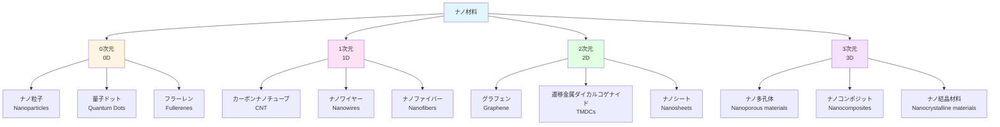

# Chapter 1: ナノ材料入門

ナノスケールの世界とサイズ効果

---

## 本章の学習目標

本章を学習することで、以下のことができるようになります:

- ✅ ナノスケールのサイズ感覚を理解し、日常的なスケールと比較できる
- ✅ 表面積/体積比の増大がもたらす物性変化を定量的に説明できる
- ✅ 量子効果と量子閉じ込め効果の基本原理を理解できる
- ✅ ナノ材料を次元(0D/1D/2D/3D)に基づいて分類できる
- ✅ ナノ材料の主要な応用分野とその特徴を説明できる
- ✅ ナノ材料の安全性と倫理的課題について議論できる

---

## 1.1 ナノ材料とは

### ナノスケールの定義

ナノ材料(Nanomaterials)を理解する第一歩は、「ナノ」というスケールを実感することです。

**ナノメートル(nm)** は、1メートルの10億分の1という極めて小さな長さの単位です:

$$
1 \text{ nm} = 10^{-9} \text{ m} = 0.000000001 \text{ m}
$$

この途方もなく小さなスケールを理解するために、身近なサイズと比較してみましょう:

| 対象 | サイズ | ナノメートル換算 |
|------|--------|-----------------|
| 人間の身長 | 約1.7 m | 1,700,000,000 nm |
| 髪の毛の太さ | 約80 μm | 80,000 nm |
| 赤血球 | 約7 μm | 7,000 nm |
| 細菌(大腸菌) | 約2 μm | 2,000 nm |
| ウイルス(インフルエンザ) | 約100 nm | 100 nm |
| **ナノ材料の典型的サイズ** | **1-100 nm** | **1-100 nm** |
| DNAの二重らせん直径 | 約2 nm | 2 nm |
| 水分子 | 約0.3 nm | 0.3 nm |
| 原子(炭素) | 約0.15 nm | 0.15 nm |

ナノ材料は、ウイルスと同じくらいか、それより小さいスケールの材料です。このスケールでは、数個から数千個の原子が集まって一つの構造を形成しています。

### ナノ材料の定義

国際標準化機構(ISO)の技術仕様書ISO/TS 80004-1では、ナノ材料を以下のように定義しています:

> **ナノ材料**: 少なくとも一つの外部寸法、または内部構造がナノスケール(おおよそ1 nmから100 nm)にある材料

この定義の重要なポイントは、「少なくとも一つの次元」という部分です。つまり、三次元すべてがナノサイズである必要はなく、一つの方向だけがナノサイズであっても、ナノ材料と呼ばれます。この考え方が、後述する次元別分類(0D、1D、2D、3D)につながります。

ナノ材料の**主要な特徴**は以下の4つです:

1. **表面積/体積比の飛躍的増大**: サイズが小さくなるほど、表面に存在する原子の割合が増加します
2. **量子効果の発現**: 粒子サイズが電子の波長と同程度になると、量子力学的効果が顕著になります
3. **サイズ依存的な物性**: 同じ化学組成でも、サイズによって色、融点、触媒活性などが変化します
4. **特異な光学特性**: 金属ナノ粒子の局在表面プラズモン共鳴など、バルク材料にはない光学特性が現れます

### なぜナノ材料が注目されるのか

バルク材料(通常サイズの材料)とナノ材料では、同じ化学組成でも全く異なる性質を示すことがあります。

代表的な例として、**金(Au)** のサイズ効果を見てみましょう:

| 粒子サイズ | 色 | 融点 | 特徴 |
|-----------|-----|------|------|
| バルク(塊) | 金色(黄金色) | 1,064°C | 化学的に安定、触媒活性なし |
| 50-100 nm | 青紫色 | 約900-1,000°C | 局在表面プラズモン共鳴 |
| 20-30 nm | 赤色 | 約700-800°C | 強い光吸収、バイオイメージング |
| 5-10 nm | 赤〜紫色 | 約500-600°C | 高い触媒活性 |
| 2-3 nm | 変化 | 約300-400°C | 量子効果の発現 |

同じ金という元素でも、粒子サイズによってこれほど大きく性質が変わるのです。この**サイズ依存性**こそが、ナノ材料研究の魅力であり、様々な応用可能性を生み出す源泉となっています。

---

## 1.2 サイズ効果と表面・界面効果

### 表面積/体積比の増大

ナノ材料の最も重要な特性の一つが、**表面積/体積比の飛躍的増大**です。

簡単な例として、半径 $r$ の球形粒子を考えてみましょう。

- **表面積**: $S = 4\pi r^2$
- **体積**: $V = \frac{4}{3}\pi r^3$
- **表面積/体積比**:

$$
\frac{S}{V} = \frac{4\pi r^2}{\frac{4}{3}\pi r^3} = \frac{3}{r}
$$

この式から、**粒子半径が小さくなるほど、表面積/体積比が増大する**ことがわかります。つまり、サイズが1/10になれば、表面積/体積比は10倍になります。

具体的な数値で比較してみましょう:

| 粒子直径 | 表面積/体積比 | 総原子数(Au) | 表面原子の割合 |
|---------|--------------|--------------|--------------|
| 1 cm (10⁷ nm) | 0.6 m⁻¹ | ~10²² | <0.001% |
| 1 mm (10⁶ nm) | 6 m⁻¹ | ~10¹⁹ | ~0.01% |
| 100 μm (10⁵ nm) | 60 m⁻¹ | ~10¹⁶ | ~0.1% |
| 10 μm (10⁴ nm) | 600 m⁻¹ | ~10¹³ | ~1% |
| 1 μm (1000 nm) | 6,000 m⁻¹ | ~10¹⁰ | ~10% |
| **100 nm** | **60,000 m⁻¹** | **~10⁷** | **~20%** |
| **10 nm** | **600,000 m⁻¹** | **~10⁴** | **~40%** |
| **5 nm** | **1,200,000 m⁻¹** | **~10³** | **~60%** |
| **2 nm** | **3,000,000 m⁻¹** | **~250** | **~80%** |

10 nmの金ナノ粒子では、全原子の約40%が表面に存在します。2 nmになると、なんと80%もの原子が表面にあります。

この表面原子の増大が、以下のような劇的な物性変化をもたらします:

- **触媒活性の向上**: 反応は主に表面で起こるため
- **反応性の増大**: 表面原子は内部原子より不安定
- **融点の低下**: 表面エネルギーの寄与が大きくなる
- **溶解度の変化**: 表面積増大により溶解速度が上昇

### 表面エネルギーの影響

ナノ粒子では、表面エネルギーが材料全体の性質に大きな影響を与えます。

代表的な現象が**融点降下(Melting point depression)** です。ナノ粒子は、バルク材料より低い温度で融解します。

この現象は**Gibbs-Thomson効果**として知られ、以下の式で近似できます:

$$
T_m(r) = T_{m,\text{bulk}} \left(1 - \frac{2\gamma V_m}{r \Delta H_f}\right)
$$

ここで:
- $T_m(r)$: 半径 $r$ の粒子の融点
- $T_{m,\text{bulk}}$: バルク材料の融点
- $\gamma$: 表面エネルギー(表面張力)
- $V_m$: モル体積
- $\Delta H_f$: 融解エンタルピー
- $r$: 粒子半径

**金ナノ粒子の融点**の実験データ:

| 粒子直径 | 融点 | バルクからの低下 |
|---------|------|----------------|
| バルク | 1,064°C | 0°C |
| 100 nm | ~1,050°C | ~14°C |
| 50 nm | ~1,020°C | ~44°C |
| 20 nm | ~950°C | ~114°C |
| 10 nm | ~850°C | ~214°C |
| 5 nm | ~650°C | ~414°C |
| 2 nm | ~350°C | ~714°C |

2 nmの金ナノ粒子は、バルクの金より700°C以上も低い温度で融解します。この性質は、低温焼結材料や熱応答性材料の開発に利用されています。

### 触媒活性の向上

表面積/体積比の増大は、**触媒活性の飛躍的向上**につながります。

**白金(Pt)触媒**を例に考えてみましょう:

- **用途**: 燃料電池の電極触媒、自動車排ガス浄化触媒
- **反応**: 水素酸化反応(H₂ → 2H⁺ + 2e⁻)

白金の粒子サイズと触媒活性の関係:

| Pt粒子サイズ | 表面積(g当たり) | 相対触媒活性 | コスト効率 |
|-------------|-----------------|------------|----------|
| バルク板 | ~1 m²/g | 1× | 1× |
| 10 μm粉末 | ~0.1 m²/g | 2× | 2× |
| 100 nm粉末 | ~10 m²/g | 50× | 50× |
| **10 nm ナノ粒子** | **~100 m²/g** | **500×** | **500×** |
| **3 nm ナノ粒子** | **~300 m²/g** | **1,500×** | **1,500×** |

3 nmの白金ナノ粒子は、バルクの白金板と比べて1,500倍の触媒活性を示します。これは、同じ質量の白金から1,500倍の性能を引き出せることを意味し、希少金属の使用量削減に大きく貢献しています。

---

## 1.3 量子効果と量子閉じ込め

### 量子効果の発現

粒子サイズがナノスケールになると、古典物理学では説明できない**量子力学的効果**が顕著になります。

量子効果を理解する鍵は、**de Broglie(ド・ブロイ)波長**です。すべての粒子は波としての性質を持ち、その波長 $\lambda$ は以下の式で与えられます:

$$
\lambda = \frac{h}{p} = \frac{h}{mv}
$$

ここで:
- $h$: プランク定数($6.626 \times 10^{-34}$ J·s)
- $p = mv$: 運動量(質量 × 速度)
- $m$: 粒子の質量
- $v$: 粒子の速度

**室温(300 K)での電子のde Broglie波長**を計算してみましょう:

- 電子の熱運動エネルギー: $E = \frac{3}{2}k_BT \approx 0.039$ eV
- 電子の質量: $m_e = 9.109 \times 10^{-31}$ kg
- 速度: $v = \sqrt{\frac{2E}{m}} \approx 1.17 \times 10^5$ m/s
- **de Broglie波長**:

$$
\lambda = \frac{h}{m_e v} \approx \frac{6.626 \times 10^{-34}}{9.109 \times 10^{-31} \times 1.17 \times 10^5} \approx 6.2 \text{ nm}
$$

電子のde Broglie波長は約**6 nm**程度です。粒子サイズがこの波長と同程度か、それより小さくなると、電子は粒子の中に「閉じ込められた波」として振る舞い、量子効果が重要になります。

### 量子閉じ込め効果

**量子閉じ込め効果(Quantum confinement effect)** とは、電子や正孔(ホール)が狭い空間に閉じ込められることで、そのエネルギー状態が離散的になる現象です。

最も単純なモデルとして、**1次元無限井戸型ポテンシャル**を考えましょう。長さ $L$ の箱の中に閉じ込められた粒子のエネルギー準位は:

$$
E_n = \frac{n^2 h^2}{8mL^2} \quad (n = 1, 2, 3, \ldots)
$$

ここで:
- $n$: 量子数
- $h$: プランク定数
- $m$: 粒子の質量
- $L$: 箱の長さ(粒子サイズ)

この式から重要な結論が得られます:

1. **エネルギーは離散的**: 連続的な値ではなく、特定の値($E_1, E_2, E_3, \ldots$)のみ許される
2. **最低エネルギー(基底状態)が存在**: $E_1 = \frac{h^2}{8mL^2}$ であり、ゼロではない
3. **エネルギーギャップはサイズに依存**:

$$
\Delta E = E_2 - E_1 = \frac{3h^2}{8mL^2} \propto \frac{1}{L^2}
$$

**粒子サイズが小さくなるほど、エネルギーギャップが大きくなります。**

これが、半導体ナノ粒子(量子ドット)でサイズによって色が変わる理由です。

### 半導体量子ドットの発光色制御

**量子ドット(Quantum dots, QDs)** は、半導体ナノ粒子で、サイズによってバンドギャップ(禁制帯幅)が変化し、発光色を制御できます。

**CdSe(セレン化カドミウム)量子ドット**の例:

| 粒子直径 | バンドギャップ | 発光色 | 発光波長 | 応用例 |
|---------|-------------|--------|---------|-------|
| バルク | 1.74 eV | 赤外 | ~710 nm | - |
| 10 nm | 1.85 eV | 赤色 | ~670 nm | 赤色QLED |
| 6 nm | 2.00 eV | オレンジ | ~620 nm | ディスプレイ |
| 4 nm | 2.25 eV | 黄緑色 | ~550 nm | バイオイメージング |
| 3 nm | 2.50 eV | 緑色 | ~495 nm | 緑色QLED |
| 2 nm | 2.75 eV | 青色 | ~450 nm | 青色QLED |

粒子直径が10 nmから2 nmへ小さくなると、バンドギャップが1.85 eVから2.75 eVへ増大し、発光色が赤色から青色へ変化します。

これは**Brus方程式**(最も単純な近似形)で説明できます:

$$
E_g(r) = E_{g,\text{bulk}} + \frac{h^2}{8r^2}\left(\frac{1}{m_e^*} + \frac{1}{m_h^*}\right) - \frac{1.8e^2}{4\pi\epsilon\epsilon_0 r}
$$

ここで:
- $E_g(r)$: 半径 $r$ の量子ドットのバンドギャップ
- $E_{g,\text{bulk}}$: バルク半導体のバンドギャップ
- $m_e^*$、$m_h^*$: 電子と正孔の有効質量
- $e$: 電子の電荷
- $\epsilon$: 誘電率
- 第2項: 量子閉じ込めによるエネルギー増大($\propto 1/r^2$)
- 第3項: クーロン相互作用によるエネルギー減少($\propto 1/r$)

量子ドットの**主要な応用**:

1. **QLED(量子ドットLEDディスプレイ)**: サムスン、ソニーなどが製品化、色再現性が従来比150%向上
2. **バイオイメージング**: 蛍光色素より明るく、光退色しにくい
3. **太陽電池**: 多接合型太陽電池で理論効率向上(Shockley-Queisser限界を超える可能性)
4. **量子情報技術**: 量子ビットの候補材料

### 金属ナノ粒子の局在表面プラズモン共鳴

金属ナノ粒子では、**局在表面プラズモン共鳴(Localized Surface Plasmon Resonance, LSPR)** という特異な光学現象が現れます。

**プラズモン**とは、金属中の自由電子の集団振動です。ナノ粒子では、光の電場によって電子雲が振動し、特定の波長で共鳴が起こります。

**金ナノ粒子のLSPR**:

| 粒子サイズ・形状 | LSPR波長 | 観察される色 | 応用 |
|---------------|---------|------------|------|
| 10-20 nm球形 | ~520 nm | 赤色 | バイオセンシング |
| 50 nm球形 | ~530 nm | 赤紫色 | 光熱療法 |
| 100 nm球形 | ~570 nm | 青紫色 | SERS基板 |
| ナノロッド(縦横比3:1) | ~650 nm, ~520 nm | 青緑色 | イメージング |
| ナノシェル(Au/SiO₂) | ~800 nm | 透明(近赤外) | がん温熱療法 |

**LSPRの応用例**:

1. **バイオセンシング**: 抗体を金ナノ粒子に修飾し、標的分子結合でLSPR波長がシフト(検出限界: pMオーダー)
2. **表面増強ラマン散乱(SERS)**: ラマン信号が10⁶〜10¹⁴倍増強、単分子検出も可能
3. **がん温熱療法**: 近赤外光(生体透過性が高い)で金ナノ粒子を加熱し、がん細胞を選択的に死滅
4. **カラーフィルター**: LSPR波長を制御したプラズモニックカラーフィルター

---

## 1.4 ナノ材料の分類

ナノ材料は、**何次元がナノサイズか**によって分類されます。

### 次元別分類

**分類の基準**:

- **0次元(0D)**: 3次元すべてがナノサイズ(長さ、幅、高さすべて < 100 nm)
- **1次元(1D)**: 2次元がナノサイズ、1次元は長い(直径 < 100 nm、長さは任意)
- **2次元(2D)**: 1次元がナノサイズ、2次元は広がりを持つ(厚さ < 100 nm、長さ・幅は任意)
- **3次元(3D)**: バルク材料だがナノ構造を内部に持つ(ナノ細孔、ナノ結晶粒など)

### 0次元ナノ材料(0D)

**ナノ粒子(Nanoparticles)**

- **定義**: すべての次元が1-100 nmの粒子
- **代表例**: 金ナノ粒子、銀ナノ粒子、酸化チタン(TiO₂)ナノ粒子
- **特徴**: 高い表面積/体積比、サイズ依存的な光学特性、触媒活性
- **応用**: 触媒、ドラッグデリバリー、抗菌材料、日焼け止め(UV吸収)

**量子ドット(Quantum Dots)**

- **定義**: 半導体ナノ粒子で量子閉じ込め効果を示すもの
- **代表例**: CdSe、PbS、InP、ペロブスカイト(CsPbBr₃)
- **特徴**: サイズで発光色制御、高い発光効率、光安定性
- **応用**: QLEDディスプレイ、バイオイメージング、太陽電池、量子コンピューティング

**フラーレン(Fullerenes)**

- **定義**: 炭素原子のみからなるサッカーボール状分子
- **代表例**: C₆₀(バッキーボール)、C₇₀、C₈₄
- **特徴**: 高い対称性、電子受容性、ラジカル消去能
- **応用**: 有機太陽電池、抗酸化剤、ドラッグデリバリー

### 1次元ナノ材料(1D)

**カーボンナノチューブ(Carbon Nanotubes, CNT)**

カーボンナノチューブは、グラフェンシート(炭素原子の六角形格子)を円筒状に巻いた構造です。

**分類**:
1. **単層カーボンナノチューブ(SWCNT)**: 1枚のグラフェンシートから構成
   - 直径: 0.4-3 nm
   - 電気特性: 巻き方により金属性または半導体性
   - 強度: 引張強度 ~100 GPa(鋼鉄の100倍)

2. **多層カーボンナノチューブ(MWCNT)**: 複数のグラフェンシートが同心円状に重なる
   - 直径: 10-100 nm
   - 電気特性: 主に金属性
   - 導電性: 銅より高い(最大 10⁷ S/m)

**主要な特性**:

| 特性 | 値 | 比較 |
|------|-----|------|
| 引張強度 | 50-100 GPa | 鋼鉄の50-100倍 |
| ヤング率 | ~1 TPa | ダイヤモンドに匹敵 |
| 電気伝導性 | 最大10⁷ S/m | 銅(6×10⁷ S/m)に近い |
| 熱伝導性 | ~3,000 W/m·K | ダイヤモンド(2,200 W/m·K)を超える |
| 電流密度 | 最大10⁹ A/cm² | 銅の1,000倍 |

**応用**:
- **複合材料**: 軽量高強度材料(航空宇宙、スポーツ用品)
- **電子デバイス**: CNTトランジスタ(CNT-FET)、透明導電膜
- **エネルギー貯蔵**: リチウムイオン電池電極、スーパーキャパシタ
- **センサー**: ガスセンサー、バイオセンサー

**ナノワイヤー(Nanowires)**

- **定義**: 直径10-100 nm、長さ数μm〜数mmの線状材料
- **代表例**: Si、ZnO、Ag、Au、InP ナノワイヤー
- **特徴**: 高いアスペクト比(長さ/直径 > 100)、1次元電子伝導
- **応用**: ナノエレクトロニクス、太陽電池、センサー、LED

**ナノファイバー(Nanofibers)**

- **定義**: 直径10-1,000 nmの繊維状材料
- **代表例**: エレクトロスピニング法で作製したポリマーナノファイバー
- **特徴**: 高い比表面積、柔軟性、多孔性
- **応用**: フィルター、組織工学用スキャフォールド、センサー

### 2次元ナノ材料(2D)

**グラフェン(Graphene)**

グラフェンは、炭素原子が六角形格子状に配列した、**厚さ約0.34 nm(炭素原子1層分)の2次元シート** です。2004年にAndre GeimとKonstantin Novoselovが機械的剥離法で単離し、2010年にノーベル物理学賞を受賞しました。

**驚異的な特性**:

| 特性 | 値 | 比較 |
|------|-----|------|
| 電気伝導性 | ~10⁸ S/m | 銅の約100倍 |
| 電子移動度 | 200,000 cm²/V·s(室温) | シリコンの100倍以上 |
| 引張強度 | 130 GPa | 鋼鉄の約200倍 |
| ヤング率 | 1 TPa | ダイヤモンドに匹敵 |
| 熱伝導性 | 5,000 W/m·K | 銅(400 W/m·K)の約12倍 |
| 光透過率 | 97.7%(単層) | ほぼ透明 |
| 比表面積 | 2,630 m²/g(理論値) | 活性炭の2倍以上 |

**応用分野**:
1. **エレクトロニクス**: グラフェンFET(高速トランジスタ)、透明導電膜、フレキシブルエレクトロニクス
2. **エネルギー**: リチウムイオン電池電極(容量3倍向上)、スーパーキャパシタ(エネルギー密度10倍)
3. **複合材料**: グラフェン/ポリマー複合材料(強度・導電性向上)
4. **センサー**: 化学センサー、バイオセンサー(単分子検出可能)
5. **透明導電膜**: タッチパネル、太陽電池(ITO代替として期待)

**遷移金属ダイカルコゲナイド(Transition Metal Dichalcogenides, TMDCs)**

- **化学式**: MX₂(M = Mo, W, Ti, V など、X = S, Se, Te)
- **代表例**: MoS₂、WS₂、WSe₂
- **構造**: X-M-Xサンドイッチ構造の単層〜数層
- **厚さ**: 単層 ~0.65 nm
- **特徴**:
  - 層数依存的なバンドギャップ(バルクは間接遷移型、単層は直接遷移型)
  - 強い光-物質相互作用
  - バレートロニクス(電子のスピンと軌道の自由度)
- **応用**: 2次元半導体デバイス、光検出器、触媒(水素発生反応)

**ナノシート(Nanosheets)**

- **定義**: 厚さ数nm以下、横サイズμm〜mmの2次元シート
- **代表例**: 層状複水酸化物(LDH)、酸化グラフェン(GO)、遷移金属酸化物ナノシート
- **応用**: 触媒担体、ガスバリア膜、エネルギー貯蔵材料

### 3次元ナノ材料(3D)

**ナノ多孔体(Nanoporous materials)**

- **定義**: ナノサイズの細孔(pore)を持つバルク材料
- **細孔サイズ分類**(IUPAC):
  - ミクロ孔(micropore): < 2 nm
  - メソ孔(mesopore): 2-50 nm
  - マクロ孔(macropore): > 50 nm
- **代表例**:
  - **ゼオライト**: ミクロ孔アルミノケイ酸塩、触媒、吸着剤
  - **メソポーラスシリカ**: MCM-41、SBA-15、ドラッグデリバリー
  - **金属有機構造体(MOF)**: 金属イオンと有機配位子からなる多孔体、水素貯蔵、CO₂吸着
  - **多孔質カーボン**: 活性炭、カーボンエアロゲル、電気二重層キャパシタ
- **特徴**: 超高比表面積(最大 7,000 m²/g)、サイズ選択的吸着、触媒活性
- **応用**: 触媒、ガス貯蔵・分離、ドラッグデリバリー、センサー

**ナノコンポジット(Nanocomposites)**

- **定義**: ナノサイズの充填材(フィラー)を含む複合材料
- **代表例**:
  - CNT/エポキシ樹脂複合材料(強度・導電性向上)
  - グラフェン/ポリマー複合材料(ガスバリア性向上)
  - クレイ/ポリマーナノコンポジット(難燃性、機械的特性向上)
- **特徴**: 少量の添加(1-5 wt%)で大幅な物性改善
- **応用**: 自動車部品、航空宇宙材料、包装材料、スポーツ用品

**ナノ結晶材料(Nanocrystalline materials)**

- **定義**: 結晶粒径が100 nm以下のバルク材料
- **特徴**: 高い粒界密度、高強度(Hall-Petch効果)、超塑性
- **応用**: 高強度金属材料、磁性材料、触媒

---

## 1.5 ナノ材料の応用分野

ナノ材料は、その特異な物性を活かして、様々な分野で革新をもたらしています。

### エネルギー分野

**リチウムイオン電池(Lithium-ion batteries, LIB)**

- **グラフェン電極**:
  - 理論容量: 744 mAh/g(従来黒鉛: 372 mAh/g)
  - 高速充電: 10分で80%充電可能
  - 長寿命: 1,000サイクル以上

- **Si/Cナノコンポジット負極**:
  - シリコンの理論容量: 4,200 mAh/g(黒鉛の11倍)
  - 問題点: 充放電時の体積変化(~300%)→ナノ構造化で解決
  - 実用化例: Tesla Model 3(Si含有負極)

- **ナノLiFePO₄正極**:
  - 粒径20-50 nmで電子・イオン伝導性向上
  - 出力密度5倍向上

**燃料電池(Fuel cells)**

- **Ptナノ粒子触媒**:
  - 粒径2-3 nmで質量活性最大化
  - Pt使用量を1/10に削減(コスト低減)
  - 触媒担体: カーボンナノチューブ、グラフェン

**太陽電池(Solar cells)**

- **量子ドット太陽電池**:
  - 理論効率: 44%(従来Si: 29%、Shockley-Queisser限界)
  - 多接合化による広い波長域での光吸収

- **ペロブスカイト太陽電池**:
  - ナノ結晶ペロブスカイト(CH₃NH₃PbI₃)
  - 変換効率: 25.7%(2023年、研究レベル)
  - 製造コスト: Si太陽電池の1/10

- **色素増感太陽電池(DSSC)**:
  - TiO₂ナノ粒子(直径20 nm)を電極に使用
  - 比表面積増大で色素吸着量増加

### エレクトロニクス分野

**半導体デバイス**

- **CNTトランジスタ(CNT-FET)**:
  - スイッチング速度: Siトランジスタの10倍
  - 低消費電力: 動作電圧0.5 V以下
  - IBM、インテルが開発中

- **グラフェントランジスタ(Graphene-FET)**:
  - 電子移動度: 200,000 cm²/V·s(Si: 1,400 cm²/V·s)
  - 高周波動作: 300 GHz以上
  - 用途: 高周波通信、THz検出器

**ディスプレイ**

- **QLED(Quantum dot LED)**:
  - サムスン、ソニーが製品化
  - 色域: 従来液晶の150%(DCI-P3カバー率100%)
  - 発光効率: 有機ELと同等
  - 長寿命: 有機ELの2倍以上

- **透明導電膜**:
  - グラフェン、CNT、銀ナノワイヤー
  - ITO(酸化インジウムスズ)代替として期待
  - フレキシブルディスプレイに最適

### 医療・バイオ分野

**ドラッグデリバリーシステム(Drug delivery system, DDS)**

- **リポソーム(脂質ナノ粒子)**:
  - サイズ: 50-200 nm
  - EPR効果(Enhanced Permeability and Retention): がん組織への選択的集積
  - FDA承認薬: Doxil(抗がん剤)、COVID-19 mRNAワクチン(Pfizer、Moderna)

- **高分子ミセル**:
  - サイズ: 10-100 nm
  - 疎水性薬物の可溶化
  - 血中滞留時間延長

- **金ナノ粒子DDSシステム**:
  - 薬物担持量多い(高い表面積/体積比)
  - 近赤外光照射で薬物放出制御
  - 標的指向性(抗体修飾)

**イメージング**

- **量子ドット造影剤**:
  - 蛍光色素より10-100倍明るい
  - 光退色しにくい(蛍光寿命: 数時間〜数日)
  - 多色同時イメージング(サイズで色制御)

- **酸化鉄(Fe₃O₄)ナノ粒子**:
  - MRI造影剤(T₂強調像)
  - 生体適合性高い
  - 磁気ハイパーサーミア(がん温熱療法)にも利用

**バイオセンサー**

- **金ナノ粒子センサー**:
  - LSPR変化で分子結合検出
  - 検出限界: pM〜fMオーダー
  - 用途: DNA検出、タンパク質検出、ウイルス検出

- **CNTバイオセンサー**:
  - グルコースセンサー、DNAセンサー
  - 電気化学的検出
  - 高感度、迅速応答

### 環境・触媒分野

**水処理**

- **TiO₂光触媒**:
  - 紫外光照射で有機物分解
  - 抗菌作用(大腸菌、黄色ブドウ球菌など)
  - 用途: 浄水、下水処理、セルフクリーニング表面

- **CNT吸着剤**:
  - 重金属イオン吸着(Pb²⁺、Cd²⁺、As³⁺)
  - 吸着容量: 活性炭の2-3倍
  - 再生利用可能

**大気浄化**

- **Ptナノ粒子触媒**:
  - 自動車排ガス浄化(三元触媒)
  - NOx、CO、炭化水素を同時除去
  - 低温活性向上

- **ナノファイバーフィルター**:
  - PM2.5捕集効率: 99.9%
  - 低圧力損失
  - 用途: マスク、空気清浄機

**CO₂削減**

- **MOF(金属有機構造体)**:
  - CO₂吸着容量: 最大40 wt%
  - 選択的CO₂吸着(CH₄、N₂と分離)
  - 用途: 排ガスからのCO₂回収

- **Cuナノ粒子触媒**:
  - CO₂電解還元(CO₂ → CO、CH₄、エタノール)
  - ファラデー効率: 70%以上
  - 再生可能エネルギーと組み合わせてカーボンニュートラル実現

### 材料・構造分野

**複合材料**

- **CNT/エポキシ樹脂複合材料**:
  - CNT含有量: 1-5 wt%
  - 引張強度: 50%向上
  - 電気伝導性: 10⁻¹² S/m → 10³ S/m(絶縁体→導体)
  - 用途: 航空機部材(ボーイング787)、スポーツ用品

- **グラフェン/ポリマー複合材料**:
  - グラフェン含有量: 0.1-1 wt%
  - ガスバリア性: 10倍向上
  - 熱伝導性: 5倍向上
  - 用途: 包装材料、電子機器筐体

**コーティング**

- **銀ナノ粒子抗菌コーティング**:
  - 抗菌メカニズム: 銀イオン放出、細菌膜破壊
  - 有効細菌: 大腸菌、MRSA、緑膿菌など
  - 用途: 医療器具、食品容器、繊維

- **超撥水コーティング(ナノ構造表面)**:
  - 接触角: 150°以上
  - ロータス効果(蓮の葉効果)
  - 用途: 建材、自動車ガラス、繊維

- **ハードコーティング(ナノコンポジット)**:
  - TiN、TiAlNナノ粒子含有
  - 硬度: HV 2,000以上
  - 用途: 切削工具、金型

---

## 1.6 ナノ材料の市場と将来展望

### 世界市場規模

ナノ材料・ナノテクノロジーの市場は急速に拡大しています。

**分野別市場規模と成長率(2023-2030年予測)**:

| 分野 | 2023年市場規模 | 2030年予測 | 年平均成長率(CAGR) |
|------|--------------|----------|------------------|
| ナノエレクトロニクス | $450億 | $850億 | 9.5% |
| ナノ医療・ドラッグデリバリー | $380億 | $720億 | 10.2% |
| ナノエネルギー(電池・太陽電池) | $320億 | $680億 | 11.3% |
| ナノ複合材料 | $270億 | $510億 | 9.8% |
| ナノ触媒・環境材料 | $180億 | $340億 | 9.4% |
| その他(コーティング、化粧品など) | $400億 | $700億 | 8.2% |
| **合計** | **$2,000億** | **$3,800億** | **9.8%** |

市場拡大の主要ドライバー:
1. **電気自動車(EV)の普及**: 高性能電池需要
2. **5G/6G通信**: 高周波デバイス、透明導電膜
3. **再生可能エネルギー**: 太陽電池、燃料電池、エネルギー貯蔵
4. **個別化医療**: ドラッグデリバリー、バイオセンサー
5. **カーボンニュートラル政策**: CO₂削減触媒、軽量材料

### 主要研究国・地域

**論文発表数ランキング(ナノ材料分野、2022年)**:

1. **中国**: 72,000報(35%)
2. **米国**: 38,000報(18%)
3. **インド**: 22,000報(11%)
4. **韓国**: 14,000報(7%)
5. **日本**: 12,000報(6%)
6. **ドイツ**: 11,000報(5%)
7. **イラン**: 9,000報(4%)
8. **英国**: 8,000報(4%)

**特許出願数トップ企業(2018-2022年累計)**:

1. **Samsung Electronics**(韓国): 3,200件
2. **LG Chem**(韓国): 2,800件
3. **BASF**(ドイツ): 2,100件
4. **IBM**(米国): 1,900件
5. **Intel**(米国): 1,700件
6. **東レ**(日本): 1,500件
7. **パナソニック**(日本): 1,400件
8. **3M**(米国): 1,300件

### 将来の研究トレンド

**1. サステナブルナノ材料(Sustainable nanomaterials)**

- **グリーン合成法**: 植物抽出物、微生物を利用した金属ナノ粒子合成(化学薬品削減)
- **バイオベースナノ材料**: セルロースナノファイバー、キチンナノファイバー
- **リサイクル可能ナノ材料**: 容易に分解・回収できる設計
- **環境負荷低減**: 希少金属(Pt、In、Coなど)の使用量削減または代替

**2. 多機能ナノ材料(Multifunctional nanomaterials)**

- **セルフヒーリング材料**: 損傷を自己修復するナノカプセル含有材料
- **刺激応答性材料**: pH、温度、光、磁場に応答して物性変化
- **マルチモーダルイメージング**: MRI + 光学イメージング同時実現
- **治療診断一体型(Theranostics)**: 診断と治療を同時に行うナノ粒子

**3. 計算・AI駆動型ナノ材料設計(Computational nanomaterial design)**

- **機械学習による材料探索**: 組成・構造から物性予測、逆設計
- **ハイスループット計算スクリーニング**: 数万種類の候補材料から最適材料選択
- **Materials Informatics**: 実験データ + 計算 + AI で材料開発加速
- **デジタルツイン**: ナノ材料の挙動を仮想空間で再現・最適化

**4. ナノバイオ融合(Nano-bio convergence)**

- **人工細胞**: リポソームベースの細胞模倣システム
- **バイオハイブリッド材料**: 生体分子(DNA、タンパク質)とナノ材料の複合体
- **ナノロボット**: DNAオリガミ、磁性ナノ粒子を利用した薬物輸送ロボット
- **脳-機械インターフェース(BMI)**: グラフェン電極による高精度脳信号計測

---

## 1.7 ナノ材料の安全性と倫理的課題

ナノ材料の急速な発展とともに、その安全性と倫理的側面への配慮がますます重要になっています。

### 安全性の懸念

**潜在的リスク**:

1. **生体影響(Biological effects)**
   - **細胞毒性**: 活性酸素種(ROS)生成による酸化ストレス
   - **肺への影響**: 吸入したナノ粒子が肺深部に到達、炎症・線維化のリスク
   - **バリア透過**: 血液脳関門、胎盤を通過する可能性
   - **蓄積性**: 肝臓、脾臓への長期蓄積

   **リスクの高い例**:
   - CNT: アスベストに類似した形状、肺線維症のリスク
   - 銀ナノ粒子: 肝細胞への蓄積、銀イオン放出による細胞毒性
   - 酸化チタン(TiO₂)ナノ粒子: IARC(国際がん研究機関)がグループ2B(ヒト発がん性の可能性)に分類

2. **環境影響(Environmental effects)**
   - **水生生態系への影響**: 藻類、魚類への毒性
   - **土壌微生物への影響**: 窒素固定細菌の活性低下
   - **生物濃縮**: 食物連鎖を通じた濃縮の可能性

3. **職業曝露(Occupational exposure)**
   - **製造現場でのリスク**: 吸入、皮膚接触
   - **廃棄物処理**: 焼却時の飛散、埋立地からの溶出

**リスク評価の現状**:

- **サイズ依存性**: 同じ物質でもサイズで毒性が異なる(例: TiO₂は100 nm以下で毒性増大)
- **表面修飾の影響**: 表面官能基(-COOH、-NH₂など)で生体適合性が変化
- **形状依存性**: 球形 vs ロッド状で細胞取り込み効率が異なる
- **データ不足**: 長期曝露影響、複合曝露の研究が不十分

### 規制とガイドライン

**主要規制機関と規制**:

1. **欧州連合(EU)**
   - **REACH規則**(化学物質の登録・評価・認可・制限): ナノ材料も対象、特別な登録要件
   - **化粧品規則**: ナノ材料含有製品の表示義務(成分名に「nano」表記)
   - **食品規則**: ナノ材料を含む新規食品の承認制度

2. **米国**
   - **FDA(食品医薬品局)**: ナノ材料含有製品のガイダンス(2014年)
   - **EPA(環境保護庁)**: ナノ材料の環境リスク評価
   - **NIOSH(国立労働安全衛生研究所)**: 職業曝露限界の推奨値

3. **日本**
   - **経済産業省**: ナノ材料の適切な管理に関する指針
   - **厚生労働省**: 化学物質審査規制法(化審法)での評価
   - **環境省**: ナノ材料の環境影響評価

**安全な取り扱い**:

- **工学的対策**: 密閉系での取り扱い、局所排気装置、HEPAフィルター
- **個人保護具(PPE)**: N95/FFP2マスク、保護メガネ、手袋、白衣
- **作業管理**: 湿式取り扱い(粉塵飛散防止)、廃棄物の適切な処理
- **健康管理**: 定期的な健康診断、曝露モニタリング

### 倫理的・社会的課題

**1. 技術格差(Technology divide)**

- **先進国と途上国の格差**: ナノテクノロジーの恩恵が先進国に集中
- **企業規模による格差**: 大企業は特許で独占、中小企業・新興国の参入障壁
- **解決策**: 技術移転、オープンイノベーション、国際協力

**2. 透明性と情報公開**

- **製品への表示**: 消費者がナノ材料含有を知る権利
- **リスクコミュニケーション**: 科学的に正確で理解しやすい情報提供
- **市民参加**: 研究開発段階からの社会対話

**3. 責任ある研究開発(Responsible Research and Innovation, RRI)**

- **予防原則**: リスクが不確実でも、予防的措置を講じる
- **デュアルユース問題**: 軍事転用の可能性(例: ナノセンサー、ナノロボット)
- **環境配慮設計**: 製品ライフサイクル全体での環境影響最小化
- **ステークホルダー対話**: 研究者、企業、規制当局、市民、NGOの協働

**日本のナノ材料安全性評価プロジェクト**:

- **NEDO(新エネルギー・産業技術総合開発機構)**: ナノ材料リスク評価書(CNT、TiO₂、フラーレンなど)を公表
- **産総研(産業技術総合研究所)**: ナノ材料の生体影響評価、安全性試験法の標準化

---

## まとめ

本章では、ナノ材料の基礎を学びました。要点をまとめます:

1. **ナノスケール**: 1-100 nmの極微小世界。水分子の約10倍、ウイルスと同程度のサイズ。

2. **サイズ効果**: 表面積/体積比が飛躍的に増大(10 nmでは原子の40%が表面)。融点降下、触媒活性向上、反応性増大などの物性変化が起こる。

3. **量子効果**: 粒子サイズが電子のde Broglie波長(~6 nm)と同程度になると量子閉じ込め効果が発現。半導体量子ドットではサイズでバンドギャップと発光色を制御可能。

4. **次元別分類**: 0次元(ナノ粒子、量子ドット)、1次元(CNT、ナノワイヤー)、2次元(グラフェン、TMDCs)、3次元(ナノ多孔体、ナノコンポジット)。次元によって特性と応用が異なる。

5. **幅広い応用**: エネルギー(電池、燃料電池、太陽電池)、エレクトロニクス(トランジスタ、ディスプレイ)、医療(ドラッグデリバリー、イメージング)、環境(触媒、水処理)、材料(複合材料、コーティング)など多岐にわたる。

6. **急成長する市場**: 2023年2,000億ドルから2030年3,800億ドルへ(年平均成長率9.8%)。中国、米国が研究をリード。

7. **安全性と倫理**: 生体影響、環境影響のリスク評価が重要。規制整備、安全な取り扱い、責任ある研究開発が求められる。

ナノ材料は、サイズという単純なパラメータが劇的な物性変化をもたらす魅力的な分野です。基礎科学から実用化まで、今後もさらなる発展が期待されます。

### 次章の予告

次章(Chapter 2: ナノ材料の基礎原理)では、本章で学んだ現象をより深く理解するために、以下のトピックを学習します:

- 表面エネルギーと界面化学の詳細
- 量子力学の基礎とバンド理論
- ナノスケールでの電気的・光学的・磁気的特性
- ナノ材料の熱力学と速度論
- 表面プラズモンの理論
- ナノ材料の機械的特性

より数式を用いた定量的な理解を目指します。

---

## 演習問題

### 問題1: サイズ効果の計算

直径10 nmの球形金(Au)ナノ粒子について、以下を計算せよ。

(a) 表面積/体積比を求めよ。

(b) 金の原子半径を0.144 nmとして、この粒子に含まれる原子の総数をおおよそ見積もれ(ヒント: 金の面心立方格子の単位格子体積は約0.068 nm³、単位格子あたり4原子)。

(c) 表面に存在する原子の個数をおおよそ見積もり、表面原子の割合を求めよ(ヒント: 表面の原子層を厚さ0.3 nmのシェルと仮定)。

### 問題2: 量子閉じ込め効果

CdSe量子ドットのサイズが6 nmから2 nmに減少したとき、バンドギャップがどのように変化するか説明せよ。また、これに伴う発光色の変化を述べよ。量子閉じ込め効果の観点から、エネルギー準位の変化を定性的に説明すること。

### 問題3: ナノ材料の分類

以下のナノ材料を0次元、1次元、2次元、3次元のいずれかに分類せよ:

(a) 単層カーボンナノチューブ(直径1 nm、長さ10 μm)

(b) グラフェンシート(厚さ0.34 nm、縦横サイズ1 mm × 1 mm)

(c) CdSe量子ドット(直径5 nm)

(d) MOF(金属有機構造体、結晶サイズ100 μm、細孔サイズ1 nm)

(e) 銀ナノワイヤー(直径50 nm、長さ20 μm)

(f) フラーレンC₆₀(直径約0.7 nm)

---

解答例

### 問題1の解答

**(a) 表面積/体積比**

半径 $r = 5$ nm = $5 \times 10^{-9}$ m

$$
\frac{S}{V} = \frac{3}{r} = \frac{3}{5 \times 10^{-9}} = 6 \times 10^8 \text{ m}^{-1}
$$

**答え: $6 \times 10^8$ m⁻¹ = 600,000 m⁻¹**

**(b) 総原子数**

粒子の体積:
$$
V = \frac{4}{3}\pi r^3 = \frac{4}{3}\pi (5 \times 10^{-9})^3 = 5.24 \times 10^{-25} \text{ m}^3 = 524 \text{ nm}^3
$$

単位格子体積: $V_{\text{cell}} = 0.068$ nm³、単位格子あたり4原子

$$
\text{総原子数} = \frac{V}{V_{\text{cell}}} \times 4 = \frac{524}{0.068} \times 4 \approx 30,800 \text{ 個}
$$

**答え: 約3万個**

**(c) 表面原子の割合**

表面シェルの体積(外側半径5 nm、内側半径4.7 nm):

$$
V_{\text{shell}} = \frac{4}{3}\pi (5^3 - 4.7^3) = \frac{4}{3}\pi (125 - 103.8) = 88.9 \text{ nm}^3
$$

表面原子数:
$$
N_{\text{surface}} = \frac{88.9}{0.068} \times 4 \approx 5,230 \text{ 個}
$$

表面原子の割合:
$$
\frac{N_{\text{surface}}}{N_{\text{total}}} = \frac{5,230}{30,800} \approx 0.17 = 17\%
$$

**答え: 表面原子数約5,200個、割合約17%**

(注: より厳密な計算では配位数を考慮するが、ここでは簡易的なシェルモデルを使用)

---

### 問題2の解答

**バンドギャップの変化**:

量子閉じ込め効果により、粒子サイズが小さくなると、エネルギー準位の間隔が増大します。

1次元無限井戸モデルでは:
$$
E_n \propto \frac{1}{L^2}
$$

したがって、サイズが6 nmから2 nmへ1/3になると、エネルギー準位の間隔は約9倍($(1/3)^{-2} = 9$)になります。

CdSeのバルクバンドギャップ(1.74 eV)に、この量子閉じ込めエネルギーが加算されるため:

- **6 nm量子ドット**: バンドギャップ約2.00 eV → **オレンジ色発光**(波長約620 nm)
- **2 nm量子ドット**: バンドギャップ約2.75 eV → **青色発光**(波長約450 nm)

**エネルギー準位の変化**:

粒子サイズが小さくなると、電子と正孔の運動が強く制限され、基底状態のエネルギーが上昇します。これにより、価電子帯の最大エネルギーは下がり、伝導帯の最小エネルギーは上がり、結果としてバンドギャップが拡大します。

**発光色の変化**: オレンジ色 → 黄緑色 → 緑色 → 青色へと短波長側にシフトします。

---

### 問題3の解答

| ナノ材料 | 分類 | 理由 |
|---------|------|------|
| (a) 単層CNT | **1次元** | 直径1 nm(ナノサイズ)、長さ10 μm(マクロサイズ) |
| (b) グラフェンシート | **2次元** | 厚さ0.34 nm(ナノサイズ)、縦横1 mm(マクロサイズ) |
| (c) CdSe量子ドット | **0次元** | すべての方向が5 nm(ナノサイズ) |
| (d) MOF | **3次元** | 結晶全体は100 μm(マクロ)だが、内部に1 nmの細孔(ナノ構造)を持つ |
| (e) 銀ナノワイヤー | **1次元** | 直径50 nm(ナノサイズ)、長さ20 μm(マクロサイズ) |
| (f) フラーレンC₆₀ | **0次元** | すべての方向が約0.7 nm(ナノサイズ) |

---

## 参考文献

1. **Roduner, E.** (2006). Size matters: why nanomaterials are different. *Chemical Society Reviews*, 35(7), 583-592. [DOI: 10.1039/B502142C](https://doi.org/10.1039/B502142C)

2. **Burda, C., Chen, X., Narayanan, R., & El-Sayed, M. A.** (2005). Chemistry and properties of nanocrystals of different shapes. *Chemical Reviews*, 105(4), 1025-1102. [DOI: 10.1021/cr030063a](https://doi.org/10.1021/cr030063a)

3. **Alivisatos, A. P.** (1996). Semiconductor clusters, nanocrystals, and quantum dots. *Science*, 271(5251), 933-937. [DOI: 10.1126/science.271.5251.933](https://doi.org/10.1126/science.271.5251.933)

4. **Brus, L. E.** (1984). Electron–electron and electron‐hole interactions in small semiconductor crystallites: The size dependence of the lowest excited electronic state. *The Journal of Chemical Physics*, 80(9), 4403-4409. [DOI: 10.1063/1.447218](https://doi.org/10.1063/1.447218)

5. **Maier, S. A.** (2007). *Plasmonics: Fundamentals and Applications*. Springer Science & Business Media. [DOI: 10.1007/0-387-37825-1](https://doi.org/10.1007/0-387-37825-1)

6. **Nel, A., Xia, T., Mädler, L., & Li, N.** (2006). Toxic potential of materials at the nanolevel. *Science*, 311(5761), 622-627. [DOI: 10.1126/science.1114397](https://doi.org/10.1126/science.1114397)

---

[← シリーズ目次に戻る](index.html) | [次章: ナノ材料の基礎原理 →](chapter2-fundamentals.html)