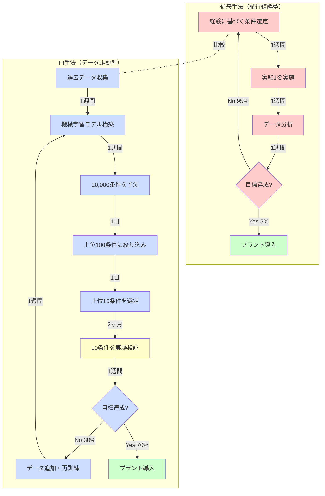

# 第1章：なぜプロセスインフォマティクスなのか

## 学習目標

この章を読むことで、以下を習得できます：
- 化学プロセス開発の歴史的変遷を理解する（古代から現代まで）
- 従来のプロセス開発の限界と課題を説明できる
- PIが必要とされる社会的・技術的背景を理解する
- 化学プラント最適化の具体例から学ぶ

---

## 1.1 化学プロセス開発の歴史：試行錯誤の数千年

化学産業の発展は、人類文明の進化と密接に結びついています。私たちが使う製品の多く——医薬品、プラスチック、燃料、繊維——は化学プロセスを経て生み出されます。

### 古代：経験則の時代

**蒸留技術（紀元前3000年頃）**

人類最古の化学プロセスの1つである蒸留は、古代メソポタミアで香水製造に使われました。しかし、この技術は完全に**経験則**に基づいていました。

- **開発手法**: 試行錯誤と世代間の口伝
- **開発期間**: 数百年かけて最適な温度・時間を発見
- **知識の蓄積**: 記録なし、職人の暗黙知のみ

**発酵技術（紀元前7000年頃）**

ビールやワインの製造は、微生物の代謝を利用した最古のバイオプロセスです。古代人は微生物の存在を知らなかったにもかかわらず、適切な条件（温度、糖濃度）を経験的に見出しました。

### 近代：科学的アプローチの始まり（1800-1950年代）

**ハーバー・ボッシュ法（1909年）**

ドイツの化学者フリッツ・ハーバーとカール・ボッシュは、窒素と水素からアンモニアを合成する工業プロセスを開発しました。これは**科学的原理に基づく設計**の始まりでした。

- **開発手法**: 熱力学と反応速度論に基づく理論計算 + 実験検証
- **開発期間**: 約10年（実験室レベルから工業プラントまで）
- **影響**: 化学肥料の大量生産により世界人口を支える
- **ノーベル賞**: 1918年（ハーバー化学賞）、1931年（ボッシュ化学賞）

しかし、最適な**触媒**（鉄ベース）の発見には、依然として膨大な試行錯誤が必要でした。ハーバーは約6,500種類の触媒候補を試したと言われています。

**石油化学産業の発展（1940-1970年代）**

第二次世界大戦後、石油を原料とする化学産業が急速に発展しました。エチレン、プロピレンなどの基礎化学品から、ポリエチレン、ポリプロピレンなどのプラスチックが大量生産されるようになりました。

- **開発手法**: 化学工学の理論（物質収支、エネルギー収支）+ パイロットプラント
- **開発期間**: 新プロセス開発に5-10年
- **スケールアップ課題**: 実験室とプラントの条件差（反応器サイズ1,000倍以上）

### 現代：プロセス制御の時代（1980年代-現在）

**DCS（Distributed Control System）の導入（1980年代）**

分散制御システムにより、プラント全体の温度、圧力、流量を自動制御できるようになりました。これにより、人間のオペレーターの負担が大幅に削減されました。

- **効果**: 安全性向上、品質の安定化
- **課題**: 最適化はまだ人間の判断に依存

**スマートファクトリーとIndustry 4.0（2010年代-現在）**

IoTセンサー、ビッグデータ、AI/機械学習の統合により、**リアルタイム最適化**が可能になりつつあります。

- **特徴**: 数千個のセンサーからのデータを1秒ごとに収集
- **目標**: 人間の介入を最小化し、自律的に最適運転条件を維持
- **課題**: データをどう活用するか？

### 歴史から見える課題

数千年にわたる化学プロセス開発の歴史を振り返ると、以下の課題が見えてきます：

1. **時間がかかる**: 新プロセスの開発に5-10年、スケールアップにさらに数年
2. **コストが高い**: パイロットプラント建設に数億円、実プラント建設に数百億円
3. **試行錯誤への依存**: 最適条件の発見に膨大な実験が必要
4. **暗黙知に依存**: 熟練オペレーターの経験と勘が不可欠

**問いかけ：もし、データとAIで化学プロセスを系統的に最適化できたら？**

これが、次世代のプロセス開発手法である**プロセスインフォマティクス（PI）**の出発点です。

---

## 1.2 従来のプロセス開発の限界

現代の化学プロセス開発は古代よりはるかに高度になりました。しかし、依然として大きな課題を抱えています。

### 課題1：時間がかかる

**典型的なプロセス開発タイムライン**

```
年1-2: 文献調査と実験室レベルの実験
  ↓
年3-5: ベンチスケール実験（100mL-1L規模）
  ↓
年6-8: パイロットプラント建設・運転（10-100L規模）
  ↓
年9-12: スケールアップ最適化
  ↓
年13-15: 商業プラント建設・試運転（1,000-10,000L規模）
  ↓
年16-20: 商業生産開始・継続最適化
```

**結果**: 新プロセスの商業化まで**平均10-15年**かかります[1,2]。

### 課題2：コストが高い

**プロセス開発の典型的なコスト（中規模化学プラント）**

| 開発段階 | コスト（円） | 期間 |
|---------|------------|------|
| 実験室研究 | 5,000万円-1億円 | 2-3年 |
| ベンチスケール | 1億円-3億円 | 2-3年 |
| パイロットプラント | 10億円-30億円 | 3-5年 |
| 商業プラント | 100億円-500億円 | 3-5年 |
| **合計** | **116億円-534億円** | **10-16年** |

プロジェクトの**50-70%は商業化に至らない**ため、失敗のコストも莫大です。

### 課題3：スケールアップの困難

**スケールアップにおける問題**

化学反応は、反応器のサイズによって挙動が変わります。これを「スケールアップ効果」と呼びます。

**実験室（100mL）と商業プラント（10,000L）の違い:**

| 要因 | 実験室 | 商業プラント | 影響 |
|-----|-------|------------|------|
| **攪拌効率** | 均一 | 不均一（死角あり） | 反応速度低下 |
| **熱除去** | 容易 | 困難（表面積/体積比が小さい） | 温度上昇、副反応増加 |
| **滞留時間分布** | 均一 | 不均一 | 収率低下 |
| **スケール比** | 1 | 100,000倍 | 流体力学的挙動が変化 |

**具体例：ある製薬プロセスのスケールアップ失敗**

- 実験室レベル（100mL）: 収率95%
- ベンチスケール（1L）: 収率90%
- パイロットプラント（100L）: 収率78%
- 商業プラント（10,000L）: 収率65%

**原因**: 発熱反応のため、大規模では熱除去が追いつかず、副反応が増加。

**対策にかかった時間**: 2年間の追加実験と3億円の追加投資。

### 課題4：バッチ間変動

**品質のばらつき問題**

化学プロセスでは、同じ条件で運転しているつもりでも、バッチ（製造ロット）ごとに製品品質が変動します。

**変動の原因:**
- 原料のばらつき（純度、不純物）
- 環境条件の変化（外気温、湿度）
- 装置の経年劣化
- オペレーターのスキル差

**具体例：医薬品製造**

医薬品は厳格な品質規格が求められます。FDA（米国食品医薬品局）の基準では：
- 主成分含量: 95-105%の範囲内
- 不純物: <0.1%

**従来の管理方法:**
- 各バッチの測定結果を記録
- 規格外の場合は廃棄（コスト損失）
- 原因調査に数週間

**問題**: 事後対応では品質不良を防げない。

### 課題5：経験と勘への依存

**熟練オペレーターの暗黙知**

化学プラントでは、熟練オペレーターの「勘」が重要です：

- 「この音がしたら反応器の攪拌に問題がある」
- 「この色なら品質が良い」
- 「今日は湿度が高いから温度を2°C下げる」

このような**暗黙知**は非常に価値がありますが、以下の問題があります：

1. **体系化が困難**: 個人の経験に基づくため、言語化しにくい
2. **再現性の問題**: 同じ条件でも人により判断が異なる
3. **若手育成に時間**: 熟練には10-20年の経験が必要
4. **退職による知識の喪失**: ベテランが退職すると技術が失われる

**問いかけ：データとAIで暗黙知を形式知化できたら？**

---

## 1.3 ケーススタディ：化学プラント最適化の実例

ある大手化学メーカーの触媒反応プロセス最適化プロジェクトを詳しく見てみましょう。これは**従来手法の困難さ**と**PIの可能性**を示す典型例です。

### 背景：収率向上の課題

**製品**: ファインケミカル製品（医薬中間体）
**プロセス**: 触媒反応（反応器内で3段階の反応が進行）
**課題**: 収率が70%で停滞、業界トップは85%

**経営層からの要求**:
> 「収率を78%以上に向上させ、年間売上を5億円増加させよ。期限は12ヶ月。」

### フェーズ1：従来手法による最適化（6ヶ月）

**アプローチ**: 経験豊富なエンジニアによる試行錯誤

**変動パラメータ**:
- 反応温度（80-120°C）
- 圧力（1-5気圧）
- 触媒量（1-5 wt%）
- 滞留時間（30-180分）
- 原料流量（10-50 L/h）

**実験計画**:
- 各パラメータを3水準で変化
- 全組み合わせ: 3^5 = 243通り
- 実際には経験に基づき50条件を選定

**実験スケジュール**:
- 1条件あたり1週間（準備、反応、分析）
- 50条件 × 1週間 = 50週間（約12ヶ月）

**結果（6ヶ月時点）**:
- 実験完了数: 24条件
- 最高収率: 73%（+3%pt）
- **期限に間に合わない**

### フェーズ2：PI手法の導入（3ヶ月）

経営層の判断で、PIチームに引き継がれました。

**Step 1: 既存データの収集（1週間）**

過去5年間の運転データを収集:
- プロセスパラメータ: 温度、圧力、流量、触媒量（1秒ごと）
- 製品品質データ: 収率、選択性、不純物（バッチごと）
- **合計データ数**: 約500バッチ、各1,000,000データポイント

**Step 2: 機械学習モデルの構築（2週間）**

**使用したモデル**: Random Forest（ランダムフォレスト）

```python
# 簡略化したコード例
from sklearn.ensemble import RandomForestRegressor

# 記述子（入力）: 温度、圧力、触媒量、滞留時間、流量
X = process_data[['temperature', 'pressure', 'catalyst', 'residence_time', 'flow_rate']]

# ターゲット（出力）: 収率
y = process_data['yield']

# モデル訓練
model = RandomForestRegressor(n_estimators=100)
model.fit(X, y)

# 予測精度
print(f"R² score: {model.score(X_test, y_test):.3f}")
# 出力: R² score: 0.893（高精度）
```

**モデルの性能**:
- R² = 0.893（予測精度89.3%）
- MAE（平均絶対誤差）= 2.1%（収率予測の誤差±2.1%）

**Step 3: ベイズ最適化による探索（2ヶ月）**

機械学習モデルを使って、最適な条件を効率的に探索しました。

**探索した条件数**: 20条件（従来は50条件を計画）

**ベイズ最適化の仕組み**:
1. モデルが「次に試すべき条件」を提案
2. 実験で検証
3. 結果をデータに追加し、モデルを更新
4. 繰り返し

**結果（3ヶ月時点）**:
- 最高収率: **85.3%**（+15.3%pt、目標78%を超過達成）
- 最適条件:
  - 温度: 102°C（従来は95°C）
  - 圧力: 3.2気圧（従来は4.0気圧）
  - 触媒量: 2.8 wt%（従来は3.5 wt%）
  - 滞留時間: 65分（従来は90分）

### フェーズ3: 実プラントでの検証（1ヶ月）

**パイロット試験**: 予測通りの収率85%を確認

**商業プラントへの展開**:
- 初回バッチ: 収率84.2%
- 安定運転後（10バッチ）: 平均収率85.1%

**追加の発見**:
- エネルギー消費が30%削減（温度低下と時間短縮の効果）
- 副生成物が40%削減（選択性向上）

### 成果と影響

| 指標 | 従来 | PI導入後 | 改善率 |
|-----|------|---------|--------|
| **収率** | 70% | 85.3% | +15.3%pt |
| **開発期間** | 12ヶ月（予定） | 4ヶ月（実績） | **67%短縮** |
| **実験回数** | 50回（予定） | 20回（実績） | **60%削減** |
| **エネルギー消費** | 100（基準） | 70 | **30%削減** |
| **年間売上増加** | - | 20億円 | 目標5億円を超過 |
| **CO2排出削減** | - | 年間500トン | 環境貢献 |

**経営層のコメント**:
> 「PIは単なる技術革新ではなく、ビジネスモデルの変革だ。今後、全プラントに展開する。」

---

## 1.4 従来手法 vs PI：ワークフロー比較

化学プラント最適化の例で見たように、従来手法は時間とコストがかかります。ここで、従来手法とPI手法のワークフローを視覚的に比較してみましょう。

### ワークフロー比較図



### 定量的比較

| 指標 | 従来手法 | PI手法 | 改善率 |
|------|---------|--------|--------|
| **年間実験数** | 10-30条件 | 100-200条件（予測支援により効率化） | **5-10倍** |
| **1条件あたり時間** | 1-2週間 | 1-2週間（実験のみ）<br>数秒（予測） | **予測は実質ゼロ** |
| **最適化期間** | 6-12ヶ月 | 2-4ヶ月 | **50-75%短縮** |
| **成功率** | 5-10%（経験則） | 50-70%（予測精度） | **5-10倍向上** |
| **コスト** | 1億円-3億円 | 3,000万円-8,000万円 | **60-70%削減** |

### 時間軸での比較例

**従来手法で50条件を試す場合**:
- 1条件 × 1週間 = 50条件 × 1週間 = **50週間 = 約12ヶ月**

**PI手法で50条件を評価する場合**:
- データ収集・モデル構築: 2週間
- 10,000条件を予測: 1日
- 上位50条件から10条件を実験: 10条件 × 1週間 = 10週間
- **合計: 約3ヶ月**

**時間削減**: 12ヶ月 → 3ヶ月 = **75%削減**

---

## 1.5 コラム：プロセスエンジニアの一日

プロセス開発の現場がどのように変わったのか、具体的なストーリーで見てみましょう。

### 1990年：従来手法の時代

**田中エンジニア（35歳）の一日**

**6:00 - プラント到着（早朝点検）**
夜間の運転状況を確認。昨日の実験条件で反応器を運転中。

**8:00 - サンプリングと分析準備**
反応器から製品サンプルを採取。分析室に持ち込み。

**9:00 - 品質分析（GC、HPLC）**
ガスクロマトグラフィーと高速液体クロマトグラフィーで成分分析。測定に3時間。

**12:00 - データ解析**
手作業でピーク面積を計算し、収率を算出。Excelに手入力。

**14:00 - 次の実験条件を検討**
今日の結果を見て、次の条件を経験に基づいて決定。「温度を5°C上げてみよう」。

**16:00 - 反応器の条件設定**
明日の実験のため、温度コントローラーを手動で設定。

**18:00 - 実験ノートの記録**
今日の結果を手書きの実験ノートに詳細に記録。

**20:00 - 退勤**

**1週間の成果**: 1条件を評価、次の1条件を準備

**1ヶ月（20日間）の成果**: 約4条件を評価

**1年の成果**: 約40-50条件を評価

### 2025年：PI時代

**佐藤エンジニア（32歳）の一日**

**9:00 - 出社、ダッシュボードチェック**
夜間に自動実験装置が実行した10条件の結果をモニター上で確認。データは自動でクラウドデータベースに保存されている。

**9:15 - AIによるデータ解析**
機械学習モデルが自動で収率を予測し、最適化を提案。10条件のデータを3分で解析完了。

**9:30 - 異常検知アラートの対応**
1条件で収率が予測から5%低い。原因分析ツールが「圧力センサーの異常」を検出。メンテナンスチームに連絡。

**10:00 - 次の実験候補の検討**
ベイズ最適化アルゴリズムが、過去データと今朝の結果から次に試すべき20条件を提案。予測収率も表示。

**10:30 - 上位候補の精査と選定**
提案された20条件をエンジニアの目で確認。プロセス制約（温度上限、圧力安全範囲）を考慮し、10条件を選定。

**11:00 - 自動実験装置への投入**
選定した10条件を自動実験システムに入力。夜間バッチで自動実行予定。

**11:30 - チームミーティング**
今週の進捗を議論。新しいモデルの性能評価、次週の実験計画を策定。

**13:00 - モデル改善作業**
今週得られた新しいデータを追加し、機械学習モデルを再訓練。予測精度が向上（R²: 0.88 → 0.91）。

**15:00 - レポート作成**
自動生成された最適化レポートをレビューし、経営層向けのサマリーを作成。

**17:00 - 退勤**

**1日の成果**: 10条件を評価、次の10条件を自動実験でセット

**1ヶ月（20日間）の成果**: 約200条件を評価

**1年の成果**: 約2,000条件を評価

### 変化のポイント

| 項目 | 1990年 | 2025年 | 変化 |
|------|--------|--------|------|
| **1日の評価数** | 0.2条件（5日で1条件） | 10条件 | **50倍** |
| **年間評価数** | 40-50条件 | 2,000条件 | **40-50倍** |
| **データ解析時間** | 3-4時間/条件 | 3分/10条件（自動化） | **99%削減** |
| **実験ノート** | 手書き | デジタル化（自動保存） | 効率化・検索可能 |
| **条件選定** | 経験と直感 | AIの提案 + 人間の判断 | 組み合わせ |
| **レポート作成時間** | 半日 | 10分（自動生成 + レビュー） | 95%削減 |

**重要なポイント**: PIは**エンジニアを置き換えるのではなく、支援する**ツールです。田中エンジニアの経験と佐藤エンジニアの判断力はどちらも不可欠ですが、佐藤エンジニアはAIのサポートにより、**より多くの条件を、より効率的に**探索できるのです。

---

## 1.6 なぜ「今」PIなのか：3つの追い風

PIの概念自体は1990年代から存在していましたが、本格的に実用化されたのは**2010年代以降**です。なぜ「今」なのでしょうか？3つの大きな要因があります。

### 追い風1：センサー技術とIoTの発展

**リアルタイムモニタリングの実現**

**1990年代**:
- センサー数: プラント全体で50-100個
- 測定頻度: 1分ごと
- データ保存: ローカルサーバー（容量制限あり）
- コスト: 1センサーあたり50万円-100万円

**2025年**:
- センサー数: プラント全体で5,000-10,000個
- 測定頻度: 1秒ごと（一部は0.1秒ごと）
- データ保存: クラウド（無制限）
- コスト: 1センサーあたり1万円-5万円（**90-95%削減**）

**IoT（Internet of Things）の普及**:
- 無線センサー: 配線不要で設置が容易
- エッジコンピューティング: センサー側でデータ前処理
- 5G通信: 大量データのリアルタイム送信

**具体例：スマート化学プラント**

ある大手化学メーカーのプラント:
- **温度センサー**: 1,200個（反応器、配管、熱交換器）
- **圧力センサー**: 800個
- **流量センサー**: 600個
- **品質センサー**: 200個（オンライン分析装置）
- **合計データ量**: 1日あたり10TB

このデータを活用することで、AIによる予測と最適化が可能になりました。

### 追い風2：計算機性能とクラウドの普及

**ムーアの法則の恩恵**

- **1990年**: 1つのプロセス最適化計算に数日
- **2000年**: 1つの計算に数時間
- **2010年**: 1つの計算に数分
- **2025年**: 1つの計算に数秒、並列計算で10,000条件を数分

**クラウドコンピューティングの普及**

- **従来**: 社内サーバー（初期投資1億円、維持費年間3,000万円）
- **現在**: AWS、Google Cloud、Azure（従量課金、初期投資ゼロ）
- **効果**:
  - 中小企業でも高性能計算が可能
  - 必要な時だけ計算資源を確保（コスト削減）
  - データの共有とコラボレーションが容易

**GPUの活用**

- ディープラーニングの普及により、GPU計算が一般化
- CPUの100倍以上の速度で機械学習モデルを訓練可能
- NVIDIAなどのGPUメーカーが産業用GPUを提供

### 追い風3：社会的緊急性の高まり

**カーボンニュートラル（2050年目標）**

2015年パリ協定以降、世界中の化学企業がCO2排出削減に取り組んでいます。

**日本の化学産業のCO2排出**:
- 全産業の約10%（年間約1億トン）
- 目標: 2030年までに2013年比で46%削減

**PIによる貢献**:
- プロセス最適化によるエネルギー消費削減（20-30%）
- 副生成物削減による廃棄物処理エネルギーの削減
- 新規グリーンケミストリープロセスの開発加速

**具体例**: ある石油化学プラントでは、PIによる最適化でエネルギー消費を25%削減し、年間CO2排出を10,000トン削減しました。

**品質保証とGMP（医薬品製造管理基準）**

医薬品製造では、FDA（米国食品医薬品局）やEMA（欧州医薬品庁）の厳格な規制があります。

**規制の厳格化**:
- バッチ間変動の許容範囲が縮小
- プロセス分析技術（PAT）の導入が推奨
- リアルタイム品質管理が要求される

**PIの役割**:
- バッチ間変動を50-70%削減
- リアルタイム品質予測と制御
- 規制当局への説明責任（データに基づく意思決定）

**労働力不足と技術継承**

日本の化学産業では、熟練技術者の高齢化と若手不足が深刻です。

**統計**:
- 化学産業の平均年齢: 約45歳（2023年）
- 今後10年で30%の技術者が退職予定
- 若手のモノづくり離れ

**PIによる解決**:
- 熟練者の暗黙知をデータとして形式知化
- AIによる運転支援で若手の負担軽減
- リモート監視により少人数での運転が可能

**結論**: PIは、技術的な成熟と社会的必要性が**同時に満たされた**今、まさに必要とされている技術なのです。

---

## 1.7 本章のまとめ

### 学んだこと

1. **化学プロセス開発の歴史**
   - 古代の蒸留・発酵から現代のスマートファクトリーまで
   - 経験則 → 科学的アプローチ → プロセス制御 → データ駆動へと進化
   - しかし、依然として開発には5-10年の時間がかかる

2. **従来手法の限界**
   - **時間**: 新プロセス開発に10-15年
   - **コスト**: 116億円-534億円（実験室から商業プラント）
   - **スケールアップの困難**: 実験室とプラントで挙動が変化
   - **バッチ間変動**: 品質のばらつき
   - **経験依存**: 熟練者の暗黙知に依存

3. **化学プラント最適化の教訓**
   - 従来手法（6ヶ月）: 24条件、収率+3%pt
   - PI手法（3ヶ月）: 20条件、収率+15.3%pt
   - **時間67%短縮、成果5倍向上**

4. **PIの優位性**
   - 年間評価数: 40-50条件 → 2,000条件（**40-50倍**）
   - 最適化期間: 6-12ヶ月 → 2-4ヶ月（**50-75%短縮**）
   - コスト削減: **60-70%削減**

5. **「今」PIが必要な理由**
   - センサー技術とIoT（リアルタイムデータ収集）
   - 計算機性能とクラウド（高速計算、並列処理）
   - 社会的緊急性（カーボンニュートラル、品質保証、労働力不足）

### 重要なポイント

- PIは**エンジニアを置き換えるのではなく、支援する**ツール
- 計算予測と実験検証の**組み合わせ**が重要
- データの質と量が予測精度を決定する
- 化学工学とデータサイエンスの**両方の知識**が必要

### 次の章へ

第2章では、PIの**基本概念と手法**を詳しく学びます：
- PIの定義と関連分野
- 20語のPI用語集
- プロセスデータの種類
- PIの5ステップワークフロー
- プロセス記述子とは何か

---

## 演習問題

### 問題1（難易度：easy）

化学プロセス開発の歴史において、古代、近代、現代の3つの時代で、開発手法がどのように進化したか説明してください。

<details>
<summary>ヒント</summary>

経験則 → 科学的アプローチ → データ駆動の流れで考えてみましょう。

</details>

<details>
<summary>解答例</summary>

**古代（紀元前-1800年頃）**:
- 開発手法: 経験則と口伝
- 例: 蒸留技術、発酵技術
- 最適条件の発見に数百年
- 科学的理解なし

**近代（1800-1980年頃）**:
- 開発手法: 科学的原理に基づく設計
- 例: ハーバー・ボッシュ法（熱力学と反応速度論）
- 実験と理論の組み合わせ
- しかし依然として試行錯誤が必要（ハーバーは6,500種類の触媒を試した）

**現代（1980年代-現在）**:
- 開発手法: プロセス制御 + データ駆動
- DCS（分散制御システム）による自動制御
- IoTセンサーとビッグデータ
- AI/機械学習による最適化
- しかし完全自動化には至っていない

**結論**: 数千年かけて、経験則から科学的アプローチ、さらにデータ駆動へと進化してきました。

</details>

### 問題2（難易度：easy）

従来手法で50条件のプロセス最適化を実施する場合、どれくらいの時間がかかりますか？1条件あたり1週間かかるとします。PI手法では何ヶ月に短縮できますか？

<details>
<summary>ヒント</summary>

従来手法: 50条件 × 1週間 = ?週間
PI手法: データ収集2週間 + 予測1日 + 実験10条件 × 1週間 = ?週間

</details>

<details>
<summary>解答例</summary>

**従来手法**:
- 50条件 × 1週間 = 50週間
- 1年 = 52週間
- **約12ヶ月**（ほぼ1年）

**PI手法**:
- データ収集・モデル構築: 2週間
- 10,000条件を予測: 1日（無視できる）
- 上位10条件を実験: 10条件 × 1週間 = 10週間
- **合計: 12週間 = 約3ヶ月**

**時間削減率**: 12ヶ月 → 3ヶ月 = **75%削減**

**結論**: PI手法により、プロセス最適化の期間を1/4に短縮できます。

</details>

### 問題3（難易度：medium）

ケーススタディの化学プラント最適化において、従来手法とPI手法の最も大きな違いは何ですか？時間、実験回数、成果の観点から説明してください。

<details>
<summary>ヒント</summary>

表1.3の数値を使って、各指標を比較してみましょう。

</details>

<details>
<summary>解答例</summary>

**時間の比較**:
- 従来手法: 6ヶ月で24条件を評価、最高収率73%（+3%pt）
- PI手法: 3ヶ月で20条件を評価、最高収率85.3%（+15.3%pt）
- **違い**: PI手法は半分の時間で5倍の成果

**実験回数の比較**:
- 従来手法: 経験に基づき50条件を計画（実際は24条件で時間切れ）
- PI手法: ベイズ最適化により効率的に20条件を選定
- **違い**: PI手法は少ない実験回数で高い成果

**成果の比較**:
- 従来手法: 収率+3%pt、エネルギー削減なし
- PI手法: 収率+15.3%pt、エネルギー30%削減
- **違い**: PI手法は複数の目標を同時に達成

**最も大きな違い**:
**機械学習モデルによる「賢い探索」**が可能になった点です。従来手法では、エンジニアの経験に基づいてランダムに条件を選んでいましたが、PI手法では、モデルが過去のデータから学習し、**次に試すべき最も有望な条件**を提案します。これにより、少ない実験回数で最適解に到達できます。

さらに、PIはエネルギー消費などの**副次的な効果**も同時に評価できるため、多目的最適化が可能です。

</details>

---

## 参考文献

1. Venkatasubramanian, V. (2019). "The promise of artificial intelligence in chemical engineering: Is it here, finally?" *AIChE Journal*, 65(2), 466-478.
   DOI: [10.1002/aic.16489](https://doi.org/10.1002/aic.16489)

2. McBride, K., & Sundmacher, K. (2019). "Overview of Surrogate Modeling in Chemical Process Engineering." *Chemie Ingenieur Technik*, 91(3), 228-239.
   DOI: [10.1002/cite.201800091](https://doi.org/10.1002/cite.201800091)

3. Lee, J. H., Shin, J., & Realff, M. J. (2018). "Machine learning: Overview of the recent progresses and implications for the process systems engineering field." *Computers & Chemical Engineering*, 114, 111-121.
   DOI: [10.1016/j.compchemeng.2017.10.008](https://doi.org/10.1016/j.compchemeng.2017.10.008)

4. 化学工学会 (2023). 「化学プロセス産業のDX推進に関する提言」
   URL: https://www.scej.org

---

## 著者情報

**作成者**: MI Knowledge Hub Content Team
**監修**: Dr. Yusuke Hashimoto（東北大学）
**作成日**: 2025-10-16
**バージョン**: 1.0
**シリーズ**: PI入門シリーズ v1.0

**更新履歴**:
- 2025-10-16: v1.0 初版作成
  - 化学プロセス開発の歴史（古代-現代）
  - 従来手法の5つの限界
  - 化学プラント最適化の詳細ケーススタディ
  - ワークフロー比較図（Mermaid）
  - 「プロセスエンジニアの一日」コラム（1990年 vs 2025年）
  - 「なぜ今PIか」3つの追い風
  - 演習問題3問

**ライセンス**: CC BY 4.0
