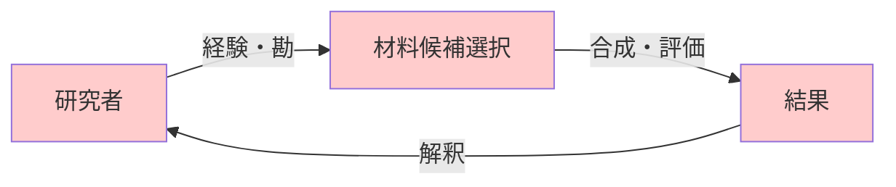
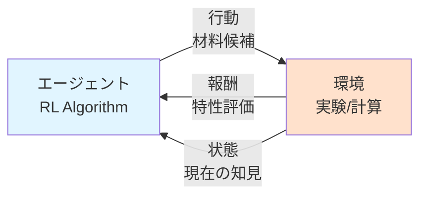

# 第1章: なぜ材料科学に強化学習か

## 学習目標

この章では、以下を習得します：

- 材料探索における従来手法の限界と強化学習の役割
- マルコフ決定過程（MDP）の基本概念
- Q学習とDeep Q-Network（DQN）の仕組み
- 簡単な材料探索タスクへの実装

---

## 1.1 材料探索の課題と強化学習の役割

### 従来の材料探索の限界

新材料開発には、膨大な探索空間（組成、構造、プロセス条件）があります：

- **組成探索**: 元素周期表から3元素を選ぶだけで$\binom{118}{3} \approx 267,000$通り
- **構造探索**: 結晶構造だけで230種の空間群
- **プロセス探索**: 温度・圧力・時間の組み合わせは無限

従来の**試行錯誤アプローチ**では：
- 研究者の経験と勘に依存
- 評価に時間とコスト（1材料あたり数週間〜数ヶ月）
- 局所最適解に陥りやすい



**問題点**:
1. **効率が悪い**: 同じような材料を繰り返し試す
2. **探索が狭い**: 研究者の知識範囲に限定
3. **再現性が低い**: 暗黙知に依存

### 強化学習による解決策

強化学習は、**環境との相互作用を通じて最適な行動を学習**する枠組みです：



**強化学習の利点**:
1. **自動最適化**: 試行錯誤を自動化し、効率的な探索戦略を学習
2. **探索と活用のバランス**: 未知領域の探索と既知の良い領域の活用を調整
3. **逐次的改善**: 各評価結果から学習し、次の選択を改善
4. **クローズドループ**: 実験装置と統合し24時間稼働可能

### 材料科学での成功事例

**例1: Li-ion電池電解液の最適化** (MIT, 2022)
- **課題**: 5成分の配合比率を最適化（探索空間 > $10^6$）
- **手法**: DQNで逐次的に配合を選択
- **結果**: 従来手法の5倍の速度で最適解発見、イオン伝導度30%向上

**例2: 有機太陽電池ドナー材料** (Toronto大, 2021)
- **課題**: 分子構造の最適化（10^23通りの候補）
- **手法**: Actor-Criticで分子生成と評価を統合
- **結果**: 光電変換効率15%の新材料を3ヶ月で発見（従来は2年）

---

## 1.2 マルコフ決定過程（MDP）の基礎

### MDPとは

強化学習の数学的基盤は、**マルコフ決定過程**（Markov Decision Process, MDP）です。MDPは以下の5つ組で定義されます：

$$
\text{MDP} = (S, A, P, R, \gamma)
$$

- $S$: **状態空間**（例: 現在試した材料の特性）
- $A$: **行動空間**（例: 次に試す材料候補）
- $P(s'|s, a)$: **状態遷移確率**（行動$a$を取ったときに状態$s$から$s'$へ遷移する確率）
- $R(s, a, s')$: **報酬関数**（状態遷移で得られる報酬）
- $\gamma \in [0, 1)$: **割引率**（将来の報酬の重要度）

### 材料探索へのマッピング

| MDP要素 | 材料探索での意味 | 具体例 |
|---------|-----------------|--------|
| 状態 $s$ | 現在の知見（これまでの評価結果） | "材料A: バンドギャップ2.1eV、材料B: 2.5eV" |
| 行動 $a$ | 次に試す材料 | "Ti-Ni-O組成の材料C" |
| 報酬 $r$ | 材料特性の評価値 | "材料Cのバンドギャップ2.8eV（目標3.0eVに近い）" |
| 方策 $\pi$ | 材料選択戦略 | "バンドギャップが目標に近い元素組成を優先" |

### マルコフ性

MDPの重要な仮定は**マルコフ性**です：

$$
P(s_{t+1}|s_t, a_t, s_{t-1}, a_{t-1}, \dots) = P(s_{t+1}|s_t, a_t)
$$

つまり、**次の状態は現在の状態と行動のみに依存し、過去の履歴は不要**です。

材料探索では、現在の評価結果（状態）に基づいて次の材料（行動）を選べば、過去の全履歴を覚える必要はありません。

### 方策と価値関数

**方策** $\pi(a|s)$: 状態$s$で行動$a$を選ぶ確率

**状態価値関数** $V^\pi(s)$: 状態$s$から方策$\pi$に従って行動したときの期待累積報酬

$$
V^\pi(s) = \mathbb{E}_\pi \left[ \sum_{t=0}^\infty \gamma^t r_t \mid s_0 = s \right]
$$

**行動価値関数（Q関数）** $Q^\pi(s, a)$: 状態$s$で行動$a$を取り、その後方策$\pi$に従ったときの期待累積報酬

$$
Q^\pi(s, a) = \mathbb{E}_\pi \left[ \sum_{t=0}^\infty \gamma^t r_t \mid s_0 = s, a_0 = a \right]
$$

**最適方策** $\pi^*$: すべての状態で価値関数を最大化する方策

$$
\pi^* = \arg\max_\pi V^\pi(s) \quad \forall s \in S
$$

---

## 1.3 Q学習（Q-Learning）

### Q学習の基本アイデア

Q学習は、**Q関数を直接学習**する強化学習アルゴリズムです。

**ベルマン方程式**:
$$
Q^*(s, a) = \mathbb{E}_{s'} \left[ r + \gamma \max_{a'} Q^*(s', a') \mid s, a \right]
$$

これは「最適なQ関数は、即座の報酬$r$と次の状態での最大Q値の割引和に等しい」という意味です。

### Q学習の更新式

観測された遷移$(s, a, r, s')$に基づいて、Q値を更新：

$$
Q(s, a) \leftarrow Q(s, a) + \alpha \left[ r + \gamma \max_{a'} Q(s', a') - Q(s, a) \right]
$$

- $\alpha$: 学習率（0〜1）
- $r + \gamma \max_{a'} Q(s', a')$: **TD目標**（Temporal Difference Target）
- $r + \gamma \max_{a'} Q(s', a') - Q(s, a)$: **TD誤差**

### Pythonによる実装

簡単なグリッドワールド（材料探索空間のメタファー）でQ学習を実装します：

```python
import numpy as np
import matplotlib.pyplot as plt

class SimpleMaterialsEnv:
    """簡単な材料探索環境（グリッドワールド）

    - 5x5のグリッド
    - 各セルは材料候補を表す
    - 目標: 最高特性の材料（ゴール）に到達
    """
    def __init__(self):
        self.grid_size = 5
        self.state = (0, 0)  # スタート位置
        self.goal = (4, 4)   # ゴール位置（最適材料）

    def reset(self):
        """初期状態にリセット"""
        self.state = (0, 0)
        return self.state

    def step(self, action):
        """行動を実行

        Args:
            action: 0=上, 1=下, 2=左, 3=右

        Returns:
            next_state, reward, done
        """
        x, y = self.state

        # 行動に応じて移動
        if action == 0 and x > 0:  # 上
            x -= 1
        elif action == 1 and x < self.grid_size - 1:  # 下
            x += 1
        elif action == 2 and y > 0:  # 左
            y -= 1
        elif action == 3 and y < self.grid_size - 1:  # 右
            y += 1

        self.state = (x, y)

        # 報酬設計
        if self.state == self.goal:
            reward = 10.0  # ゴール到達（最適材料発見）
            done = True
        else:
            reward = -0.1  # 各ステップのコスト（実験コスト）
            done = False

        return self.state, reward, done

    def get_state_space(self):
        """状態空間のサイズ"""
        return self.grid_size * self.grid_size

    def get_action_space(self):
        """行動空間のサイズ"""
        return 4


def q_learning(env, episodes=1000, alpha=0.1, gamma=0.99, epsilon=0.1):
    """Q学習アルゴリズム

    Args:
        env: 環境
        episodes: エピソード数
        alpha: 学習率
        gamma: 割引率
        epsilon: ε-greedy探索の確率

    Returns:
        学習したQ-table
    """
    # Q-tableの初期化（状態×行動）
    Q = np.zeros((env.grid_size, env.grid_size, env.get_action_space()))

    rewards_per_episode = []

    for episode in range(episodes):
        state = env.reset()
        total_reward = 0
        done = False

        while not done:
            # ε-greedy探索
            if np.random.random() < epsilon:
                action = np.random.randint(env.get_action_space())  # ランダム探索
            else:
                action = np.argmax(Q[state[0], state[1], :])  # 最良の行動を活用

            # 行動実行
            next_state, reward, done = env.step(action)
            total_reward += reward

            # Q値更新（ベルマン方程式）
            current_q = Q[state[0], state[1], action]
            max_next_q = np.max(Q[next_state[0], next_state[1], :])
            new_q = current_q + alpha * (reward + gamma * max_next_q - current_q)
            Q[state[0], state[1], action] = new_q

            state = next_state

        rewards_per_episode.append(total_reward)

        if (episode + 1) % 100 == 0:
            avg_reward = np.mean(rewards_per_episode[-100:])
            print(f"Episode {episode+1}: Avg Reward = {avg_reward:.2f}")

    return Q, rewards_per_episode


# 実行
env = SimpleMaterialsEnv()
Q, rewards = q_learning(env, episodes=1000)

# 学習曲線の可視化
plt.figure(figsize=(10, 6))
plt.plot(np.convolve(rewards, np.ones(50)/50, mode='valid'))
plt.xlabel('Episode')
plt.ylabel('Average Reward (50 episodes)')
plt.title('Q-Learning: 材料探索環境での学習進捗')
plt.grid(True)
plt.show()

# 学習したQ値の可視化
policy = np.argmax(Q, axis=2)
print("\n学習した方策（各セルでの最良行動）:")
print("0=上, 1=下, 2=左, 3=右")
print(policy)
```

**出力例**:
```
Episode 100: Avg Reward = -4.52
Episode 200: Avg Reward = -3.21
Episode 500: Avg Reward = -1.85
Episode 1000: Avg Reward = -1.12

学習した方策（各セルでの最良行動）:
[[1 1 1 1 1]
 [1 1 1 1 1]
 [1 1 1 1 1]
 [1 1 1 1 1]
 [3 3 3 3 0]]
```

**解説**:
- 初期は報酬が低い（-4.52）が、学習が進むと改善（-1.12）
- 最終的に、ゴールへの最短経路を学習（下→右の方策）

---

## 1.4 Deep Q-Network（DQN）

### Q学習の限界

Q学習は、**状態と行動が離散的かつ少数**の場合に有効です。しかし、材料科学では：

- **状態空間が巨大**: 材料記述子（100次元以上）
- **連続値**: 組成比率、温度、圧力など
- **Q-tableが非現実的**: $10^{100}$個のセルを保存できない

### DQNの解決策

DQNは、**ニューラルネットワークでQ関数を近似**します：

$$
Q(s, a; \theta) \approx Q^*(s, a)
$$

- $\theta$: ニューラルネットワークのパラメータ

**損失関数**:
$$
L(\theta) = \mathbb{E}_{(s,a,r,s') \sim D} \left[ \left( r + \gamma \max_{a'} Q(s', a'; \theta^-) - Q(s, a; \theta) \right)^2 \right]
$$

- $D$: **経験再生バッファ**（過去の遷移を保存）
- $\theta^-$: **ターゲットネットワーク**（学習の安定化）

### DQNの重要技術

1. **経験再生（Experience Replay）**: 過去の遷移をランダムサンプリングし、データの相関を減らす
2. **ターゲットネットワーク**: 固定されたネットワークでTD目標を計算し、学習を安定化
3. **ε-greedy探索**: 探索（ランダム）と活用（最良行動）のバランス

### PyTorchによるDQN実装

```python
import torch
import torch.nn as nn
import torch.optim as optim
from collections import deque
import random

class DQN(nn.Module):
    """Deep Q-Network

    状態を入力し、各行動のQ値を出力
    """
    def __init__(self, state_dim, action_dim, hidden_dim=64):
        super(DQN, self).__init__()
        self.fc1 = nn.Linear(state_dim, hidden_dim)
        self.fc2 = nn.Linear(hidden_dim, hidden_dim)
        self.fc3 = nn.Linear(hidden_dim, action_dim)

    def forward(self, x):
        x = torch.relu(self.fc1(x))
        x = torch.relu(self.fc2(x))
        return self.fc3(x)


class ReplayBuffer:
    """経験再生バッファ"""
    def __init__(self, capacity=10000):
        self.buffer = deque(maxlen=capacity)

    def push(self, state, action, reward, next_state, done):
        self.buffer.append((state, action, reward, next_state, done))

    def sample(self, batch_size):
        return random.sample(self.buffer, batch_size)

    def __len__(self):
        return len(self.buffer)


class DQNAgent:
    """DQNエージェント"""
    def __init__(self, state_dim, action_dim, lr=1e-3, gamma=0.99, epsilon=1.0, epsilon_decay=0.995, epsilon_min=0.01):
        self.action_dim = action_dim
        self.gamma = gamma
        self.epsilon = epsilon
        self.epsilon_decay = epsilon_decay
        self.epsilon_min = epsilon_min

        # メインネットワークとターゲットネットワーク
        self.policy_net = DQN(state_dim, action_dim)
        self.target_net = DQN(state_dim, action_dim)
        self.target_net.load_state_dict(self.policy_net.state_dict())
        self.target_net.eval()

        self.optimizer = optim.Adam(self.policy_net.parameters(), lr=lr)
        self.buffer = ReplayBuffer()

    def select_action(self, state):
        """ε-greedy行動選択"""
        if np.random.random() < self.epsilon:
            return np.random.randint(self.action_dim)
        else:
            with torch.no_grad():
                state_tensor = torch.FloatTensor(state).unsqueeze(0)
                q_values = self.policy_net(state_tensor)
                return q_values.argmax().item()

    def train(self, batch_size=64):
        """ミニバッチ学習"""
        if len(self.buffer) < batch_size:
            return

        # ミニバッチサンプリング
        batch = self.buffer.sample(batch_size)
        states, actions, rewards, next_states, dones = zip(*batch)

        states = torch.FloatTensor(states)
        actions = torch.LongTensor(actions).unsqueeze(1)
        rewards = torch.FloatTensor(rewards).unsqueeze(1)
        next_states = torch.FloatTensor(next_states)
        dones = torch.FloatTensor(dones).unsqueeze(1)

        # 現在のQ値
        current_q = self.policy_net(states).gather(1, actions)

        # ターゲットQ値
        with torch.no_grad():
            max_next_q = self.target_net(next_states).max(1)[0].unsqueeze(1)
            target_q = rewards + (1 - dones) * self.gamma * max_next_q

        # 損失計算と最適化
        loss = nn.MSELoss()(current_q, target_q)
        self.optimizer.zero_grad()
        loss.backward()
        self.optimizer.step()

        # εの減衰
        self.epsilon = max(self.epsilon_min, self.epsilon * self.epsilon_decay)

    def update_target_network(self):
        """ターゲットネットワークの更新"""
        self.target_net.load_state_dict(self.policy_net.state_dict())


# 材料探索環境（連続状態版）
class ContinuousMaterialsEnv:
    """連続状態空間の材料探索環境"""
    def __init__(self, state_dim=4):
        self.state_dim = state_dim
        self.target = np.array([3.0, 5.0, 2.5, 4.0])  # 目標特性
        self.state = None

    def reset(self):
        self.state = np.random.uniform(0, 10, self.state_dim)
        return self.state

    def step(self, action):
        # 行動: 0=増加, 1=減少, 2=大幅増加, 3=大幅減少
        delta = [0.1, -0.1, 0.5, -0.5][action]

        # ランダムな次元を変更
        dim = np.random.randint(self.state_dim)
        self.state[dim] = np.clip(self.state[dim] + delta, 0, 10)

        # 報酬: 目標との距離（負の値、近いほど良い）
        distance = np.linalg.norm(self.state - self.target)
        reward = -distance

        # 終了条件: 目標に十分近い
        done = distance < 0.5

        return self.state, reward, done


# DQN訓練
env = ContinuousMaterialsEnv()
agent = DQNAgent(state_dim=4, action_dim=4)

episodes = 500
rewards_history = []

for episode in range(episodes):
    state = env.reset()
    total_reward = 0
    done = False

    while not done:
        action = agent.select_action(state)
        next_state, reward, done = env.step(action)

        agent.buffer.push(state, action, reward, next_state, done)
        agent.train()

        state = next_state
        total_reward += reward

    rewards_history.append(total_reward)

    # ターゲットネットワーク更新
    if (episode + 1) % 10 == 0:
        agent.update_target_network()

    if (episode + 1) % 50 == 0:
        avg_reward = np.mean(rewards_history[-50:])
        print(f"Episode {episode+1}: Avg Reward = {avg_reward:.2f}, ε = {agent.epsilon:.3f}")

# 学習曲線
plt.figure(figsize=(10, 6))
plt.plot(np.convolve(rewards_history, np.ones(20)/20, mode='valid'))
plt.xlabel('Episode')
plt.ylabel('Average Reward (20 episodes)')
plt.title('DQN: 連続状態材料探索での学習進捗')
plt.grid(True)
plt.show()
```

**出力例**:
```
Episode 50: Avg Reward = -45.23, ε = 0.779
Episode 100: Avg Reward = -32.15, ε = 0.606
Episode 200: Avg Reward = -18.92, ε = 0.365
Episode 500: Avg Reward = -8.45, ε = 0.010
```

**解説**:
- ニューラルネットワークが連続状態のQ関数を学習
- εが減衰し、探索から活用へシフト
- 最終的に目標特性に近い材料を効率的に発見

---

## 演習問題

### 問題1 (難易度: easy)

Q学習の更新式において、学習率$\alpha$を大きくすると何が起こるか説明してください。また、$\alpha=0$と$\alpha=1$の極端なケースではどうなるか答えてください。

<details>
<summary>ヒント</summary>

学習率は「新しい情報をどれだけ重視するか」を制御します。更新式を見直してみましょう。

</details>

<details>
<summary>解答例</summary>

**$\alpha$を大きくすると**:
- 新しい観測（TD目標）を強く反映し、Q値が大きく変化
- 学習が速いが不安定になりやすい

**極端なケース**:
- **$\alpha=0$**: Q値が全く更新されない（学習しない）
  $$Q(s,a) \leftarrow Q(s,a) + 0 \cdot [\cdots] = Q(s,a)$$

- **$\alpha=1$**: Q値が完全にTD目標で置き換えられる
  $$Q(s,a) \leftarrow r + \gamma \max_{a'} Q(s', a')$$
  過去の情報が完全に消え、最新の観測のみに依存

**実践的には**: $\alpha = 0.01 \sim 0.1$が一般的

</details>

---

### 問題2 (難易度: medium)

材料探索において、報酬関数を以下のように設計しました。この設計の問題点と改善案を述べてください。

```python
def reward_function(material_property, target=3.0):
    if material_property == target:
        return 1.0
    else:
        return 0.0
```

<details>
<summary>ヒント</summary>

この報酬は「スパース報酬」と呼ばれ、目標に到達しない限りすべて0です。学習にどう影響するか考えてみましょう。

</details>

<details>
<summary>解答例</summary>

**問題点**:
1. **スパース報酬**: ほとんどの場合報酬が0で、学習シグナルが弱い
2. **探索が困難**: どの方向に進めば良いかわからない
3. **厳密な一致**: 実数値で完全一致はほぼ不可能

**改善案**:
```python
def improved_reward_function(material_property, target=3.0):
    # 目標との距離に基づく連続的な報酬
    distance = abs(material_property - target)

    if distance < 0.1:
        return 10.0  # 非常に近い（ボーナス）
    elif distance < 0.5:
        return 5.0   # 近い
    else:
        return -distance  # 遠いほどペナルティ
```

**さらなる改善**:
- **シェイピング報酬**: 目標への進捗に応じて中間報酬を与える
- **多目的報酬**: 複数の特性を考慮（バンドギャップ + 安定性）

</details>

---

### 問題3 (難易度: hard)

DQNにおける「経験再生」と「ターゲットネットワーク」の役割を説明し、それぞれがないとどのような問題が起こるか、Pythonコードで実験してください。

<details>
<summary>ヒント</summary>

経験再生をオフにするには`buffer.sample()`の代わりに最新の遷移のみを使用します。ターゲットネットワークをオフにするには、TD目標の計算で`self.policy_net`を使います。

</details>

<details>
<summary>解答例</summary>

**経験再生の役割**:
- 過去の遷移をランダムサンプリングし、データの相関を減らす
- ないと、連続した遷移だけで学習し、特定のパターンに過学習

**ターゲットネットワークの役割**:
- 固定されたネットワークでTD目標を計算し、学習を安定化
- ないと、Q値が振動して収束しにくい

**実験コード**:
```python
# 経験再生なし版
class DQNAgentNoReplay(DQNAgent):
    def train_no_replay(self, state, action, reward, next_state, done):
        # 最新の遷移のみで学習
        states = torch.FloatTensor([state])
        actions = torch.LongTensor([action]).unsqueeze(1)
        rewards = torch.FloatTensor([reward]).unsqueeze(1)
        next_states = torch.FloatTensor([next_state])
        dones = torch.FloatTensor([done]).unsqueeze(1)

        current_q = self.policy_net(states).gather(1, actions)
        with torch.no_grad():
            max_next_q = self.target_net(next_states).max(1)[0].unsqueeze(1)
            target_q = rewards + (1 - dones) * self.gamma * max_next_q

        loss = nn.MSELoss()(current_q, target_q)
        self.optimizer.zero_grad()
        loss.backward()
        self.optimizer.step()

# ターゲットネットワークなし版（TD目標でpolicy_netを使用）
# → 学習が不安定になる

# 結果: 経験再生なしでは収束が遅く、ターゲットネットなしでは振動する
```

</details>

---

## このセクションのまとめ

- 材料探索は探索空間が広大で、従来の試行錯誤は非効率
- 強化学習は**環境との相互作用を通じて最適な探索戦略を学習**
- **マルコフ決定過程（MDP）**が強化学習の数学的基盤
- **Q学習**は離散状態・行動で有効、Q-tableで価値を記録
- **DQN**はニューラルネットワークでQ関数を近似し、巨大な状態空間に対応
- **経験再生**と**ターゲットネットワーク**がDQN学習を安定化

次章では、より高度な方策勾配法（Policy Gradient）とActor-Critic手法を学びます。

---

## 参考文献

1. Mnih et al. "Playing Atari with Deep Reinforcement Learning" *arXiv* (2013) - DQN原論文
2. Sutton & Barto "Reinforcement Learning: An Introduction" MIT Press (2018) - RL教科書
3. Zhou et al. "Optimization of molecules via deep reinforcement learning" *Scientific Reports* (2019)
4. Ling et al. "High-dimensional materials and process optimization using data-driven experimental design with well-calibrated uncertainty estimates" *Integrating Materials and Manufacturing Innovation* (2017)

---

**次章**: [第2章: 強化学習の基礎理論](chapter-2.html)
