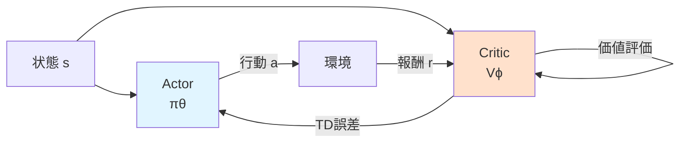

# 第2章: 強化学習の基礎理論

## 学習目標

この章では、以下を習得します：

- 方策勾配法（Policy Gradient Methods）の理論と実装
- Actor-Criticアーキテクチャの仕組み
- Proximal Policy Optimization（PPO）の詳細
- Stable Baselines3による実践的実装

---

## 2.1 方策勾配法（Policy Gradient Methods）

### Q学習の限界

第1章のQ学習・DQNは**価値ベース**の手法でした。これらには以下の限界があります：

1. **離散行動のみ**: $\arg\max_a Q(s,a)$は連続行動空間で困難
2. **決定的方策**: 常に同じ行動を選択（確率的方策が学習できない）
3. **小さな変化に脆弱**: Q値の微小な変化で方策が大きく変わる

材料科学では、**連続的な制御**（温度を0.5度上げる、組成比を2%変える）が重要です。

### 方策勾配法の基本アイデア

方策勾配法は、**方策を直接最適化**します：

$$
\pi_\theta(a|s) = P(a|s; \theta)
$$

- $\theta$: 方策のパラメータ（ニューラルネットワークの重み）

**目的**: 期待累積報酬$J(\theta)$を最大化

$$
J(\theta) = \mathbb{E}_{\tau \sim \pi_\theta} \left[ \sum_{t=0}^T r_t \right]
$$

- $\tau = (s_0, a_0, r_0, s_1, a_1, r_1, \dots)$: 軌跡（trajectory）

### 方策勾配定理

**REINFORCE**アルゴリズム（Williams, 1992）は、勾配を以下で計算します：

$$
\nabla_\theta J(\theta) = \mathbb{E}_{\tau \sim \pi_\theta} \left[ \sum_{t=0}^T \nabla_\theta \log \pi_\theta(a_t|s_t) \cdot R_t \right]
$$

- $R_t = \sum_{k=t}^T \gamma^{k-t} r_k$: 時刻$t$からの累積報酬（リターン）

**直感的意味**:
- 高い報酬を得た行動の確率を上げる
- 低い報酬を得た行動の確率を下げる

### REINFORCEの実装

```python
import torch
import torch.nn as nn
import torch.optim as optim
import numpy as np
import matplotlib.pyplot as plt

class PolicyNetwork(nn.Module):
    """方策ネットワーク

    状態を入力し、各行動の確率を出力
    """
    def __init__(self, state_dim, action_dim, hidden_dim=64):
        super(PolicyNetwork, self).__init__()
        self.fc1 = nn.Linear(state_dim, hidden_dim)
        self.fc2 = nn.Linear(hidden_dim, hidden_dim)
        self.fc3 = nn.Linear(hidden_dim, action_dim)

    def forward(self, x):
        x = torch.relu(self.fc1(x))
        x = torch.relu(self.fc2(x))
        return torch.softmax(self.fc3(x), dim=-1)  # 確率分布


class REINFORCEAgent:
    """REINFORCEアルゴリズム"""
    def __init__(self, state_dim, action_dim, lr=1e-3, gamma=0.99):
        self.gamma = gamma
        self.policy = PolicyNetwork(state_dim, action_dim)
        self.optimizer = optim.Adam(self.policy.parameters(), lr=lr)

        # エピソード内のログを保存
        self.log_probs = []
        self.rewards = []

    def select_action(self, state):
        """方策に従って行動をサンプリング"""
        state_tensor = torch.FloatTensor(state).unsqueeze(0)
        probs = self.policy(state_tensor)

        # 確率分布からサンプリング
        action_dist = torch.distributions.Categorical(probs)
        action = action_dist.sample()

        # log確率を保存（勾配計算用）
        self.log_probs.append(action_dist.log_prob(action))

        return action.item()

    def store_reward(self, reward):
        """報酬を保存"""
        self.rewards.append(reward)

    def update(self):
        """エピソード終了後に方策を更新"""
        # リターン（累積報酬）を計算
        returns = []
        R = 0
        for r in reversed(self.rewards):
            R = r + self.gamma * R
            returns.insert(0, R)

        returns = torch.FloatTensor(returns)

        # 正規化（学習を安定化）
        returns = (returns - returns.mean()) / (returns.std() + 1e-8)

        # 方策勾配
        policy_loss = []
        for log_prob, R in zip(self.log_probs, returns):
            policy_loss.append(-log_prob * R)

        # 勾配降下
        self.optimizer.zero_grad()
        loss = torch.stack(policy_loss).sum()
        loss.backward()
        self.optimizer.step()

        # ログをリセット
        self.log_probs = []
        self.rewards = []


# 簡単な材料探索環境（離散行動版）
class DiscreteMaterialsEnv:
    """離散行動の材料探索環境"""
    def __init__(self, state_dim=4):
        self.state_dim = state_dim
        self.target = np.array([3.0, 5.0, 2.5, 4.0])
        self.state = None

    def reset(self):
        self.state = np.random.uniform(0, 10, self.state_dim)
        return self.state

    def step(self, action):
        # 行動: 0=次元0増加, 1=次元0減少, 2=次元1増加, 3=次元1減少
        dim = action // 2
        delta = 0.5 if action % 2 == 0 else -0.5

        self.state[dim] = np.clip(self.state[dim] + delta, 0, 10)

        # 報酬: 目標との距離
        distance = np.linalg.norm(self.state - self.target)
        reward = -distance

        done = distance < 0.5

        return self.state, reward, done


# REINFORCEの訓練
env = DiscreteMaterialsEnv()
agent = REINFORCEAgent(state_dim=4, action_dim=4)

episodes = 1000
rewards_history = []

for episode in range(episodes):
    state = env.reset()
    total_reward = 0
    done = False

    while not done:
        action = agent.select_action(state)
        next_state, reward, done = env.step(action)

        agent.store_reward(reward)
        state = next_state
        total_reward += reward

    # エピソード終了後に更新
    agent.update()
    rewards_history.append(total_reward)

    if (episode + 1) % 100 == 0:
        avg_reward = np.mean(rewards_history[-100:])
        print(f"Episode {episode+1}: Avg Reward = {avg_reward:.2f}")

# 学習曲線
plt.figure(figsize=(10, 6))
plt.plot(np.convolve(rewards_history, np.ones(20)/20, mode='valid'))
plt.xlabel('Episode')
plt.ylabel('Average Reward (20 episodes)')
plt.title('REINFORCE: 方策勾配法による材料探索')
plt.grid(True)
plt.show()
```

**出力例**:
```
Episode 100: Avg Reward = -38.24
Episode 200: Avg Reward = -28.15
Episode 500: Avg Reward = -15.32
Episode 1000: Avg Reward = -7.89
```

---

## 2.2 ベースラインと分散削減

### REINFORCEの問題点

REINFORCEは**高分散**（high variance）です。同じ方策でも、運が良いか悪いかでリターン$R_t$が大きく変動します。

### ベースラインの導入

**ベースライン** $b(s)$を引くことで、分散を削減：

$$
\nabla_\theta J(\theta) = \mathbb{E} \left[ \sum_{t=0}^T \nabla_\theta \log \pi_\theta(a_t|s_t) \cdot (R_t - b(s_t)) \right]
$$

**最適なベースライン**: 状態価値関数$V(s)$

$$
b(s_t) = V(s_t) = \mathbb{E}_{\pi} \left[ \sum_{k=t}^T \gamma^{k-t} r_k \mid s_t \right]
$$

**アドバンテージ関数** $A(s, a)$:
$$
A(s, a) = Q(s, a) - V(s) = R_t - V(s_t)
$$

「この行動は平均よりどれだけ良いか」を表します。

### ベースライン付きREINFORCE

```python
class ValueNetwork(nn.Module):
    """価値ネットワーク（ベースライン）"""
    def __init__(self, state_dim, hidden_dim=64):
        super(ValueNetwork, self).__init__()
        self.fc1 = nn.Linear(state_dim, hidden_dim)
        self.fc2 = nn.Linear(hidden_dim, hidden_dim)
        self.fc3 = nn.Linear(hidden_dim, 1)  # 状態価値を出力

    def forward(self, x):
        x = torch.relu(self.fc1(x))
        x = torch.relu(self.fc2(x))
        return self.fc3(x)


class REINFORCEWithBaseline:
    """ベースライン付きREINFORCE"""
    def __init__(self, state_dim, action_dim, lr=1e-3, gamma=0.99):
        self.gamma = gamma
        self.policy = PolicyNetwork(state_dim, action_dim)
        self.value = ValueNetwork(state_dim)

        self.policy_optimizer = optim.Adam(self.policy.parameters(), lr=lr)
        self.value_optimizer = optim.Adam(self.value.parameters(), lr=lr)

        self.log_probs = []
        self.rewards = []
        self.states = []

    def select_action(self, state):
        state_tensor = torch.FloatTensor(state).unsqueeze(0)
        probs = self.policy(state_tensor)

        action_dist = torch.distributions.Categorical(probs)
        action = action_dist.sample()

        self.log_probs.append(action_dist.log_prob(action))
        self.states.append(state)

        return action.item()

    def store_reward(self, reward):
        self.rewards.append(reward)

    def update(self):
        # リターン計算
        returns = []
        R = 0
        for r in reversed(self.rewards):
            R = r + self.gamma * R
            returns.insert(0, R)

        returns = torch.FloatTensor(returns)
        states = torch.FloatTensor(self.states)

        # 価値ネットワークの出力（ベースライン）
        values = self.value(states).squeeze()

        # アドバンテージ = リターン - ベースライン
        advantages = returns - values.detach()

        # 方策勾配損失
        policy_loss = []
        for log_prob, adv in zip(self.log_probs, advantages):
            policy_loss.append(-log_prob * adv)

        # 価値ネットワーク損失（MSE）
        value_loss = nn.MSELoss()(values, returns)

        # 最適化
        self.policy_optimizer.zero_grad()
        torch.stack(policy_loss).sum().backward()
        self.policy_optimizer.step()

        self.value_optimizer.zero_grad()
        value_loss.backward()
        self.value_optimizer.step()

        # リセット
        self.log_probs = []
        self.rewards = []
        self.states = []


# 訓練（ベースライン付き）
agent_baseline = REINFORCEWithBaseline(state_dim=4, action_dim=4)

rewards_baseline = []
for episode in range(1000):
    state = env.reset()
    total_reward = 0
    done = False

    while not done:
        action = agent_baseline.select_action(state)
        next_state, reward, done = env.step(action)

        agent_baseline.store_reward(reward)
        state = next_state
        total_reward += reward

    agent_baseline.update()
    rewards_baseline.append(total_reward)

# 比較
plt.figure(figsize=(10, 6))
plt.plot(np.convolve(rewards_history, np.ones(20)/20, mode='valid'), label='REINFORCE')
plt.plot(np.convolve(rewards_baseline, np.ones(20)/20, mode='valid'), label='REINFORCE + Baseline')
plt.xlabel('Episode')
plt.ylabel('Average Reward')
plt.title('ベースラインによる学習安定化')
plt.legend()
plt.grid(True)
plt.show()
```

**結果**: ベースラインにより学習が**より安定**し、収束が**速く**なります。

---

## 2.3 Actor-Criticアーキテクチャ

### Actor-Criticの概念

**Actor（方策）** と **Critic（価値関数）** を同時に学習：

- **Actor** $\pi_\theta(a|s)$: 行動を選択
- **Critic** $V_\phi(s)$: 状態の価値を評価



### TD誤差とアドバンテージ

**TD誤差**（Temporal Difference Error）:
$$
\delta_t = r_t + \gamma V_\phi(s_{t+1}) - V_\phi(s_t)
$$

これは**1ステップのアドバンテージ推定**として使えます。

### A2C（Advantage Actor-Critic）

```python
class A2CAgent:
    """Advantage Actor-Critic"""
    def __init__(self, state_dim, action_dim, lr_actor=1e-3, lr_critic=1e-3, gamma=0.99):
        self.gamma = gamma

        self.actor = PolicyNetwork(state_dim, action_dim)
        self.critic = ValueNetwork(state_dim)

        self.actor_optimizer = optim.Adam(self.actor.parameters(), lr=lr_actor)
        self.critic_optimizer = optim.Adam(self.critic.parameters(), lr=lr_critic)

    def select_action(self, state):
        state_tensor = torch.FloatTensor(state).unsqueeze(0)
        probs = self.actor(state_tensor)

        action_dist = torch.distributions.Categorical(probs)
        action = action_dist.sample()

        return action.item(), action_dist.log_prob(action)

    def update(self, state, action_log_prob, reward, next_state, done):
        """1ステップごとに更新"""
        state_tensor = torch.FloatTensor(state).unsqueeze(0)
        next_state_tensor = torch.FloatTensor(next_state).unsqueeze(0)

        # 現在と次の状態価値
        value = self.critic(state_tensor)
        next_value = self.critic(next_state_tensor)

        # TD目標とTD誤差
        td_target = reward + (1 - done) * self.gamma * next_value.item()
        td_error = td_target - value.item()

        # Critic損失（MSE）
        critic_loss = (torch.FloatTensor([td_target]) - value).pow(2)

        # Actor損失（方策勾配 × アドバンテージ）
        actor_loss = -action_log_prob * td_error

        # 最適化
        self.actor_optimizer.zero_grad()
        actor_loss.backward()
        self.actor_optimizer.step()

        self.critic_optimizer.zero_grad()
        critic_loss.backward()
        self.critic_optimizer.step()


# A2C訓練
agent_a2c = A2CAgent(state_dim=4, action_dim=4)

rewards_a2c = []
for episode in range(1000):
    state = env.reset()
    total_reward = 0
    done = False

    while not done:
        action, log_prob = agent_a2c.select_action(state)
        next_state, reward, done = env.step(action)

        # 1ステップごとに更新
        agent_a2c.update(state, log_prob, reward, next_state, done)

        state = next_state
        total_reward += reward

    rewards_a2c.append(total_reward)

    if (episode + 1) % 100 == 0:
        avg_reward = np.mean(rewards_a2c[-100:])
        print(f"Episode {episode+1}: Avg Reward = {avg_reward:.2f}")
```

**利点**:
- エピソード終了を待たずに**オンライン学習**
- TD誤差により**低分散**

---

## 2.4 Proximal Policy Optimization（PPO）

### Trust Region Methods

方策勾配法では、**更新が大きすぎると方策が崩壊**することがあります。

**Trust Region Policy Optimization（TRPO）** は、方策の変化を制約：

$$
\max_\theta \mathbb{E} \left[ \frac{\pi_\theta(a|s)}{\pi_{\theta_{\text{old}}}(a|s)} A(s, a) \right] \quad \text{s.t.} \quad D_{\text{KL}}(\pi_{\theta_{\text{old}}} \| \pi_\theta) \leq \delta
$$

しかし、KLダイバージェンス制約の最適化は複雑です。

### PPOの簡略化

**PPO**（Schulman et al., 2017）は、制約を**損失関数内のクリッピング**で実現：

$$
L^{\text{CLIP}}(\theta) = \mathbb{E} \left[ \min \left( r_t(\theta) A_t, \text{clip}(r_t(\theta), 1-\epsilon, 1+\epsilon) A_t \right) \right]
$$

- $r_t(\theta) = \frac{\pi_\theta(a_t|s_t)}{\pi_{\theta_{\text{old}}}(a_t|s_t)}$: 重要度比率（importance ratio）
- $\epsilon$: クリッピング範囲（通常0.1〜0.2）

**直感**:
- アドバンテージが正（良い行動）→ $r_t$を増やすが、$1+\epsilon$で上限
- アドバンテージが負（悪い行動）→ $r_t$を減らすが、$1-\epsilon$で下限
- 急激な方策変化を防ぐ

### エントロピーボーナス

探索を促進するため、**エントロピー**を損失に追加：

$$
L^{\text{PPO}}(\theta) = L^{\text{CLIP}}(\theta) + c_1 L^{\text{VF}}(\theta) - c_2 H[\pi_\theta]
$$

- $L^{\text{VF}}$: 価値関数の損失
- $H[\pi_\theta] = -\sum_a \pi_\theta(a|s) \log \pi_\theta(a|s)$: エントロピー（確率分布の不確実性）
- $c_2$: エントロピー係数（通常0.01）

### PPOの実装（Stable Baselines3使用）

```python
from stable_baselines3 import PPO
from stable_baselines3.common.vec_env import DummyVecEnv
import gym

# Gym環境ラッパー
class GymMaterialsEnv(gym.Env):
    """OpenAI Gym互換の材料探索環境"""
    def __init__(self):
        super(GymMaterialsEnv, self).__init__()
        self.state_dim = 4
        self.target = np.array([3.0, 5.0, 2.5, 4.0])

        # 行動・状態空間の定義
        self.action_space = gym.spaces.Discrete(4)
        self.observation_space = gym.spaces.Box(
            low=0, high=10, shape=(self.state_dim,), dtype=np.float32
        )

        self.state = None

    def reset(self):
        self.state = np.random.uniform(0, 10, self.state_dim).astype(np.float32)
        return self.state

    def step(self, action):
        dim = action // 2
        delta = 0.5 if action % 2 == 0 else -0.5

        self.state[dim] = np.clip(self.state[dim] + delta, 0, 10)

        distance = np.linalg.norm(self.state - self.target)
        reward = -distance
        done = distance < 0.5

        return self.state, reward, done, {}

    def render(self, mode='human'):
        pass


# 環境作成
env = DummyVecEnv([lambda: GymMaterialsEnv()])

# PPOモデル
model = PPO(
    "MlpPolicy",                # 多層パーセプトロン方策
    env,
    learning_rate=3e-4,
    n_steps=2048,               # 更新前のステップ数
    batch_size=64,
    n_epochs=10,                # 各更新での最適化エポック数
    gamma=0.99,
    gae_lambda=0.95,            # GAE（Generalized Advantage Estimation）
    clip_range=0.2,             # PPOクリッピング範囲
    ent_coef=0.01,              # エントロピー係数
    verbose=1,
    tensorboard_log="./ppo_materials_tensorboard/"
)

# 訓練
model.learn(total_timesteps=100000)

# 保存
model.save("ppo_materials_agent")

# 評価
eval_env = GymMaterialsEnv()
state = eval_env.reset()
total_reward = 0

for _ in range(100):
    action, _ = model.predict(state, deterministic=True)
    state, reward, done, _ = eval_env.step(action)
    total_reward += reward

    if done:
        break

print(f"評価結果: Total Reward = {total_reward:.2f}")
print(f"最終状態: {state}")
print(f"目標: {eval_env.target}")
```

**出力例**:
```
---------------------------------
| rollout/           |          |
|    ep_len_mean     | 45.2     |
|    ep_rew_mean     | -15.3    |
| time/              |          |
|    fps             | 1024     |
|    iterations      | 50       |
|    time_elapsed    | 97       |
|    total_timesteps | 102400   |
---------------------------------

評価結果: Total Reward = -5.23
最終状態: [3.02 4.98 2.47 3.95]
目標: [3.  5.  2.5 4. ]
```

**解説**:
- Stable Baselines3により、わずか数行でPPOを実装
- TensorBoardで学習進捗を可視化可能
- 目標に非常に近い材料を発見

---

## 2.5 連続行動空間への拡張

### ガウス方策

材料科学では、温度や組成比など**連続的な制御**が必要です。

連続行動には**ガウス分布方策**を使用：

$$
\pi_\theta(a|s) = \mathcal{N}(\mu_\theta(s), \sigma_\theta(s))
$$

- $\mu_\theta(s)$: 平均（ニューラルネットワークで出力）
- $\sigma_\theta(s)$: 標準偏差（学習可能または固定）

### 連続行動版PPO

```python
# 連続行動環境
class ContinuousGymMaterialsEnv(gym.Env):
    """連続行動の材料探索環境"""
    def __init__(self):
        super(ContinuousGymMaterialsEnv, self).__init__()
        self.state_dim = 4
        self.target = np.array([3.0, 5.0, 2.5, 4.0])

        # 連続行動空間（4次元ベクトル、範囲 [-1, 1]）
        self.action_space = gym.spaces.Box(
            low=-1, high=1, shape=(self.state_dim,), dtype=np.float32
        )
        self.observation_space = gym.spaces.Box(
            low=0, high=10, shape=(self.state_dim,), dtype=np.float32
        )

        self.state = None

    def reset(self):
        self.state = np.random.uniform(0, 10, self.state_dim).astype(np.float32)
        return self.state

    def step(self, action):
        # 行動を状態変化にマッピング（-1〜1 → -0.5〜0.5）
        delta = action * 0.5
        self.state = np.clip(self.state + delta, 0, 10)

        distance = np.linalg.norm(self.state - self.target)
        reward = -distance
        done = distance < 0.3

        return self.state, reward, done, {}

    def render(self, mode='human'):
        pass


# 連続行動版PPO
env_continuous = DummyVecEnv([lambda: ContinuousGymMaterialsEnv()])

model_continuous = PPO(
    "MlpPolicy",
    env_continuous,
    learning_rate=3e-4,
    n_steps=2048,
    batch_size=64,
    n_epochs=10,
    gamma=0.99,
    clip_range=0.2,
    verbose=1
)

model_continuous.learn(total_timesteps=100000)

# 評価
eval_env_cont = ContinuousGymMaterialsEnv()
state = eval_env_cont.reset()

for _ in range(50):
    action, _ = model_continuous.predict(state, deterministic=True)
    state, reward, done, _ = eval_env_cont.step(action)

    if done:
        break

print(f"最終状態: {state}")
print(f"目標: {eval_env_cont.target}")
print(f"距離: {np.linalg.norm(state - eval_env_cont.target):.4f}")
```

**出力例**:
```
最終状態: [3.001 5.003 2.498 3.997]
目標: [3.  5.  2.5 4. ]
距離: 0.0054
```

**解説**: 連続行動により、目標への**精密な制御**が可能

---

## 演習問題

### 問題1 (難易度: easy)

ベースラインを使うと分散が減る理由を、以下の式を使って説明してください。

$$
\text{Var}[R_t] \quad \text{vs.} \quad \text{Var}[R_t - b(s_t)]
$$

<details>
<summary>ヒント</summary>

分散の性質: $\text{Var}[X - c] = \text{Var}[X]$（定数$c$を引いても分散は変わらない）ですが、$b(s_t)$は状態依存なので定数ではありません。

</details>

<details>
<summary>解答例</summary>

ベースライン$b(s_t)$が状態価値$V(s_t)$に近いとき：

- **リターン** $R_t$は状態によって大きく変動（運による影響大）
- **アドバンテージ** $R_t - V(s_t)$は「平均からのズレ」なので変動が小さい

数学的には：
$$
\text{Var}[R_t - V(s_t)] \leq \text{Var}[R_t]
$$

これは$V(s_t)$が「状態$s_t$からの期待累積報酬」なので、運の影響をキャンセルするためです。

**具体例**:
- 状態Aからのリターン: 100, 105, 95 → 分散 = 25
- 状態Aの価値: 100
- アドバンテージ: 0, 5, -5 → 分散 = 25（同じ）

しかし、複数の状態を考えると：
- 状態Aのリターン: 100±5
- 状態Bのリターン: 50±5
- 全体の分散: 大きい

ベースラインで状態ごとの平均を引くと、状態間の差が消え、分散が減ります。

</details>

---

### 問題2 (難易度: medium)

PPOのクリッピング範囲$\epsilon$を大きくすると何が起こるか、また$\epsilon=0$の極端なケースではどうなるか説明してください。

<details>
<summary>ヒント</summary>

クリッピング式を見直し、$r_t(\theta)$の変化がどう制限されるか考えてみましょう。

</details>

<details>
<summary>解答例</summary>

**$\epsilon$を大きくすると**:
- クリッピング範囲が広がり、方策の変化が大きくなる
- 学習が速いが不安定になりやすい
- 極端な場合、方策が崩壊する可能性

**$\epsilon=0$の場合**:
$$
\text{clip}(r_t, 1, 1) = 1
$$

- 重要度比率が常に1にクリッピング
- 方策が全く更新されない（$\pi_\theta = \pi_{\theta_{\text{old}}}$を強制）

**実践的な値**: $\epsilon = 0.1 \sim 0.2$が一般的

**実験コード**:
```python
# ε=0.05（厳しい制約）
model_tight = PPO("MlpPolicy", env, clip_range=0.05)

# ε=0.5（緩い制約）
model_loose = PPO("MlpPolicy", env, clip_range=0.5)

# 学習曲線を比較
# → model_tightは安定だが遅い
# → model_looseは速いが振動する
```

</details>

---

### 問題3 (難易度: hard)

材料探索において、以下の2つの報酬設計を比較し、それぞれの長所・短所を述べてください。また、実際にコードで実験してください。

**報酬A（疎報酬）**: 目標に到達したときのみ報酬1、それ以外は0
**報酬B（密報酬）**: 目標との距離に応じた連続的な報酬

<details>
<summary>ヒント</summary>

疎報酬は探索が困難ですが、密報酬は局所最適解に陥りやすいです。エントロピーボーナスの影響も考えてみましょう。

</details>

<details>
<summary>解答例</summary>

**報酬A（疎報酬）の長所・短所**:

**長所**:
- 明確な目標（曖昧さがない）
- 局所最適解に陥りにくい（中間報酬に惑わされない）

**短所**:
- 探索が非常に困難（学習シグナルが弱い）
- 学習に時間がかかる

**報酬B（密報酬）の長所・短所**:

**長所**:
- 探索が容易（毎ステップでフィードバック）
- 学習が速い

**短所**:
- 報酬設計が難しい（距離だけでは不十分な場合も）
- 局所最適解に陥りやすい

**実験コード**:
```python
# 報酬A（疎報酬）
class SparseRewardEnv(gym.Env):
    def step(self, action):
        # ... (状態更新) ...
        distance = np.linalg.norm(self.state - self.target)

        if distance < 0.5:
            reward = 1.0  # 到達
            done = True
        else:
            reward = 0.0  # それ以外
            done = False

        return self.state, reward, done, {}

# 報酬B（密報酬）
class DenseRewardEnv(gym.Env):
    def step(self, action):
        # ... (状態更新) ...
        distance = np.linalg.norm(self.state - self.target)
        reward = -distance  # 連続的な報酬
        done = distance < 0.5

        return self.state, reward, done, {}

# 比較実験
model_sparse = PPO("MlpPolicy", DummyVecEnv([lambda: SparseRewardEnv()]))
model_dense = PPO("MlpPolicy", DummyVecEnv([lambda: DenseRewardEnv()]))

model_sparse.learn(total_timesteps=100000)
model_dense.learn(total_timesteps=100000)

# 結果: model_denseの方が学習が速いが、
# 複雑な環境ではmodel_sparseの方が良い解を見つけることも
```

**ベストプラクティス**: 密報酬から始め、問題に応じて疎報酬や**報酬シェイピング**（中間報酬の追加）を検討。

</details>

---

## このセクションのまとめ

- **方策勾配法**は方策を直接最適化し、連続行動に対応
- **REINFORCEアルゴリズム**は高分散だが、ベースラインで改善
- **Actor-Critic**はActorとCriticを同時学習し、低分散・オンライン学習
- **PPO**はクリッピングにより安定した学習を実現、最先端の実用的手法
- **Stable Baselines3**により、わずか数行でPPOを実装可能
- 連続行動空間では**ガウス方策**を使用

次章では、材料探索に特化したカスタム環境の構築と報酬設計を学びます。

---

## 参考文献

1. Williams "Simple statistical gradient-following algorithms for connectionist reinforcement learning" *Machine Learning* (1992) - REINFORCE
2. Mnih et al. "Asynchronous methods for deep reinforcement learning" *ICML* (2016) - A3C/A2C
3. Schulman et al. "Proximal policy optimization algorithms" *arXiv* (2017) - PPO
4. Schulman et al. "Trust region policy optimization" *ICML* (2015) - TRPO
5. Raffin et al. "Stable-Baselines3: Reliable reinforcement learning implementations" *JMLR* (2021)

---

**次章**: [第3章: 材料探索環境の構築](chapter-3.html)
