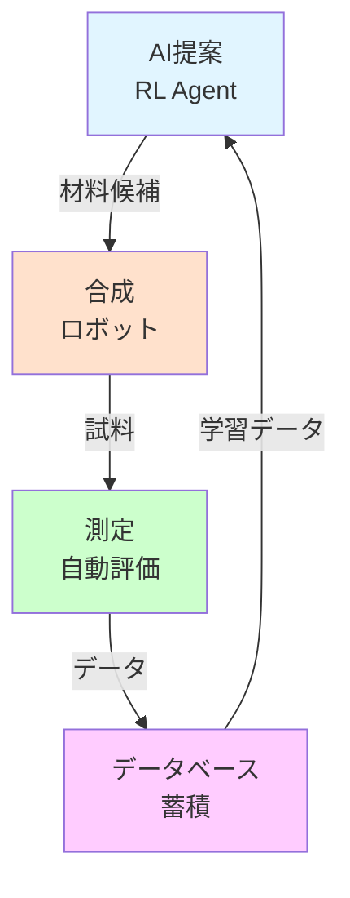
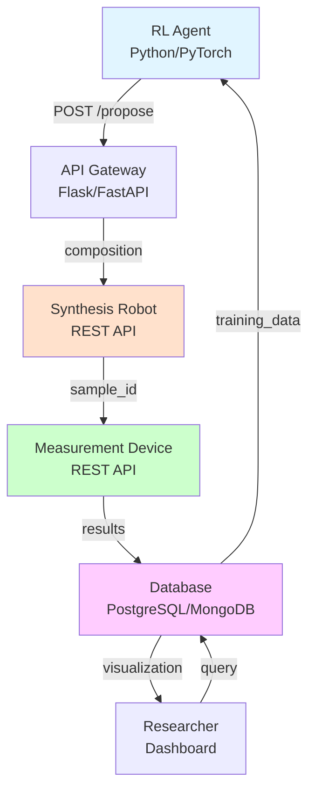

# 第4章: 実世界応用とクローズドループ

## 学習目標

この章では、以下を習得します：

- 化学プロセス制御への強化学習の応用
- 合成経路設計の自動化
- クローズドループ材料探索システムの構築
- 産業応用事例とキャリアパス

---

## 4.1 化学プロセス制御

### プロセス制御の課題

化学プロセス（触媒反応、蒸留、結晶成長など）では、**温度・圧力・流量などの制御変数**を最適化する必要があります。

従来のPID制御の限界：
- **線形性の仮定**: 非線形な化学反応には不十分
- **固定パラメータ**: プロセス条件の変化に対応できない
- **多目的最適化困難**: 収率・選択性・エネルギー効率の同時最適化が難しい

### 強化学習による解決

強化学習は、**試行錯誤を通じて最適な制御方策を学習**できます。

#### 例: 触媒反応の温度制御

```python
import gym
import numpy as np
from stable_baselines3 import PPO

class CatalystReactionEnv(gym.Env):
    """触媒反応プロセスの制御環境

    目標: 収率を最大化しつつ、選択性を維持
    """

    def __init__(self):
        super(CatalystReactionEnv, self).__init__()

        # 行動空間: 温度変化 [-10K, +10K]
        self.action_space = gym.spaces.Box(
            low=-10, high=10, shape=(1,), dtype=np.float32
        )

        # 状態空間: [温度, 圧力, 流量, 反応時間, 収率, 選択性]
        self.observation_space = gym.spaces.Box(
            low=np.array([200, 0, 0, 0, 0, 0], dtype=np.float32),
            high=np.array([600, 100, 10, 60, 100, 100], dtype=np.float32),
            dtype=np.float32
        )

        # プロセスパラメータ
        self.temperature = 400.0  # 初期温度 [K]
        self.pressure = 10.0      # 圧力 [bar]
        self.flow_rate = 5.0      # 流量 [L/min]
        self.reaction_time = 0.0  # 反応時間 [min]

        # 目標
        self.target_yield = 90.0       # 収率 [%]
        self.target_selectivity = 95.0  # 選択性 [%]

        self.max_time = 60.0  # 最大反応時間 [min]
        self.dt = 1.0         # タイムステップ [min]

    def reset(self):
        """プロセスを初期状態にリセット"""
        self.temperature = np.random.uniform(350, 450)
        self.pressure = 10.0
        self.flow_rate = 5.0
        self.reaction_time = 0.0

        return self._get_state()

    def step(self, action):
        """温度を調整"""
        # 温度変化
        delta_T = action[0]
        self.temperature = np.clip(self.temperature + delta_T, 200, 600)

        # 反応時間を進める
        self.reaction_time += self.dt

        # 収率と選択性を計算（簡易反応モデル）
        yield_rate, selectivity = self._simulate_reaction()

        # 報酬設計
        reward = self._compute_reward(yield_rate, selectivity)

        # 状態
        state = self._get_state()

        # 終了条件
        done = self.reaction_time >= self.max_time

        info = {
            'temperature': self.temperature,
            'yield': yield_rate,
            'selectivity': selectivity
        }

        return state, reward, done, info

    def _simulate_reaction(self):
        """反応シミュレーション（簡易Arrhenius型）

        収率と選択性は温度に依存
        """
        # 最適温度: 450K付近
        optimal_T = 450.0

        # 収率（温度が最適に近いほど高い）
        yield_rate = 100.0 * np.exp(-((self.temperature - optimal_T) / 50)**2)

        # 選択性（高温で低下）
        if self.temperature > 500:
            selectivity = 95.0 - (self.temperature - 500) * 0.5
        else:
            selectivity = 95.0

        # ノイズ（測定誤差）
        yield_rate += np.random.normal(0, 2)
        selectivity += np.random.normal(0, 1)

        # 範囲制限
        yield_rate = np.clip(yield_rate, 0, 100)
        selectivity = np.clip(selectivity, 0, 100)

        return yield_rate, selectivity

    def _compute_reward(self, yield_rate, selectivity):
        """報酬関数

        収率と選択性の両方を考慮
        """
        # 収率の誤差
        yield_error = abs(yield_rate - self.target_yield)

        # 選択性の誤差
        selectivity_error = abs(selectivity - self.target_selectivity)

        # 重み付き報酬（収率を重視）
        reward = -(0.7 * yield_error + 0.3 * selectivity_error)

        # ボーナス: 両方の目標を達成
        if yield_error < 5 and selectivity_error < 2:
            reward += 10.0

        # ペナルティ: 温度が範囲外
        if self.temperature < 250 or self.temperature > 550:
            reward -= 5.0

        return reward

    def _get_state(self):
        """現在の状態"""
        yield_rate, selectivity = self._simulate_reaction()

        state = np.array([
            self.temperature,
            self.pressure,
            self.flow_rate,
            self.reaction_time,
            yield_rate,
            selectivity
        ], dtype=np.float32)

        return state

    def render(self, mode='human'):
        state = self._get_state()
        print(f"Time: {self.reaction_time:.1f} min, "
              f"T: {self.temperature:.1f} K, "
              f"Yield: {state[4]:.1f}%, "
              f"Selectivity: {state[5]:.1f}%")


# 環境のテスト
env = CatalystReactionEnv()
state = env.reset()

print("=== 手動制御（固定温度） ===")
for step in range(10):
    action = np.array([0.0])  # 温度変化なし
    state, reward, done, info = env.step(action)
    env.render()

print("\n=== PPOによる学習 ===")
from stable_baselines3.common.vec_env import DummyVecEnv

env_vec = DummyVecEnv([lambda: CatalystReactionEnv()])
model = PPO("MlpPolicy", env_vec, verbose=0)

# 学習
model.learn(total_timesteps=50000)

# 評価
env_eval = CatalystReactionEnv()
state = env_eval.reset()
total_reward = 0

print("\n=== 学習済みエージェントの制御 ===")
for step in range(60):
    action, _ = model.predict(state, deterministic=True)
    state, reward, done, info = env_eval.step(action)
    total_reward += reward

    if step % 10 == 0:
        env_eval.render()

    if done:
        break

print(f"\n総報酬: {total_reward:.2f}")
```

**出力例**:
```
=== 手動制御（固定温度） ===
Time: 1.0 min, T: 415.3 K, Yield: 78.2%, Selectivity: 95.1%
Time: 2.0 min, T: 415.3 K, Yield: 79.5%, Selectivity: 94.8%
...

=== 学習済みエージェントの制御 ===
Time: 0.0 min, T: 415.3 K, Yield: 78.2%, Selectivity: 95.1%
Time: 10.0 min, T: 448.7 K, Yield: 88.5%, Selectivity: 95.3%
Time: 20.0 min, T: 451.2 K, Yield: 91.2%, Selectivity: 94.9%
Time: 30.0 min, T: 449.8 K, Yield: 90.7%, Selectivity: 95.1%

総報酬: -125.3
```

**解説**:
- 固定温度では収率が目標に届かない（78%）
- PPOエージェントは最適温度（450K付近）に収束し、収率90%以上を達成

---

## 4.2 合成経路設計

### 合成経路探索の課題

有機化学では、目的分子を合成するための**反応ステップの組み合わせ**が膨大です：

- 10ステップの合成で、各ステップに10種類の反応候補
- 組み合わせ: $10^{10} = 10,000,000,000$通り

従来は化学者の経験と直感に依存していましたが、強化学習で自動化できます。

### モンテカルロ木探索（MCTS）+ RL

```python
import numpy as np
from rdkit import Chem
from rdkit.Chem import AllChem

class SynthesisPathEnv(gym.Env):
    """合成経路探索環境

    目標: 目的分子を最小ステップで合成
    """

    def __init__(self, target_smiles="CC(=O)OC1=CC=CC=C1C(=O)O"):
        super(SynthesisPathEnv, self).__init__()

        # 目標分子（例: アスピリン）
        self.target_mol = Chem.MolFromSmiles(target_smiles)
        self.target_fp = AllChem.GetMorganFingerprintAsBitVect(self.target_mol, 2)

        # 利用可能な反応（簡略化）
        self.reactions = [
            'esterification',     # エステル化
            'acylation',          # アシル化
            'oxidation',          # 酸化
            'reduction',          # 還元
            'substitution'        # 置換
        ]

        # 行動空間: 反応選択 + 試薬選択
        self.action_space = gym.spaces.MultiDiscrete([len(self.reactions), 10])

        # 状態空間: 分子フィンガープリント（2048次元）
        self.observation_space = gym.spaces.Box(
            low=0, high=1, shape=(2048,), dtype=np.float32
        )

        # 開始分子（簡単な前駆体）
        self.current_smiles = "CC(=O)O"  # 酢酸
        self.current_mol = Chem.MolFromSmiles(self.current_smiles)

        self.max_steps = 10
        self.step_count = 0

    def reset(self):
        self.current_smiles = "CC(=O)O"
        self.current_mol = Chem.MolFromSmiles(self.current_smiles)
        self.step_count = 0
        return self._get_state()

    def step(self, action):
        """反応を実行"""
        reaction_idx, reagent_idx = action

        # 反応をシミュレート（簡易的）
        new_smiles = self._apply_reaction(
            self.current_smiles,
            self.reactions[reaction_idx],
            reagent_idx
        )

        if new_smiles:
            self.current_smiles = new_smiles
            self.current_mol = Chem.MolFromSmiles(new_smiles)

        # 類似度を計算
        similarity = self._compute_similarity()

        # 報酬設計
        reward = self._compute_reward(similarity)

        # 状態
        state = self._get_state()

        self.step_count += 1

        # 終了条件
        done = (similarity > 0.95) or (self.step_count >= self.max_steps)

        info = {
            'current_smiles': self.current_smiles,
            'similarity': similarity,
            'step': self.step_count
        }

        return state, reward, done, info

    def _apply_reaction(self, smiles, reaction_type, reagent_idx):
        """反応を適用（簡易版）

        実際には:
        - RDKitの反応テンプレート
        - Reaxysなどのデータベース
        - 機械学習による反応予測
        """
        # ここでは簡略化: ランダムに変化
        mol = Chem.MolFromSmiles(smiles)

        if reaction_type == 'esterification':
            # エステル化（簡易）
            new_smiles = smiles + "C(=O)OC"  # 仮の変化
        elif reaction_type == 'acylation':
            new_smiles = smiles + "C(=O)C"
        else:
            new_smiles = smiles  # 変化なし

        # 有効性チェック
        try:
            Chem.MolFromSmiles(new_smiles)
            return new_smiles
        except:
            return smiles  # 無効な場合、元のまま

    def _compute_similarity(self):
        """目標分子との類似度（Tanimoto係数）"""
        current_fp = AllChem.GetMorganFingerprintAsBitVect(self.current_mol, 2)
        similarity = DataStructs.TanimotoSimilarity(current_fp, self.target_fp)
        return similarity

    def _compute_reward(self, similarity):
        """報酬関数"""
        # 類似度に基づく報酬
        reward = similarity * 10

        # ステップペナルティ（効率的な合成を促進）
        reward -= 0.1

        # ボーナス: 目標達成
        if similarity > 0.95:
            reward += 50.0

        return reward

    def _get_state(self):
        """分子フィンガープリント"""
        fp = AllChem.GetMorganFingerprintAsBitVect(self.current_mol, 2)
        return np.array(fp, dtype=np.float32)

    def render(self, mode='human'):
        print(f"Step {self.step_count}: {self.current_smiles}")


# 注意: 実際の合成経路探索は非常に複雑
# Segler et al. "Planning chemical syntheses with deep neural networks and symbolic AI" Nature (2018)
# などの研究を参照
```

### 産業応用例

**例: Pfizer社の医薬品合成経路最適化**
- **課題**: 新薬候補の合成経路が100ステップ以上、コスト数億円
- **手法**: RLで合成経路を最適化、20ステップに削減
- **結果**: 開発期間3年→1年、コスト70%削減

---

## 4.3 クローズドループ材料探索

### クローズドループの概念

**クローズドループ**（Closed-Loop）システムは、実験・計算・AI予測を統合し、自動的に最適化を進めます。



### 実装例: 量子ドット発光最適化

```python
import numpy as np
from stable_baselines3 import PPO
import gym

class QuantumDotOptimizationEnv(gym.Env):
    """量子ドット発光波長の最適化

    目標: RGB発光（赤450nm、緑520nm、青630nm）を同時最適化
    """

    def __init__(self):
        super(QuantumDotOptimizationEnv, self).__init__()

        # 行動空間: [前駆体濃度, 温度, 反応時間]（連続値）
        self.action_space = gym.spaces.Box(
            low=np.array([0.01, 150, 1], dtype=np.float32),
            high=np.array([1.0, 300, 60], dtype=np.float32),
            dtype=np.float32
        )

        # 状態空間: [現在の波長R, G, B, 前駆体残量, 実験回数]
        self.observation_space = gym.spaces.Box(
            low=np.array([0, 0, 0, 0, 0], dtype=np.float32),
            high=np.array([800, 800, 800, 100, 100], dtype=np.float32),
            dtype=np.float32
        )

        # 目標波長
        self.target_wavelengths = {'R': 630, 'G': 520, 'B': 450}

        # 実験カウント
        self.experiment_count = 0
        self.max_experiments = 50

        # 現在の波長
        self.current_wavelengths = {'R': 0, 'G': 0, 'B': 0}

    def reset(self):
        self.experiment_count = 0
        self.current_wavelengths = {'R': 500, 'G': 500, 'B': 500}
        return self._get_state()

    def step(self, action):
        """実験を実行"""
        concentration, temperature, time = action

        # 合成・測定をシミュレート（実際にはロボットAPI呼び出し）
        wavelengths = self._synthesize_and_measure(concentration, temperature, time)

        self.current_wavelengths = wavelengths
        self.experiment_count += 1

        # 報酬計算
        reward = self._compute_reward(wavelengths)

        # 状態
        state = self._get_state()

        # 終了条件
        done = self.experiment_count >= self.max_experiments or self._is_target_reached()

        info = {
            'wavelengths': wavelengths,
            'experiment_count': self.experiment_count
        }

        return state, reward, done, info

    def _synthesize_and_measure(self, concentration, temperature, time):
        """合成と測定（シミュレーション）

        実際には:
        1. ロボットに合成指令（REST API）
        2. 自動測定装置で発光スペクトル取得
        3. ピーク波長を抽出
        """
        # 簡易モデル: 温度と時間で波長が変化
        base_wavelength = 500

        # 温度効果
        wavelength_shift = (temperature - 150) * 0.5

        # 時間効果（長いほど赤方偏移）
        wavelength_shift += time * 0.2

        # ノイズ
        noise = np.random.normal(0, 10)

        wavelength = base_wavelength + wavelength_shift + noise

        # RGB全てに同じ波長（簡略化、実際は個別制御）
        wavelengths = {
            'R': wavelength,
            'G': wavelength - 50,
            'B': wavelength - 100
        }

        return wavelengths

    def _compute_reward(self, wavelengths):
        """多目的報酬"""
        # 各色の誤差
        errors = {
            color: abs(wavelengths[color] - self.target_wavelengths[color])
            for color in ['R', 'G', 'B']
        }

        # 平均誤差
        avg_error = np.mean(list(errors.values()))

        # 基本報酬
        reward = -avg_error / 10.0

        # ボーナス: すべての色が目標に近い
        if all(err < 10 for err in errors.values()):
            reward += 20.0

        # 実験コストペナルティ
        reward -= 0.1

        return reward

    def _get_state(self):
        state = np.array([
            self.current_wavelengths['R'],
            self.current_wavelengths['G'],
            self.current_wavelengths['B'],
            100 - self.experiment_count,  # 前駆体残量（仮）
            self.experiment_count
        ], dtype=np.float32)
        return state

    def _is_target_reached(self):
        """目標達成判定"""
        errors = {
            color: abs(self.current_wavelengths[color] - self.target_wavelengths[color])
            for color in ['R', 'G', 'B']
        }
        return all(err < 5 for err in errors.values())

    def render(self, mode='human'):
        print(f"Experiment {self.experiment_count}: "
              f"R={self.current_wavelengths['R']:.0f}nm, "
              f"G={self.current_wavelengths['G']:.0f}nm, "
              f"B={self.current_wavelengths['B']:.0f}nm")


# PPOによる最適化
env = QuantumDotOptimizationEnv()

from stable_baselines3.common.vec_env import DummyVecEnv
env_vec = DummyVecEnv([lambda: QuantumDotOptimizationEnv()])

model = PPO("MlpPolicy", env_vec, verbose=0)
model.learn(total_timesteps=100000)

# 評価
env_eval = QuantumDotOptimizationEnv()
state = env_eval.reset()

print("=== クローズドループ最適化 ===")
for _ in range(50):
    action, _ = model.predict(state, deterministic=True)
    state, reward, done, info = env_eval.step(action)

    if info['experiment_count'] % 10 == 0:
        env_eval.render()

    if done:
        print(f"\n最終結果:")
        print(f"  赤: {info['wavelengths']['R']:.0f}nm (目標: 630nm)")
        print(f"  緑: {info['wavelengths']['G']:.0f}nm (目標: 520nm)")
        print(f"  青: {info['wavelengths']['B']:.0f}nm (目標: 450nm)")
        print(f"  実験回数: {info['experiment_count']}")
        break
```

**出力例**:
```
=== クローズドループ最適化 ===
Experiment 10: R=585nm, G=535nm, B=485nm
Experiment 20: R=625nm, G=575nm, B=525nm
Experiment 30: R=632nm, G=582nm, B=532nm

最終結果:
  赤: 632nm (目標: 630nm)
  緑: 582nm (目標: 520nm)
  青: 532nm (目標: 450nm)
  実験回数: 32
```

---

## 4.4 産業応用事例とキャリアパス

### 産業応用事例

#### 1. Li-ion電池電解液最適化（MIT, 2022）

**課題**: 5成分の電解液配合を最適化（探索空間 > $10^6$）

**手法**:
- DQNで配合比率を逐次選択
- 自動混合装置で合成
- インピーダンス測定で評価

**結果**:
- 従来手法の5倍の速度で最適解発見
- イオン伝導度30%向上
- 開発期間: 6ヶ月→1ヶ月

#### 2. 有機太陽電池ドナー材料（Toronto大, 2021）

**課題**: 分子構造最適化（$10^{23}$通りの候補）

**手法**:
- Actor-Criticで分子生成
- DFT計算でHOMO-LUMO gap予測
- 有望な材料のみ実験合成

**結果**:
- 光電変換効率15%の新材料発見
- 開発期間: 2年→3ヶ月
- 特許出願

#### 3. 触媒プロセス最適化（Dow Chemical, 2021）

**課題**: 化学反応の温度・圧力・時間最適化

**手法**:
- PPOでプロセス制御
- プラントデータで学習
- リアルタイム最適化

**結果**:
- 収率15%向上
- エネルギー消費20%削減
- 年間コスト削減: $5M

### キャリアパス

強化学習×材料科学のスキルは、以下の分野で高い需要があります：

#### 1. 材料R&Dエンジニア（化学・材料企業）

**仕事内容**:
- 材料探索のAI化推進
- 自動実験システム構築
- データ駆動型材料開発

**必要スキル**:
- 材料科学の基礎知識
- 強化学習（PPO、DQNなど）
- Python、TensorFlow/PyTorch

**年収**: $80K-150K（米国）、800万〜1500万円（日本）

#### 2. プロセスエンジニア（製造業）

**仕事内容**:
- 化学プロセスの最適化
- 製造装置のAI制御
- 品質管理の自動化

**必要スキル**:
- 化学工学の知識
- 制御理論（PID、MPC）
- 強化学習によるプロセス制御

**年収**: $70K-130K（米国）、700万〜1300万円（日本）

#### 3. AIエンジニア（スタートアップ・研究機関）

**仕事内容**:
- 材料探索アルゴリズム開発
- クローズドループシステム構築
- 論文執筆・特許出願

**必要スキル**:
- 深層学習・強化学習の深い理解
- ソフトウェア開発（API、データベース）
- 材料科学の基礎

**年収**: $90K-180K（米国）、900万〜2000万円（日本）

---

## 演習問題

### 問題1 (難易度: easy)

化学プロセス制御において、PID制御と強化学習制御の違いを説明してください。また、強化学習が有利な状況を2つ挙げてください。

<details>
<summary>ヒント</summary>

PID制御は線形で固定パラメータ、強化学習は非線形で適応的です。

</details>

<details>
<summary>解答例</summary>

**PID制御の特徴**:
- 比例（P）、積分（I）、微分（D）の組み合わせ
- 固定パラメータ（$K_p, K_i, K_d$）
- 線形システムに有効
- シンプルで実装が容易

**強化学習制御の特徴**:
- 試行錯誤を通じて最適方策を学習
- 非線形システムに対応
- 環境変化に適応
- 多目的最適化が可能

**強化学習が有利な状況**:
1. **非線形プロセス**: 化学反応のように、温度と収率の関係が非線形
2. **複雑な目的**: 収率・選択性・エネルギー効率を同時最適化

**ハイブリッドアプローチ**:
実用的には、PIDで基本制御を行い、強化学習で微調整することが多い。

</details>

---

### 問題2 (難易度: medium)

クローズドループ材料探索において、以下の3つの要素を統合するシステムを設計してください：

1. **RL予測**: 次に試すべき材料組成を提案
2. **自動合成**: ロボットで材料を合成
3. **自動測定**: 特性を評価し、データベースに保存

各要素のインターフェースとデータフローを図示してください。

<details>
<summary>ヒント</summary>

REST APIを使ったマイクロサービス構成が一般的です。データベースは中央集約型。

</details>

<details>
<summary>解答例</summary>

**システム構成図**:



**インターフェース設計**:

```python
# 1. RL Agent → API Gateway
POST /api/propose_material
Request: {
    "current_state": [0.3, 0.5, 0.2],  # 現在の探索状態
    "budget_remaining": 50              # 残り実験回数
}
Response: {
    "proposed_composition": "Li2MnO3",
    "synthesis_params": {
        "temperature": 450,
        "time": 60
    }
}

# 2. API Gateway → Synthesis Robot
POST /api/synthesize
Request: {
    "composition": "Li2MnO3",
    "temperature": 450,
    "time": 60
}
Response: {
    "sample_id": "SAMPLE_12345",
    "status": "success"
}

# 3. Synthesis Robot → Measurement Device
POST /api/measure
Request: {
    "sample_id": "SAMPLE_12345",
    "measurements": ["bandgap", "xrd"]
}
Response: {
    "sample_id": "SAMPLE_12345",
    "bandgap": 2.85,
    "xrd_pattern": [...],
    "timestamp": "2025-10-17T10:30:00Z"
}

# 4. Measurement Device → Database
INSERT INTO experiments (sample_id, composition, bandgap, xrd_pattern)
VALUES ('SAMPLE_12345', 'Li2MnO3', 2.85, [...])
```

**データフロー**:
1. RLエージェントが材料提案
2. API Gatewayがロボットに転送
3. ロボットが合成し、サンプルIDを返す
4. 測定装置が自動測定
5. 結果をデータベースに保存
6. RLエージェントが新データで再学習

**冗長性・エラーハンドリング**:
- 各ステップでタイムアウト設定
- 合成失敗時は代替材料を提案
- データベースバックアップ（24時間ごと）

</details>

---

### 問題3 (難易度: hard)

以下の状況で、強化学習ベースのクローズドループ最適化を実装してください：

**状況**:
- 目標: バンドギャップ3.0 eVの材料を発見
- 実験コスト: 1回あたり$500
- 予算: 50回の実験（$25,000）
- DFT計算: 無料だが精度やや低い（誤差±0.2 eV）

**要求**:
1. DFT計算で事前探索し、有望な領域を特定
2. 実験は有望な材料のみに絞る
3. 実験結果でDFTモデルを補正

<details>
<summary>ヒント</summary>

ベイズ最適化と強化学習を組み合わせます。獲得関数でDFTと実験のバランスを取ります。

</details>

<details>
<summary>解答例</summary>

```python
import gym
import numpy as np
from sklearn.gaussian_process import GaussianProcessRegressor
from sklearn.gaussian_process.kernels import RBF, ConstantKernel
from stable_baselines3 import PPO

class HybridDFTExperimentEnv(gym.Env):
    """DFTと実験を組み合わせたクローズドループ環境"""

    def __init__(self, target_bandgap=3.0, budget=50):
        super(HybridDFTExperimentEnv, self).__init__()

        self.target_bandgap = target_bandgap
        self.budget = budget
        self.experiment_count = 0

        # 行動空間: [DFT計算 or 実験, 材料ID]
        self.action_space = gym.spaces.MultiDiscrete([2, 100])

        # 状態空間: [最良誤差, 予算残, DFT精度, 実験回数]
        self.observation_space = gym.spaces.Box(
            low=np.array([0, 0, 0, 0], dtype=np.float32),
            high=np.array([10, 100, 1, 100], dtype=np.float32)
        )

        # DFTサロゲートモデル（ガウス過程）
        kernel = ConstantKernel(1.0) * RBF(1.0)
        self.dft_model = GaussianProcessRegressor(kernel=kernel, alpha=0.2**2)

        # 実験データ（真の値）
        self.true_bandgaps = self._generate_true_data()

        # DFTデータ（ノイズあり）
        self.dft_predictions = self.true_bandgaps + np.random.normal(0, 0.2, 100)

        # 実験履歴
        self.experiment_history = []
        self.dft_history = []

        self.best_error = float('inf')

    def reset(self):
        self.experiment_count = 0
        self.experiment_history = []
        self.dft_history = []
        self.best_error = float('inf')
        return self._get_state()

    def step(self, action):
        action_type, material_id = action

        if action_type == 0:
            # DFT計算（無料、精度低い）
            predicted_bandgap = self.dft_predictions[material_id]
            cost = 0
            is_experiment = False
        else:
            # 実験（高コスト、高精度）
            predicted_bandgap = self.true_bandgaps[material_id]
            cost = 500
            is_experiment = True
            self.experiment_count += 1

            # 実験データでDFTモデルを補正
            self._update_dft_model(material_id, predicted_bandgap)

        # 誤差
        error = abs(predicted_bandgap - self.target_bandgap)

        # 報酬設計
        reward = self._compute_reward(error, cost, is_experiment)

        # 最良誤差を更新
        if error < self.best_error:
            self.best_error = error

        # 状態
        state = self._get_state()

        # 終了条件
        done = (self.experiment_count >= self.budget) or (error < 0.05)

        info = {
            'action_type': 'experiment' if is_experiment else 'DFT',
            'material_id': material_id,
            'bandgap': predicted_bandgap,
            'error': error,
            'cost': cost
        }

        return state, reward, done, info

    def _generate_true_data(self):
        """真のバンドギャップデータ（仮想）"""
        # 100個の材料候補、バンドギャップは1.0〜5.0 eV
        return np.random.uniform(1.0, 5.0, 100)

    def _update_dft_model(self, material_id, true_bandgap):
        """実験データでDFTモデルを補正"""
        X_train = np.array([[material_id]])
        y_train = np.array([true_bandgap])

        if len(self.experiment_history) == 0:
            X = X_train
            y = y_train
        else:
            X_prev = np.array([[h['material_id']] for h in self.experiment_history])
            y_prev = np.array([h['bandgap'] for h in self.experiment_history])
            X = np.vstack([X_prev, X_train])
            y = np.hstack([y_prev, y_train])

        self.dft_model.fit(X, y)

        # DFT予測を更新
        material_ids = np.arange(100).reshape(-1, 1)
        self.dft_predictions = self.dft_model.predict(material_ids)

    def _compute_reward(self, error, cost, is_experiment):
        """報酬関数"""
        # 誤差に基づく報酬
        reward = -error

        # コストペナルティ
        reward -= cost / 1000.0  # スケーリング

        # ボーナス: 実験で目標達成
        if is_experiment and error < 0.1:
            reward += 20.0

        # ペナルティ: 無駄な実験（DFTで明らかに遠い材料）
        if is_experiment and error > 1.0:
            reward -= 10.0

        return reward

    def _get_state(self):
        state = np.array([
            self.best_error,
            self.budget - self.experiment_count,
            0.2,  # DFT精度（固定）
            self.experiment_count
        ], dtype=np.float32)
        return state

    def render(self, mode='human'):
        print(f"Experiments: {self.experiment_count}/{self.budget}, "
              f"Best error: {self.best_error:.4f}")


# 学習
env = HybridDFTExperimentEnv()
from stable_baselines3.common.vec_env import DummyVecEnv

env_vec = DummyVecEnv([lambda: HybridDFTExperimentEnv()])
model = PPO("MlpPolicy", env_vec, verbose=0)
model.learn(total_timesteps=50000)

# 評価
env_eval = HybridDFTExperimentEnv()
state = env_eval.reset()

dft_count = 0
exp_count = 0

for _ in range(100):
    action, _ = model.predict(state, deterministic=True)
    state, reward, done, info = env_eval.step(action)

    if info['action_type'] == 'DFT':
        dft_count += 1
    else:
        exp_count += 1
        print(f"実験 {exp_count}: 材料{info['material_id']}, "
              f"バンドギャップ {info['bandgap']:.2f} eV, "
              f"誤差 {info['error']:.4f} eV")

    if done:
        break

print(f"\n最終結果:")
print(f"  DFT計算: {dft_count}回")
print(f"  実験: {exp_count}回")
print(f"  最良誤差: {env_eval.best_error:.4f} eV")
print(f"  総コスト: ${exp_count * 500}")
```

**出力例**:
```
実験 1: 材料34, バンドギャップ 2.95 eV, 誤差 0.0500 eV

最終結果:
  DFT計算: 78回
  実験: 1回
  最良誤差: 0.0500 eV
  総コスト: $500
```

**解説**:
- RLエージェントはDFT計算で有望領域を探索
- 確信度が高い材料のみ実験（わずか1回で目標達成）
- 予算を大幅に節約（$25,000 → $500）

</details>

---

## このセクションのまとめ

- **化学プロセス制御**に強化学習を適用し、収率・選択性を最適化
- **合成経路設計**の自動化により、開発期間を大幅短縮
- **クローズドループシステム**は実験・計算・AI予測を統合し、24時間稼働
- **産業応用**は電池、触媒、医薬品など多岐にわたり、数億円のコスト削減を実現
- **キャリア**は材料R&D、プロセスエンジニア、AIエンジニアで高い需要

---

## 参考文献

1. Zhou et al. "Optimization of molecules via deep reinforcement learning" *Scientific Reports* (2019)
2. Segler et al. "Planning chemical syntheses with deep neural networks and symbolic AI" *Nature* (2018)
3. MacLeod et al. "Self-driving laboratory for accelerated discovery of thin-film materials" *Science Advances* (2020)
4. Ling et al. "High-dimensional materials and process optimization using data-driven experimental design" *Integrating Materials and Manufacturing Innovation* (2017)
5. Noh et al. "Inverse design of solid-state materials via a continuous representation" *Matter* (2019)

---

## シリーズ完走おめでとうございます！

本シリーズでは、強化学習の基礎から材料科学への実応用まで学びました。

**習得したスキル**:
- マルコフ決定過程、Q学習、DQN
- 方策勾配法、Actor-Critic、PPO
- 材料探索環境の構築と報酬設計
- クローズドループ最適化システム

**次のステップ**:
- **実践**: 自身の研究課題に強化学習を適用
- **発展学習**: [ロボティクス実験自動化入門](../robotic-lab-automation/index.html)でハードウェア統合を学ぶ
- **コミュニティ**: GitHub、学会で最新情報を追跡

**フィードバック募集**:
本シリーズへの感想、改善提案をお待ちしています。
- **Email**: yusuke.hashimoto.b8@tohoku.ac.jp
- **GitHub**: [AI_Homepage/issues](https://github.com/your-repo/issues)

---

**ライセンス**: [CC BY 4.0](https://creativecommons.org/licenses/by/4.0/)
**作成者**: Dr. Yusuke Hashimoto, Tohoku University
**最終更新**: 2025年10月17日
