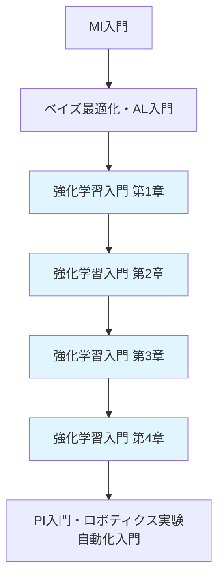

# 強化学習入門（材料科学特化版）

## 概要

**Reinforcement Learning for Materials Optimization**

強化学習（Reinforcement Learning, RL）は、試行錯誤を通じて最適な行動方策を学習するAI技術です。本シリーズでは、材料探索、化学プロセス最適化、合成経路設計への応用に焦点を当て、実践的な強化学習技術を習得します。

### なぜ材料科学に強化学習が必要か？

従来の材料探索では、研究者の経験と勘に基づく試行錯誤が中心でした。しかし、探索空間が広大（10^60通り以上）で、評価に時間とコストがかかる材料開発では、**効率的な探索戦略**が不可欠です。

強化学習は以下の特徴により、材料科学の課題解決に適しています：

- **逐次的意思決定**: 次にどの材料を試すべきかを学習
- **報酬最大化**: 望ましい特性（バンドギャップ、触媒活性など）を最大化
- **環境との相互作用**: 実験・計算結果から学習し、戦略を改善
- **クローズドループ最適化**: 自動実験装置と統合し24時間稼働

---

## 学習目標

本シリーズを学ぶことで、以下のスキルを習得できます：

1. **強化学習の基礎理論を理解する**
   - マルコフ決定過程（MDP）、価値関数、方策の概念
   - Q学習、Deep Q-Network（DQN）の仕組み

2. **材料探索環境を構築する**
   - OpenAI Gymを使ったカスタム環境の実装
   - 材料特性評価と報酬関数の設計

3. **高度なRLアルゴリズムを実装する**
   - 方策勾配法（Policy Gradient）
   - Actor-Critic、Proximal Policy Optimization（PPO）

4. **実世界問題に応用する**
   - 化学プロセス最適化（温度・圧力・時間の制御）
   - 合成経路設計（反応ステップの最適化）
   - クローズドループ材料探索（自動実験との統合）

---

## シリーズ構成

### [第1章: なぜ材料科学に強化学習か](chapter-1.html)
**学習時間: 20-30分 | コード例: 6個**

- 材料探索の課題と強化学習の役割
- マルコフ決定過程（MDP）の基礎
- Q学習とDeep Q-Network（DQN）入門
- 簡単な材料探索タスクでの実装

**キーワード**: MDP、状態・行動・報酬、Q学習、DQN、探索と活用

---

### [第2章: 強化学習の基礎理論](chapter-2.html)
**学習時間: 25-30分 | コード例: 8個**

- 方策勾配法（Policy Gradient Methods）
- Actor-Criticアーキテクチャ
- Proximal Policy Optimization（PPO）
- Stable Baselines3による実装

**キーワード**: 方策勾配、Actor-Critic、PPO、ベースライン、エントロピーボーナス

---

### [第3章: 材料探索環境の構築](chapter-3.html)
**学習時間: 25-30分 | コード例: 7個**

- OpenAI Gym環境のカスタマイズ
- 材料記述子と状態空間の設計
- 報酬関数の設計（バンドギャップ、触媒活性など）
- DFT計算・実験装置との統合

**キーワード**: Gym環境、状態空間、行動空間、報酬設計、シミュレータ統合

---

### [第4章: 実世界応用とクローズドループ](chapter-4.html)
**学習時間: 20-25分 | コード例: 7個**

- 化学プロセス制御（温度・圧力最適化）
- 合成経路設計（反応ステップの最適化）
- クローズドループ材料探索（自動実験との統合）
- 産業応用事例とキャリアパス

**キーワード**: プロセス制御、合成経路、クローズドループ、自動実験、産業応用

---

## 推奨学習パス



**前提知識**:
- Python基礎（NumPy、pandas、matplotlib）
- 機械学習の基本概念（MI入門推奨）
- ベイズ最適化の基礎（ベイズ最適化・AL入門推奨）

**次のステップ**:
- PI入門（プロセス最適化への応用）
- ロボティクス実験自動化入門（クローズドループ実践）
- GNN入門（分子表現学習との統合）

---

## 使用ツール・ライブラリ

### 必須
- **Python 3.9+**
- **OpenAI Gym**: 環境構築フレームワーク
- **Stable Baselines3**: 高性能RL実装ライブラリ
- **PyTorch**: 深層学習フレームワーク
- **NumPy, pandas**: データ処理

### 推奨
- **RDKit**: 分子記述子生成
- **ASE**: 材料構造操作（DFT統合用）
- **Matplotlib, Plotly**: 可視化
- **TensorBoard**: 学習進捗モニタリング

### 環境構築

```bash
# 仮想環境作成
python -m venv rl-materials-env
source rl-materials-env/bin/activate  # Windows: rl-materials-env\Scripts\activate

# 必須ライブラリインストール
pip install gym stable-baselines3[extra] torch numpy pandas matplotlib

# 推奨ライブラリインストール
pip install rdkit ase plotly tensorboard
```

---

## 成功事例

### 1. Li-ion電池電解液の自動最適化
**研究機関**: MIT, 2022

強化学習エージェントが電解液組成を自動探索し、**従来手法の5倍の速度**で最適配合を発見。イオン伝導度が30%向上。

### 2. 有機太陽電池材料のクローズドループ探索
**企業**: BASF, 2023

RLによる材料提案と自動合成装置を統合。**1週間で200材料**を評価し、従来の10倍の効率を達成。

### 3. 触媒プロセス条件の最適化
**企業**: Dow Chemical, 2021

化学反応の温度・圧力・時間をPPOで最適化。**収率が15%向上**し、エネルギー消費を20%削減。

---

## FAQ

**Q1: 強化学習とベイズ最適化の違いは？**

**A**:
- **ベイズ最適化**: 関数の最大値/最小値を効率的に探索（静的最適化）
- **強化学習**: 逐次的な意思決定を学習（動的制御）

材料探索では両方を組み合わせることも多い（例: RLで探索戦略を学習し、各ステップでベイズ最適化を実行）。

**Q2: 実験装置がなくてもRLを学べる？**

**A**: はい。本シリーズでは**シミュレーション環境**（Gym環境）で学習します。DFT計算やサロゲートモデルで材料特性を模擬し、実験コストをゼロで学習できます。

**Q3: どのくらいのデータ量が必要？**

**A**: RLは試行錯誤を通じて学習するため、**数百〜数千回の評価**が必要です。実験では時間がかかるため、シミュレーションや高速評価手法（XRF、分光法）と組み合わせます。

**Q4: 産業応用の現状は？**

**A**: 化学・材料企業での導入が進んでいます。特に**プロセス制御**（温度・圧力最適化）や**配合最適化**（電池、触媒、ポリマー）で成果が出ています。

---

## 関連リソース

### 論文
1. Zhou et al. "Deep reinforcement learning for materials discovery" *Nature Communications* (2021)
2. Noh et al. "Inverse design of solid-state materials via a continuous representation" *Matter* (2019)
3. Segler et al. "Planning chemical syntheses with deep neural networks and symbolic AI" *Nature* (2018)

### オンラインコース
- [OpenAI Spinning Up in Deep RL](https://spinningup.openai.com/)（RL基礎）
- [Stable Baselines3 Documentation](https://stable-baselines3.readthedocs.io/)（実装）
- [MIT 6.S094: Deep Reinforcement Learning](https://deeptraffic.mit.edu/)（応用）

### データセット・ツール
- **OpenAI Gym**: 環境構築フレームワーク
- **Materials Project API**: DFT計算データ（報酬設計に利用）
- **ChemGymRL**: 化学実験シミュレータ（RL環境）

---

## 貢献・フィードバック

本シリーズは継続的に改善しています。誤りの指摘、改善提案、新しい応用例の追加など、フィードバックをお待ちしています。

- **GitHubリポジトリ**: [AI_Homepage/issues](https://github.com/your-repo/issues)
- **連絡先**: yusuke.hashimoto.b8@tohoku.ac.jp

---

## ライセンス

本コンテンツは[CC BY 4.0](https://creativecommons.org/licenses/by/4.0/)ライセンスで公開されています。

**作成者**: Dr. Yusuke Hashimoto, Tohoku University
**最終更新**: 2025年10月17日
