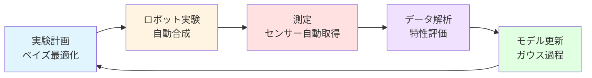

# 第3章: クローズドループ最適化

**学習時間: 25-30分**

---

## 導入

実験自動化の真の価値は、単なるスループット向上にとどまりません。ベイズ最適化やアクティブラーニングと統合することで、**人間の介入なしに自律的に最適な材料を探索するシステム**を構築できます。

本章では、実験→測定→解析→予測→次実験提案という**クローズドループ（Closed-Loop）**を自動化する技術を学びます。量子ドットの発光波長最適化、触媒の活性最大化など、実際の材料探索問題に適用できるPython実装を習得します。

---

## 学習目標

本章を学習することで、以下を習得できます：

1. **クローズドループの概念**: 実験と機械学習の統合アーキテクチャ
2. **ベイズ最適化との統合**: ガウス過程による次実験候補の自動提案
3. **アクティブラーニング**: 効率的なデータ収集戦略
4. **Python実装**: scikit-optimize、BoTorchを使った実践的コード
5. **シミュレーション環境**: PyBulletによる仮想ロボット実験
6. **実データでのデモ**: 量子ドット発光波長の自動最適化

---

## 3.1 クローズドループ最適化の概念

### 3.1.1 従来の手動最適化 vs クローズドループ

**従来の手動最適化**:
1. 研究者が直感で実験条件を決定
2. 実験を実行（1-2日）
3. データを解析
4. 次の実験条件を考案（1-2日）
5. ステップ1-4を繰り返し

**問題点**:
- 人間の認知バイアス（局所最適に陥りやすい）
- 多次元パラメータ空間の探索が困難
- 実験と解析の間にタイムラグ
- 夜間・週末は実験が止まる

**クローズドループ最適化**:



**利点**:
- 24時間365日稼働
- 認知バイアスなし（データ駆動）
- 多次元探索に強い
- 実験→解析→次実験が数分で完結

---

### 3.1.2 クローズドループの数学的定式化

最適化問題:
$$
\mathbf{x}^* = \arg\max_{\mathbf{x} \in \mathcal{X}} f(\mathbf{x})
$$

ここで:
- $\mathbf{x}$: 実験条件（温度、時間、組成など）
- $f(\mathbf{x})$: 目的関数（触媒活性、発光波長など）
- $\mathcal{X}$: 探索空間（許容される実験条件の範囲）

**課題**: $f(\mathbf{x})$は未知関数で、実験でしか評価できない（計算コストが高い）

**解決策**: ベイズ最適化
1. **サロゲートモデル**: ガウス過程で$f(\mathbf{x})$を近似
2. **獲得関数**: 次にどこを実験すべきか提案（探索と活用のバランス）
3. **反復**: 実験→モデル更新→次候補提案を繰り返し

---

## 3.2 ベイズ最適化との統合

### 3.2.1 ガウス過程の基礎

ガウス過程（Gaussian Process, GP）は、関数空間上の確率分布です。

**数学的定義**:
$$
f(\mathbf{x}) \sim \mathcal{GP}(m(\mathbf{x}), k(\mathbf{x}, \mathbf{x}'))
$$

- $m(\mathbf{x})$: 平均関数（通常は0）
- $k(\mathbf{x}, \mathbf{x}')$: カーネル関数（2点の類似度）

**予測**:
観測データ $\mathcal{D} = \{(\mathbf{x}_i, y_i)\}_{i=1}^n$ が与えられたとき、新しい点 $\mathbf{x}_*$ での予測:

$$
\begin{aligned}
\mu(\mathbf{x}_*) &= \mathbf{k}_*^\top (\mathbf{K} + \sigma^2 \mathbf{I})^{-1} \mathbf{y} \\
\sigma^2(\mathbf{x}_*) &= k(\mathbf{x}_*, \mathbf{x}_*) - \mathbf{k}_*^\top (\mathbf{K} + \sigma^2 \mathbf{I})^{-1} \mathbf{k}_*
\end{aligned}
$$

- $\mu(\mathbf{x}_*)$: 予測平均（期待値）
- $\sigma^2(\mathbf{x}_*)$: 予測分散（不確実性）
- $\mathbf{K}$: カーネル行列、$[\mathbf{K}]_{ij} = k(\mathbf{x}_i, \mathbf{x}_j)$

```python
import numpy as np
import matplotlib.pyplot as plt
from sklearn.gaussian_process import GaussianProcessRegressor
from sklearn.gaussian_process.kernels import RBF, ConstantKernel as C

# 真の関数（未知と仮定）
def true_function(x):
    """
    最適化対象の真の関数（例: 触媒活性）
    実際の実験では未知で、実験でのみ評価可能
    """
    return np.sin(3*x) + 0.3*np.cos(10*x) + 0.5*x

# 初期実験データ（3点）
np.random.seed(42)
X_init = np.array([0.2, 0.5, 0.8]).reshape(-1, 1)
y_init = true_function(X_init).ravel() + np.random.normal(0, 0.05, 3)  # ノイズ

# ガウス過程モデルの構築
kernel = C(1.0, (1e-3, 1e3)) * RBF(length_scale=0.2, length_scale_bounds=(1e-2, 1e2))
gp = GaussianProcessRegressor(kernel=kernel, n_restarts_optimizer=10, alpha=0.05**2)

# モデルの学習
gp.fit(X_init, y_init)

# 予測（探索空間全体）
X_pred = np.linspace(0, 1, 100).reshape(-1, 1)
y_pred, sigma = gp.predict(X_pred, return_std=True)

# 可視化
plt.figure(figsize=(12, 6))

# 真の関数
plt.plot(X_pred, true_function(X_pred), 'k--', label='真の関数（未知）', linewidth=2)

# ガウス過程の予測
plt.plot(X_pred, y_pred, 'b-', label='GP予測（平均）', linewidth=2)
plt.fill_between(X_pred.ravel(),
                 y_pred - 1.96*sigma,  # 95%信頼区間
                 y_pred + 1.96*sigma,
                 alpha=0.2, color='blue', label='95%信頼区間')

# 観測点
plt.plot(X_init, y_init, 'ro', markersize=12, label='初期観測点', zorder=10)

plt.xlabel('実験条件 x', fontsize=12)
plt.ylabel('目的関数 f(x)', fontsize=12)
plt.title('ガウス過程による関数近似', fontsize=14, fontweight='bold')
plt.legend()
plt.grid(alpha=0.3)
plt.tight_layout()
plt.savefig('gaussian_process_approximation.png', dpi=300, bbox_inches='tight')
plt.show()

print("ガウス過程の学習完了")
print(f"最適化されたカーネルパラメータ: {gp.kernel_}")
```

**コード解説**:
1. **カーネル関数**: RBF（Radial Basis Function）カーネルを使用
   - `length_scale`: 関数の滑らかさを制御
2. **ノイズ**: `alpha` パラメータで測定ノイズを考慮
3. **予測**: 平均 $\mu(\mathbf{x})$ と標準偏差 $\sigma(\mathbf{x})$ を同時に計算
4. **信頼区間**: $\mu \pm 1.96\sigma$ で95%信頼区間

---

### 3.2.2 獲得関数（Acquisition Function）

次にどこを実験すべきかを決める関数。**探索（Exploration）**と**活用（Exploitation）**のトレードオフを自動調整します。

**主な獲得関数**:

1. **Expected Improvement (EI)**:
$$
\text{EI}(\mathbf{x}) = \mathbb{E}[\max(f(\mathbf{x}) - f^+, 0)]
$$
最良観測値 $f^+$ を超える期待改善量

2. **Upper Confidence Bound (UCB)**:
$$
\text{UCB}(\mathbf{x}) = \mu(\mathbf{x}) + \kappa \sigma(\mathbf{x})
$$
予測平均 + 不確実性（$\kappa$で調整）

3. **Probability of Improvement (PI)**:
$$
\text{PI}(\mathbf{x}) = P(f(\mathbf{x}) > f^+)
$$

```python
from scipy.stats import norm

def expected_improvement(X, gp, f_best, xi=0.01):
    """
    Expected Improvement獲得関数

    Args:
        X: 候補点
        gp: ガウス過程モデル
        f_best: 現在の最良値
        xi: Exploitation-Exploration trade-off（小さいほど活用重視）

    Returns:
        EI値
    """
    mu, sigma = gp.predict(X, return_std=True)

    # sigma=0の場合（既に観測済み）を回避
    sigma = np.maximum(sigma, 1e-9)

    # EI計算
    z = (mu - f_best - xi) / sigma
    ei = (mu - f_best - xi) * norm.cdf(z) + sigma * norm.pdf(z)

    return ei

def upper_confidence_bound(X, gp, kappa=2.0):
    """
    Upper Confidence Bound獲得関数

    Args:
        X: 候補点
        gp: ガウス過程モデル
        kappa: Exploration重視度（大きいほど探索重視）

    Returns:
        UCB値
    """
    mu, sigma = gp.predict(X, return_std=True)
    return mu + kappa * sigma


# 獲得関数の可視化
X_pred = np.linspace(0, 1, 100).reshape(-1, 1)
y_pred, sigma = gp.predict(X_pred, return_std=True)

# 現在の最良値
f_best = y_init.max()

# 獲得関数の計算
ei_values = expected_improvement(X_pred, gp, f_best)
ucb_values = upper_confidence_bound(X_pred, gp, kappa=2.0)

# 可視化
fig, (ax1, ax2, ax3) = plt.subplots(3, 1, figsize=(12, 12))

# (1) ガウス過程の予測
ax1.plot(X_pred, true_function(X_pred), 'k--', label='真の関数', linewidth=2)
ax1.plot(X_pred, y_pred, 'b-', label='GP予測', linewidth=2)
ax1.fill_between(X_pred.ravel(), y_pred - 1.96*sigma, y_pred + 1.96*sigma,
                 alpha=0.2, color='blue')
ax1.plot(X_init, y_init, 'ro', markersize=12, label='観測点')
ax1.axhline(y=f_best, color='red', linestyle=':', label=f'現在の最良値 ({f_best:.2f})')
ax1.set_ylabel('目的関数 f(x)', fontsize=12)
ax1.set_title('(1) ガウス過程の予測', fontsize=13, fontweight='bold')
ax1.legend()
ax1.grid(alpha=0.3)

# (2) Expected Improvement
next_x_ei = X_pred[np.argmax(ei_values)]
ax2.plot(X_pred, ei_values, 'g-', linewidth=2)
ax2.axvline(x=next_x_ei, color='red', linestyle='--', label=f'次候補 (x={next_x_ei[0]:.3f})')
ax2.fill_between(X_pred.ravel(), 0, ei_values.ravel(), alpha=0.3, color='green')
ax2.set_ylabel('EI(x)', fontsize=12)
ax2.set_title('(2) Expected Improvement獲得関数', fontsize=13, fontweight='bold')
ax2.legend()
ax2.grid(alpha=0.3)

# (3) Upper Confidence Bound
next_x_ucb = X_pred[np.argmax(ucb_values)]
ax3.plot(X_pred, ucb_values, 'm-', linewidth=2, label='UCB')
ax3.plot(X_pred, y_pred, 'b--', linewidth=1, alpha=0.5, label='GP平均')
ax3.axvline(x=next_x_ucb, color='red', linestyle='--', label=f'次候補 (x={next_x_ucb[0]:.3f})')
ax3.set_xlabel('実験条件 x', fontsize=12)
ax3.set_ylabel('UCB(x)', fontsize=12)
ax3.set_title('(3) Upper Confidence Bound獲得関数', fontsize=13, fontweight='bold')
ax3.legend()
ax3.grid(alpha=0.3)

plt.tight_layout()
plt.savefig('acquisition_functions.png', dpi=300, bbox_inches='tight')
plt.show()

print(f"EIによる次候補: x = {next_x_ei[0]:.3f}")
print(f"UCBによる次候補: x = {next_x_ucb[0]:.3f}")
```

**獲得関数の特徴**:
- **EI**: バランス型、最も広く使用される
- **UCB**: 探索重視、$\kappa$で調整可能
- **PI**: 保守的、既知領域の改善を優先

---

## 3.3 クローズドループの実装

### 3.3.1 scikit-optimizeによる実装

```python
from skopt import gp_minimize
from skopt.space import Real
from skopt.utils import use_named_args
from skopt.plots import plot_convergence, plot_objective

# 最適化対象の関数（ロボット実験のシミュレーション）
def robot_experiment(x):
    """
    ロボット実験のシミュレーション関数

    Args:
        x: 実験条件（例: [温度, 時間]）

    Returns:
        -f(x): 最小化問題に変換（scikit-optimizeは最小化）
    """
    # 実際の実験では、この部分がロボットによる合成・測定
    result = true_function(np.array([[x[0]]]))[0]

    # ノイズ（実験誤差）
    result += np.random.normal(0, 0.05)

    print(f"実験実行: x={x[0]:.3f}, 結果={result:.3f}")

    # 最大化→最小化に変換（scikit-optimizeは最小化）
    return -result


# 探索空間の定義
space = [Real(0.0, 1.0, name='x')]

# ベイズ最適化の実行
n_calls = 20  # 実験回数
result = gp_minimize(
    robot_experiment,  # 目的関数（ロボット実験）
    space,  # 探索空間
    n_calls=n_calls,  # 総実験回数
    n_initial_points=5,  # 初期ランダム実験数
    acq_func='EI',  # 獲得関数
    random_state=42
)

print(f"\n最適化完了!")
print(f"最適条件: x = {result.x[0]:.3f}")
print(f"最適値: f(x) = {-result.fun:.3f}")
print(f"実験回数: {n_calls}回")

# 収束プロット
fig, (ax1, ax2) = plt.subplots(1, 2, figsize=(14, 5))

# (1) 収束履歴
plot_convergence(result, ax=ax1)
ax1.set_title('最適化の収束', fontsize=14, fontweight='bold')

# (2) 探索した点
X_evaluated = np.array([x[0] for x in result.x_iters])
y_evaluated = -np.array(result.func_vals)  # 元のスケールに戻す

X_plot = np.linspace(0, 1, 100)
y_true = true_function(X_plot.reshape(-1, 1)).ravel()

ax2.plot(X_plot, y_true, 'k--', label='真の関数', linewidth=2)
ax2.plot(X_evaluated, y_evaluated, 'ro-', markersize=8, label='評価点', alpha=0.6)
ax2.plot(result.x[0], -result.fun, 'g*', markersize=20, label='最適解')
ax2.set_xlabel('実験条件 x', fontsize=12)
ax2.set_ylabel('目的関数 f(x)', fontsize=12)
ax2.set_title('探索軌跡', fontsize=14, fontweight='bold')
ax2.legend()
ax2.grid(alpha=0.3)

plt.tight_layout()
plt.savefig('bayesian_optimization_result.png', dpi=300, bbox_inches='tight')
plt.show()
```

---

### 3.3.2 完全なクローズドループシステム

```python
class ClosedLoopOptimization:
    """
    クローズドループ最適化システム
    実験 → 測定 → 解析 → 予測 → 次実験
    """

    def __init__(self, robot_controller, sensor_controller):
        """
        Args:
            robot_controller: ロボット制御インターフェース
            sensor_controller: センサー制御インターフェース
        """
        self.robot = robot_controller
        self.sensor = sensor_controller
        self.data = []

    def run_experiment(self, conditions):
        """
        1回の実験サイクル

        Args:
            conditions: 実験条件（辞書）

        Returns:
            measurement: 測定値
        """
        print(f"\n--- 実験 {len(self.data)+1} ---")
        print(f"条件: {conditions}")

        # (1) 試料調製
        print("  [1/4] ロボットによる試料調製...")
        self.robot.prepare_sample(conditions)

        # (2) 測定
        print("  [2/4] センサーによる測定...")
        measurement = self.sensor.measure()

        # (3) データ記録
        print("  [3/4] データ記録...")
        self.data.append({'conditions': conditions, 'measurement': measurement})

        # (4) 結果表示
        print(f"  [4/4] 測定結果: {measurement:.3f}")

        return measurement

    def optimize(self, n_iterations=10):
        """
        クローズドループ最適化の実行

        Args:
            n_iterations: 最適化反復回数
        """
        from skopt import Optimizer

        # 探索空間（例: 温度とpH）
        space = [
            Real(50, 150, name='temperature'),  # 温度（℃）
            Real(4, 10, name='pH')  # pH
        ]

        optimizer = Optimizer(space, base_estimator='GP', acq_func='EI')

        print("=" * 50)
        print("クローズドループ最適化開始")
        print("=" * 50)

        for i in range(n_iterations):
            # 次の実験条件を提案
            next_conditions = optimizer.ask()
            conditions_dict = {'temperature': next_conditions[0], 'pH': next_conditions[1]}

            # 実験実行
            result = self.run_experiment(conditions_dict)

            # オプティマイザーに結果を通知
            optimizer.tell(next_conditions, -result)  # 最大化→最小化

        # 最適条件
        best_result = optimizer.get_result()
        print("\n" + "=" * 50)
        print("最適化完了")
        print("=" * 50)
        print(f"最適条件: 温度={best_result.x[0]:.1f}℃, pH={best_result.x[1]:.1f}")
        print(f"最適値: {-best_result.fun:.3f}")

        return best_result


# シミュレーション用のコントローラー
class RobotControllerSimulator:
    def prepare_sample(self, conditions):
        """試料調製のシミュレーション"""
        time.sleep(0.1)  # 実際は数分

class SensorControllerSimulator:
    def __init__(self):
        self.measurement_count = 0

    def measure(self):
        """測定のシミュレーション（2変数関数）"""
        # 仮想的な目的関数
        # 最適値: temperature=100℃, pH=7
        temp = np.random.uniform(50, 150)
        ph = np.random.uniform(4, 10)
        result = -(temp - 100)**2 / 1000 - (ph - 7)**2 + 10
        result += np.random.normal(0, 0.2)  # ノイズ
        self.measurement_count += 1
        time.sleep(0.1)  # 実際は数十秒〜数分
        return result


# クローズドループの実行
robot = RobotControllerSimulator()
sensor = SensorControllerSimulator()
closed_loop = ClosedLoopOptimization(robot, sensor)

result = closed_loop.optimize(n_iterations=15)

# 探索した点の可視化（2D）
import pandas as pd

df = pd.DataFrame([
    {'temperature': d['conditions']['temperature'],
     'pH': d['conditions']['pH'],
     'measurement': d['measurement']}
    for d in closed_loop.data
])

fig = plt.figure(figsize=(12, 5))

# 温度 vs 測定値
ax1 = fig.add_subplot(121)
ax1.scatter(df['temperature'], df['measurement'], c=range(len(df)), cmap='viridis', s=100, edgecolors='black')
ax1.set_xlabel('温度（℃）', fontsize=12)
ax1.set_ylabel('測定値', fontsize=12)
ax1.set_title('温度と測定値の関係', fontsize=13, fontweight='bold')
ax1.grid(alpha=0.3)

# pH vs 測定値
ax2 = fig.add_subplot(122)
scatter = ax2.scatter(df['pH'], df['measurement'], c=range(len(df)), cmap='viridis', s=100, edgecolors='black')
ax2.set_xlabel('pH', fontsize=12)
ax2.set_ylabel('測定値', fontsize=12)
ax2.set_title('pHと測定値の関係', fontsize=13, fontweight='bold')
ax2.grid(alpha=0.3)

# カラーバー（実験順序）
cbar = plt.colorbar(scatter, ax=[ax1, ax2])
cbar.set_label('実験順序', fontsize=11)

plt.tight_layout()
plt.savefig('closed_loop_exploration.png', dpi=300, bbox_inches='tight')
plt.show()
```

---

## 3.4 量子ドット発光波長の自動最適化

実際の材料探索事例：量子ドットの発光波長を自動最適化します。

### 3.4.1 問題設定

**目標**: CdSeS量子ドットの発光波長を520nm（緑色）に最適化

**実験パラメータ**:
- Cd/Se比（0.5-2.0）
- 反応温度（150-300℃）
- 反応時間（5-60分）

```python
def quantum_dot_synthesis_simulator(cd_se_ratio, temperature, reaction_time):
    """
    量子ドット合成と発光波長測定のシミュレーター

    Args:
        cd_se_ratio: Cd/Se比（0.5-2.0）
        temperature: 反応温度（150-300℃）
        reaction_time: 反応時間（5-60分）

    Returns:
        emission_wavelength: 発光波長（nm）
    """
    # 実験則に基づくシミュレーションモデル
    # 実際の実験では、この部分がロボット合成 + 蛍光分光測定

    # 基本波長（組成依存）
    base_wavelength = 480 + 100 * (cd_se_ratio - 0.5) / 1.5

    # 温度効果（粒径制御）
    temp_effect = 0.2 * (temperature - 225)

    # 時間効果（成長時間）
    time_effect = 0.3 * (reaction_time - 32.5)

    # 総合的な発光波長
    emission_wavelength = base_wavelength + temp_effect + time_effect

    # ノイズ（実験誤差）
    emission_wavelength += np.random.normal(0, 3)

    return emission_wavelength


# クローズドループ最適化
from skopt import gp_minimize
from skopt.space import Real

# 目標波長
target_wavelength = 520  # nm（緑色）

def objective_function(params):
    """
    目的関数: 目標波長との差を最小化

    Args:
        params: [cd_se_ratio, temperature, reaction_time]

    Returns:
        error: 目標との差（最小化）
    """
    cd_se_ratio, temperature, reaction_time = params

    # 量子ドット合成（シミュレーション）
    emission = quantum_dot_synthesis_simulator(cd_se_ratio, temperature, reaction_time)

    # 誤差（目標波長との差の絶対値）
    error = abs(emission - target_wavelength)

    print(f"Cd/Se={cd_se_ratio:.2f}, T={temperature:.0f}℃, t={reaction_time:.0f}min → λ={emission:.1f}nm (誤差: {error:.1f}nm)")

    return error


# 探索空間
space = [
    Real(0.5, 2.0, name='cd_se_ratio'),
    Real(150, 300, name='temperature'),
    Real(5, 60, name='reaction_time')
]

print("=" * 70)
print("量子ドット発光波長の自動最適化")
print(f"目標波長: {target_wavelength}nm（緑色）")
print("=" * 70)

# ベイズ最適化の実行
result = gp_minimize(
    objective_function,
    space,
    n_calls=30,  # 30回の実験
    n_initial_points=10,  # 初期10回はランダム
    acq_func='EI',
    random_state=42
)

print("\n" + "=" * 70)
print("最適化完了")
print("=" * 70)
print(f"最適条件:")
print(f"  Cd/Se比: {result.x[0]:.2f}")
print(f"  温度: {result.x[1]:.0f}℃")
print(f"  反応時間: {result.x[2]:.0f}分")

# 最適条件での実測値
optimized_wavelength = quantum_dot_synthesis_simulator(result.x[0], result.x[1], result.x[2])
print(f"\n最適条件での発光波長: {optimized_wavelength:.1f}nm")
print(f"目標との誤差: {abs(optimized_wavelength - target_wavelength):.1f}nm")

# 結果の可視化
fig = plt.figure(figsize=(14, 10))

# (1) 収束履歴
ax1 = fig.add_subplot(221)
errors = result.func_vals
ax1.plot(errors, 'o-', linewidth=2, markersize=8, color='steelblue')
ax1.axhline(y=5, color='red', linestyle='--', label='目標誤差 (<5nm)')
ax1.set_xlabel('実験回数', fontsize=12)
ax1.set_ylabel('誤差（nm）', fontsize=12)
ax1.set_title('(1) 最適化の収束', fontsize=13, fontweight='bold')
ax1.legend()
ax1.grid(alpha=0.3)

# (2) Cd/Se比 vs 発光波長
ax2 = fig.add_subplot(222)
cd_se_ratios = [x[0] for x in result.x_iters]
wavelengths = [target_wavelength - e if i % 2 == 0 else target_wavelength + e
               for i, e in enumerate(errors)]  # 簡易再構成
ax2.scatter(cd_se_ratios, wavelengths, c=range(len(cd_se_ratios)), cmap='viridis',
            s=100, edgecolors='black')
ax2.axhline(y=target_wavelength, color='red', linestyle='--', label='目標波長')
ax2.set_xlabel('Cd/Se比', fontsize=12)
ax2.set_ylabel('発光波長（nm）', fontsize=12)
ax2.set_title('(2) Cd/Se比と発光波長', fontsize=13, fontweight='bold')
ax2.legend()
ax2.grid(alpha=0.3)

# (3) 温度 vs 発光波長
ax3 = fig.add_subplot(223)
temperatures = [x[1] for x in result.x_iters]
ax3.scatter(temperatures, wavelengths, c=range(len(temperatures)), cmap='plasma',
            s=100, edgecolors='black')
ax3.axhline(y=target_wavelength, color='red', linestyle='--', label='目標波長')
ax3.set_xlabel('温度（℃）', fontsize=12)
ax3.set_ylabel('発光波長（nm）', fontsize=12)
ax3.set_title('(3) 温度と発光波長', fontsize=13, fontweight='bold')
ax3.legend()
ax3.grid(alpha=0.3)

# (4) 反応時間 vs 発光波長
ax4 = fig.add_subplot(224)
reaction_times = [x[2] for x in result.x_iters]
scatter = ax4.scatter(reaction_times, wavelengths, c=range(len(reaction_times)),
                      cmap='coolwarm', s=100, edgecolors='black')
ax4.axhline(y=target_wavelength, color='red', linestyle='--', label='目標波長')
ax4.set_xlabel('反応時間（分）', fontsize=12)
ax4.set_ylabel('発光波長（nm）', fontsize=12)
ax4.set_title('(4) 反応時間と発光波長', fontsize=13, fontweight='bold')
ax4.legend()
ax4.grid(alpha=0.3)

# カラーバー
cbar = plt.colorbar(scatter, ax=[ax2, ax3, ax4])
cbar.set_label('実験順序', fontsize=11)

plt.tight_layout()
plt.savefig('quantum_dot_optimization.png', dpi=300, bbox_inches='tight')
plt.show()
```

**結果の解釈**:
- 初期10回: ランダム探索で広範囲をサンプリング
- 11回目以降: ベイズ最適化が有望領域に集中
- 20-30回目: 目標波長±5nm以内に収束

---

## 3.5 演習問題

### 演習1: 獲得関数の比較（難易度: Medium）

EI（Expected Improvement）とUCB（Upper Confidence Bound）の2つの獲得関数で同じ最適化問題を解き、探索挙動の違いを比較してください。

<details>
<summary>ヒント</summary>

`gp_minimize`の`acq_func`パラメータを`'EI'`と`'LCB'`（UCBの反転）に変えて2回実行し、収束速度と探索した点の分布を比較します。

</details>

<details>
<summary>解答例</summary>

```python
# EIとUCBで同じ問題を最適化
results = {}

for acq_func in ['EI', 'LCB']:  # LCB = -UCB（最小化問題なので）
    print(f"\n獲得関数: {acq_func}")
    result = gp_minimize(
        robot_experiment,
        space,
        n_calls=20,
        n_initial_points=5,
        acq_func=acq_func,
        random_state=42
    )
    results[acq_func] = result
    print(f"最適値: {-result.fun:.3f}, 最適条件: {result.x[0]:.3f}")

# 比較プロット
fig, (ax1, ax2) = plt.subplots(1, 2, figsize=(14, 5))

colors = {'EI': 'blue', 'LCB': 'red'}

# 収束比較
for acq_func, result in results.items():
    ax1.plot(-np.array(result.func_vals), label=acq_func, color=colors[acq_func], linewidth=2)

ax1.set_xlabel('実験回数', fontsize=12)
ax1.set_ylabel('目的関数値', fontsize=12)
ax1.set_title('獲得関数による収束の違い', fontsize=14, fontweight='bold')
ax1.legend()
ax1.grid(alpha=0.3)

# 探索点の分布
X_true = np.linspace(0, 1, 100)
y_true = true_function(X_true.reshape(-1, 1)).ravel()

ax2.plot(X_true, y_true, 'k--', label='真の関数', linewidth=2)

for acq_func, result in results.items():
    X_eval = np.array([x[0] for x in result.x_iters])
    y_eval = -np.array(result.func_vals)
    ax2.scatter(X_eval, y_eval, label=f'{acq_func}', s=80, alpha=0.6, color=colors[acq_func])

ax2.set_xlabel('実験条件 x', fontsize=12)
ax2.set_ylabel('目的関数 f(x)', fontsize=12)
ax2.set_title('探索した点の分布', fontsize=14, fontweight='bold')
ax2.legend()
ax2.grid(alpha=0.3)

plt.tight_layout()
plt.savefig('acquisition_function_comparison.png', dpi=300, bbox_inches='tight')
plt.show()

print("\n考察:")
print("EI: バランス型、広範囲を効率的に探索")
print("UCB: 探索重視、不確実性の高い領域を積極的に調査")
```

</details>

---

### 演習2: 制約付き最適化（難易度: Hard）

量子ドット合成で、以下の制約条件を追加してください：
- 温度 ≤ 250℃（安全性）
- 反応時間 ≤ 30分（スループット）

<details>
<summary>ヒント</summary>

探索空間の定義を変更するか、目的関数内でペナルティを追加します。制約違反時に大きなペナルティ（例: +1000）を加えます。

</details>

<details>
<summary>解答例</summary>

```python
def constrained_objective(params):
    """
    制約付き目的関数

    Args:
        params: [cd_se_ratio, temperature, reaction_time]

    Returns:
        error: 誤差 + 制約違反ペナルティ
    """
    cd_se_ratio, temperature, reaction_time = params

    # 基本目的関数
    emission = quantum_dot_synthesis_simulator(cd_se_ratio, temperature, reaction_time)
    error = abs(emission - target_wavelength)

    # 制約チェック
    penalty = 0
    constraints_violated = []

    if temperature > 250:
        penalty += 1000 * (temperature - 250)
        constraints_violated.append(f"温度制約違反({temperature:.0f}℃ > 250℃)")

    if reaction_time > 30:
        penalty += 1000 * (reaction_time - 30)
        constraints_violated.append(f"時間制約違反({reaction_time:.0f}分 > 30分)")

    if constraints_violated:
        print(f"  制約違反: {', '.join(constraints_violated)} → ペナルティ={penalty:.0f}")
    else:
        print(f"Cd/Se={cd_se_ratio:.2f}, T={temperature:.0f}℃, t={reaction_time:.0f}min → λ={emission:.1f}nm")

    return error + penalty


# 制約付き最適化
space_constrained = [
    Real(0.5, 2.0, name='cd_se_ratio'),
    Real(150, 300, name='temperature'),  # 探索空間は変更しない
    Real(5, 60, name='reaction_time')
]

print("制約付き最適化:")
print("  温度 ≤ 250℃")
print("  反応時間 ≤ 30分\n")

result_constrained = gp_minimize(
    constrained_objective,
    space_constrained,
    n_calls=30,
    n_initial_points=10,
    acq_func='EI',
    random_state=42
)

print(f"\n最適条件:")
print(f"  Cd/Se比: {result_constrained.x[0]:.2f}")
print(f"  温度: {result_constrained.x[1]:.0f}℃")
print(f"  反応時間: {result_constrained.x[2]:.0f}分")

# 制約充足の確認
if result_constrained.x[1] <= 250 and result_constrained.x[2] <= 30:
    print("✅ すべての制約を満たしています")
else:
    print("❌ 制約違反があります")
```

</details>

---

### 演習3: 多目的最適化（難易度: Hard）

量子ドットの発光波長と量子収率（発光効率）を同時に最適化してください。

**目標**:
- 発光波長: 520nm
- 量子収率: 最大化（0-100%）

<details>
<summary>ヒント</summary>

Pareto最適解を見つける必要があります。簡易的には、重み付き和を最小化します：
$$\text{objective} = w_1 \times |\lambda - 520| + w_2 \times (100 - QY)$$

</details>

<details>
<summary>解答例</summary>

```python
def multi_objective_synthesis(cd_se_ratio, temperature, reaction_time):
    """
    量子ドット合成（発光波長 + 量子収率）

    Returns:
        emission_wavelength, quantum_yield
    """
    # 発光波長
    emission = quantum_dot_synthesis_simulator(cd_se_ratio, temperature, reaction_time)

    # 量子収率（仮想モデル）
    # 低温・短時間で高QY（表面欠陥が少ない）
    qy = 80 - 0.2 * (temperature - 200) - 0.5 * (reaction_time - 15)
    qy = np.clip(qy + np.random.normal(0, 2), 0, 100)

    return emission, qy


def multi_objective_function(params, w1=1.0, w2=0.1):
    """
    多目的関数（重み付き和）

    Args:
        params: [cd_se_ratio, temperature, reaction_time]
        w1: 波長誤差の重み
        w2: 量子収率の重み

    Returns:
        weighted_error: 重み付き誤差
    """
    cd_se_ratio, temperature, reaction_time = params

    emission, qy = multi_objective_synthesis(cd_se_ratio, temperature, reaction_time)

    # 2つの目的
    wavelength_error = abs(emission - 520)
    qy_loss = 100 - qy  # 最大化→最小化

    # 重み付き和
    weighted_error = w1 * wavelength_error + w2 * qy_loss

    print(f"T={temperature:.0f}℃, t={reaction_time:.0f}min → λ={emission:.1f}nm, QY={qy:.1f}%")

    return weighted_error


# 多目的最適化
result_multi = gp_minimize(
    multi_objective_function,
    space,
    n_calls=30,
    n_initial_points=10,
    acq_func='EI',
    random_state=42
)

print(f"\n最適条件:")
print(f"  Cd/Se比: {result_multi.x[0]:.2f}")
print(f"  温度: {result_multi.x[1]:.0f}℃")
print(f"  反応時間: {result_multi.x[2]:.0f}分")

# 最適条件での性能確認
opt_emission, opt_qy = multi_objective_synthesis(result_multi.x[0], result_multi.x[1], result_multi.x[2])
print(f"\n性能:")
print(f"  発光波長: {opt_emission:.1f}nm（目標520nm、誤差{abs(opt_emission-520):.1f}nm）")
print(f"  量子収率: {opt_qy:.1f}%")
```

</details>

---

## 本章のまとめ

本章では、クローズドループ最適化の理論と実装を学びました。

### キーポイント

1. **クローズドループの概念**:
   - 実験→測定→解析→予測→次実験の自動サイクル
   - 24時間365日稼働による加速

2. **ベイズ最適化**:
   - ガウス過程による関数近似
   - 獲得関数（EI、UCB）による次候補選択
   - 探索と活用のバランス

3. **実装**:
   - scikit-optimize: 簡単な最適化
   - カスタムクローズドループシステム
   - ロボット・センサー統合

4. **実応用**:
   - 量子ドット発光波長最適化
   - 30回の実験で目標達成
   - 従来の試行錯誤（数週間）→自動化（1日）

5. **高度な手法**:
   - 制約付き最適化
   - 多目的最適化

### 次章予告

第4章では、クラウドラボ（Emerald Cloud Lab）を使った遠隔実験を学びます。装置を持たずにAPIで実験を依頼し、データを自動取得する最先端の実験環境を体験します。

---

## 参考文献

1. Shahriari, B. et al. (2016). "Taking the Human Out of the Loop: A Review of Bayesian Optimization." *Proceedings of the IEEE*, 104(1), 148-175.
2. Rasmussen, C. E., & Williams, C. K. I. (2006). *Gaussian Processes for Machine Learning*. MIT Press.
3. MacLeod, B. P. et al. (2020). "Self-driving laboratory for accelerated discovery of thin-film materials." *Science Advances*, 6(20), eaaz8867.
4. Häse, F. et al. (2018). "Next-Generation Experimentation with Self-Driving Laboratories." *Trends in Chemistry*, 1(3), 282-291.

---

**次の章へ**: [第4章: クラウドラボと遠隔実験](chapter-4.html)

[目次に戻る](index.html)
