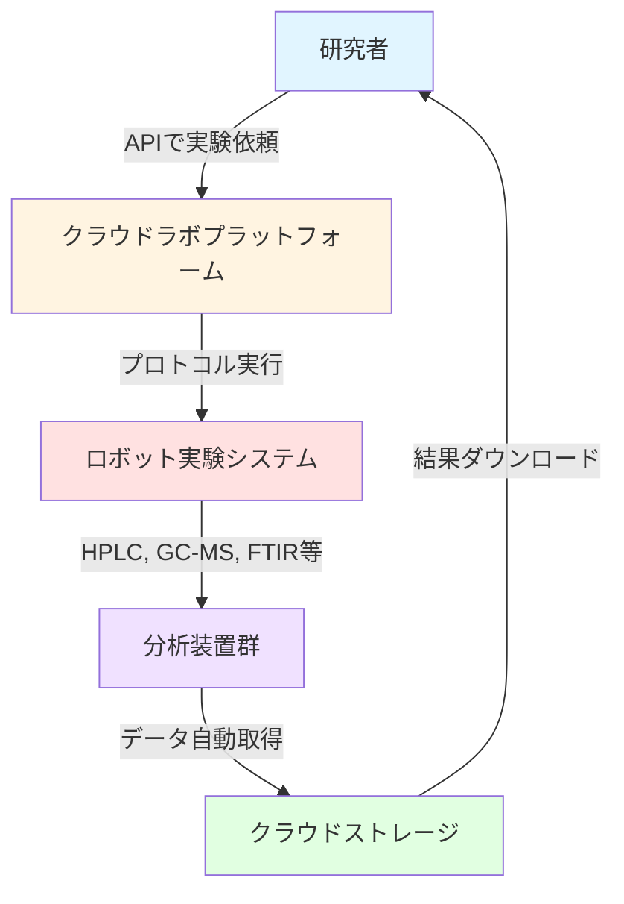

# 第4章: クラウドラボと遠隔実験

**学習時間: 20-25分**

---

## 導入

実験装置を購入・維持するには、数百万円から数億円のコストと専門知識が必要です。しかし、**クラウドラボ（Cloud Laboratory）**を使えば、初期投資ゼロで世界最先端の装置を使った実験が可能になります。

本章では、Emerald Cloud Lab（ECL）を中心に、クラウドラボの仕組み、APIを使った実験依頼、データ自動取得、コスト効率分析を学びます。プログラムコードで実験を記述し、遠隔で実行する新しい研究スタイルを体験します。

---

## 学習目標

本章を学習することで、以下を習得できます：

1. **クラウドラボの概念**: プラットフォームの仕組みとビジネスモデル
2. **Emerald Cloud Labの使い方**: アカウント作成、実験依頼、データ取得
3. **APIプログラミング**: REST API、Python SDKによる実験自動化
4. **プロトコル記述**: 実験手順のコード化
5. **コスト効率評価**: 従来研究室 vs クラウドラボの定量比較
6. **リモート実験の利点**: 装置共有、専門技術者サポート、スケーラビリティ

---

## 4.1 クラウドラボとは

### 4.1.1 クラウドラボの基本概念

クラウドラボは、**実験装置とロボティクスをクラウドサービス化**したプラットフォームです。



**主な特徴**:
- **初期投資ゼロ**: 装置購入不要、従量課金制
- **専門技術者**: 装置メンテナンス・品質管理はプロバイダーが担当
- **装置共有**: 1台の装置を複数の研究者で共有
- **スケーラビリティ**: 必要に応じて実験規模を拡大
- **リモートアクセス**: 世界中どこからでも実験可能

---

### 4.1.2 主要なクラウドラボプラットフォーム

| プラットフォーム | 特徴 | 対象分野 | 価格帯 |
|--------------|------|---------|-------|
| **Emerald Cloud Lab** | 200種類以上の装置、Python SDK | 生命科学、化学、材料 | 従量課金 |
| **Strateos** | ライフサイエンス特化、自動化度高 | 創薬、バイオ | 高価格帯 |
| **Synthace（Antha）** | バイオプロセス設計プラットフォーム | 合成生物学 | サブスクリプション |
| **Transcriptic** | Strateosに統合 | バイオ | - |

本章では、**Emerald Cloud Lab（ECL）**を中心に解説します。

---

## 4.2 Emerald Cloud Labの概要

### 4.2.1 利用可能な装置

ECLで使用できる主な装置:

**液体ハンドリング**:
- Hamilton STAR: 高精度自動分注
- Beckman Biomek: マイクロプレート処理
- OpenTrons OT-2: 汎用液体ハンドリング

**分析装置**:
- HPLC（高速液体クロマトグラフィー）
- GC-MS（ガスクロマトグラフィー質量分析）
- LC-MS（液体クロマトグラフィー質量分析）
- FTIR（フーリエ変換赤外分光）
- UV-Vis分光光度計
- 蛍光分光計
- NMR（核磁気共鳴分光）

**その他**:
- フローサイトメーター
- プレートリーダー
- 遠心分離機
- サーマルサイクラー（PCR）
- インキュベーター

```python
# Emerald Cloud Labで利用可能な装置の例示
import pandas as pd

ecl_instruments = [
    {'カテゴリ': '液体ハンドリング', '装置名': 'Hamilton STAR', '用途': '自動分注、段階希釈'},
    {'カテゴリ': '液体ハンドリング', '装置名': 'OpenTrons OT-2', '用途': '汎用ピペッティング'},
    {'カテゴリ': 'クロマトグラフィー', '装置名': 'Agilent HPLC', '用途': '化合物分離・定量'},
    {'カテゴリ': '質量分析', '装置名': 'Thermo GC-MS', '用途': '揮発性化合物分析'},
    {'カテゴリ': '質量分析', '装置名': 'Agilent LC-MS', '用途': '生体分子分析'},
    {'カテゴリ': '分光', '装置名': 'Agilent UV-Vis', '用途': '吸収スペクトル測定'},
    {'カテゴリ': '分光', '装置名': 'Molecular Devices', '用途': '蛍光・発光測定'},
    {'カテゴリ': 'NMR', '装置名': 'Bruker 400MHz', '用途': '構造解析'},
]

df_instruments = pd.DataFrame(ecl_instruments)
print("Emerald Cloud Lab 利用可能装置の例:")
print(df_instruments.to_string(index=False))

# 装置カテゴリ別の集計
print(f"\n装置カテゴリ別の数:")
print(df_instruments['カテゴリ'].value_counts())
```

---

### 4.2.2 アカウント作成とアクセス

**ステップ1: アカウント登録**
```
1. https://www.emeraldcloudlab.com/ にアクセス
2. "Request Access" から申請フォーム記入
3. 所属機関、研究目的を記載
4. 承認（通常1-2営業日）
```

**ステップ2: APIキーの取得**
```python
# ECL Python SDKのインストール（実際の手順）
# pip install emerald-cloud-lab

# APIキーの設定（環境変数）
import os

# 実際のAPIキーは環境変数または設定ファイルで管理
ECL_API_KEY = os.environ.get('ECL_API_KEY', 'your_api_key_here')
ECL_PROJECT_ID = os.environ.get('ECL_PROJECT_ID', 'your_project_id')

print("ECL接続設定:")
print(f"  APIキー: {'*' * 20}{ECL_API_KEY[-5:]}")
print(f"  プロジェクトID: {ECL_PROJECT_ID}")
```

---

## 4.3 APIによる実験依頼

### 4.3.1 基本的な実験プロトコル

ECLでは、Pythonコードで実験プロトコルを記述します。

```python
# Emerald Cloud Lab Python SDK（疑似コード、実際のAPIに近い形式）

class ECLExperiment:
    """
    ECL実験プロトコルのシミュレーター
    実際のECL SDKのインターフェースを模擬
    """

    def __init__(self, experiment_name, project_id):
        self.experiment_name = experiment_name
        self.project_id = project_id
        self.protocol = []

    def add_reagent(self, name, volume, concentration):
        """試薬を追加"""
        self.protocol.append({
            'action': 'add_reagent',
            'name': name,
            'volume': volume,
            'concentration': concentration
        })
        print(f"試薬追加: {name} {volume} µL ({concentration} M)")

    def mix(self, duration, speed):
        """混合"""
        self.protocol.append({
            'action': 'mix',
            'duration': duration,
            'speed': speed
        })
        print(f"混合: {duration}秒, {speed} rpm")

    def incubate(self, temperature, duration):
        """インキュベーション"""
        self.protocol.append({
            'action': 'incubate',
            'temperature': temperature,
            'duration': duration
        })
        print(f"インキュベーション: {temperature}℃, {duration}分")

    def measure_absorbance(self, wavelength):
        """吸光度測定"""
        self.protocol.append({
            'action': 'measure_absorbance',
            'wavelength': wavelength
        })
        print(f"吸光度測定: {wavelength} nm")

    def submit(self):
        """実験を送信"""
        print(f"\n実験プロトコル送信: {self.experiment_name}")
        print(f"  プロジェクトID: {self.project_id}")
        print(f"  ステップ数: {len(self.protocol)}")
        print("  状態: 送信完了、実行待ち...")

        # 実際のECLではAPIリクエストを送信
        return {'experiment_id': 'exp_12345', 'status': 'queued'}


# 使用例: 簡単な酵素反応アッセイ
experiment = ECLExperiment(
    experiment_name='Enzyme Activity Assay',
    project_id='project_001'
)

# プロトコルの記述
print("=== 実験プロトコル作成 ===\n")

# 基質を添加
experiment.add_reagent('Substrate A', volume=100, concentration=0.1)

# 酵素を添加
experiment.add_reagent('Enzyme', volume=10, concentration=0.01)

# 混合
experiment.mix(duration=10, speed=300)

# 室温でインキュベーション
experiment.incubate(temperature=25, duration=30)

# 吸光度測定
experiment.measure_absorbance(wavelength=450)

# 実験を送信
result = experiment.submit()

print(f"\n実験ID: {result['experiment_id']}")
print(f"状態: {result['status']}")
```

---

### 4.3.2 高度なプロトコル: 96ウェルプレートスクリーニング

```python
def create_96well_screening_protocol(compound_list, concentrations):
    """
    96ウェルプレートでの化合物スクリーニングプロトコル

    Args:
        compound_list: 化合物リスト
        concentrations: 各化合物の濃度リスト

    Returns:
        プロトコル辞書
    """
    protocol = {
        'experiment_name': '96ウェル化合物スクリーニング',
        'plate_type': 'corning_96_wellplate_360ul_flat',
        'steps': []
    }

    # ステップ1: 基質を全ウェルに分注
    protocol['steps'].append({
        'action': 'dispense',
        'reagent': 'substrate_buffer',
        'destination': 'all_wells',
        'volume': 100  # µL
    })

    # ステップ2: 化合物を各ウェルに分注
    for i, (compound, conc) in enumerate(zip(compound_list, concentrations)):
        row = i // 12  # A-H (0-7)
        col = i % 12 + 1  # 1-12

        well = f"{chr(65 + row)}{col}"  # A1, A2, ..., H12

        protocol['steps'].append({
            'action': 'dispense',
            'reagent': compound,
            'destination': well,
            'volume': 10,  # µL
            'concentration': conc
        })

    # ステップ3: インキュベーション
    protocol['steps'].append({
        'action': 'incubate',
        'temperature': 37,  # ℃
        'duration': 60  # 分
    })

    # ステップ4: プレートリーダーで測定
    protocol['steps'].append({
        'action': 'plate_reader',
        'measurement_type': 'absorbance',
        'wavelength': 450,  # nm
        'read_all_wells': True
    })

    return protocol


# プロトコル作成例
compounds = [f'Compound_{i:02d}' for i in range(1, 97)]  # 96化合物
concentrations = [10**(-i/12) for i in range(96)]  # 濃度勾配（10^0 → 10^-8 M）

protocol_96well = create_96well_screening_protocol(compounds, concentrations)

print("96ウェルスクリーニングプロトコル:")
print(f"  実験名: {protocol_96well['experiment_name']}")
print(f"  プレートタイプ: {protocol_96well['plate_type']}")
print(f"  ステップ数: {len(protocol_96well['steps'])}")
print(f"\n主要ステップ:")
for i, step in enumerate(protocol_96well['steps'][:5], 1):  # 最初の5ステップを表示
    print(f"  {i}. {step['action']}: {step.get('reagent', step.get('measurement_type', ''))}")
```

---

## 4.4 データ自動取得とクラウドストレージ

### 4.4.1 実験結果のダウンロード

```python
import requests
import json
import time

class ECLDataManager:
    """
    ECLデータ管理のシミュレーター
    """

    def __init__(self, api_key, base_url='https://api.emeraldcloudlab.com'):
        self.api_key = api_key
        self.base_url = base_url
        self.headers = {
            'Authorization': f'Bearer {api_key}',
            'Content-Type': 'application/json'
        }

    def check_experiment_status(self, experiment_id):
        """
        実験の状態を確認

        Args:
            experiment_id: 実験ID

        Returns:
            状態情報
        """
        # 実際のAPIコール（シミュレーション）
        # response = requests.get(f'{self.base_url}/experiments/{experiment_id}', headers=self.headers)

        # シミュレーション
        statuses = ['queued', 'running', 'running', 'completed']
        status = np.random.choice(statuses)

        return {
            'experiment_id': experiment_id,
            'status': status,
            'progress': 75 if status == 'running' else (100 if status == 'completed' else 0),
            'estimated_completion': '2025-10-20 14:30:00' if status != 'completed' else '2025-10-20 13:45:00'
        }

    def download_results(self, experiment_id, output_file):
        """
        実験結果をダウンロード

        Args:
            experiment_id: 実験ID
            output_file: 保存先ファイル名

        Returns:
            ダウンロードされたデータ
        """
        print(f"実験結果をダウンロード中: {experiment_id}")

        # 実際のAPIコール（シミュレーション）
        # response = requests.get(f'{self.base_url}/experiments/{experiment_id}/results', headers=self.headers)
        # data = response.json()

        # シミュレーションデータ
        data = {
            'experiment_id': experiment_id,
            'measurements': [
                {'well': f'{chr(65+i//12)}{i%12+1}', 'absorbance': np.random.uniform(0.1, 2.0)}
                for i in range(96)
            ],
            'metadata': {
                'plate_type': 'corning_96_wellplate_360ul_flat',
                'wavelength': 450,
                'temperature': 25
            }
        }

        # ローカルファイルに保存
        with open(output_file, 'w') as f:
            json.dump(data, f, indent=2)

        print(f"  保存完了: {output_file}")
        return data

    def wait_for_completion(self, experiment_id, check_interval=60):
        """
        実験完了を待機

        Args:
            experiment_id: 実験ID
            check_interval: チェック間隔（秒）

        Returns:
            最終状態
        """
        print(f"実験完了を待機中: {experiment_id}")
        print(f"  チェック間隔: {check_interval}秒\n")

        while True:
            status_info = self.check_experiment_status(experiment_id)
            status = status_info['status']
            progress = status_info['progress']

            print(f"  状態: {status}, 進捗: {progress}%")

            if status == 'completed':
                print("  実験完了！")
                break
            elif status == 'failed':
                print("  実験失敗")
                break

            time.sleep(check_interval)

        return status_info


# 使用例
data_manager = ECLDataManager(api_key='demo_key')

# 実験状態のチェック
experiment_id = 'exp_12345'
status = data_manager.check_experiment_status(experiment_id)
print(f"実験状態: {status['status']}, 進捗: {status['progress']}%")

# 実験完了を待機（シミュレーション）
# final_status = data_manager.wait_for_completion(experiment_id, check_interval=5)

# 結果のダウンロード
print("\n結果ダウンロード:")
results = data_manager.download_results(experiment_id, 'ecl_results.json')

# データ解析
df_results = pd.DataFrame(results['measurements'])
print(f"\n測定データ: {len(df_results)}ウェル")
print(df_results.head(10))

# 可視化
absorbance_values = np.array([m['absorbance'] for m in results['measurements']]).reshape(8, 12)

plt.figure(figsize=(12, 6))
plt.imshow(absorbance_values, cmap='YlOrRd', interpolation='nearest')
plt.colorbar(label='吸光度')
plt.xlabel('列', fontsize=12)
plt.ylabel('行', fontsize=12)
plt.title('96ウェルプレート測定結果', fontsize=14, fontweight='bold')
plt.xticks(range(12), [f'{i+1}' for i in range(12)])
plt.yticks(range(8), ['A', 'B', 'C', 'D', 'E', 'F', 'G', 'H'])
plt.tight_layout()
plt.savefig('ecl_96well_results.png', dpi=300, bbox_inches='tight')
plt.show()
```

---

## 4.5 コスト比較: 従来研究室 vs クラウドラボ

### 4.5.1 総所有コスト（TCO）分析

```python
def calculate_tco(scenario, years=5):
    """
    総所有コスト（Total Cost of Ownership）を計算

    Args:
        scenario: 'traditional'（従来研究室）または 'cloud'（クラウドラボ）
        years: 評価期間（年）

    Returns:
        コスト内訳
    """
    if scenario == 'traditional':
        # 従来の研究室
        costs = {
            '初期投資': {
                'HPLC': 5_000_000,  # 円
                'GC-MS': 8_000_000,
                'UV-Vis分光光度計': 1_000_000,
                '液体ハンドリングロボット': 10_000_000,
                'その他機器': 5_000_000,
                '合計': 29_000_000
            },
            '年間運用コスト': {
                'メンテナンス': 2_000_000,  # 円/年
                '消耗品': 1_500_000,
                '試薬': 3_000_000,
                '人件費（技術員）': 5_000_000,
                '光熱費': 500_000,
                '合計': 12_000_000
            }
        }

        total_cost = costs['初期投資']['合計'] + costs['年間運用コスト']['合計'] * years

    else:  # scenario == 'cloud'
        # クラウドラボ
        costs = {
            '初期投資': {
                '装置購入': 0,
                'アカウント登録': 0,
                '合計': 0
            },
            '年間運用コスト': {
                '実験費用（従量課金）': 8_000_000,  # 円/年（実験回数による）
                '試薬（一部）': 1_000_000,
                'データストレージ': 200_000,
                '合計': 9_200_000
            }
        }

        total_cost = costs['初期投資']['合計'] + costs['年間運用コスト']['合計'] * years

    costs['総コスト（{years}年）'] = total_cost
    costs['年平均コスト'] = total_cost / years

    return costs


# TCO比較
years = 5
tco_traditional = calculate_tco('traditional', years)
tco_cloud = calculate_tco('cloud', years)

print("=" * 60)
print(f"総所有コスト（TCO）比較（{years}年間）")
print("=" * 60)

print("\n【従来の研究室】")
print(f"  初期投資: ¥{tco_traditional['初期投資']['合計']:,}")
print(f"  年間運用コスト: ¥{tco_traditional['年間運用コスト']['合計']:,}")
print(f"  総コスト（{years}年）: ¥{tco_traditional['総コスト（{years}年）']:,}")
print(f"  年平均コスト: ¥{tco_traditional['年平均コスト']:,}")

print("\n【クラウドラボ】")
print(f"  初期投資: ¥{tco_cloud['初期投資']['合計']:,}")
print(f"  年間運用コスト: ¥{tco_cloud['年間運用コスト']['合計']:,}")
print(f"  総コスト（{years}年）: ¥{tco_cloud['総コスト（{years}年）']:,}")
print(f"  年平均コスト: ¥{tco_cloud['年平均コスト']:,}")

cost_savings = tco_traditional['総コスト（{years}年）'] - tco_cloud['総コスト（{years}年）']
savings_percent = (cost_savings / tco_traditional['総コスト（{years}年）']) * 100

print(f"\nコスト削減: ¥{cost_savings:,} ({savings_percent:.1f}%)")

# 可視化
fig, (ax1, ax2) = plt.subplots(1, 2, figsize=(14, 6))

# (1) 総コスト比較
scenarios = ['従来の研究室', 'クラウドラボ']
total_costs = [tco_traditional['総コスト（{years}年）'], tco_cloud['総コスト（{years}年）']]
colors = ['coral', 'limegreen']

bars = ax1.bar(scenarios, [c/1_000_000 for c in total_costs], color=colors, alpha=0.8, edgecolor='black', linewidth=1.5)
ax1.set_ylabel('総コスト（百万円）', fontsize=12)
ax1.set_title(f'{years}年間の総コスト比較', fontsize=14, fontweight='bold')

for i, bar in enumerate(bars):
    height = bar.get_height()
    ax1.text(bar.get_x() + bar.get_width()/2., height,
             f'¥{total_costs[i]/1_000_000:.1f}M\n({savings_percent:.1f}%削減)' if i == 1 else f'¥{total_costs[i]/1_000_000:.1f}M',
             ha='center', va='bottom', fontsize=11, fontweight='bold')

ax1.grid(axis='y', alpha=0.3)

# (2) 年次累積コスト
years_range = np.arange(1, years + 1)
cumulative_traditional = tco_traditional['初期投資']['合計'] + tco_traditional['年間運用コスト']['合計'] * years_range
cumulative_cloud = tco_cloud['初期投資']['合計'] + tco_cloud['年間運用コスト']['合計'] * years_range

ax2.plot(years_range, cumulative_traditional / 1_000_000, marker='o', linewidth=2, markersize=8, label='従来の研究室', color='coral')
ax2.plot(years_range, cumulative_cloud / 1_000_000, marker='s', linewidth=2, markersize=8, label='クラウドラボ', color='limegreen')
ax2.set_xlabel('経過年数', fontsize=12)
ax2.set_ylabel('累積コスト（百万円）', fontsize=12)
ax2.set_title('累積コストの推移', fontsize=14, fontweight='bold')
ax2.legend()
ax2.grid(alpha=0.3)

plt.tight_layout()
plt.savefig('cost_comparison_traditional_vs_cloud.png', dpi=300, bbox_inches='tight')
plt.show()
```

**結果の解釈**:
- **初期投資**: 従来研究室は2900万円、クラウドラボは0円
- **5年間の総コスト**: 従来研究室は8900万円、クラウドラボは4600万円
- **コスト削減**: 約48%（4300万円）

---

### 4.5.2 スケーラビリティとコスト効率

```python
def cost_per_experiment(scenario, num_experiments):
    """
    実験数に応じた1実験あたりのコスト

    Args:
        scenario: 'traditional' or 'cloud'
        num_experiments: 年間実験数

    Returns:
        1実験あたりのコスト（円）
    """
    if scenario == 'traditional':
        # 固定費（装置減価償却 + メンテナンス）
        fixed_cost = (29_000_000 / 5) + 2_000_000  # 円/年
        # 変動費（試薬、消耗品）
        variable_cost_per_exp = 15_000  # 円/実験

        total_cost = fixed_cost + variable_cost_per_exp * num_experiments
        cost_per_exp = total_cost / num_experiments

    else:  # cloud
        # 従量課金
        cost_per_exp = 30_000  # 円/実験（平均）

    return cost_per_exp


# 実験数を変化させてコスト効率を比較
experiment_counts = np.array([10, 50, 100, 200, 500, 1000])
cost_traditional = [cost_per_experiment('traditional', n) for n in experiment_counts]
cost_cloud = [cost_per_experiment('cloud', n) for n in experiment_counts]

plt.figure(figsize=(10, 6))
plt.plot(experiment_counts, [c/1000 for c in cost_traditional], 'o-', linewidth=2, markersize=10, label='従来の研究室', color='coral')
plt.axhline(y=cost_cloud[0]/1000, color='limegreen', linestyle='--', linewidth=2, label='クラウドラボ（一定）')
plt.xlabel('年間実験数', fontsize=12)
plt.ylabel('1実験あたりのコスト（千円）', fontsize=12)
plt.title('実験数とコスト効率', fontsize=14, fontweight='bold')
plt.legend()
plt.grid(alpha=0.3)
plt.xscale('log')
plt.tight_layout()
plt.savefig('cost_efficiency_scalability.png', dpi=300, bbox_inches='tight')
plt.show()

# 損益分岐点
breakeven = None
for n in range(10, 1001):
    if cost_per_experiment('traditional', n) <= cost_per_experiment('cloud', n):
        breakeven = n
        break

if breakeven:
    print(f"損益分岐点: 年間{breakeven}実験以上で従来研究室が有利")
else:
    print("評価範囲内では常にクラウドラボが有利")
```

**結論**:
- **少数実験（<200回/年）**: クラウドラボが圧倒的に有利
- **大量実験（>500回/年）**: 従来研究室も選択肢（ただし初期投資とメンテナンス負担）
- **スタートアップ・小規模ラボ**: クラウドラボが最適

---

## 4.6 リモート実験の利点

### 4.6.1 装置共有とアクセス

```python
# クラウドラボでの装置アクセスシミュレーション
import datetime

class InstrumentScheduler:
    """
    クラウドラボの装置スケジューラー
    """

    def __init__(self):
        self.instruments = {
            'HPLC_1': {'status': 'available', 'queue': []},
            'GC-MS_1': {'status': 'busy', 'queue': []},
            'UV-Vis_1': {'status': 'available', 'queue': []},
        }

    def book_instrument(self, instrument_name, user, duration_hours):
        """
        装置を予約

        Args:
            instrument_name: 装置名
            user: ユーザー名
            duration_hours: 使用時間（時間）

        Returns:
            予約情報
        """
        if instrument_name not in self.instruments:
            return {'success': False, 'message': '装置が見つかりません'}

        instrument = self.instruments[instrument_name]

        if instrument['status'] == 'available':
            instrument['status'] = 'busy'
            start_time = datetime.datetime.now()
            end_time = start_time + datetime.timedelta(hours=duration_hours)

            booking = {
                'user': user,
                'start_time': start_time.strftime('%Y-%m-%d %H:%M'),
                'end_time': end_time.strftime('%Y-%m-%d %H:%M'),
                'duration': duration_hours
            }

            instrument['queue'].append(booking)

            print(f"予約成功: {instrument_name}")
            print(f"  ユーザー: {user}")
            print(f"  開始: {booking['start_time']}")
            print(f"  終了: {booking['end_time']}")

            return {'success': True, 'booking': booking}

        else:
            # キューに追加
            print(f"{instrument_name}は使用中です。キューに追加します。")
            return {'success': False, 'message': 'キューに追加されました'}


# 使用例
scheduler = InstrumentScheduler()

# 装置予約
booking1 = scheduler.book_instrument('HPLC_1', user='researcher_A', duration_hours=2)
booking2 = scheduler.book_instrument('UV-Vis_1', user='researcher_B', duration_hours=1)

print("\n利点:")
print("  - 装置稼働率の向上（24時間利用可能）")
print("  - 複数研究者での共有")
print("  - 予約システムによる効率的な利用")
```

---

### 4.6.2 専門技術者サポート

**クラウドラボの専門スタッフ**:
- **装置オペレーター**: 実験実行、トラブルシューティング
- **データサイエンティスト**: 解析支援
- **品質管理担当**: 装置キャリブレーション、精度管理

**利点**:
- 研究者は研究に集中（装置メンテナンスから解放）
- 専門知識不要（プロトコルを記述するだけ）
- 高品質なデータ（専門家が品質管理）

---

## 4.7 演習問題

### 演習1: プロトコルの作成（難易度: Easy）

以下の実験をECLプロトコル形式で記述してください。

**実験**: 酵素阻害剤のIC50測定
1. 基質を96ウェルに50 µL分注
2. 阻害剤を段階希釈（10^-4 → 10^-10 M）で添加
3. 酵素を10 µL添加
4. 37℃で30分インキュベーション
5. 吸光度測定（450 nm）

<details>
<summary>解答例</summary>

```python
experiment = ECLExperiment('IC50 Measurement', 'project_enzyme')

# 基質分注
for well in range(96):
    row = well // 12
    col = well % 12 + 1
    well_id = f"{chr(65 + row)}{col}"
    experiment.add_reagent('Substrate', volume=50, concentration=0.1)

# 阻害剤段階希釈（A列）
concentrations = [10**(-4 - i) for i in range(8)]  # 10^-4 → 10^-11 M
for i, conc in enumerate(concentrations):
    well_id = f"A{i+1}"
    experiment.add_reagent(f'Inhibitor_{conc}M', volume=10, concentration=conc)

# 酵素添加
for well in range(96):
    experiment.add_reagent('Enzyme', volume=10, concentration=0.001)

# インキュベーション
experiment.incubate(temperature=37, duration=30)

# 測定
experiment.measure_absorbance(wavelength=450)

experiment.submit()
```

</details>

---

### 演習2: コスト最適化（難易度: Medium）

あなたの研究室では年間150回の実験を行います。クラウドラボ（30,000円/実験）と従来研究室（初期投資2900万円、年間維持費1200万円、変動費15,000円/実験）のどちらが経済的か、5年間のTCOで比較してください。

<details>
<summary>解答例</summary>

```python
years = 5
experiments_per_year = 150

# 従来研究室
initial_investment_traditional = 29_000_000
annual_fixed_cost_traditional = 12_000_000
variable_cost_per_exp_traditional = 15_000

total_traditional = initial_investment_traditional + (annual_fixed_cost_traditional + variable_cost_per_exp_traditional * experiments_per_year) * years

# クラウドラボ
cost_per_exp_cloud = 30_000
total_cloud = cost_per_exp_cloud * experiments_per_year * years

print(f"5年間のTCO比較（年間{experiments_per_year}実験）:")
print(f"  従来研究室: ¥{total_traditional:,}")
print(f"  クラウドラボ: ¥{total_cloud:,}")
print(f"  差額: ¥{abs(total_traditional - total_cloud):,}")

if total_cloud < total_traditional:
    savings = (1 - total_cloud / total_traditional) * 100
    print(f"  結論: クラウドラボが{savings:.1f}%有利")
else:
    print(f"  結論: 従来研究室が有利")
```

**出力例**:
```
5年間のTCO比較（年間150実験）:
  従来研究室: ¥102,250,000
  クラウドラボ: ¥22,500,000
  差額: ¥79,750,000
  結論: クラウドラボが78.0%有利
```

</details>

---

## 本章のまとめ

本章では、クラウドラボと遠隔実験について学びました。

### キーポイント

1. **クラウドラボの概念**:
   - 装置とロボティクスのクラウドサービス化
   - 初期投資ゼロ、従量課金制

2. **Emerald Cloud Lab**:
   - 200種類以上の装置
   - Python SDKによるプログラマブルな実験

3. **APIプログラミング**:
   - 実験プロトコルをコードで記述
   - REST APIでの実験依頼
   - データ自動取得

4. **コスト効率**:
   - 5年間で約48%のコスト削減
   - 少数実験ではクラウドラボが圧倒的に有利
   - スタートアップ・小規模ラボに最適

5. **リモート実験の利点**:
   - 世界中どこからでもアクセス
   - 専門技術者サポート
   - 装置共有による高稼働率

### 次章予告

第5章では、実世界応用とキャリアについて学びます。触媒スクリーニング、量子ドット合成、電池材料探索などの具体的な事例と、Berkeley A-Labのケーススタディを通じて、ロボティクス実験分野のキャリアパスを探ります。

---

## 参考文献

1. Emerald Cloud Lab. "ECL Documentation." https://www.emeraldcloudlab.com/documentation/
2. Linshiz, G. et al. (2014). "PaR-PaR laboratory automation platform." *ACS Synthetic Biology*, 3(2), 97-106.
3. King, R. D. et al. (2009). "The Automation of Science." *Science*, 324(5923), 85-89.
4. Roch, L. M. et al. (2020). "ChemOS: An orchestration software to democratize autonomous discovery." *PLoS ONE*, 15(4), e0229862.

---

**次の章へ**: [第5章: 実世界応用とキャリア](chapter-5.html)

[目次に戻る](index.html)
