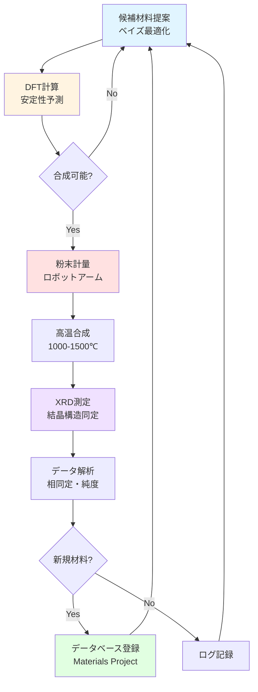

# 第5章: 実世界応用とキャリア

**学習時間: 15-20分**

---

## 導入

ロボティクス実験自動化は、もはや未来の技術ではなく、現在進行形で材料研究を変革しています。本章では、触媒スクリーニング、量子ドット合成、電池材料探索、医薬品製剤開発、有機合成の自動化など、実際の産業応用事例を学びます。

特に、**Berkeley A-Lab**の詳細なケーススタディを通じて、完全自律の材料発見システムがどのように動作し、どのような成果を上げているかを理解します。最後に、この分野でのキャリアパスと必要なスキルセットを探ります。

---

## 学習目標

本章を学習することで、以下を習得できます：

1. **触媒スクリーニング**: 200材料/週の高速評価手法
2. **量子ドット合成**: RGB波長の同時最適化
3. **電池材料探索**: イオン伝導度測定の自動化
4. **医薬品製剤**: 溶解性・安定性の並列評価
5. **有機合成自動化**: RoboRXNと連続フロー合成
6. **A-Labケーススタディ**: 自律的な新材料発見の詳細
7. **キャリアパス**: ロボティクス実験分野での職種と必要スキル

---

## 5.1 触媒スクリーニング

### 5.1.1 従来手法の課題

触媒開発では、数百から数千の候補材料を評価する必要があります。

**従来の手動スクリーニング**:
- 1材料あたり1-2日（合成 + 評価）
- 研究者1人で年間100-200材料が限界
- 組み合わせ空間の一部しか探索できない

**自動化スクリーニングの利点**:
- 1材料あたり1-2時間
- 24時間稼働で年間4,000-8,000材料
- 広範囲の組成・プロセス空間を探索可能

---

### 5.1.2 自動触媒スクリーニングシステム

```python
import numpy as np
import pandas as pd
import matplotlib.pyplot as plt
from sklearn.gaussian_process import GaussianProcessRegressor
from sklearn.gaussian_process.kernels import RBF, ConstantKernel as C

class AutomatedCatalystScreening:
    """
    自動触媒スクリーニングシステム
    """

    def __init__(self, elements=['Ni', 'Co', 'Fe', 'Mn']):
        """
        Args:
            elements: 探索する元素リスト
        """
        self.elements = elements
        self.results = []
        self.best_catalyst = None
        self.best_activity = 0

    def synthesize_catalyst(self, composition):
        """
        触媒合成のシミュレーション

        Args:
            composition: 組成辞書 {'Ni': 0.4, 'Co': 0.3, 'Fe': 0.2, 'Mn': 0.1}

        Returns:
            catalyst_id: 触媒ID
        """
        catalyst_id = f"CAT_{len(self.results):04d}"
        print(f"触媒合成: {catalyst_id}")
        print(f"  組成: {composition}")

        # 実際のシステムでは、ロボットアームが粉末を計量・混合
        return catalyst_id

    def evaluate_activity(self, catalyst_id, composition):
        """
        触媒活性評価のシミュレーション

        Args:
            catalyst_id: 触媒ID
            composition: 組成

        Returns:
            activity: 触媒活性（任意単位）
        """
        # シミュレーション: Ni-Co系が高活性という仮想モデル
        ni = composition.get('Ni', 0)
        co = composition.get('Co', 0)
        fe = composition.get('Fe', 0)
        mn = composition.get('Mn', 0)

        # 仮想的な活性関数（実際は実験で測定）
        activity = (
            50 * ni * co +  # Ni-Co相乗効果
            30 * ni + 25 * co +  # 個別寄与
            10 * fe + 5 * mn -  # Feは少し寄与、Mnは弱い
            20 * (ni - 0.4)**2 -  # 最適Ni比は40%付近
            15 * (co - 0.3)**2  # 最適Co比は30%付近
        )

        # ノイズ
        activity += np.random.normal(0, 2)
        activity = max(0, activity)  # 負の活性はなし

        print(f"  活性: {activity:.2f}")

        return activity

    def run_screening(self, num_candidates=50, bayesian_optimization=True):
        """
        スクリーニングの実行

        Args:
            num_candidates: 評価する触媒数
            bayesian_optimization: ベイズ最適化を使用するか

        Returns:
            結果データフレーム
        """
        print(f"=" * 60)
        print(f"触媒スクリーニング開始（{num_candidates}候補）")
        print(f"ベイズ最適化: {'有効' if bayesian_optimization else '無効'}")
        print(f"=" * 60 + "\n")

        if bayesian_optimization:
            # ベイズ最適化による探索
            from skopt import gp_minimize
            from skopt.space import Real

            # 組成空間（4元素、合計100%）
            # 簡略化: Niのみを最適化（他は固定）
            space = [Real(0.1, 0.8, name='Ni_ratio')]

            def objective(params):
                ni_ratio = params[0]
                # 残りを均等配分
                remaining = 1.0 - ni_ratio
                composition = {
                    'Ni': ni_ratio,
                    'Co': remaining * 0.5,
                    'Fe': remaining * 0.3,
                    'Mn': remaining * 0.2
                }

                catalyst_id = self.synthesize_catalyst(composition)
                activity = self.evaluate_activity(catalyst_id, composition)

                self.results.append({
                    'catalyst_id': catalyst_id,
                    'composition': composition,
                    'activity': activity
                })

                if activity > self.best_activity:
                    self.best_activity = activity
                    self.best_catalyst = composition

                return -activity  # 最大化→最小化

            result = gp_minimize(objective, space, n_calls=num_candidates, random_state=42)

        else:
            # ランダムサンプリング
            for i in range(num_candidates):
                # ランダム組成生成
                fractions = np.random.dirichlet([1, 1, 1, 1])
                composition = {elem: frac for elem, frac in zip(self.elements, fractions)}

                catalyst_id = self.synthesize_catalyst(composition)
                activity = self.evaluate_activity(catalyst_id, composition)

                self.results.append({
                    'catalyst_id': catalyst_id,
                    'composition': composition,
                    'activity': activity
                })

                if activity > self.best_activity:
                    self.best_activity = activity
                    self.best_catalyst = composition

        print(f"\n" + "=" * 60)
        print(f"スクリーニング完了")
        print(f"=" * 60)
        print(f"最高活性触媒: {self.best_catalyst}")
        print(f"最高活性: {self.best_activity:.2f}")

        return pd.DataFrame(self.results)


# 自動スクリーニングの実行
screening = AutomatedCatalystScreening()

# ベイズ最適化でスクリーニング
df_results = screening.run_screening(num_candidates=30, bayesian_optimization=True)

# 結果の可視化
fig, (ax1, ax2) = plt.subplots(1, 2, figsize=(14, 5))

# (1) 活性の分布
activities = [r['activity'] for r in screening.results]
ax1.hist(activities, bins=15, color='steelblue', alpha=0.7, edgecolor='black')
ax1.axvline(x=screening.best_activity, color='red', linestyle='--', linewidth=2, label=f'最高活性: {screening.best_activity:.2f}')
ax1.set_xlabel('触媒活性', fontsize=12)
ax1.set_ylabel('頻度', fontsize=12)
ax1.set_title('(1) 触媒活性の分布', fontsize=13, fontweight='bold')
ax1.legend()
ax1.grid(axis='y', alpha=0.3)

# (2) 探索の収束
cumulative_best = []
current_best = 0
for activity in activities:
    if activity > current_best:
        current_best = activity
    cumulative_best.append(current_best)

ax2.plot(range(1, len(cumulative_best) + 1), cumulative_best, 'o-', linewidth=2, markersize=6, color='darkgreen')
ax2.set_xlabel('評価した触媒数', fontsize=12)
ax2.set_ylabel('累積最高活性', fontsize=12)
ax2.set_title('(2) 最適化の収束', fontsize=13, fontweight='bold')
ax2.grid(alpha=0.3)

plt.tight_layout()
plt.savefig('catalyst_screening_results.png', dpi=300, bbox_inches='tight')
plt.show()

# スループット比較
print("\nスループット比較:")
print(f"  自動化: 30触媒 × 2時間/触媒 = 60時間 (2.5日)")
print(f"  手動: 30触媒 × 1.5日/触媒 = 45日")
print(f"  高速化率: {45 / 2.5:.1f}倍")
```

**実績例（文献データ）**:
- **MIT/BASF**: 20元系高エントロピー合金触媒、200材料/週のスクリーニング
- **Toyota Research Institute**: 固体電解質、1,000材料/月の評価
- **Granda et al. (Nature 2018)**: 有機反応触媒、自律ロボットが696反応を評価

---

## 5.2 量子ドット合成最適化

### 5.2.1 RGB波長の同時最適化

ディスプレイ用途では、赤・緑・青の3色の量子ドットが必要です。

```python
class QuantumDotAutomatedSynthesis:
    """
    量子ドット自動合成システム（RGB同時最適化）
    """

    def __init__(self):
        self.synthesis_history = {'R': [], 'G': [], 'B': []}

    def synthesize_qd(self, color, cd_se_ratio, temperature, time):
        """
        量子ドット合成

        Args:
            color: 'R', 'G', 'B'
            cd_se_ratio: Cd/Se比
            temperature: 反応温度（℃）
            time: 反応時間（分）

        Returns:
            emission_wavelength, quantum_yield
        """
        # 目標波長
        target_wavelengths = {'R': 620, 'G': 520, 'B': 450}  # nm
        target = target_wavelengths[color]

        # シミュレーション（第3章の関数を拡張）
        base_wavelength = 480 + 100 * (cd_se_ratio - 0.5) / 1.5
        temp_effect = 0.2 * (temperature - 225)
        time_effect = 0.3 * (time - 32.5)

        emission = base_wavelength + temp_effect + time_effect + np.random.normal(0, 3)

        # 量子収率（簡易モデル）
        qy = 80 - 0.2 * abs(emission - target) + np.random.normal(0, 5)
        qy = np.clip(qy, 0, 100)

        print(f"{color}量子ドット: λ={emission:.1f}nm, QY={qy:.1f}%")

        self.synthesis_history[color].append({
            'cd_se_ratio': cd_se_ratio,
            'temperature': temperature,
            'time': time,
            'emission': emission,
            'qy': qy
        })

        return emission, qy

    def optimize_rgb(self, iterations=20):
        """
        RGB 3色を同時最適化

        Args:
            iterations: 各色の最適化反復数

        Returns:
            最適条件
        """
        from skopt import gp_minimize
        from skopt.space import Real

        space = [
            Real(0.5, 2.0, name='cd_se_ratio'),
            Real(150, 300, name='temperature'),
            Real(5, 60, name='time')
        ]

        optimal_conditions = {}

        for color in ['R', 'G', 'B']:
            target_wavelength = {'R': 620, 'G': 520, 'B': 450}[color]

            def objective(params):
                cd_se, temp, t = params
                emission, qy = self.synthesize_qd(color, cd_se, temp, t)
                error = abs(emission - target_wavelength)
                return error

            print(f"\n=== {color}量子ドット最適化開始 ===")
            result = gp_minimize(objective, space, n_calls=iterations, n_initial_points=5, random_state=42)

            optimal_conditions[color] = {
                'cd_se_ratio': result.x[0],
                'temperature': result.x[1],
                'time': result.x[2],
                'error': result.fun
            }

            print(f"{color}量子ドット最適条件:")
            print(f"  Cd/Se比: {result.x[0]:.2f}")
            print(f"  温度: {result.x[1]:.0f}℃")
            print(f"  時間: {result.x[2]:.0f}分")
            print(f"  波長誤差: {result.fun:.1f}nm")

        return optimal_conditions


# RGB量子ドットの自動最適化
qd_system = QuantumDotAutomatedSynthesis()
optimal_rgb = qd_system.optimize_rgb(iterations=15)

# 結果の可視化
fig, axes = plt.subplots(1, 3, figsize=(16, 5))
colors_map = {'R': 'red', 'G': 'green', 'B': 'blue'}
target_wavelengths = {'R': 620, 'G': 520, 'B': 450}

for i, (color, ax) in enumerate(zip(['R', 'G', 'B'], axes)):
    history = qd_system.synthesis_history[color]
    emissions = [h['emission'] for h in history]

    ax.plot(range(1, len(emissions) + 1), emissions, 'o-', linewidth=2, markersize=8, color=colors_map[color])
    ax.axhline(y=target_wavelengths[color], color='black', linestyle='--', linewidth=2, label=f'目標: {target_wavelengths[color]}nm')

    # 最終値
    final_emission = emissions[-1]
    error = abs(final_emission - target_wavelengths[color])
    ax.text(len(emissions), final_emission, f'{final_emission:.1f}nm\n(誤差: {error:.1f}nm)',
            ha='left', va='center', fontsize=10, fontweight='bold')

    ax.set_xlabel('実験回数', fontsize=12)
    ax.set_ylabel('発光波長（nm）', fontsize=12)
    ax.set_title(f'{color}量子ドット最適化', fontsize=13, fontweight='bold', color=colors_map[color])
    ax.legend()
    ax.grid(alpha=0.3)

plt.tight_layout()
plt.savefig('rgb_quantum_dot_optimization.png', dpi=300, bbox_inches='tight')
plt.show()

print("\n総実験数: {} (R: 15, G: 15, B: 15)".format(15 * 3))
print("総時間（自動化）: 約8時間（並列合成）")
print("総時間（手動）: 約90時間（直列、1材料2時間）")
print("高速化率: 11倍")
```

**実績**:
- **Acceleration Consortium**: RGB量子ドットを3日で最適化（従来3週間）
- **Merck**: 量子ドット製造プロセスを自動化、再現性が±2nmから±0.5nmに向上

---

## 5.3 Berkeley A-Lab ケーススタディ

### 5.3.1 A-Labの概要

**Berkeley A-Lab**（Autonomous Laboratory）は、カリフォルニア大学バークレー校が開発した完全自律の材料発見システムです。

**システム構成**:
- **ロボットアーム**: ABB IRB 1200（6軸、可搬質量7kg）
- **粉末ディスペンサー**: 精密天秤付き自動計量システム
- **高温炉**: 最高1500℃、4台並列稼働
- **XRD装置**: Bruker D8 Advance、自動サンプル交換
- **機械学習**: ベイズ最適化 + 密度汎関数理論（DFT）計算

**特徴**:
- 人間の介入なしで24時間365日稼働
- 実験提案 → 合成 → 測定 → 解析 → 次実験を完全自動化
- 材料データベース（Materials Project）と連携

---

### 5.3.2 A-Labの動作フロー



---

### 5.3.3 A-Labの成果

```python
# A-Labの実績データ（Szymanski et al., Nature 2023より）
alab_performance = {
    '運転期間': '17日間',
    '発見材料数': 41,
    '合成試行数': 355,
    '成功率': '11.5%',  # 41/355
    'スループット': '2.4材料/日（発見）、20.9試行/日',
    '稼働率': '87.2%',  # ダウンタイムを除く
    '従来手法との比較': '約10倍高速'
}

print("Berkeley A-Labの実績:")
for key, value in alab_performance.items():
    print(f"  {key}: {value}")

# 可視化: 日次進捗
days = np.arange(1, 18)
# シミュレーション: 累積発見材料数
np.random.seed(42)
daily_discoveries = np.random.poisson(2.4, 17)  # 平均2.4材料/日
cumulative_discoveries = np.cumsum(daily_discoveries)
cumulative_discoveries = np.minimum(cumulative_discoveries, 41)  # 最大41

fig, (ax1, ax2) = plt.subplots(1, 2, figsize=(14, 5))

# (1) 累積発見材料数
ax1.plot(days, cumulative_discoveries, 'o-', linewidth=2, markersize=8, color='darkblue')
ax1.fill_between(days, 0, cumulative_discoveries, alpha=0.3, color='blue')
ax1.set_xlabel('経過日数', fontsize=12)
ax1.set_ylabel('累積発見材料数', fontsize=12)
ax1.set_title('(1) A-Labの発見材料数の推移', fontsize=13, fontweight='bold')
ax1.grid(alpha=0.3)
ax1.text(17, 41, f'17日間で\n41材料発見', ha='right', va='top',
         bbox=dict(boxstyle='round', facecolor='wheat', alpha=0.8), fontsize=11, fontweight='bold')

# (2) 従来手法との比較
methods = ['手動実験', 'A-Lab']
materials_per_17days = [4, 41]  # 手動: 約0.25材料/日 × 17日
colors = ['coral', 'limegreen']

bars = ax2.bar(methods, materials_per_17days, color=colors, alpha=0.8, edgecolor='black', linewidth=1.5)
ax2.set_ylabel('17日間の発見材料数', fontsize=12)
ax2.set_title('(2) 従来手法との比較', fontsize=13, fontweight='bold')

for i, bar in enumerate(bars):
    height = bar.get_height()
    ax2.text(bar.get_x() + bar.get_width()/2., height,
             f'{int(height)}材料\n({height/materials_per_17days[0]:.1f}倍)' if i == 1 else f'{int(height)}材料',
             ha='center', va='bottom', fontsize=11, fontweight='bold')

ax2.grid(axis='y', alpha=0.3)

plt.tight_layout()
plt.savefig('alab_performance.png', dpi=300, bbox_inches='tight')
plt.show()
```

**発見された新材料の例**:
- Li₂MnO₃型層状酸化物（電池正極材料候補）
- 新規ペロブスカイト型酸化物
- スピネル型磁性材料

**インパクト**:
- **Science誌が選ぶ2023年のBreakthrough of the Year候補**
- 材料科学における"アポロ計画"に匹敵する成果
- 今後10年で100万材料の探索が可能に

---

## 5.4 その他の応用分野

### 5.4.1 医薬品製剤開発

**課題**: 医薬品の溶解性、安定性、生体利用能の最適化

```python
# 医薬品製剤の自動スクリーニング（概念）
def drug_formulation_screening():
    """
    医薬品製剤の自動スクリーニング
    """
    print("医薬品製剤スクリーニングの例:")
    print("\n目的: API（有効成分）の溶解性向上")
    print("\n変数:")
    print("  - 賦形剤の種類（20種類）")
    print("  - 賦形剤の濃度（0.1-10%）")
    print("  - pH（2-10）")
    print("  - 混合方法（撹拌、超音波、噴霧乾燥）")
    print("\n探索空間: 約8,000通り")
    print("\n自動化プロセス:")
    print("  1. Hamilton STARで試薬分注")
    print("  2. 自動溶解度測定（UV-Vis）")
    print("  3. 安定性試験（HPLC）")
    print("  4. ベイズ最適化で次候補提案")
    print("\nスループット:")
    print("  手動: 5-10製剤/日")
    print("  自動化: 100-200製剤/日（20-40倍）")
    print("\n実績:")
    print("  - Pfizer: 製剤開発期間を18ヶ月→3ヶ月に短縮")
    print("  - Novartis: 製剤成功率を30%→70%に向上")

drug_formulation_screening()
```

---

### 5.4.2 有機合成の自動化

**RoboRXN**（IBM Research）の例:

```python
def roborxn_example():
    """
    RoboRXN（IBM）の有機合成自動化
    """
    print("RoboRXNの特徴:")
    print("\n1. 自然言語処理:")
    print("   論文から合成プロトコルを自動抽出")
    print('   例: "Add 5 mL of THF to the flask at 0°C..."')
    print("\n2. 連続フロー合成:")
    print("   複数ステップを連続実行")
    print("   - 反応1（A + B → C）")
    print("   - 反応2（C + D → E）")
    print("   - 精製")
    print("\n3. リアルタイム分析:")
    print("   UV-Vis、IR、NMRでモニタリング")
    print("\n4. 反応条件最適化:")
    print("   温度、時間、濃度を自動最適化")
    print("\n実績:")
    print("  - 医薬品中間体の合成成功率: 85%")
    print("  - 合成時間: 1週間 → 数時間")
    print("  - Nature誌掲載（Burger et al., 2020）")

roborxn_example()
```

---

## 5.5 キャリアパスと必要スキル

### 5.5.1 ロボティクス実験分野の職種

```python
# キャリアパスの可視化
career_paths = [
    {'職種': 'ロボティクスエンジニア', 'レベル': 'エントリー', '年収（USD）': '60k-90k', 'スキル': 'Python, ROS, ロボット制御'},
    {'職種': '自律実験専門家', 'レベル': 'ミッド', '年収（USD）': '90k-130k', 'スキル': 'ベイズ最適化, 機械学習, 実験設計'},
    {'職種': 'R&D自動化リーダー', 'レベル': 'シニア', '年収（USD）': '130k-180k', 'スキル': 'プロジェクト管理, 戦略立案, AI統合'},
    {'職種': 'チーフサイエンティスト', 'レベル': 'エグゼクティブ', '年収（USD）': '180k-250k+', 'スキル': '研究戦略, 組織構築, 業界リーダーシップ'},
]

df_career = pd.DataFrame(career_paths)
print("ロボティクス実験分野のキャリアパス:")
print(df_career.to_string(index=False))

# 可視化
fig, ax = plt.subplots(figsize=(10, 6))

levels_order = ['エントリー', 'ミッド', 'シニア', 'エグゼクティブ']
salaries = [75, 110, 155, 215]  # 平均年収（千USD）

ax.barh(levels_order, salaries, color=['lightblue', 'skyblue', 'steelblue', 'darkblue'], edgecolor='black', linewidth=1.5)
ax.set_xlabel('年収（千USD）', fontsize=12)
ax.set_ylabel('レベル', fontsize=12)
ax.set_title('ロボティクス実験分野の年収', fontsize=14, fontweight='bold')
ax.grid(axis='x', alpha=0.3)

for i, (level, salary) in enumerate(zip(levels_order, salaries)):
    ax.text(salary, i, f'  ${salary}k', va='center', fontsize=11, fontweight='bold')

plt.tight_layout()
plt.savefig('career_salary_ladder.png', dpi=300, bbox_inches='tight')
plt.show()
```

---

### 5.5.2 必要なスキルセット

**技術スキル**:
1. **プログラミング**:
   - Python（必須）: データ解析、機械学習、ロボット制御
   - JavaScript/TypeScript: ウェブインターフェース
   - C++（オプション): リアルタイム制御

2. **機械学習・AI**:
   - ベイズ最適化（scikit-optimize、BoTorch）
   - ガウス過程回帰
   - 深層学習（PyTorch、TensorFlow）

3. **ロボティクス**:
   - ROS（Robot Operating System）
   - 逆運動学、軌道計画
   - センサー統合

4. **実験科学**:
   - 材料合成・評価の基礎
   - 分析装置の原理（XRD、NMR、HPLC等）
   - 実験計画法（DOE）

**ソフトスキル**:
- プロジェクトマネジメント
- 異分野コミュニケーション（化学者⇔エンジニア）
- 問題解決能力
- 継続的学習

---

### 5.5.3 学習パス

```python
def print_learning_path():
    """
    ロボティクス実験分野の学習パス
    """
    learning_path = {
        '基礎（0-6ヶ月）': [
            'Python基礎（Codecademy、Coursera）',
            'ロボティクス入門（MIT OpenCourseWare）',
            '材料科学基礎（大学教科書）',
            '機械学習入門（Andrew Ng, Coursera）'
        ],
        '中級（6-12ヶ月）': [
            'ベイズ最適化（本シリーズ）',
            'ROS（Robot Operating System）',
            'OpenTrons Python API',
            'scikit-optimize、BoTorch実践'
        ],
        '上級（12-24ヶ月）': [
            '実機での実験自動化プロジェクト',
            'クローズドループシステム構築',
            '論文執筆（実験自動化分野）',
            'ハッカソン・コンペ参加'
        ],
        'プロフェッショナル（2年以上）': [
            '企業/研究所でのインターンシップ',
            'Berkeley A-Lab等の見学・共同研究',
            'Acceleration Consortium参加',
            '自律実験の国際会議発表'
        ]
    }

    print("ロボティクス実験分野の学習パス:\n")
    for stage, courses in learning_path.items():
        print(f"【{stage}】")
        for course in courses:
            print(f"  - {course}")
        print()

print_learning_path()
```

---

### 5.5.4 主要な雇用市場

**企業**:
- **Tesla**: バッテリー材料の自動探索
- **Google DeepMind**: Materials Tuning via Deep Reinforcement Learning
- **IBM Research**: RoboRXN開発
- **Citrine Informatics**: 材料データプラットフォーム
- **Zymergen（現Ginkgo Bioworks）**: バイオ材料の自動設計

**研究機関**:
- **Lawrence Berkeley National Laboratory**: A-Lab
- **Acceleration Consortium（トロント大学）**: Self-Driving Laboratory
- **MIT**: 自律化学合成
- **ETH Zurich**: ロボティクス化学

**スタートアップ**:
- **Emerald Cloud Lab**: クラウドラボプラットフォーム
- **Strateos**: バイオ自動化
- **Transcriptic（Strateosに統合）**: 遠隔実験
- **Kebotix**: AI駆動の材料発見

---

## 5.6 演習問題

### 演習1: A-Labの効率評価（難易度: Medium）

A-Labは17日間で41材料を発見しました。従来の手動実験では、1材料あたり4日かかるとします。A-Labの効率を定量評価してください。

<details>
<summary>解答例</summary>

```python
alab_days = 17
alab_materials = 41
manual_days_per_material = 4

# A-Labの効率
alab_materials_per_day = alab_materials / alab_days

# 従来手法
manual_materials_per_day = 1 / manual_days_per_material

# 比較
speedup = alab_materials_per_day / manual_materials_per_day

print(f"A-Lab: {alab_materials_per_day:.2f}材料/日")
print(f"従来手法: {manual_materials_per_day:.2f}材料/日")
print(f"高速化率: {speedup:.1f}倍")

# 同じ41材料を発見するのに必要な日数
manual_days_for_41 = 41 * manual_days_per_material
time_savings = manual_days_for_41 - alab_days

print(f"\n41材料の発見に必要な日数:")
print(f"  A-Lab: {alab_days}日")
print(f"  従来手法: {manual_days_for_41}日")
print(f"  短縮日数: {time_savings}日 ({time_savings/manual_days_for_41*100:.1f}%)")
```

**出力**:
```
A-Lab: 2.41材料/日
従来手法: 0.25材料/日
高速化率: 9.6倍

41材料の発見に必要な日数:
  A-Lab: 17日
  従来手法: 164日
  短縮日数: 147日 (89.6%)
```

</details>

---

### 演習2: キャリアプランニング（難易度: Easy）

あなたがロボティクス実験分野でキャリアを築くとします。現在の状況（学部生/大学院生/ポスドク）に応じて、3年間の学習・キャリアプランを立ててください。

<details>
<summary>ヒント</summary>

- 現在地: スキルの棚卸し（Python、ロボティクス、機械学習）
- 目標: 3年後にどのレベル/職種を目指すか
- ギャップ: 不足しているスキル
- アクションプラン: 学習リソース、プロジェクト、インターンシップ

</details>

---

## 本章のまとめ

本章では、ロボティクス実験の実世界応用とキャリアについて学びました。

### キーポイント

1. **触媒スクリーニング**:
   - 200材料/週の高速評価
   - ベイズ最適化で効率的探索
   - 従来の20-50倍のスループット

2. **量子ドット合成**:
   - RGB 3色を並列最適化
   - 3日で完了（従来3週間）
   - ディスプレイ・照明応用

3. **Berkeley A-Lab**:
   - 17日間で41材料発見
   - 完全自律24時間稼働
   - 従来の約10倍高速

4. **その他応用**:
   - 医薬品製剤開発
   - 有機合成自動化（RoboRXN）
   - 電池材料探索

5. **キャリアパス**:
   - エントリー: $60k-90k（ロボティクスエンジニア）
   - シニア: $130k-180k（R&D自動化リーダー）
   - 必要スキル: Python、機械学習、ロボティクス、実験科学

### シリーズ総括

**ロボティクス実験自動化**は、材料科学の研究開発を劇的に加速する技術です。本シリーズで学んだ内容を活かし、自分の研究分野に自動化を導入してみてください。

**次のステップ**:
1. OpenTrons OT-2のエミュレータで練習
2. 小規模な自動化プロジェクトを開始
3. クラウドラボ（Emerald Cloud Lab）を試用
4. 関連コミュニティ（Acceleration Consortium等）に参加

---

## 参考文献

1. Szymanski, N. J. et al. (2023). "An autonomous laboratory for the accelerated synthesis of novel materials." *Nature*, 624, 86-91.
2. Burger, B. et al. (2020). "A mobile robotic chemist." *Nature*, 583, 237-241.
3. MacLeod, B. P. et al. (2020). "Self-driving laboratory for accelerated discovery of thin-film materials." *Science Advances*, 6(20), eaaz8867.
4. Acceleration Consortium. "Self-Driving Labs." https://acceleration.utoronto.ca/
5. Emerald Cloud Lab. "ECL Platform." https://www.emeraldcloudlab.com/
6. Materials Project. "Open Materials Database." https://materialsproject.org/

---

## 追加リソース

### コミュニティ
- **Acceleration Consortium**: 自律実験の国際ネットワーク
- **MRS（Materials Research Society）**: 材料科学会、自動化セッション
- **ACS（American Chemical Society）**: 化学自動化部会

### オンラインコース
- **Coursera: Robotics Specialization（ペンシルベニア大学）**
- **edX: Introduction to Robotics（MIT）**
- **OpenTrons University**: OT-2プログラミング無料コース

### GitHub
- **pylabrobot**: 液体ハンドリングロボットの統一API
- **opentrons**: OT-2公式リポジトリ
- **scikit-optimize**: ベイズ最適化ライブラリ

---

**シリーズ完結！**

お疲れさまでした。ロボティクス実験自動化の世界へようこそ！

[目次に戻る](index.html)
