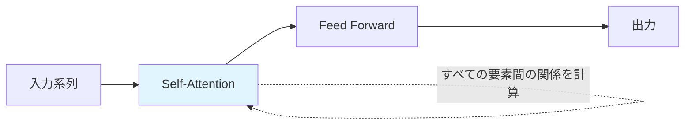
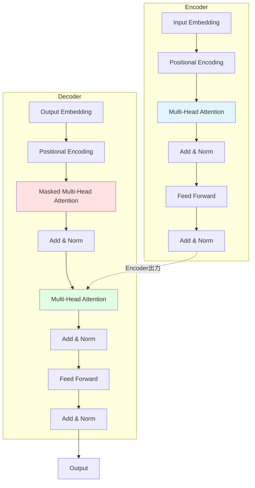

# 第1章: Transformer革命と材料科学

**学習時間**: 20-30分 | **難易度**: 中級

## 📋 この章で学ぶこと

- Attention機構の原理と数学的理解
- Self-AttentionとMulti-Head Attentionの仕組み
- TransformerがRNN/CNNより優れている理由
- BERT、GPTの基本構造と違い
- 材料科学での成功事例

---

## 1.1 なぜTransformerが革命を起こしたのか

### 従来のRNN/CNNの限界

**RNN（Recurrent Neural Network）の問題**:
- 長い系列での勾配消失・爆発
- 並列化が困難（逐次処理が必要）
- 長期依存関係の捕捉が難しい

**CNN（Convolutional Neural Network）の問題**:
- 局所的な特徴しか捉えられない
- 長距離の関係性を捉えるには深い層が必要
- 分子・材料のような不規則な構造には不向き

### Transformerの革新性

**2017年、"Attention Is All You Need"論文で登場**:
- ✅ **全要素間の関係を直接モデル化**（Attention機構）
- ✅ **完全並列化可能**（GPUを最大限活用）
- ✅ **長距離依存関係を効率的に捕捉**
- ✅ **解釈性**（Attention重みで重要な部分を可視化）



---

## 1.2 Attention機構の原理

### Attention機構とは

**基本概念**: 入力の中で「どこに注目すべきか」を学習する仕組み

**数式**:
$$
\text{Attention}(Q, K, V) = \text{softmax}\left(\frac{QK^T}{\sqrt{d_k}}\right)V
$$

- **Q (Query)**: 「何を探しているか」
- **K (Key)**: 「何を持っているか」
- **V (Value)**: 「実際の内容」
- $d_k$: Keyの次元（スケーリング因子）

### 直感的理解

**図書館の例え**:
- **Query**: 「機械学習の本を探している」
- **Key**: 各本の目次・タイトル
- **Value**: 本の実際の内容
- **Attention**: 関連性が高い本に「注目」して読む

### Python実装: 基本的なAttention

```python
import torch
import torch.nn.functional as F

def scaled_dot_product_attention(Q, K, V, mask=None):
    """
    Scaled Dot-Product Attention

    Args:
        Q: Query (batch_size, seq_len, d_k)
        K: Key (batch_size, seq_len, d_k)
        V: Value (batch_size, seq_len, d_v)
        mask: マスク（オプション）
    """
    d_k = Q.size(-1)

    # 1. QとKの内積を計算（類似度）
    scores = torch.matmul(Q, K.transpose(-2, -1)) / torch.sqrt(torch.tensor(d_k, dtype=torch.float32))
    # scores shape: (batch_size, seq_len_q, seq_len_k)

    # 2. マスク適用（必要な場合）
    if mask is not None:
        scores = scores.masked_fill(mask == 0, -1e9)

    # 3. Softmaxで正規化（Attention重み）
    attention_weights = F.softmax(scores, dim=-1)

    # 4. Attention重みでValueを重み付け和
    output = torch.matmul(attention_weights, V)

    return output, attention_weights

# 使用例
batch_size, seq_len, d_model = 2, 5, 64
Q = torch.randn(batch_size, seq_len, d_model)
K = torch.randn(batch_size, seq_len, d_model)
V = torch.randn(batch_size, seq_len, d_model)

output, attn_weights = scaled_dot_product_attention(Q, K, V)
print(f"Output shape: {output.shape}")  # (2, 5, 64)
print(f"Attention weights shape: {attn_weights.shape}")  # (2, 5, 5)
```

### Attention重みの可視化

```python
import matplotlib.pyplot as plt
import seaborn as sns

def visualize_attention(attention_weights, tokens=None):
    """
    Attention重みをヒートマップで可視化

    Args:
        attention_weights: (seq_len, seq_len)のAttention重み
        tokens: トークンのリスト（オプション）
    """
    plt.figure(figsize=(8, 6))

    # 最初のサンプルの最初のヘッドのAttention重みを取得
    attn = attention_weights[0].detach().numpy()

    sns.heatmap(attn, cmap='YlOrRd', cbar=True, square=True,
                xticklabels=tokens if tokens else range(attn.shape[0]),
                yticklabels=tokens if tokens else range(attn.shape[0]))

    plt.xlabel('Key (参照先)')
    plt.ylabel('Query (注目元)')
    plt.title('Attention Weights')
    plt.tight_layout()
    plt.show()

# 使用例
tokens = ['H', 'C', 'C', 'O', 'H']
visualize_attention(attn_weights, tokens)
```

---

## 1.3 Self-Attention: 自己注意機構

### Self-Attentionとは

**定義**: 入力系列自身に対してAttentionを適用する仕組み

**特徴**:
- Query、Key、Valueすべて同じ入力から生成
- 系列内の任意の2要素間の関係を直接モデル化
- 位置に関わらず、関連性の高い要素に注目

### 分子におけるSelf-Attentionの例

**メタノール (CH₃OH)の例**:
```python
# 原子: C, H, H, H, O, H
# Self-Attentionで各原子が他の原子との関係を学習
# 例: O原子はC原子と強い関係性を持つ
```

### Self-Attention実装

```python
import torch.nn as nn

class SelfAttention(nn.Module):
    def __init__(self, d_model):
        super(SelfAttention, self).__init__()
        self.d_model = d_model

        # Q, K, Vへの線形変換
        self.W_q = nn.Linear(d_model, d_model)
        self.W_k = nn.Linear(d_model, d_model)
        self.W_v = nn.Linear(d_model, d_model)

    def forward(self, x):
        """
        Args:
            x: (batch_size, seq_len, d_model)
        """
        # Q, K, Vを生成
        Q = self.W_q(x)
        K = self.W_k(x)
        V = self.W_v(x)

        # Scaled Dot-Product Attention
        output, attn_weights = scaled_dot_product_attention(Q, K, V)

        return output, attn_weights

# 使用例
d_model = 128
seq_len = 10
batch_size = 4

self_attn = SelfAttention(d_model)
x = torch.randn(batch_size, seq_len, d_model)
output, attn_weights = self_attn(x)

print(f"Input shape: {x.shape}")          # (4, 10, 128)
print(f"Output shape: {output.shape}")    # (4, 10, 128)
print(f"Attention shape: {attn_weights.shape}")  # (4, 10, 10)
```

---

## 1.4 Multi-Head Attention: 多頭注意機構

### なぜMulti-Headが必要か

**単一のAttentionヘッドの限界**:
- 1つの視点からしか関係性を見られない
- 複雑な関係性（化学結合、立体配座など）を捉えきれない

**Multi-Head Attentionの利点**:
- 複数の異なる視点から関係性を学習
- 各ヘッドが異なる特徴（結合、距離、角度など）を捉える
- より豊かな表現が可能

### 数式

$$
\text{MultiHead}(Q, K, V) = \text{Concat}(\text{head}_1, ..., \text{head}_h)W^O
$$

where $\text{head}_i = \text{Attention}(QW_i^Q, KW_i^K, VW_i^V)$

### 実装

```python
class MultiHeadAttention(nn.Module):
    def __init__(self, d_model, num_heads):
        super(MultiHeadAttention, self).__init__()
        assert d_model % num_heads == 0, "d_modelはnum_headsで割り切れる必要があります"

        self.d_model = d_model
        self.num_heads = num_heads
        self.d_k = d_model // num_heads

        # Q, K, V変換
        self.W_q = nn.Linear(d_model, d_model)
        self.W_k = nn.Linear(d_model, d_model)
        self.W_v = nn.Linear(d_model, d_model)

        # 出力変換
        self.W_o = nn.Linear(d_model, d_model)

    def forward(self, x, mask=None):
        batch_size = x.size(0)

        # 1. Q, K, Vを生成して、ヘッドごとに分割
        Q = self.W_q(x).view(batch_size, -1, self.num_heads, self.d_k).transpose(1, 2)
        K = self.W_k(x).view(batch_size, -1, self.num_heads, self.d_k).transpose(1, 2)
        V = self.W_v(x).view(batch_size, -1, self.num_heads, self.d_k).transpose(1, 2)
        # Shape: (batch_size, num_heads, seq_len, d_k)

        # 2. 各ヘッドでScaled Dot-Product Attention
        output, attn_weights = scaled_dot_product_attention(Q, K, V, mask)
        # output: (batch_size, num_heads, seq_len, d_k)

        # 3. ヘッドを連結
        output = output.transpose(1, 2).contiguous().view(batch_size, -1, self.d_model)
        # Shape: (batch_size, seq_len, d_model)

        # 4. 出力変換
        output = self.W_o(output)

        return output, attn_weights

# 使用例
d_model = 512
num_heads = 8
seq_len = 20
batch_size = 2

mha = MultiHeadAttention(d_model, num_heads)
x = torch.randn(batch_size, seq_len, d_model)
output, attn_weights = mha(x)

print(f"Input shape: {x.shape}")          # (2, 20, 512)
print(f"Output shape: {output.shape}")    # (2, 20, 512)
print(f"Attention shape: {attn_weights.shape}")  # (2, 8, 20, 20)
```

---

## 1.5 Positional Encoding: 位置情報の埋め込み

### なぜ必要か

**問題**: Self-Attentionには順序の概念がない
- "H-C-O" と "O-C-H" を区別できない
- 分子や材料では原子の配置順序が重要

**解決策**: Positional Encodingで位置情報を追加

### 数式

$$
PE_{(pos, 2i)} = \sin\left(\frac{pos}{10000^{2i/d_{model}}}\right)
$$

$$
PE_{(pos, 2i+1)} = \cos\left(\frac{pos}{10000^{2i/d_{model}}}\right)
$$

### 実装

```python
class PositionalEncoding(nn.Module):
    def __init__(self, d_model, max_len=5000):
        super(PositionalEncoding, self).__init__()

        # 位置エンコーディング行列を作成
        pe = torch.zeros(max_len, d_model)
        position = torch.arange(0, max_len, dtype=torch.float).unsqueeze(1)
        div_term = torch.exp(torch.arange(0, d_model, 2).float() * (-torch.log(torch.tensor(10000.0)) / d_model))

        pe[:, 0::2] = torch.sin(position * div_term)
        pe[:, 1::2] = torch.cos(position * div_term)

        pe = pe.unsqueeze(0)  # (1, max_len, d_model)
        self.register_buffer('pe', pe)

    def forward(self, x):
        """
        Args:
            x: (batch_size, seq_len, d_model)
        """
        seq_len = x.size(1)
        x = x + self.pe[:, :seq_len, :]
        return x

# 使用例と可視化
d_model = 128
max_len = 100

pos_enc = PositionalEncoding(d_model, max_len)

# ダミー入力
x = torch.zeros(1, 50, d_model)
output = pos_enc(x)

# 可視化
plt.figure(figsize=(12, 4))
plt.plot(pos_enc.pe[0, :50, :8].numpy())
plt.xlabel('Position')
plt.ylabel('Encoding Value')
plt.title('Positional Encoding (first 8 dimensions)')
plt.legend([f'dim {i}' for i in range(8)])
plt.tight_layout()
plt.show()
```

---

## 1.6 TransformerとBERT/GPT

### Transformer全体アーキテクチャ



### BERT（Bidirectional Encoder Representations from Transformers）

**特徴**:
- **Encoderのみ**使用
- **双方向**でコンテキストを理解
- **事前学習タスク**: Masked Language Model (MLM) + Next Sentence Prediction (NSP)
- **用途**: 分類、特徴抽出、質問応答

**材料科学での応用**:
- MatBERT: 材料の組成式から特性予測
- ChemBERTa: 分子SMILES表現学習

### GPT（Generative Pre-trained Transformer）

**特徴**:
- **Decoderのみ**使用
- **単方向**（左から右）でテキスト生成
- **事前学習タスク**: 次の単語予測
- **用途**: テキスト生成、対話、創造的タスク

**材料科学での応用**:
- 分子生成（SMILES文字列生成）
- 材料記述文の自動生成
- 合成経路の提案

---

## 1.7 材料科学での成功事例

### 1. ChemBERTa: 分子表現学習

**概要**: SMILESをBERTで学習
```python
# 分子SMILES: CC(C)Cc1ccc(cc1)C(C)C(=O)O (イブプロフェン)
# ChemBERTaで埋め込みベクトルに変換 → 特性予測
```

**成果**:
- 小規模データでの高精度予測
- 転移学習により開発期間短縮
- 解釈可能性（Attentionで重要部分可視化）

### 2. Matformer: 材料特性予測

**概要**: 結晶構造をTransformerで処理
```python
# 入力: 原子座標、原子番号、格子定数
# 出力: バンドギャップ、形成エネルギー
```

**成果**:
- Materials Projectデータで高精度
- GNNと同等以上の性能
- 計算効率が良い

### 3. 拡散モデルによる分子生成

**概要**: 条件付き拡散モデルで新規分子生成
```python
# 条件: 溶解度 > 5 mg/mL, LogP < 3
# 生成: 条件を満たす分子SMILES
```

**成果**:
- 創薬で有望な候補分子発見
- 従来手法より多様性が高い
- 合成可能性も考慮

---

## 1.8 まとめ

### 重要ポイント

1. **Attention機構**: 系列内の任意の要素間の関係を直接モデル化
2. **Self-Attention**: 入力系列自身に対するAttention
3. **Multi-Head Attention**: 複数の視点から関係性を学習
4. **Positional Encoding**: 位置情報を埋め込み
5. **BERT/GPT**: Transformer based の代表的事前学習モデル
6. **材料科学応用**: 分子・材料表現学習、特性予測、生成モデル

### 次章への準備

第2章では、材料科学に特化したTransformerアーキテクチャ（Matformer、CrystalFormer、ChemBERTa）を詳しく学びます。

---

## 📝 演習問題

### 問題1: 基礎理解（概念）
Attention機構における Query、Key、Value の役割を、図書館の例え以外で説明してください。

<details>
<summary>解答例</summary>

**検索エンジンの例え**:
- **Query**: ユーザーが入力した検索キーワード
- **Key**: 各Webページのメタデータ（タイトル、要約）
- **Value**: Webページの実際のコンテンツ
- **Attention**: 検索キーワードとの関連性が高いページを上位表示

**分子の例え**:
- **Query**: ある原子が「どの原子と相互作用したいか」
- **Key**: 各原子の特徴（原子番号、電荷、位置）
- **Value**: 各原子の詳細な情報
- **Attention**: 化学結合や相互作用の強さを表現
</details>

### 問題2: 実装（コーディング）
以下のコードの空欄を埋めて、Simple Attention（スケーリングなし、マスクなし）を実装してください。

```python
def simple_attention(Q, K, V):
    """
    シンプルなAttention機構

    Args:
        Q: Query (batch_size, seq_len, d_k)
        K: Key (batch_size, seq_len, d_k)
        V: Value (batch_size, seq_len, d_v)

    Returns:
        output: (batch_size, seq_len, d_v)
        attention_weights: (batch_size, seq_len, seq_len)
    """
    # 1. QとKの内積を計算
    scores = torch.matmul(______, ______.transpose(-2, -1))

    # 2. Softmaxで正規化
    attention_weights = F.softmax(______, dim=-1)

    # 3. Attention重みでValueを重み付け和
    output = torch.matmul(______, ______)

    return output, attention_weights
```

<details>
<summary>解答例</summary>

```python
def simple_attention(Q, K, V):
    # 1. QとKの内積を計算
    scores = torch.matmul(Q, K.transpose(-2, -1))

    # 2. Softmaxで正規化
    attention_weights = F.softmax(scores, dim=-1)

    # 3. Attention重みでValueを重み付け和
    output = torch.matmul(attention_weights, V)

    return output, attention_weights
```
</details>

### 問題3: 応用（考察）
分子 "CCO"（エタノール）におけるSelf-Attentionを考えます。以下の質問に答えてください：

1. どの原子間のAttention重みが最も高くなると予想されますか？
2. その理由を化学的観点から説明してください。
3. Multi-Head Attentionでは、各ヘッドがどのような異なる情報を捉える可能性がありますか？

<details>
<summary>解答例</summary>

1. **最も高いAttention重み**: C-C結合、C-O結合

2. **化学的理由**:
   - 共有結合により強い相互作用がある
   - 電子の共有により電子密度が高い
   - O原子はC原子と極性結合を形成

3. **各ヘッドが捉える情報の例**:
   - **ヘッド1**: 化学結合（1次結合）
   - **ヘッド2**: 2次結合（C-C-O角度）
   - **ヘッド3**: 電子密度分布
   - **ヘッド4**: 原子の種類（C vs O vs H）
   - **ヘッド5**: 立体配座情報
   - **ヘッド6**: 極性相互作用

   各ヘッドが異なる視点から分子を理解することで、より豊かな表現が可能になる。
</details>

---

## 🔗 参考資料

### 論文
- Vaswani et al. (2017) "Attention Is All You Need" [arXiv:1706.03762](https://arxiv.org/abs/1706.03762)
- Devlin et al. (2019) "BERT: Pre-training of Deep Bidirectional Transformers" [arXiv:1810.04805](https://arxiv.org/abs/1810.04805)

### チュートリアル
- [The Illustrated Transformer](http://jalammar.github.io/illustrated-transformer/)
- [PyTorch Transformer Tutorial](https://pytorch.org/tutorials/beginner/transformer_tutorial.html)

### 次章
**[第2章: 材料向けTransformerアーキテクチャ](chapter-2.md)** で、Matformer、ChemBERTaなど材料科学特化モデルを学びます。

---

**作成者**: 橋本佑介（東北大学）
**最終更新**: 2025年10月17日
