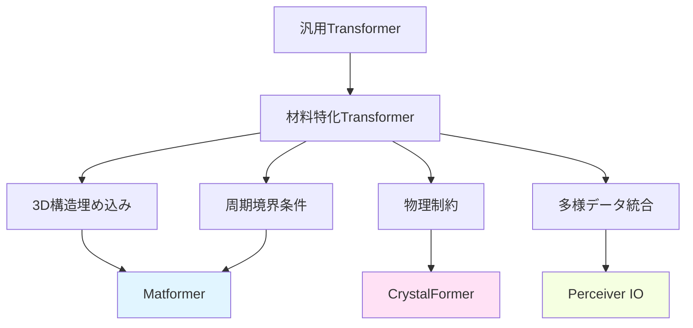
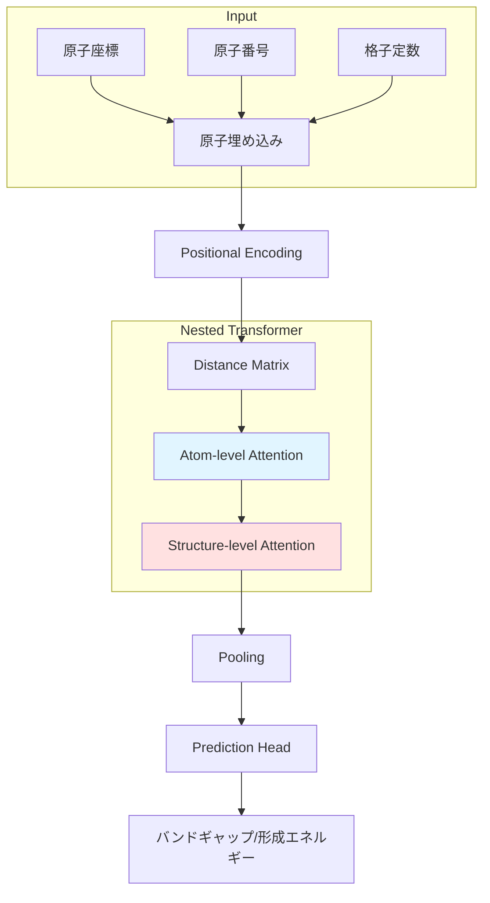
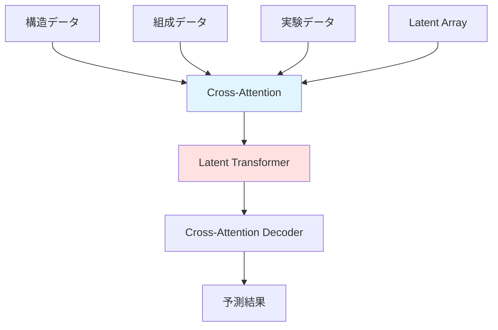

# 第2章: 材料向けTransformerアーキテクチャ

**学習時間**: 30-35分 | **難易度**: 中級〜上級

## 📋 この章で学ぶこと

- 材料科学に特化したTransformerアーキテクチャの設計原理
- Matformer: Materials Transformer for Property Prediction
- CrystalFormer: Crystal Structure Representation
- ChemBERTa: 分子SMILES表現学習
- Perceiver IO: 多様なデータ統合
- 実装演習: Matformerで材料特性予測

---

## 2.1 材料科学特化Transformerの必要性

### 汎用Transformerの限界

**自然言語処理用Transformerをそのまま使う問題**:
- ❌ 分子・材料の3D構造情報が失われる
- ❌ 化学結合や原子間距離を考慮できない
- ❌ 周期的境界条件（結晶）を扱えない
- ❌ 物理的制約（保存則、対称性）を無視

### 材料特化Transformerの特徴

**必要な拡張**:
- ✅ **3D構造の埋め込み**: 原子座標、距離、角度
- ✅ **周期的境界条件**: 結晶格子の繰り返し
- ✅ **物理的制約**: 対称性、等変性
- ✅ **多様なデータ統合**: 構造 + 組成 + 実験データ



---

## 2.2 Matformer: Materials Transformer

### 概要

**Matformer** (Chen et al., 2022)は、材料の結晶構造から特性を予測するTransformerモデルです。

**特徴**:
- **Nested Transformer**: 原子レベルとクリスタルレベルの階層的処理
- **Distance-aware Attention**: 原子間距離を考慮
- **Elastic Inference**: 計算量とメモリを動的に調整

### アーキテクチャ



### 原子埋め込み（Atom Embedding）

```python
import torch
import torch.nn as nn
import numpy as np

class AtomEmbedding(nn.Module):
    def __init__(self, num_atoms=118, d_model=256):
        """
        原子埋め込み層

        Args:
            num_atoms: 原子の種類数（周期表、118元素）
            d_model: 埋め込み次元
        """
        super(AtomEmbedding, self).__init__()
        self.embedding = nn.Embedding(num_atoms, d_model)

    def forward(self, atomic_numbers):
        """
        Args:
            atomic_numbers: (batch_size, num_atoms) 原子番号
        Returns:
            embeddings: (batch_size, num_atoms, d_model)
        """
        return self.embedding(atomic_numbers)

# 使用例: NaCl結晶
batch_size = 2
num_atoms = 8  # 単位格子内の原子数

# 原子番号: Na(11), Cl(17)
atomic_numbers = torch.tensor([
    [11, 17, 11, 17, 11, 17, 11, 17],  # サンプル1
    [11, 17, 11, 17, 11, 17, 11, 17]   # サンプル2
])

atom_emb = AtomEmbedding(num_atoms=118, d_model=256)
embeddings = atom_emb(atomic_numbers)
print(f"Atom embeddings shape: {embeddings.shape}")  # (2, 8, 256)
```

### Distance-aware Attention

**原子間距離を考慮したAttention**:

```python
class DistanceAwareAttention(nn.Module):
    def __init__(self, d_model, num_heads, max_distance=10.0):
        """
        距離を考慮したAttention

        Args:
            d_model: モデル次元
            num_heads: Attentionヘッド数
            max_distance: 最大距離（Å）
        """
        super(DistanceAwareAttention, self).__init__()
        self.d_model = d_model
        self.num_heads = num_heads
        self.d_k = d_model // num_heads
        self.max_distance = max_distance

        self.W_q = nn.Linear(d_model, d_model)
        self.W_k = nn.Linear(d_model, d_model)
        self.W_v = nn.Linear(d_model, d_model)
        self.W_o = nn.Linear(d_model, d_model)

        # 距離埋め込み
        self.distance_embedding = nn.Linear(1, num_heads)

    def forward(self, x, distance_matrix):
        """
        Args:
            x: (batch_size, num_atoms, d_model)
            distance_matrix: (batch_size, num_atoms, num_atoms) 原子間距離（Å）
        """
        batch_size = x.size(0)

        # Q, K, V
        Q = self.W_q(x).view(batch_size, -1, self.num_heads, self.d_k).transpose(1, 2)
        K = self.W_k(x).view(batch_size, -1, self.num_heads, self.d_k).transpose(1, 2)
        V = self.W_v(x).view(batch_size, -1, self.num_heads, self.d_k).transpose(1, 2)

        # Attention scores
        scores = torch.matmul(Q, K.transpose(-2, -1)) / np.sqrt(self.d_k)

        # 距離バイアス
        # 距離が近いほど大きな値、遠いほど小さな値
        distance_bias = self.distance_embedding(distance_matrix.unsqueeze(-1))  # (batch, num_atoms, num_atoms, num_heads)
        distance_bias = distance_bias.permute(0, 3, 1, 2)  # (batch, num_heads, num_atoms, num_atoms)

        # ガウス関数で距離を変換（近い原子ほど高いスコア）
        distance_factor = torch.exp(-distance_matrix.unsqueeze(1) / 2.0)  # (batch, 1, num_atoms, num_atoms)

        scores = scores + distance_bias * distance_factor

        # Softmax
        attention_weights = torch.softmax(scores, dim=-1)

        # Attentionの適用
        output = torch.matmul(attention_weights, V)
        output = output.transpose(1, 2).contiguous().view(batch_size, -1, self.d_model)
        output = self.W_o(output)

        return output, attention_weights

# 使用例
d_model = 256
num_heads = 8
num_atoms = 8

dist_attn = DistanceAwareAttention(d_model, num_heads)

x = torch.randn(2, num_atoms, d_model)
# NaCl結晶の原子間距離（簡略版）
distance_matrix = torch.tensor([
    [[0.0, 2.8, 3.9, 4.8, 3.9, 5.5, 4.8, 6.7],  # 原子1からの距離
     [2.8, 0.0, 2.8, 3.9, 5.5, 3.9, 6.7, 4.8],
     # ... 省略
     [6.7, 4.8, 5.5, 3.9, 4.8, 3.9, 2.8, 0.0]]
]).repeat(2, 1, 1)  # batch_size分複製

output, attn_weights = dist_attn(x, distance_matrix)
print(f"Output shape: {output.shape}")  # (2, 8, 256)
```

### Matformerブロック

```python
class MatformerBlock(nn.Module):
    def __init__(self, d_model, num_heads, d_ff=1024, dropout=0.1):
        """
        Matformerの基本ブロック

        Args:
            d_model: モデル次元
            num_heads: Attentionヘッド数
            d_ff: Feed-Forward層の中間次元
            dropout: ドロップアウト率
        """
        super(MatformerBlock, self).__init__()

        self.distance_attention = DistanceAwareAttention(d_model, num_heads)
        self.norm1 = nn.LayerNorm(d_model)
        self.dropout1 = nn.Dropout(dropout)

        # Feed-Forward Network
        self.ffn = nn.Sequential(
            nn.Linear(d_model, d_ff),
            nn.ReLU(),
            nn.Dropout(dropout),
            nn.Linear(d_ff, d_model)
        )
        self.norm2 = nn.LayerNorm(d_model)
        self.dropout2 = nn.Dropout(dropout)

    def forward(self, x, distance_matrix):
        # Distance-aware Attention + Residual
        attn_output, _ = self.distance_attention(x, distance_matrix)
        x = self.norm1(x + self.dropout1(attn_output))

        # Feed-Forward + Residual
        ffn_output = self.ffn(x)
        x = self.norm2(x + self.dropout2(ffn_output))

        return x
```

---

## 2.3 CrystalFormer: 結晶構造Transformer

### 概要

**CrystalFormer**は、結晶の周期的境界条件を考慮したTransformerです。

**特徴**:
- **Wyckoff位置埋め込み**: 結晶の対称性を考慮
- **Fractional Coordinates**: 分数座標での表現
- **Space Group Encoding**: 空間群情報の埋め込み

### 分数座標埋め込み

```python
class FractionalCoordinateEncoding(nn.Module):
    def __init__(self, d_model):
        super(FractionalCoordinateEncoding, self).__init__()
        self.coord_linear = nn.Linear(3, d_model)

    def forward(self, fractional_coords):
        """
        Args:
            fractional_coords: (batch_size, num_atoms, 3) 分数座標 [0, 1)
        Returns:
            encoding: (batch_size, num_atoms, d_model)
        """
        # 三角関数埋め込み
        freqs = torch.arange(1, d_model // 6 + 1, dtype=torch.float32)
        coords_expanded = fractional_coords.unsqueeze(-1) * freqs

        encoding = torch.cat([
            torch.sin(2 * np.pi * coords_expanded),
            torch.cos(2 * np.pi * coords_expanded)
        ], dim=-1)

        # 線形変換で次元調整
        encoding = encoding.flatten(start_dim=2)
        encoding = self.coord_linear(encoding)

        return encoding
```

### 周期境界条件の考慮

```python
def compute_periodic_distance(coords1, coords2, lattice_matrix):
    """
    周期境界条件を考慮した距離計算

    Args:
        coords1: (num_atoms1, 3) 分数座標
        coords2: (num_atoms2, 3) 分数座標
        lattice_matrix: (3, 3) 格子ベクトル行列
    Returns:
        distances: (num_atoms1, num_atoms2) 最短距離（Å）
    """
    # デカルト座標に変換
    cart1 = torch.matmul(coords1, lattice_matrix)
    cart2 = torch.matmul(coords2, lattice_matrix)

    # すべての周期イメージを考慮（-1, 0, 1の範囲）
    offsets = torch.tensor([
        [i, j, k] for i in [-1, 0, 1]
                  for j in [-1, 0, 1]
                  for k in [-1, 0, 1]
    ], dtype=torch.float32)  # 27通り

    min_distances = []
    for offset in offsets:
        offset_cart = torch.matmul(offset, lattice_matrix)
        shifted_cart2 = cart2 + offset_cart

        # 距離計算
        diff = cart1.unsqueeze(1) - shifted_cart2.unsqueeze(0)
        distances = torch.norm(diff, dim=-1)
        min_distances.append(distances)

    # 最短距離を選択
    min_distances = torch.stack(min_distances, dim=-1)
    min_distances, _ = torch.min(min_distances, dim=-1)

    return min_distances

# 使用例: 単純立方格子
fractional_coords = torch.tensor([
    [0.0, 0.0, 0.0],  # 原子1
    [0.5, 0.5, 0.5]   # 原子2
])

lattice_matrix = torch.tensor([
    [5.0, 0.0, 0.0],
    [0.0, 5.0, 0.0],
    [0.0, 0.0, 5.0]
])  # 5Åの立方格子

distances = compute_periodic_distance(fractional_coords, fractional_coords, lattice_matrix)
print("Distance matrix (Å):")
print(distances)
```

---

## 2.4 ChemBERTa: 分子SMILES表現学習

### 概要

**ChemBERTa**は、分子のSMILES文字列をBERTで学習したモデルです。

**特徴**:
- **RoBERTa**ベース（BERT改良版）
- **10M分子**で事前学習
- **転移学習**で少量データでも高精度

### SMILESトークン化

```python
from transformers import RobertaTokenizer

class SMILESTokenizer:
    def __init__(self):
        # ChemBERTa用のトークナイザ
        self.tokenizer = RobertaTokenizer.from_pretrained("seyonec/ChemBERTa-zinc-base-v1")

    def encode(self, smiles_list):
        """
        SMILES文字列をトークン化

        Args:
            smiles_list: SMILESのリスト
        Returns:
            input_ids: トークンID
            attention_mask: マスク
        """
        encoded = self.tokenizer(
            smiles_list,
            padding=True,
            truncation=True,
            max_length=128,
            return_tensors='pt'
        )
        return encoded['input_ids'], encoded['attention_mask']

# 使用例
smiles_list = [
    'CCO',  # エタノール
    'CC(C)Cc1ccc(cc1)C(C)C(=O)O',  # イブプロフェン
    'CN1C=NC2=C1C(=O)N(C(=O)N2C)C'  # カフェイン
]

tokenizer = SMILESTokenizer()
input_ids, attention_mask = tokenizer.encode(smiles_list)

print(f"Input IDs shape: {input_ids.shape}")
print(f"Attention mask shape: {attention_mask.shape}")
print(f"First molecule tokens: {input_ids[0][:10]}")
```

### ChemBERTaモデルの使用

```python
from transformers import RobertaModel

class ChemBERTaEmbedding(nn.Module):
    def __init__(self, pretrained_model="seyonec/ChemBERTa-zinc-base-v1"):
        super(ChemBERTaEmbedding, self).__init__()
        self.bert = RobertaModel.from_pretrained(pretrained_model)

    def forward(self, input_ids, attention_mask):
        """
        Args:
            input_ids: (batch_size, seq_len)
            attention_mask: (batch_size, seq_len)
        Returns:
            embeddings: (batch_size, hidden_size)
        """
        outputs = self.bert(input_ids=input_ids, attention_mask=attention_mask)

        # [CLS]トークンの埋め込みを使用
        cls_embedding = outputs.last_hidden_state[:, 0, :]

        return cls_embedding

# 分子特性予測モデル
class MoleculePropertyPredictor(nn.Module):
    def __init__(self, hidden_size=768, num_properties=1):
        super(MoleculePropertyPredictor, self).__init__()
        self.chemberta = ChemBERTaEmbedding()
        self.predictor = nn.Sequential(
            nn.Linear(hidden_size, 256),
            nn.ReLU(),
            nn.Dropout(0.2),
            nn.Linear(256, num_properties)
        )

    def forward(self, input_ids, attention_mask):
        embeddings = self.chemberta(input_ids, attention_mask)
        predictions = self.predictor(embeddings)
        return predictions

# 使用例
model = MoleculePropertyPredictor(num_properties=1)  # 例: logP予測
predictions = model(input_ids, attention_mask)
print(f"Predictions shape: {predictions.shape}")  # (3, 1)
```

---

## 2.5 Perceiver IO: 多様なデータ統合

### 概要

**Perceiver IO**は、異なる種類のデータを統合して処理できるTransformerです。

**材料科学での応用**:
- 構造データ + 組成データ
- 実験データ + 計算データ
- 画像 + テキスト + 数値

### アーキテクチャ



### 簡易実装

```python
class PerceiverBlock(nn.Module):
    def __init__(self, latent_dim, input_dim, num_latents=64):
        super(PerceiverBlock, self).__init__()
        self.num_latents = num_latents
        self.latent_dim = latent_dim

        # Latent array（学習可能）
        self.latents = nn.Parameter(torch.randn(num_latents, latent_dim))

        # Cross-Attention: Latent → Input
        self.cross_attn = nn.MultiheadAttention(latent_dim, num_heads=8, batch_first=True)

        # Self-Attention: Latent → Latent
        self.self_attn = nn.MultiheadAttention(latent_dim, num_heads=8, batch_first=True)

        # 入力を埋め込み
        self.input_projection = nn.Linear(input_dim, latent_dim)

    def forward(self, x):
        """
        Args:
            x: (batch_size, seq_len, input_dim) 入力データ
        Returns:
            latents: (batch_size, num_latents, latent_dim)
        """
        batch_size = x.size(0)

        # 入力を埋め込み
        x_embed = self.input_projection(x)

        # Latentを複製
        latents = self.latents.unsqueeze(0).repeat(batch_size, 1, 1)

        # Cross-Attention: Latent (Query) ← Input (Key, Value)
        latents, _ = self.cross_attn(latents, x_embed, x_embed)

        # Self-Attention: Latent内部
        latents, _ = self.self_attn(latents, latents, latents)

        return latents

# 使用例: 構造データと組成データを統合
batch_size = 2
seq_len = 20
input_dim = 128
latent_dim = 256

perceiver = PerceiverBlock(latent_dim, input_dim, num_latents=32)

# 構造データ（例: 原子座標）
structure_data = torch.randn(batch_size, seq_len, input_dim)

latents = perceiver(structure_data)
print(f"Latent representation shape: {latents.shape}")  # (2, 32, 256)
```

---

## 2.6 実装演習: Matformerで材料特性予測

### 完全な実装例

```python
import torch
import torch.nn as nn
from torch.utils.data import Dataset, DataLoader

# データセット
class MaterialsDataset(Dataset):
    def __init__(self, num_samples=100):
        self.num_samples = num_samples

    def __len__(self):
        return self.num_samples

    def __getitem__(self, idx):
        # ダミーデータ（実際はMaterials Projectなどから取得）
        num_atoms = 8
        atomic_numbers = torch.randint(1, 30, (num_atoms,))  # 原子番号
        positions = torch.randn(num_atoms, 3)  # 原子座標（Å）
        distance_matrix = torch.cdist(positions, positions)  # 距離行列

        # ターゲット: バンドギャップ（eV）
        target = torch.randn(1)

        return atomic_numbers, distance_matrix, target

# Matformerモデル（簡略版）
class SimpleMatformer(nn.Module):
    def __init__(self, d_model=256, num_heads=8, num_layers=4):
        super(SimpleMatformer, self).__init__()

        self.atom_embedding = AtomEmbedding(num_atoms=118, d_model=d_model)

        self.layers = nn.ModuleList([
            MatformerBlock(d_model, num_heads)
            for _ in range(num_layers)
        ])

        self.pooling = nn.AdaptiveAvgPool1d(1)
        self.predictor = nn.Sequential(
            nn.Linear(d_model, 128),
            nn.ReLU(),
            nn.Linear(128, 1)
        )

    def forward(self, atomic_numbers, distance_matrix):
        # 原子埋め込み
        x = self.atom_embedding(atomic_numbers)

        # Matformerブロック
        for layer in self.layers:
            x = layer(x, distance_matrix)

        # Global pooling
        x = x.transpose(1, 2)  # (batch, d_model, num_atoms)
        x = self.pooling(x).squeeze(-1)  # (batch, d_model)

        # 予測
        output = self.predictor(x)
        return output

# 訓練
def train_matformer():
    device = torch.device('cuda' if torch.cuda.is_available() else 'cpu')

    # データ
    dataset = MaterialsDataset(num_samples=100)
    dataloader = DataLoader(dataset, batch_size=8, shuffle=True)

    # モデル
    model = SimpleMatformer(d_model=256, num_heads=8, num_layers=4).to(device)

    # 最適化
    criterion = nn.MSELoss()
    optimizer = torch.optim.Adam(model.parameters(), lr=1e-4)

    # 訓練ループ
    model.train()
    for epoch in range(5):
        total_loss = 0
        for atomic_numbers, distance_matrix, target in dataloader:
            atomic_numbers = atomic_numbers.to(device)
            distance_matrix = distance_matrix.to(device)
            target = target.to(device)

            # Forward
            predictions = model(atomic_numbers, distance_matrix)
            loss = criterion(predictions, target)

            # Backward
            optimizer.zero_grad()
            loss.backward()
            optimizer.step()

            total_loss += loss.item()

        avg_loss = total_loss / len(dataloader)
        print(f"Epoch {epoch+1}, Loss: {avg_loss:.4f}")

    return model

# 実行
trained_model = train_matformer()
```

---

## 2.7 まとめ

### 重要ポイント

1. **Matformer**: 距離を考慮したAttention、階層的構造
2. **CrystalFormer**: 周期境界条件、分数座標、空間群
3. **ChemBERTa**: SMILES表現学習、転移学習
4. **Perceiver IO**: 多様なデータ統合

### 次章への準備

第3章では、事前学習モデル（MatBERT、MolBERT）とファインチューニングを学びます。

---

## 📝 演習問題

### 問題1: 概念理解
Distance-aware Attentionが通常のAttentionより材料科学で優れている理由を3つ挙げてください。

<details>
<summary>解答例</summary>

1. **化学結合の考慮**: 原子間距離が近いほど相互作用が強いという物理法則を反映
2. **長距離相互作用の抑制**: 遠い原子への不要なAttentionを減らし、計算効率向上
3. **解釈性の向上**: Attention重みが化学的に意味のある結合強度と対応
</details>

### 問題2: 実装
周期境界条件を考慮せずに距離を計算する単純な関数を実装してください。

```python
def compute_simple_distance(coords1, coords2):
    """
    単純な距離計算（周期境界条件なし）

    Args:
        coords1: (num_atoms1, 3)
        coords2: (num_atoms2, 3)
    Returns:
        distances: (num_atoms1, num_atoms2)
    """
    # ここに実装
    pass
```

<details>
<summary>解答例</summary>

```python
def compute_simple_distance(coords1, coords2):
    diff = coords1.unsqueeze(1) - coords2.unsqueeze(0)
    distances = torch.norm(diff, dim=-1)
    return distances
```
</details>

### 問題3: 応用
ChemBERTaを使って、分子の水溶解度を予測するモデルを設計してください。必要な層と構成を説明してください。

<details>
<summary>解答例</summary>

```python
class SolubilityPredictor(nn.Module):
    def __init__(self):
        super(SolubilityPredictor, self).__init__()
        self.chemberta = ChemBERTaEmbedding()  # 768次元

        self.predictor = nn.Sequential(
            nn.Linear(768, 512),
            nn.ReLU(),
            nn.Dropout(0.3),
            nn.Linear(512, 256),
            nn.ReLU(),
            nn.Dropout(0.2),
            nn.Linear(256, 1)  # 溶解度（連続値）
        )

    def forward(self, input_ids, attention_mask):
        embeddings = self.chemberta(input_ids, attention_mask)
        solubility = self.predictor(embeddings)
        return solubility
```

**設計理由**:
- ChemBERTaで分子の一般的な特徴を抽出
- 3層の全結合層で溶解度に特化した表現に変換
- Dropoutで過学習を防止
- 出力は連続値（log10(mol/L)など）
</details>

---

**次章**: **[第3章: 事前学習モデルと転移学習](chapter-3.md)**

---

**作成者**: 橋本佑介（東北大学）
**最終更新**: 2025年10月17日
