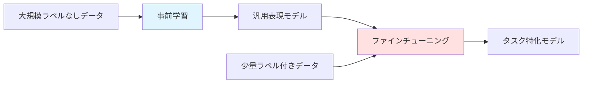
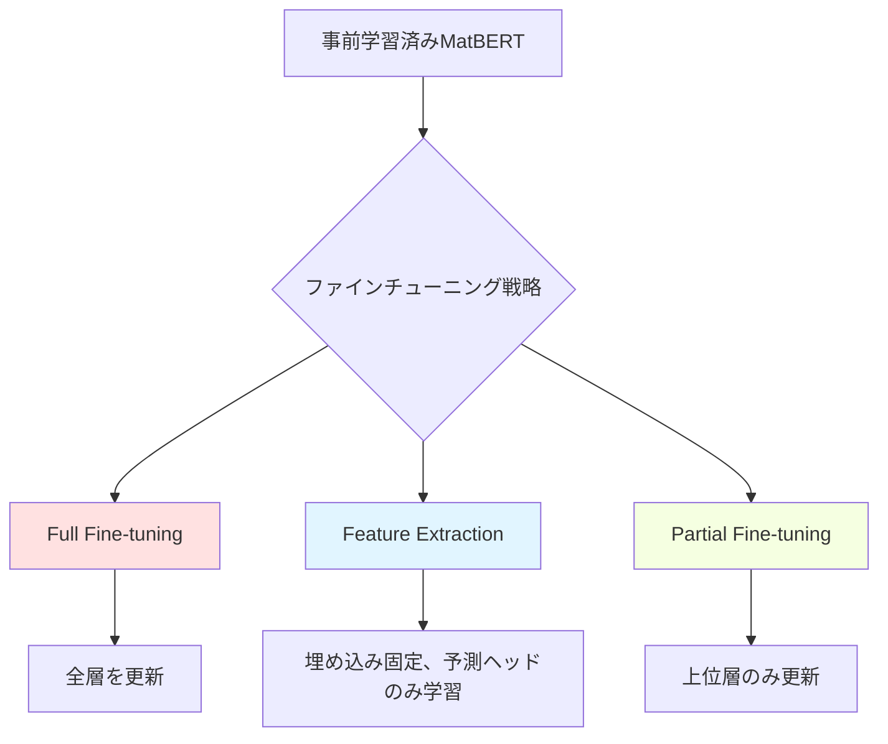

# 第3章: 事前学習モデルと転移学習

**学習時間**: 25-30分 | **難易度**: 中級〜上級

## 📋 この章で学ぶこと

- 事前学習（Pre-training）の重要性と原理
- MatBERT、MolBERTなど材料科学向け事前学習モデル
- ファインチューニング（Fine-tuning）の戦略
- Few-shot学習とプロンプトエンジニアリング
- ドメイン適応（Domain Adaptation）

---

## 3.1 事前学習の重要性

### なぜ事前学習が必要か

**材料科学の課題**:
- ❌ ラベル付きデータが少ない（実験データは高コスト）
- ❌ ドメイン固有の知識が必要
- ❌ ゼロから学習すると時間とコストがかかる

**事前学習の利点**:
- ✅ 大規模な**ラベルなしデータ**で一般的な知識を獲得
- ✅ 少量のラベル付きデータで**高精度**を実現
- ✅ 開発期間の**大幅短縮**（数週間→数時間）



### 事前学習のタスク

**自然言語処理での例**:
- **Masked Language Model (MLM)**: 一部の単語をマスクして予測
- **Next Sentence Prediction (NSP)**: 2文の連続性を予測

**材料科学での応用**:
- **Masked Atom Prediction**: 一部の原子をマスクして予測
- **Property Prediction**: 複数の材料特性を同時予測
- **Contrastive Learning**: 類似材料を近く、異なる材料を遠くに配置

---

## 3.2 MatBERT: Materials BERT

### 概要

**MatBERT**は、材料の組成式をBERTで学習したモデルです。

**特徴**:
- **500k材料**の組成式で事前学習
- **マスク原子予測**タスク
- 転移学習で様々な特性予測に適用可能

### 組成式のトークン化

```python
import torch
import torch.nn as nn
from transformers import BertTokenizer, BertModel

class CompositionTokenizer:
    def __init__(self):
        # カスタム語彙（周期表の元素）
        self.vocab = ['[PAD]', '[CLS]', '[SEP]', '[MASK]'] + [
            'H', 'He', 'Li', 'Be', 'B', 'C', 'N', 'O', 'F', 'Ne',
            'Na', 'Mg', 'Al', 'Si', 'P', 'S', 'Cl', 'Ar', 'K', 'Ca',
            # ... 全元素
        ]
        self.token_to_id = {token: i for i, token in enumerate(self.vocab)}
        self.id_to_token = {i: token for i, token in enumerate(self.vocab)}

    def tokenize(self, composition):
        """
        組成式をトークン化

        Args:
            composition: 'Fe2O3' のような組成式
        Returns:
            tokens: トークンのリスト
        """
        import re
        # 元素と数字を分割
        pattern = r'([A-Z][a-z]?)(\d*\.?\d*)'
        matches = re.findall(pattern, composition)

        tokens = ['[CLS]']
        for element, count in matches:
            if element in self.vocab:
                # 元素を追加
                tokens.append(element)
                # 数が1より大きい場合、その回数だけ繰り返す（簡略化）
                if count and float(count) > 1:
                    for _ in range(int(float(count)) - 1):
                        tokens.append(element)
        tokens.append('[SEP]')

        return tokens

    def encode(self, compositions, max_length=32):
        """
        組成式をIDに変換

        Args:
            compositions: 組成式のリスト
            max_length: 最大長
        Returns:
            input_ids: (batch_size, max_length)
            attention_mask: (batch_size, max_length)
        """
        batch_input_ids = []
        batch_attention_mask = []

        for comp in compositions:
            tokens = self.tokenize(comp)
            ids = [self.token_to_id.get(token, 0) for token in tokens]

            # パディング
            attention_mask = [1] * len(ids)
            while len(ids) < max_length:
                ids.append(0)  # [PAD]
                attention_mask.append(0)

            # トランケーション
            ids = ids[:max_length]
            attention_mask = attention_mask[:max_length]

            batch_input_ids.append(ids)
            batch_attention_mask.append(attention_mask)

        return torch.tensor(batch_input_ids), torch.tensor(batch_attention_mask)

# 使用例
tokenizer = CompositionTokenizer()

compositions = [
    'Fe2O3',     # 酸化鉄
    'LiCoO2',    # リチウムコバルト酸化物（電池材料）
    'BaTiO3'     # チタン酸バリウム（誘電体）
]

input_ids, attention_mask = tokenizer.encode(compositions)
print(f"Input IDs shape: {input_ids.shape}")
print(f"First composition tokens: {input_ids[0][:10]}")
```

### MatBERTモデル

```python
class MatBERT(nn.Module):
    def __init__(self, vocab_size, d_model=512, num_layers=6, num_heads=8):
        super(MatBERT, self).__init__()

        # Embedding
        self.embedding = nn.Embedding(vocab_size, d_model)
        self.position_embedding = nn.Embedding(512, d_model)

        # Transformer Encoder
        encoder_layer = nn.TransformerEncoderLayer(
            d_model=d_model,
            nhead=num_heads,
            dim_feedforward=2048,
            batch_first=True
        )
        self.transformer_encoder = nn.TransformerEncoder(encoder_layer, num_layers)

        self.d_model = d_model

    def forward(self, input_ids, attention_mask):
        """
        Args:
            input_ids: (batch_size, seq_len)
            attention_mask: (batch_size, seq_len)
        Returns:
            embeddings: (batch_size, seq_len, d_model)
        """
        batch_size, seq_len = input_ids.shape

        # Token embedding
        token_embeddings = self.embedding(input_ids)

        # Positional embedding
        positions = torch.arange(seq_len, device=input_ids.device).unsqueeze(0).expand(batch_size, -1)
        position_embeddings = self.position_embedding(positions)

        # 合計
        embeddings = token_embeddings + position_embeddings

        # Transformer
        # attention_maskをTransformer用に変換（0→-inf, 1→0）
        transformer_mask = (1 - attention_mask).bool()
        output = self.transformer_encoder(embeddings, src_key_padding_mask=transformer_mask)

        return output

# 使用例
vocab_size = len(tokenizer.vocab)
model = MatBERT(vocab_size, d_model=512, num_layers=6, num_heads=8)

embeddings = model(input_ids, attention_mask)
print(f"Embeddings shape: {embeddings.shape}")  # (3, 32, 512)
```

### 事前学習: Masked Atom Prediction

```python
def masked_atom_prediction_loss(model, input_ids, attention_mask, mask_prob=0.15):
    """
    マスク原子予測による事前学習

    Args:
        model: MatBERTモデル
        input_ids: (batch_size, seq_len)
        attention_mask: (batch_size, seq_len)
        mask_prob: マスクする確率
    Returns:
        loss: 損失
    """
    batch_size, seq_len = input_ids.shape

    # ランダムにマスク
    mask_token_id = tokenizer.token_to_id['[MASK]']
    mask = torch.rand(batch_size, seq_len) < mask_prob
    mask = mask & (attention_mask == 1)  # パディング部分は除外

    # 元のトークンを保存
    original_input_ids = input_ids.clone()

    # マスクを適用
    input_ids[mask] = mask_token_id

    # Forward
    embeddings = model(input_ids, attention_mask)

    # 予測ヘッド
    prediction_head = nn.Linear(model.d_model, vocab_size)
    logits = prediction_head(embeddings)

    # 損失計算（マスクされた位置のみ）
    criterion = nn.CrossEntropyLoss(ignore_index=-100)
    labels = original_input_ids.clone()
    labels[~mask] = -100  # マスクされていない部分は無視

    loss = criterion(logits.view(-1, vocab_size), labels.view(-1))

    return loss

# 事前学習ループ（簡略版）
def pretrain_matbert(model, dataloader, epochs=10):
    optimizer = torch.optim.Adam(model.parameters(), lr=1e-4)

    model.train()
    for epoch in range(epochs):
        total_loss = 0
        for input_ids, attention_mask in dataloader:
            loss = masked_atom_prediction_loss(model, input_ids, attention_mask)

            optimizer.zero_grad()
            loss.backward()
            optimizer.step()

            total_loss += loss.item()

        avg_loss = total_loss / len(dataloader)
        print(f"Epoch {epoch+1}, Pretraining Loss: {avg_loss:.4f}")

    return model
```

---

## 3.3 ファインチューニング戦略

### ファインチューニングとは

**定義**: 事前学習モデルを特定タスクに適応させる追加学習

**戦略**:
1. **Full Fine-tuning**: すべてのパラメータを更新
2. **Feature Extraction**: 埋め込み層のみ使用、予測ヘッドのみ学習
3. **Partial Fine-tuning**: 一部の層のみ更新



### 実装: バンドギャップ予測

```python
class MatBERTForBandgap(nn.Module):
    def __init__(self, matbert_model, d_model=512):
        super(MatBERTForBandgap, self).__init__()
        self.matbert = matbert_model

        # 予測ヘッド
        self.bandgap_predictor = nn.Sequential(
            nn.Linear(d_model, 256),
            nn.ReLU(),
            nn.Dropout(0.2),
            nn.Linear(256, 1)
        )

    def forward(self, input_ids, attention_mask):
        # MatBERT埋め込み
        embeddings = self.matbert(input_ids, attention_mask)

        # [CLS]トークンの埋め込みを使用
        cls_embedding = embeddings[:, 0, :]

        # バンドギャップ予測
        bandgap = self.bandgap_predictor(cls_embedding)
        return bandgap

# ファインチューニング
def finetune_for_bandgap(pretrained_model, train_loader, val_loader, strategy='full'):
    """
    バンドギャップ予測へのファインチューニング

    Args:
        pretrained_model: 事前学習済みMatBERT
        train_loader: 訓練データローダー
        val_loader: 検証データローダー
        strategy: 'full', 'feature', 'partial'
    """
    model = MatBERTForBandgap(pretrained_model)

    # 戦略に応じてパラメータの固定
    if strategy == 'feature':
        # MatBERTを固定
        for param in model.matbert.parameters():
            param.requires_grad = False
    elif strategy == 'partial':
        # 下位層を固定、上位層のみ更新
        for i, layer in enumerate(model.matbert.transformer_encoder.layers):
            if i < 3:  # 下位3層を固定
                for param in layer.parameters():
                    param.requires_grad = False

    # 最適化
    optimizer = torch.optim.Adam(filter(lambda p: p.requires_grad, model.parameters()), lr=1e-5)
    criterion = nn.MSELoss()

    # 訓練ループ
    best_val_loss = float('inf')
    for epoch in range(20):
        model.train()
        train_loss = 0
        for input_ids, attention_mask, bandgaps in train_loader:
            predictions = model(input_ids, attention_mask)
            loss = criterion(predictions, bandgaps)

            optimizer.zero_grad()
            loss.backward()
            optimizer.step()

            train_loss += loss.item()

        # 検証
        model.eval()
        val_loss = 0
        with torch.no_grad():
            for input_ids, attention_mask, bandgaps in val_loader:
                predictions = model(input_ids, attention_mask)
                loss = criterion(predictions, bandgaps)
                val_loss += loss.item()

        train_loss /= len(train_loader)
        val_loss /= len(val_loader)

        print(f"Epoch {epoch+1}, Train Loss: {train_loss:.4f}, Val Loss: {val_loss:.4f}")

        if val_loss < best_val_loss:
            best_val_loss = val_loss
            torch.save(model.state_dict(), 'best_matbert_bandgap.pt')

    return model
```

---

## 3.4 Few-shot学習

### 概要

**Few-shot学習**: 少量のサンプル（数個〜数十個）で新しいタスクを学習

**材料科学での重要性**:
- 新規材料のデータは非常に少ない
- 実験データの取得は高コスト
- 迅速なプロトタイピングが必要

### Prototypical Networks

```python
class PrototypicalNetwork(nn.Module):
    def __init__(self, matbert_model, d_model=512):
        super(PrototypicalNetwork, self).__init__()
        self.encoder = matbert_model

    def forward(self, support_ids, support_mask, query_ids, query_mask, support_labels):
        """
        Prototypical Networksによる分類

        Args:
            support_ids: サポートセット入力 (n_support, seq_len)
            support_mask: サポートセットマスク
            query_ids: クエリ入力 (n_query, seq_len)
            query_mask: クエリマスク
            support_labels: サポートセットラベル (n_support,)
        Returns:
            predictions: クエリの予測ラベル
        """
        # サポートセットとクエリの埋め込み
        support_embeddings = self.encoder(support_ids, support_mask)[:, 0, :]  # [CLS]
        query_embeddings = self.encoder(query_ids, query_mask)[:, 0, :]

        # 各クラスのプロトタイプ（平均埋め込み）を計算
        unique_labels = torch.unique(support_labels)
        prototypes = []
        for label in unique_labels:
            mask = (support_labels == label)
            prototype = support_embeddings[mask].mean(dim=0)
            prototypes.append(prototype)

        prototypes = torch.stack(prototypes)  # (num_classes, d_model)

        # クエリとプロトタイプ間の距離
        distances = torch.cdist(query_embeddings, prototypes)  # (n_query, num_classes)

        # 最も近いプロトタイプのクラスを予測
        predictions = torch.argmin(distances, dim=1)

        return predictions

# 使用例: 3-way 5-shot分類
# 3クラス、各クラス5サンプル
n_classes = 3
n_support_per_class = 5
n_query = 10

support_ids = torch.randint(0, vocab_size, (n_classes * n_support_per_class, 32))
support_mask = torch.ones_like(support_ids)
support_labels = torch.arange(n_classes).repeat_interleave(n_support_per_class)

query_ids = torch.randint(0, vocab_size, (n_query, 32))
query_mask = torch.ones_like(query_ids)

proto_net = PrototypicalNetwork(model)
predictions = proto_net(support_ids, support_mask, query_ids, query_mask, support_labels)
print(f"Predictions: {predictions}")
```

---

## 3.5 プロンプトエンジニアリング

### 材料科学でのプロンプト

**プロンプト**: モデルに追加情報を与えて性能を向上

**例**:
```python
# 通常: 'Fe2O3'
# プロンプト付き: '[OXIDE] Fe2O3 [BANDGAP]'
```

### 実装

```python
class PromptedMatBERT(nn.Module):
    def __init__(self, matbert_model, d_model=512):
        super(PromptedMatBERT, self).__init__()
        self.matbert = matbert_model

        # タスク別プロンプト埋め込み（学習可能）
        self.task_prompts = nn.Parameter(torch.randn(10, d_model))  # 10種類のタスク

    def forward(self, input_ids, attention_mask, task_id=0):
        """
        Args:
            input_ids: (batch_size, seq_len)
            attention_mask: (batch_size, seq_len)
            task_id: タスクID (0-9)
        """
        batch_size = input_ids.size(0)

        # 通常の埋め込み
        embeddings = self.matbert(input_ids, attention_mask)

        # タスクプロンプトを先頭に追加
        task_prompt = self.task_prompts[task_id].unsqueeze(0).expand(batch_size, -1, -1)
        embeddings = torch.cat([task_prompt, embeddings], dim=1)

        return embeddings

# 使用例
prompted_model = PromptedMatBERT(model)

# タスク0: バンドギャップ予測
embeddings_task0 = prompted_model(input_ids, attention_mask, task_id=0)

# タスク1: 形成エネルギー予測
embeddings_task1 = prompted_model(input_ids, attention_mask, task_id=1)

print(f"Embeddings with prompt shape: {embeddings_task0.shape}")
```

---

## 3.6 ドメイン適応

### 概要

**ドメイン適応**: ソースドメインで訓練したモデルをターゲットドメインに適応

**例**:
- ソース: 無機材料データ
- ターゲット: 有機分子データ

### Adversarial Domain Adaptation

```python
class DomainClassifier(nn.Module):
    def __init__(self, d_model=512):
        super(DomainClassifier, self).__init__()
        self.classifier = nn.Sequential(
            nn.Linear(d_model, 256),
            nn.ReLU(),
            nn.Linear(256, 2)  # ソース or ターゲット
        )

    def forward(self, embeddings):
        return self.classifier(embeddings)

class DomainAdaptiveMatBERT(nn.Module):
    def __init__(self, matbert_model):
        super(DomainAdaptiveMatBERT, self).__init__()
        self.matbert = matbert_model
        self.domain_classifier = DomainClassifier()
        self.task_predictor = nn.Linear(512, 1)  # 例: バンドギャップ予測

    def forward(self, input_ids, attention_mask, alpha=1.0):
        """
        Args:
            alpha: ドメイン適応の強さ
        """
        embeddings = self.matbert(input_ids, attention_mask)[:, 0, :]

        # タスク予測
        task_output = self.task_predictor(embeddings)

        # ドメイン予測（勾配反転層を使用）
        # ここでは簡略化のため省略
        domain_output = self.domain_classifier(embeddings)

        return task_output, domain_output

# 訓練ループ（簡略版）
def train_domain_adaptive(model, source_loader, target_loader, epochs=20):
    optimizer = torch.optim.Adam(model.parameters(), lr=1e-5)
    task_criterion = nn.MSELoss()
    domain_criterion = nn.CrossEntropyLoss()

    for epoch in range(epochs):
        for (source_ids, source_mask, source_labels), (target_ids, target_mask, _) in zip(source_loader, target_loader):
            # ソースドメイン
            source_task, source_domain = model(source_ids, source_mask)
            source_domain_labels = torch.zeros(source_ids.size(0), dtype=torch.long)  # ソース = 0

            # ターゲットドメイン
            target_task, target_domain = model(target_ids, target_mask)
            target_domain_labels = torch.ones(target_ids.size(0), dtype=torch.long)  # ターゲット = 1

            # 損失
            task_loss = task_criterion(source_task, source_labels)
            domain_loss = domain_criterion(source_domain, source_domain_labels) + \
                          domain_criterion(target_domain, target_domain_labels)

            total_loss = task_loss + 0.1 * domain_loss

            optimizer.zero_grad()
            total_loss.backward()
            optimizer.step()

        print(f"Epoch {epoch+1}, Task Loss: {task_loss.item():.4f}, Domain Loss: {domain_loss.item():.4f}")
```

---

## 3.7 まとめ

### 重要ポイント

1. **事前学習**: 大規模ラベルなしデータで一般的知識を獲得
2. **ファインチューニング**: 少量データでタスク特化
3. **Few-shot学習**: 数個のサンプルで新タスク学習
4. **プロンプトエンジニアリング**: タスク情報を埋め込みで表現
5. **ドメイン適応**: 異なるドメイン間で知識転移

### 次章への準備

第4章では、拡散モデルによる分子生成と材料逆設計を学びます。

---

## 📝 演習問題

### 問題1: 概念理解
ファインチューニングの3つの戦略（Full、Feature Extraction、Partial）について、それぞれどのような場合に適しているか説明してください。

<details>
<summary>解答例</summary>

1. **Full Fine-tuning**:
   - **適用場面**: ターゲットドメインのデータが比較的多い（数千サンプル以上）
   - **利点**: 最高精度を達成可能
   - **欠点**: 過学習リスク、計算コスト大

2. **Feature Extraction**:
   - **適用場面**: データが非常に少ない（数十〜数百サンプル）
   - **利点**: 過学習を防ぎやすい、高速
   - **欠点**: ドメインが大きく異なる場合は精度低下

3. **Partial Fine-tuning**:
   - **適用場面**: 中程度のデータ量、ドメインが類似
   - **利点**: バランスの取れた性能とコスト
   - **欠点**: どの層を更新するか選択が難しい
</details>

### 問題2: 実装
以下のコードの空欄を埋めて、事前学習済みモデルをロードしてファインチューニングする関数を完成させてください。

```python
def load_and_finetune(pretrained_path, train_loader, val_loader):
    # 事前学習済みモデルをロード
    matbert = MatBERT(vocab_size=______, d_model=512)
    matbert.load_state_dict(torch.load(______))

    # ファインチューニング用モデルを構築
    model = MatBERTForBandgap(______)

    # 最適化
    optimizer = torch.optim.Adam(______.parameters(), lr=1e-5)
    criterion = nn.MSELoss()

    # 訓練ループ
    for epoch in range(10):
        model.train()
        for input_ids, attention_mask, targets in train_loader:
            predictions = model(______, ______)
            loss = ______(predictions, targets)

            optimizer.zero_grad()
            ______.backward()
            optimizer.step()

    return model
```

<details>
<summary>解答例</summary>

```python
def load_and_finetune(pretrained_path, train_loader, val_loader):
    # 事前学習済みモデルをロード
    matbert = MatBERT(vocab_size=len(tokenizer.vocab), d_model=512)
    matbert.load_state_dict(torch.load(pretrained_path))

    # ファインチューニング用モデルを構築
    model = MatBERTForBandgap(matbert)

    # 最適化
    optimizer = torch.optim.Adam(model.parameters(), lr=1e-5)
    criterion = nn.MSELoss()

    # 訓練ループ
    for epoch in range(10):
        model.train()
        for input_ids, attention_mask, targets in train_loader:
            predictions = model(input_ids, attention_mask)
            loss = criterion(predictions, targets)

            optimizer.zero_grad()
            loss.backward()
            optimizer.step()

    return model
```
</details>

### 問題3: 応用
材料科学で Few-shot学習が特に有用な3つのシナリオを挙げ、それぞれの理由を説明してください。

<details>
<summary>解答例</summary>

1. **新規材料の迅速評価**:
   - **シナリオ**: 新しいクラスの材料（例: 新型ペロブスカイト）
   - **理由**: 実験データがまだ少なく、数サンプルで特性予測が必要

2. **実験計画の効率化**:
   - **シナリオ**: 高コストな実験（単結晶成長、高圧合成）
   - **理由**: 少数の実験結果から次の実験条件を提案

3. **企業の独自材料開発**:
   - **シナリオ**: 競合に公開できない独自材料
   - **理由**: 社内データのみで学習、外部データは使えない
</details>

---

**次章**: **[第4章: 生成モデルと逆設計](chapter-4.md)**

---

**作成者**: 橋本佑介（東北大学）
**最終更新**: 2025年10月17日
