# 第4章: 生成モデルと逆設計

**学習時間**: 20-25分 | **難易度**: 上級

## 📋 この章で学ぶこと

- 拡散モデル（Diffusion Models）の原理
- 条件付き生成（Conditional Generation）
- 分子生成とSMILES生成
- 材料逆設計（Inverse Design）
- 産業応用とキャリアパス

---

## 4.1 生成モデルとは

### 材料科学における生成モデルの重要性

**従来のアプローチ（順問題）**:
```
材料構造 → 特性予測
```

**逆設計（逆問題）**:
```
望ましい特性 → 材料構造生成
```

**生成モデルの利点**:
- ✅ 広大な探索空間から候補を自動生成
- ✅ 多目的最適化（複数の特性を同時に満足）
- ✅ 合成可能性を考慮した生成
- ✅ 人間の直感を超えた新規構造の発見

```mermaid
graph LR
    A[目標特性] --> B[生成モデル]
    C[制約条件] --> B
    B --> D[候補材料]
    D --> E[特性予測]
    E --> F{目標達成?}
    F -->|No| B
    F -->|Yes| G[実験検証]

    style B fill:#e1f5ff
    style G fill:#ffe1e1
```



---

## 4.2 拡散モデルの原理

### 拡散モデルとは

**基本アイデア**: ノイズ追加プロセスを逆転して、ノイズからデータを生成

**Forward Process（ノイズ追加）**:
$$
q(x_t | x_{t-1}) = \mathcal{N}(x_t; \sqrt{1-\beta_t} x_{t-1}, \beta_t I)
$$

**Reverse Process（ノイズ除去）**:
$$
p_\theta(x_{t-1} | x_t) = \mathcal{N}(x_{t-1}; \mu_\theta(x_t, t), \Sigma_\theta(x_t, t))
$$

### 視覚的理解

```mermaid
graph LR
    X0[元データ x₀] -->|ノイズ追加| X1[x₁]
    X1 -->|ノイズ追加| X2[x₂]
    X2 -->|...| XT[純粋ノイズ xₜ]

    XT -->|ノイズ除去| X2R[x₂]
    X2R -->|ノイズ除去| X1R[x₁]
    X1R -->|ノイズ除去| X0R[生成データ x₀]

    style X0 fill:#e1f5ff
    style XT fill:#ffe1e1
    style X0R fill:#e1ffe1
```



### 簡易実装

```python
import torch
import torch.nn as nn
import torch.nn.functional as F
import numpy as np

class SimpleDiffusionModel(nn.Module):
    def __init__(self, input_dim, hidden_dim=256, num_timesteps=1000):
        super(SimpleDiffusionModel, self).__init__()
        self.num_timesteps = num_timesteps

        # ノイズスケジュール
        self.betas = torch.linspace(1e-4, 0.02, num_timesteps)
        self.alphas = 1.0 - self.betas
        self.alphas_cumprod = torch.cumprod(self.alphas, dim=0)

        # ノイズ予測ネットワーク
        self.noise_predictor = nn.Sequential(
            nn.Linear(input_dim + 1, hidden_dim),  # +1はタイムステップ
            nn.ReLU(),
            nn.Linear(hidden_dim, hidden_dim),
            nn.ReLU(),
            nn.Linear(hidden_dim, input_dim)
        )

    def forward_process(self, x0, t):
        """
        Forward process: ノイズ追加

        Args:
            x0: 元データ (batch_size, input_dim)
            t: タイムステップ (batch_size,)
        Returns:
            xt: ノイズが追加されたデータ
            noise: 追加されたノイズ
        """
        batch_size = x0.size(0)

        # タイムステップごとのノイズレベル
        alpha_t = self.alphas_cumprod[t].view(-1, 1)
        sqrt_alpha_t = torch.sqrt(alpha_t)
        sqrt_one_minus_alpha_t = torch.sqrt(1 - alpha_t)

        # ノイズをサンプリング
        noise = torch.randn_like(x0)

        # ノイズを追加
        xt = sqrt_alpha_t * x0 + sqrt_one_minus_alpha_t * noise

        return xt, noise

    def predict_noise(self, xt, t):
        """
        ノイズを予測

        Args:
            xt: ノイズが追加されたデータ
            t: タイムステップ
        Returns:
            predicted_noise: 予測されたノイズ
        """
        # タイムステップを埋め込み
        t_embed = t.float().unsqueeze(1) / self.num_timesteps

        # ノイズ予測
        x_with_t = torch.cat([xt, t_embed], dim=1)
        predicted_noise = self.noise_predictor(x_with_t)

        return predicted_noise

    def reverse_process(self, xt, t):
        """
        Reverse process: ノイズ除去（1ステップ）

        Args:
            xt: 現在のデータ
            t: タイムステップ
        Returns:
            x_prev: 1ステップ前のデータ
        """
        # ノイズを予測
        predicted_noise = self.predict_noise(xt, t)

        # パラメータ
        alpha_t = self.alphas[t].view(-1, 1)
        alpha_t_cumprod = self.alphas_cumprod[t].view(-1, 1)
        beta_t = self.betas[t].view(-1, 1)

        # 前のステップを計算
        x_prev = (1 / torch.sqrt(alpha_t)) * (
            xt - (beta_t / torch.sqrt(1 - alpha_t_cumprod)) * predicted_noise
        )

        # ノイズを追加（t > 0の場合）
        if t[0] > 0:
            noise = torch.randn_like(xt)
            x_prev = x_prev + torch.sqrt(beta_t) * noise

        return x_prev

    def generate(self, batch_size, input_dim):
        """
        データを生成

        Args:
            batch_size: バッチサイズ
            input_dim: データ次元
        Returns:
            x0: 生成されたデータ
        """
        # 純粋ノイズから開始
        xt = torch.randn(batch_size, input_dim)

        # 逆プロセスを実行
        for t in reversed(range(self.num_timesteps)):
            t_batch = torch.full((batch_size,), t, dtype=torch.long)
            xt = self.reverse_process(xt, t_batch)

        return xt

# 使用例: 分子記述子の生成
input_dim = 128  # 記述子の次元
diffusion_model = SimpleDiffusionModel(input_dim, hidden_dim=256, num_timesteps=100)

# 訓練データ（ダミー）
x0 = torch.randn(64, input_dim)  # 64分子の記述子

# Forward process（ノイズ追加）
t = torch.randint(0, 100, (64,))
xt, noise = diffusion_model.forward_process(x0, t)

# ノイズ予測
predicted_noise = diffusion_model.predict_noise(xt, t)

# 損失
loss = F.mse_loss(predicted_noise, noise)
print(f"Training loss: {loss.item():.4f}")

# 生成
generated_data = diffusion_model.generate(batch_size=10, input_dim=input_dim)
print(f"Generated data shape: {generated_data.shape}")
```

---

## 4.3 条件付き生成

### 概要

**条件付き生成**: 目標特性を条件として与えて生成

**例**:
```python
# 条件: バンドギャップ = 2.0 eV、形成エネルギー < 0
# 生成: 条件を満たす材料構造
```

### 実装: Conditional Diffusion

```python
class ConditionalDiffusionModel(nn.Module):
    def __init__(self, input_dim, condition_dim, hidden_dim=256, num_timesteps=1000):
        super(ConditionalDiffusionModel, self).__init__()
        self.num_timesteps = num_timesteps

        # ノイズスケジュール
        self.betas = torch.linspace(1e-4, 0.02, num_timesteps)
        self.alphas = 1.0 - self.betas
        self.alphas_cumprod = torch.cumprod(self.alphas, dim=0)

        # 条件エンコーダ
        self.condition_encoder = nn.Sequential(
            nn.Linear(condition_dim, hidden_dim),
            nn.ReLU(),
            nn.Linear(hidden_dim, hidden_dim)
        )

        # ノイズ予測ネットワーク（条件付き）
        self.noise_predictor = nn.Sequential(
            nn.Linear(input_dim + hidden_dim + 1, hidden_dim),  # +1はタイムステップ
            nn.ReLU(),
            nn.Linear(hidden_dim, hidden_dim),
            nn.ReLU(),
            nn.Linear(hidden_dim, input_dim)
        )

    def predict_noise(self, xt, t, condition):
        """
        条件付きノイズ予測

        Args:
            xt: ノイズが追加されたデータ (batch_size, input_dim)
            t: タイムステップ (batch_size,)
            condition: 条件（目標特性） (batch_size, condition_dim)
        Returns:
            predicted_noise: 予測されたノイズ
        """
        # 条件を埋め込み
        condition_embed = self.condition_encoder(condition)

        # タイムステップを埋め込み
        t_embed = t.float().unsqueeze(1) / self.num_timesteps

        # 結合
        x_with_condition = torch.cat([xt, condition_embed, t_embed], dim=1)

        # ノイズ予測
        predicted_noise = self.noise_predictor(x_with_condition)

        return predicted_noise

    def generate_conditional(self, condition, input_dim):
        """
        条件付きデータ生成

        Args:
            condition: 条件 (batch_size, condition_dim)
            input_dim: データ次元
        Returns:
            x0: 生成されたデータ
        """
        batch_size = condition.size(0)

        # 純粋ノイズから開始
        xt = torch.randn(batch_size, input_dim)

        # 逆プロセス
        for t in reversed(range(self.num_timesteps)):
            t_batch = torch.full((batch_size,), t, dtype=torch.long)

            # ノイズ予測
            predicted_noise = self.predict_noise(xt, t_batch, condition)

            # パラメータ
            alpha_t = self.alphas[t]
            alpha_t_cumprod = self.alphas_cumprod[t]
            beta_t = self.betas[t]

            # 前のステップを計算
            xt = (1 / torch.sqrt(alpha_t)) * (
                xt - (beta_t / torch.sqrt(1 - alpha_t_cumprod)) * predicted_noise
            )

            # ノイズを追加（t > 0の場合）
            if t > 0:
                noise = torch.randn_like(xt)
                xt = xt + torch.sqrt(beta_t) * noise

        return xt

# 使用例
input_dim = 128
condition_dim = 3  # バンドギャップ、形成エネルギー、磁気モーメント

conditional_model = ConditionalDiffusionModel(input_dim, condition_dim, hidden_dim=256, num_timesteps=100)

# 目標特性
target_properties = torch.tensor([
    [2.0, -0.5, 0.0],  # バンドギャップ2.0eV、形成エネルギー-0.5eV、非磁性
    [3.5, -1.0, 2.0],  # バンドギャップ3.5eV、形成エネルギー-1.0eV、磁性
])

# 条件付き生成
generated_materials = conditional_model.generate_conditional(target_properties, input_dim)
print(f"Generated materials shape: {generated_materials.shape}")  # (2, 128)
```

---

## 4.4 分子生成: SMILES生成

### 概要

**SMILES（Simplified Molecular Input Line Entry System）**: 分子を文字列で表現

**例**:
- エタノール: `CCO`
- ベンゼン: `c1ccccc1`
- アスピリン: `CC(=O)Oc1ccccc1C(=O)O`

### Transformer-based SMILES生成

```python
from transformers import GPT2Config, GPT2LMHeadModel, GPT2Tokenizer

class SMILESGenerator(nn.Module):
    def __init__(self, vocab_size=1000, d_model=512, num_layers=6):
        super(SMILESGenerator, self).__init__()

        # GPT-2 config
        config = GPT2Config(
            vocab_size=vocab_size,
            n_positions=512,
            n_embd=d_model,
            n_layer=num_layers,
            n_head=8
        )

        self.gpt = GPT2LMHeadModel(config)

    def forward(self, input_ids, labels=None):
        """
        Args:
            input_ids: (batch_size, seq_len)
            labels: (batch_size, seq_len) 次トークン予測のターゲット
        """
        outputs = self.gpt(input_ids, labels=labels)
        return outputs

    def generate_smiles(self, start_token_id, max_length=100, temperature=1.0):
        """
        SMILES文字列を生成

        Args:
            start_token_id: 開始トークンID
            max_length: 最大長
            temperature: サンプリング温度（高いほどランダム）
        Returns:
            generated_ids: 生成されたトークンID
        """
        generated = [start_token_id]

        for _ in range(max_length):
            input_ids = torch.tensor([generated])
            outputs = self.gpt(input_ids)
            logits = outputs.logits[:, -1, :] / temperature

            # サンプリング
            probs = F.softmax(logits, dim=-1)
            next_token = torch.multinomial(probs, num_samples=1).item()

            generated.append(next_token)

            # 終了トークンなら停止
            if next_token == 2:  # [EOS]
                break

        return generated

# 条件付きSMILES生成
class ConditionalSMILESGenerator(nn.Module):
    def __init__(self, vocab_size=1000, condition_dim=10, d_model=512):
        super(ConditionalSMILESGenerator, self).__init__()

        # 条件エンコーダ
        self.condition_encoder = nn.Linear(condition_dim, d_model)

        # GPT-2 config
        config = GPT2Config(
            vocab_size=vocab_size,
            n_positions=512,
            n_embd=d_model,
            n_layer=6,
            n_head=8
        )
        self.gpt = GPT2LMHeadModel(config)

    def forward(self, input_ids, condition):
        """
        Args:
            input_ids: (batch_size, seq_len)
            condition: (batch_size, condition_dim) 目標特性
        """
        batch_size, seq_len = input_ids.shape

        # 条件を埋め込み
        condition_embed = self.condition_encoder(condition).unsqueeze(1)  # (batch, 1, d_model)

        # トークン埋め込み
        token_embeddings = self.gpt.transformer.wte(input_ids)

        # 条件を先頭に追加
        embeddings = torch.cat([condition_embed, token_embeddings], dim=1)

        # GPT-2 forward（埋め込みから直接）
        outputs = self.gpt(inputs_embeds=embeddings)

        return outputs

# 使用例: 溶解度が高い分子を生成
condition_dim = 5  # logP, 溶解度, 分子量, HBドナー数, HBアクセプター数
target_properties = torch.tensor([[1.5, 10.0, 250.0, 2.0, 3.0]])  # 高溶解度

conditional_smiles_gen = ConditionalSMILESGenerator(vocab_size=1000, condition_dim=condition_dim)
```

---

## 4.5 材料逆設計のワークフロー

### 完全なワークフロー

```mermaid
graph TB
    A[目標特性定義] --> B[条件付き生成モデル]
    B --> C[候補材料生成]
    C --> D[特性予測モデル]
    D --> E{目標達成?}
    E -->|No| F[候補除外]
    F --> B
    E -->|Yes| G[合成可能性チェック]
    G --> H{合成可能?}
    H -->|No| F
    H -->|Yes| I[安定性計算]
    I --> J{安定?}
    J -->|No| F
    J -->|Yes| K[実験候補リスト]

    style A fill:#e1f5ff
    style K fill:#e1ffe1
```



### 実装例

```python
class MaterialsInverseDesign:
    def __init__(self, generator, predictor, synthesizability_checker):
        """
        材料逆設計システム

        Args:
            generator: 条件付き生成モデル
            predictor: 特性予測モデル
            synthesizability_checker: 合成可能性チェッカー
        """
        self.generator = generator
        self.predictor = predictor
        self.synthesizability_checker = synthesizability_checker

    def design_materials(self, target_properties, num_candidates=100, threshold=0.1):
        """
        材料を逆設計

        Args:
            target_properties: 目標特性 (condition_dim,)
            num_candidates: 生成する候補数
            threshold: 許容誤差
        Returns:
            valid_materials: 検証を通過した材料リスト
        """
        valid_materials = []

        for i in range(num_candidates):
            # 1. 候補生成
            candidate = self.generator.generate_conditional(
                target_properties.unsqueeze(0),
                input_dim=128
            )

            # 2. 特性予測
            predicted_properties = self.predictor(candidate)

            # 3. 目標との比較
            error = torch.abs(predicted_properties - target_properties).mean()
            if error > threshold:
                continue

            # 4. 合成可能性チェック
            if not self.synthesizability_checker(candidate):
                continue

            # 5. 安定性チェック（省略）

            # 合格
            valid_materials.append({
                'structure': candidate,
                'predicted_properties': predicted_properties,
                'error': error.item()
            })

        # 誤差でソート
        valid_materials.sort(key=lambda x: x['error'])

        return valid_materials

# 使用例
def simple_synthesizability_checker(structure):
    """
    簡易合成可能性チェック（実際はより複雑）
    """
    # ここでは常にTrueを返す（実際はRetrosynなどを使用）
    return True

# システム構築
inverse_design_system = MaterialsInverseDesign(
    generator=conditional_model,
    predictor=lambda x: torch.randn(x.size(0), 3),  # ダミー予測器
    synthesizability_checker=simple_synthesizability_checker
)

# 目標特性
target = torch.tensor([2.5, -0.8, 0.0])  # バンドギャップ、形成エネルギー、磁気モーメント

# 逆設計実行
designed_materials = inverse_design_system.design_materials(target, num_candidates=50)
print(f"Found {len(designed_materials)} valid materials")

# 上位3つを表示
for i, material in enumerate(designed_materials[:3]):
    print(f"\nMaterial {i+1}:")
    print(f"  Predicted properties: {material['predicted_properties']}")
    print(f"  Error: {material['error']:.4f}")
```

---

## 4.6 産業応用とキャリア

### 実世界の成功事例

#### 1. 創薬: 新規抗生物質の発見

**MIT (2020)**:
- **手法**: 拡散モデルで分子生成
- **成果**: halicin（新規抗生物質）発見
- **インパクト**: 従来手法より100倍高速

#### 2. 電池材料: 高エネルギー密度電解質

**Stanford/Toyota (2022)**:
- **手法**: Transformer + 強化学習
- **成果**: リチウム伝導度1.5倍の固体電解質
- **インパクト**: 全固体電池の実用化加速

#### 3. 触媒: CO₂還元触媒

**CMU (2023)**:
- **手法**: 条件付き生成 + DFT計算
- **成果**: 効率10倍の触媒発見
- **インパクト**: カーボンニュートラル実現への貢献

### キャリアパス

**AI材料設計エンジニア**:
- **職種**: 製薬、化学、材料メーカーのR&D
- **年収**: 800-1500万円（日本）、$120k-$250k（米国）
- **必要スキル**: Transformer、生成モデル、材料科学

**研究者（アカデミア）**:
- **職種**: 大学・研究機関のPI
- **研究分野**: AI材料科学、計算材料科学
- **競争力**: Nature/Science級の論文が求められる

**スタートアップ創業**:
- **例**: Insilico Medicine（創薬AI）、Citrine Informatics（材料AI）
- **資金調達**: シリーズA〜C、数億〜数十億円
- **成功例**: IPO、大手企業への買収

---

## 4.7 まとめ

### 重要ポイント

1. **拡散モデル**: ノイズから高品質データを生成
2. **条件付き生成**: 目標特性を指定して材料設計
3. **SMILES生成**: Transformerで分子構造を生成
4. **逆設計**: 特性から構造への逆向き探索
5. **産業応用**: 創薬、電池、触媒で実用化進む

### シリーズのまとめ

**第1章**: Transformer基礎、Attention機構
**第2章**: 材料特化アーキテクチャ（Matformer、ChemBERTa）
**第3章**: 事前学習モデル、転移学習
**第4章**: 生成モデル、逆設計

**次のステップ**:
1. 実践プロジェクトで経験を積む
2. 最新論文を読んで知識を更新
3. Kaggleコンペに参加して実力を試す
4. コミュニティに参加して情報交換

---

## 📝 演習問題

### 問題1: 概念理解
拡散モデルが従来の生成モデル（VAE、GAN）と比べて優れている点を3つ挙げてください。

<details>
<summary>解答例</summary>

1. **学習の安定性**: GANのようなmode collapseが起こりにくい
2. **サンプル品質**: 高品質で多様なサンプルを生成可能
3. **柔軟な条件付け**: 様々な条件（特性、制約）を容易に組み込める

追加:
- **解釈性**: 生成プロセスが段階的で理解しやすい
- **スケーラビリティ**: 大規模データでも効率的に学習
</details>

### 問題2: 実装
条件付き生成で、複数の目標特性（バンドギャップ、形成エネルギー）を同時に満たす材料を生成するコードを書いてください。

```python
def multi_objective_generation(generator, target_bandgap, target_formation_energy, num_samples=10):
    """
    多目的最適化で材料を生成

    Args:
        generator: 条件付き生成モデル
        target_bandgap: 目標バンドギャップ（eV）
        target_formation_energy: 目標形成エネルギー（eV/atom）
        num_samples: 生成数
    Returns:
        generated_materials: 生成された材料のリスト
    """
    # ここに実装
    pass
```

<details>
<summary>解答例</summary>

```python
def multi_objective_generation(generator, target_bandgap, target_formation_energy, num_samples=10):
    # 条件を作成
    condition = torch.tensor([[target_bandgap, target_formation_energy]])
    condition = condition.repeat(num_samples, 1)

    # 生成
    generated_materials = generator.generate_conditional(condition, input_dim=128)

    return generated_materials

# 使用例
target_bg = 2.0  # 2.0 eV
target_fe = -0.5  # -0.5 eV/atom

materials = multi_objective_generation(conditional_model, target_bg, target_fe, num_samples=20)
print(f"Generated {materials.shape[0]} materials")
```
</details>

### 問題3: 応用
材料逆設計において、生成された候補材料を評価する際の重要な基準を5つ挙げ、それぞれを説明してください。

<details>
<summary>解答例</summary>

1. **目標特性の達成度**:
   - 予測特性が目標値にどれだけ近いか
   - 複数特性の場合、パレート最適性

2. **合成可能性**:
   - 既知の合成手法で作製可能か
   - 前駆体の入手可能性
   - 合成条件（温度、圧力）の実現可能性

3. **熱力学的安定性**:
   - 形成エネルギーが負（安定相）
   - 他の結晶構造と比較して最安定
   - 分解反応に対する安定性

4. **化学的妥当性**:
   - 原子価則を満たす
   - 結合距離・角度が妥当
   - 既知の化学系と整合

5. **コストと環境負荷**:
   - 構成元素の価格と埋蔵量
   - 有害元素（Cd、Pb等）の使用
   - リサイクル可能性
</details>

---

## 🎓 シリーズ完了おめでとうございます！

このシリーズを完了したあなたは、Transformerと生成モデルの基礎から応用まで、材料科学での活用方法を習得しました。

### 次のステップ

1. **実践プロジェクト**:
   - Materials Projectデータで材料特性予測
   - QM9データセットで分子生成
   - 独自データでファインチューニング

2. **論文実装**:
   - Matformer論文を読んで実装
   - 最新の生成モデル論文に挑戦

3. **コンペティーション**:
   - Open Catalyst Challenge
   - Kaggleの分子予測コンペ

4. **コミュニティ参加**:
   - Hugging Face Forum
   - Materials Project Community
   - 材料科学のカンファレンス（MRS、APS）

---

## 🔗 参考資料

### 論文
- Ho et al. (2020) "Denoising Diffusion Probabilistic Models"
- Chen et al. (2022) "Matformer: Nested Transformer for Elastic Inference"
- Xie et al. (2021) "Crystal Diffusion Variational Autoencoder"
- Stokes et al. (2020) "A Deep Learning Approach to Antibiotic Discovery" (Nature)

### ツール
- [Hugging Face Diffusers](https://github.com/huggingface/diffusers)
- [RDKit](https://www.rdkit.org/) - 分子処理
- [Materials Project API](https://materialsproject.org/)

### 次のシリーズ
- **強化学習入門**: 材料探索への強化学習適用
- **GNN入門**: グラフニューラルネットワークで分子・材料表現

---

**作成者**: 橋本佑介（東北大学）
**最終更新**: 2025年10月17日
**シリーズ**: Transformer・Foundation Models入門（全4章完）

**ライセンス**: CC BY 4.0
