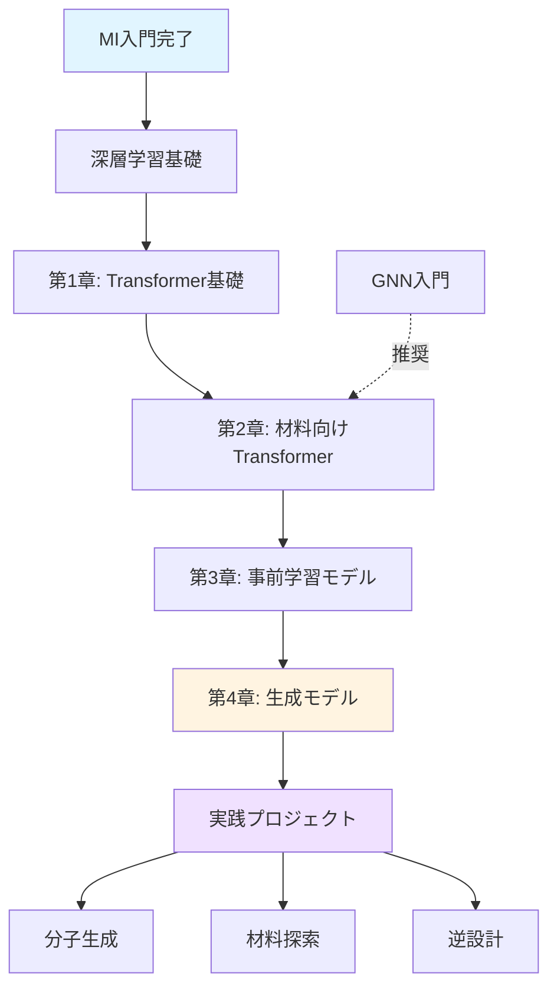

# Transformer・Foundation Models入門
**Transformers and Foundation Models for Materials Science**

## 🎯 シリーズ概要

近年、自然言語処理の分野で革命を起こした**Transformer**アーキテクチャと、その発展形である**Foundation Models（基盤モデル）**が、材料科学の分野にも大きな影響を与え始めています。BERT、GPT、拡散モデルといった技術が、分子設計、材料探索、逆設計に応用され、従来のアプローチでは不可能だった課題を解決しています。

このシリーズでは、Transformerの基礎から材料科学への応用、そして最先端の生成モデルまでを体系的に学びます。

---

## 📚 学習内容

### 第1章: Transformer革命と材料科学
**学習時間**: 20-30分 | **コード例**: 6個

Transformerアーキテクチャの基礎とAttention機構を理解し、材料科学への応用可能性を探ります。

- **Attention機構の原理**
- **Self-AttentionとMulti-Head Attention**
- **Positional Encodingと系列処理**
- **BERT、GPTの基本構造**
- **材料科学への応用事例**

### 第2章: 材料向けTransformerアーキテクチャ
**学習時間**: 30-35分 | **コード例**: 8個

材料科学に特化したTransformerモデルの設計と実装を学びます。

- **Matformer（材料特性予測）**
- **CrystalFormer（結晶構造表現）**
- **ChemBERTa（分子表現学習）**
- **Perceiver IO（多様なデータ統合）**
- **材料データへの適用実践**

### 第3章: 事前学習モデルと転移学習
**学習時間**: 25-30分 | **コード例**: 7個

大規模データで事前学習されたモデルを活用し、少量データでの高精度予測を実現します。

- **事前学習の重要性**
- **MatBERT、MolBERT**
- **ファインチューニング戦略**
- **Few-shot学習**
- **ドメイン適応**

### 第4章: 生成モデルと逆設計
**学習時間**: 20-25分 | **コード例**: 6個

拡散モデルやVAEを用いた分子生成と材料逆設計の最新技術を学びます。

- **拡散モデル（Diffusion Models）**
- **条件付き生成**
- **分子生成と最適化**
- **材料逆設計**
- **産業応用とキャリア**

---

## 🎓 前提知識

### 必須
- **MI入門**: 機械学習の基礎、材料記述子
- **深層学習基礎**: ニューラルネットワーク、PyTorch基本操作
- **Python**: NumPy、pandas、基本的なプログラミング

### 推奨
- **GNN入門**: グラフ表現、分子グラフの扱い
- **線形代数**: 行列演算、固有値・固有ベクトル
- **確率統計**: 確率分布、ベイズ推論

---

## 💻 環境構築

### 必要なライブラリ

```bash
# PyTorch（CUDA対応推奨）
pip install torch torchvision torchaudio

# Hugging Face Transformers
pip install transformers

# 分子・材料科学ライブラリ
pip install rdkit-pypi
pip install matminer
pip install pymatgen

# データ処理・可視化
pip install numpy pandas matplotlib seaborn scikit-learn

# その他
pip install datasets tokenizers
```

### Google Colab
すべてのコード例はGoogle Colabで実行可能です。GPU利用を推奨します。

---

## 📊 学習ロードマップ



---

## 🎯 到達目標

このシリーズを完了すると、以下ができるようになります：

1. **Transformer理解**: Attention機構とTransformerアーキテクチャの原理を理解できる
2. **材料特化モデル**: Matformer、ChemBERTaなど材料向けモデルを実装・活用できる
3. **転移学習**: 事前学習モデルをファインチューニングして実問題に適用できる
4. **生成モデル**: 拡散モデルを用いた分子生成と材料逆設計ができる
5. **実装力**: Hugging Face Transformersを使った実践的な開発ができる

---

## 🔬 応用分野

### 創薬・分子設計
- **分子特性予測**: ADME/T予測、毒性予測
- **分子生成**: 新規薬剤候補の自動生成
- **結合親和性予測**: タンパク質-リガンド相互作用

### 材料探索
- **材料特性予測**: バンドギャップ、形成エネルギー
- **結晶構造予測**: 新規結晶構造の生成
- **組成最適化**: 多成分材料の組成設計

### 逆設計
- **目標特性からの材料生成**: 望ましい特性を持つ材料の自動設計
- **プロセス最適化**: 合成条件の最適化
- **触媒設計**: 目標反応に最適な触媒構造の探索

---

## 📖 章別詳細

### [第1章: Transformer革命と材料科学](chapter-1.md)
Transformerの誕生から材料科学への応用まで、基礎から丁寧に解説します。

**主要トピック**:
- Attention機構の数学的理解
- Transformer vs RNN/CNN
- BERT、GPTの特徴と違い
- 材料科学での成功事例

### [第2章: 材料向けTransformerアーキテクチャ](chapter-2.md)
材料科学に特化したTransformerモデルの設計原理と実装を学びます。

**主要トピック**:
- Matformer: Materials Transformer
- CrystalFormer: 結晶構造表現
- ChemBERTa: 分子SMILES表現学習
- 実装演習: Matformerで材料特性予測

### [第3章: 事前学習モデルと転移学習](chapter-3.md)
大規模データで訓練された事前学習モデルを活用し、少量データでの高精度予測を実現します。

**主要トピック**:
- 事前学習の重要性
- MatBERTでの材料表現学習
- ファインチューニング実践
- Few-shot学習とプロンプトエンジニアリング

### [第4章: 生成モデルと逆設計](chapter-4.md)
拡散モデルやVAEを用いた最先端の分子生成と材料逆設計を学びます。

**主要トピック**:
- 拡散モデルの原理
- 条件付き生成
- 分子生成実践
- 材料逆設計のケーススタディ

---

## 🌟 特徴

### 実行可能なコード
すべてのコード例は実際に動作し、Google Colabで試せます。

### 最新研究の反映
2024年までの最新論文・技術を反映しています。

### 産業応用重視
実際の研究・開発で使える実践的な内容です。

### 段階的学習
基礎から応用まで、無理なく学べる構成です。

---

## 🔗 関連リソース

### 論文
- Vaswani et al. (2017) "Attention Is All You Need"
- Devlin et al. (2019) "BERT: Pre-training of Deep Bidirectional Transformers"
- Radford et al. (2019) "Language Models are Unsupervised Multitask Learners" (GPT-2)
- Ho et al. (2020) "Denoising Diffusion Probabilistic Models"
- Chen et al. (2022) "Matformer: Nested Transformer for Elastic Inference"

### ツール・ライブラリ
- [Hugging Face Transformers](https://huggingface.co/docs/transformers)
- [ChemBERTa](https://github.com/seyonechithrananda/bert-loves-chemistry)
- [MolBERT](https://github.com/BenevolentAI/MolBERT)
- [PyTorch](https://pytorch.org/)

### データセット
- QM9: 134k分子の量子化学計算データ
- Materials Project: 140k材料のDFT計算データ
- PubChem: 100M以上の化学構造データ
- ZINC15: 創薬向け分子データベース

---

## 💡 学習のヒント

1. **数学は後から**: まず動かしてみて、理解を深めてから数式に取り組む
2. **小さく始める**: 小規模なデータセットで実験してから大規模に拡張
3. **可視化重視**: Attention重みを可視化して、モデルの挙動を理解
4. **比較実験**: 従来手法とTransformerを比較して、利点を実感
5. **コミュニティ活用**: Hugging Face Forumで疑問を解決

---

## 📝 演習問題

各章に3つの演習問題があります：
- **基礎問題**: 概念理解を確認
- **実装問題**: コードを書いて実践
- **応用問題**: 発展的な課題に挑戦

---

## 🎓 次のステップ

このシリーズを完了したら：

1. **実践プロジェクト**: 自分の研究データにTransformerを適用
2. **論文実装**: 最新論文のモデルを実装してみる
3. **コンペティション**: Kaggleや学会のコンペに参加
4. **研究発表**: 学会で成果を発表
5. **コミュニティ貢献**: オープンソースプロジェクトに貢献

---

## 📞 サポート

質問や不具合の報告は以下へ：
- **Email**: yusuke.hashimoto.b8@tohoku.ac.jp
- **GitHub Issues**: [AI_Homepage Issues](https://github.com/yourusername/AI_Homepage/issues)

---

**最終更新**: 2025年10月17日
**作成者**: 橋本佑介（東北大学）
**ライセンス**: CC BY 4.0

---

それでは、**[第1章: Transformer革命と材料科学](chapter-1.md)** から学習を始めましょう！
