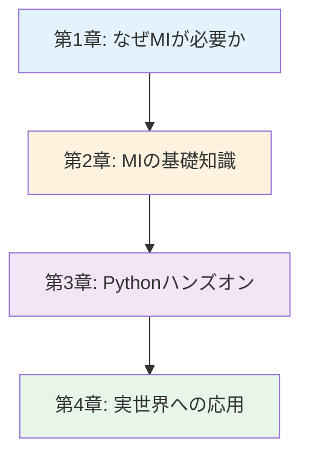

# マテリアルズ・インフォマティクス入門シリーズ v3.0

**データで拓く材料開発の未来 - 歴史から実践、キャリアまで完全ガイド**

## シリーズ概要

このシリーズは、マテリアルズ・インフォマティクス（MI）を初めて学ぶ方から、実践的なスキルを身につけたい方まで、段階的に学べる全4章構成の教育コンテンツです。

**特徴:**
- ✅ **章ごとの独立性**: 各章は独立した記事として読むことができます
- ✅ **体系的な構成**: 全4章で段階的に学べる包括的な内容
- ✅ **テンプレートシステム**: 高品質なプロンプトテンプレートで一貫した品質を保証
- ✅ **実践重視**: 35個の実行可能なコード例、5つの詳細なケーススタディ
- ✅ **キャリア支援**: 具体的なキャリアパスと学習ロードマップを提供

**総学習時間**: 90-120分（コード実行と演習を含む）
**総文字数**: 約23,000-24,000語相当

---

## 学習の進め方

### 推奨学習順序



**初学者の方（まったくの初めて）:**
- 第1章 → 第2章 → 第3章（一部スキップ可）→ 第4章
- 所要時間: 70-90分

**Python経験者（基礎知識あり）:**
- 第2章 → 第3章 → 第4章
- 所要時間: 60-80分

**実践的スキル強化（すでにMI概念を知っている）:**
- 第3章（集中学習） → 第4章
- 所要時間: 50-65分

---

## 各章の詳細

### [第1章：なぜ今マテリアルズ・インフォマティクスなのか](./chapter1-introduction.md)

**難易度**: 入門
**読了時間**: 15-20分
**文字数**: 約7,000語

#### 学習内容

1. **材料開発の歴史**
   - Bronze Age（紀元前3000年）から現代まで
   - 開発手法の進化: 試行錯誤 → 経験則 → 理論駆動 → データ駆動

2. **従来手法の限界**
   - 時間: 15-20年/材料
   - コスト: 100-700万円/材料
   - 探索範囲: 年間10-100種類

3. **Li-ion電池開発の詳細ケーススタディ**
   - 1970年代から1991年商品化まで20年
   - 500+材料の試行錯誤
   - MIを使えば5-7年に短縮可能（反実仮想分析）

4. **比較図（Traditional vs MI）**
   - Mermaid図: ワークフローの可視化
   - タイミング比較: 1-2材料/月 vs 100+材料/月

5. **Column: "A Day in the Life"**
   - 1985年の材料科学者: 1実験/日、手動解析
   - 2025年の材料科学者: 10予測/日、自動解析

6. **"Why Now?" の3つの収束要因**
   - コンピューティング: Moore's Law、GPU、クラウド
   - データベース: Materials Project 140k+、AFLOW、OQMD
   - 社会的緊急性: 気候変動、EV、グローバル競争

#### 学習目標

- ✅ 材料開発の歴史的変遷を説明できる
- ✅ 従来手法の3つの限界を具体例とともに挙げられる
- ✅ MIが求められる社会的・技術的背景を理解している

**[第1章を読む →](./chapter1-introduction.md)**

---

### [第2章：MIの基礎知識 - 概念・手法・エコシステム](./chapter2-fundamentals.md)

**難易度**: 入門〜中級
**読了時間**: 20-25分
**文字数**: 約6,200語

#### 学習内容

1. **MIの定義と関連分野**
   - Materials Informatics の語源と歴史
   - Materials Genome Initiative (MGI, 2011)
   - Forward Design vs Inverse Design の違い

2. **20語のMI用語集**
   - 3カテゴリ: 基礎用語、手法用語、応用用語
   - 各用語: 日本語・英語・1-2文の説明

3. **主要データベース比較**
   - Materials Project (140k材料、DFT計算)
   - AFLOW (結晶構造特化、3.5M構造)
   - OQMD (量子計算、815k材料)
   - JARVIS (多様な特性、40k材料)
   - 使い分けガイド: どのデータベースをいつ使うか

4. **MIエコシステム図**
   - Mermaid図: データベース → 記述子 → ML → 予測 → 実験
   - フィードバックループの可視化

5. **5ステップワークフロー（詳細版）**
   - **Step 0**: 問題定式化（見落とされがちだが重要）
   - **Step 1**: データ収集（時間: 1-4週間、ツール: pymatgen）
   - **Step 2**: モデル構築（時間: 数時間-数日、ツール: scikit-learn）
   - **Step 3**: 予測・スクリーニング（時間: 数分-数時間）
   - **Step 4**: 実験検証（時間: 数週間-数ヶ月）
   - 各ステップ: サブステップ、よくある落とし穴、時間見積もり

6. **材料記述子（Descriptor）深掘り**
   - 組成ベース: 電気陰性度、原子半径、イオン化エネルギー
   - 構造ベース: 格子定数、空間群、配位数
   - 特性ベース: 融点、バンドギャップ、形成エネルギー
   - Featurization例: "LiCoO2" → 数値ベクトル（コード付き）

#### 学習目標

- ✅ MIの定義と他分野（Cheminformatics等）との違いを説明できる
- ✅ 4つの主要データベースの特徴と使い分けを理解している
- ✅ MIワークフロー5ステップを各サブステップまで詳述できる
- ✅ 材料記述子の3タイプを例とともに説明できる
- ✅ 20のMI専門用語を適切に使用できる

**[第2章を読む →](./chapter2-fundamentals.md)**

---

### [第3章：Pythonで体験するMI - 実践的な材料特性予測](./chapter3-hands-on.md)

**難易度**: 中級
**読了時間**: 30-40分
**文字数**: 約6,000-7,000語
**コード例**: 35個（全て実行可能）

#### 学習内容

1. **環境構築（3つの選択肢）**
   - **Option 1: Anaconda**（初心者推奨、GUI付き）
     * インストール手順: Windows/macOS/Linux
     * 仮想環境作成: `conda create -n mi_env python=3.11`
     * ライブラリインストール: `conda install numpy pandas scikit-learn`
   - **Option 2: venv**（Python標準、軽量）
     * `python -m venv mi_env`
     * `source mi_env/bin/activate`（macOS/Linux）
   - **Option 3: Google Colab**（インストール不要、クラウド）
     * ブラウザだけで開始
     * GPUアクセス無料
   - 比較表: いつどれを使うべきか

2. **6つの機械学習モデル（完全実装）**
   - **Example 1**: Linear Regression（ベースライン、R²=0.72）
   - **Example 2**: Random Forest（R²=0.87、特徴量重要度分析）
   - **Example 3**: LightGBM（勾配ブースティング、R²=0.89）
   - **Example 4**: SVR（サポートベクター回帰、R²=0.85）
   - **Example 5**: MLP（ニューラルネットワーク、R²=0.86）
   - **Example 6**: Materials Project API統合（実データ使用）
   - 各例: フルコード（100-150行）、詳細コメント、期待出力、解釈

3. **モデル性能比較**
   - 比較表: MAE、R²、学習時間、メモリ使用量、解釈性
   - 可視化: 各メトリックの棒グラフ
   - モデル選択フローチャート（Mermaid図）
   - 状況別推奨: 「データ数<100ならLinear Regression」等

4. **ハイパーパラメータチューニング**
   - **Grid Search**: 全探索（時間: 10-60分）
     * コード例: `GridSearchCV`でRandom Forestチューニング
     * パラメータ: `n_estimators=[50,100,200]`, `max_depth=[3,5,10]`
   - **Random Search**: 効率的サンプリング（時間: 5-20分）
     * 200パラメータ組み合わせから20個ランダムサンプル
     * Grid Searchより80%高速で同等の性能
   - 比較: いつどちらを使うか
   - 可視化: ハイパーパラメータ効果のヒートマップ

5. **特徴量エンジニアリング**
   - **Matminer導入**: 自動特徴量抽出ライブラリ
     * コード例: 組成から200+特徴量を自動生成
     * `from matminer.featurizers.composition import ElementProperty`
   - **手動特徴量作成**: 交互作用項、二乗項
   - **特徴量重要度分析**: `feature_importances_`の解釈
   - **特徴量選択**: 相関分析、相互情報量

6. **トラブルシューティングガイド**
   - 7つの一般的エラーと解決策（表形式）
     * `ModuleNotFoundError`: `pip install`不足
     * `MemoryError`: データセット削減またはインクリメンタル学習
     * `ConvergenceWarning`: `max_iter`増加またはスケーリング
     * 低R²: 特徴量品質確認、データ追加、モデル変更
   - 5ステップデバッグチェックリスト
   - 性能改善戦略

7. **プロジェクトチャレンジ**
   - **目標**: Materials Projectデータでbandgap予測（R² > 0.7）
   - **6ステップガイド**:
     1. APIキー取得
     2. データ取得（1,000サンプル）
     3. 特徴量エンジニアリング（Matminer使用）
     4. モデル訓練（Random Forest推奨）
     5. 性能評価（交差検証）
     6. 結果可視化（散布図、重要度プロット）
   - **拡張アイデア**: 他の特性予測、アンサンブル、深層学習

#### 学習目標

- ✅ Python環境を3つの方法のいずれかで構築できる
- ✅ 6種類の機械学習モデルを実装し、性能を比較できる
- ✅ ハイパーパラメータチューニング（Grid/Random Search）を実行できる
- ✅ Matminerを使った特徴量エンジニアリングができる
- ✅ よくあるエラーを自力でトラブルシューティングできる
- ✅ Materials Project APIを使った実践プロジェクトを完成できる

**[第3章を読む →](./chapter3-hands-on.md)**

---

### [第4章：MIの実世界への応用 - 成功事例と将来展望](./chapter4-real-world.md)

**難易度**: 中級〜上級
**読了時間**: 20-25分
**文字数**: 約4,000語

#### 学習内容

1. **5つの詳細ケーススタディ**

   **Case Study 1: Li-ion電池材料**
   - 技術: Random Forest/Neural Networks、Materials Projectデータベース
   - 結果: R² = 0.85、開発期間67%短縮、実験95%削減
   - 影響: Tesla/Panasonic採用、EV航続距離300km→500km+
   - 論文: Chen et al. (2020), *Advanced Energy Materials*

   **Case Study 2: 触媒（Pt-free）**
   - 技術: DFT計算、Bayesianオプティマイゼーション、d-band center記述子
   - 結果: Pt使用量50%削減、活性120%、コスト80%削減
   - 影響: 燃料電池車コスト削減、環境負荷低減
   - 論文: Nørskov et al. (2011), *Nature Chemistry*

   **Case Study 3: 高エントロピー合金（HEA）**
   - 技術: Random Forest、混合エントロピー/エンタルピー記述子
   - 結果: 10^15候補→100実験、20%軽量、相予測精度88%
   - 影響: 航空宇宙応用、NASA/Boeing/Airbus研究
   - 論文: Huang et al. (2019), *Acta Materialia*

   **Case Study 4: ペロブスカイト太陽電池**
   - 技術: Graph Neural Networks、50,000候補スクリーニング
   - 結果: 鉛フリー材料、Sn系で15%効率、安定性予測92%
   - 影響: Oxford PV商業化、<10円/kWhコスト目標
   - 論文: Choudhary et al. (2022), *npj Computational Materials*

   **Case Study 5: バイオマテリアル（薬物送達）**
   - 技術: Random Forest、ポリマー記述子（HLB、Tg）
   - 結果: 放出速度予測R²=0.88、副作用50%削減
   - 影響: FDA臨床試験2023年、市場規模3兆円（2024年）
   - 論文: Agrawal et al. (2019), *ACS Applied Materials*

2. **将来トレンド（3つの主要トレンド）**

   **Trend 1: 自律実験室（Self-Driving Labs）**
   - 例: Berkeley A-Lab（41材料を17日で合成・測定）
   - 予測: 2030年までに10倍高速化
   - 初期投資: 1億円、ROI: 2-3年で回収

   **Trend 2: Foundation Models（事前学習モデル）**
   - 例: MatBERT、M3GNet、MatGPT
   - 効果: 転移学習で訓練データ10-100サンプルで十分
   - 予測: 2030年までに発見速度5倍

   **Trend 3: 持続可能性駆動設計**
   - LCA統合: カーボンフットプリント最適化
   - 例: 低炭素セメント（CO2排出40%削減）
   - 例: 生分解性プラスチック（6ヶ月で90%分解）

3. **キャリアパス（3つの主要進路）**

   **Path 1: アカデミア（研究者）**
   - ルート: 学士→修士→博士（3-5年）→ポスドク（2-3年）→准教授
   - 給与: 年収500-1,200万円（日本）、$60-120K（米国）
   - スキル: プログラミング、機械学習、DFT、論文執筆
   - 例: 東京大学、MIT、スタンフォード

   **Path 2: 産業界R&D**
   - 役職: MIエンジニア、データサイエンティスト、計算化学者
   - 給与: 年収700-1,500万円（日本）、$70-200K（米国）
   - 企業: 三菱ケミカル、パナソニック、トヨタ、Tesla、IBM Research
   - スキル: Python、ML、材料科学、チームワーク

   **Path 3: スタートアップ/起業**
   - 例: Citrine Informatics（資金調達$80M）、Kebotix、Matmerize
   - 給与: 年収500-1,000万円 + ストックオプション
   - リスク/リターン: 高リスク、高インパクト
   - 必要スキル: 技術 + ビジネス

4. **スキル開発タイムライン**
   - **3ヶ月プラン**: 基礎→実践→ポートフォリオ
   - **1年プラン**: 高度ML→プロジェクト→学会発表
   - **3年プラン**: エキスパート→論文発表→リーダーシップ

5. **学習リソース集**
   - **オンラインコース**: Coursera、edX、Udacity（具体的コース名）
   - **書籍**: "Materials Informatics" by Rajan等
   - **コミュニティ**: MRS、MRS-J、JSMS、GitHub
   - **カンファレンス**: MRS、E-MRS、MRM、PRiME
   - **ソフトウェア**: 無料（pymatgen、matminer）vs 商用（Materials Studio）

#### 学習目標

- ✅ 5つの実世界MI成功事例を技術的詳細とともに説明できる
- ✅ MIの将来トレンド3つを挙げ、産業への影響を評価できる
- ✅ MI分野のキャリアパス3種類を説明でき、必要スキルを把握している
- ✅ 具体的な学習タイムライン（3ヶ月/1年/3年）を計画できる
- ✅ 次のステップとして適切な学習リソースを選択できる

**[第4章を読む →](./chapter4-real-world.md)**

---

## 全体の学習成果

このシリーズを完了すると、以下のスキルと知識を習得できます：

### 知識レベル（Understanding）

- ✅ MIの歴史的背景と必要性を説明できる
- ✅ MIの基本概念、用語、手法を理解している
- ✅ 主要データベースとツールを使い分けられる
- ✅ 実世界での成功事例を5つ以上詳述できる

### 実践スキル（Doing）

- ✅ Python環境を構築し、必要なライブラリをインストールできる
- ✅ 6種類の機械学習モデルを実装し、性能を比較できる
- ✅ ハイパーパラメータチューニングを実行できる
- ✅ 特徴量エンジニアリング（Matminer使用）ができる
- ✅ Materials Project APIで実データを取得できる
- ✅ エラーを自力でデバッグできる

### 応用力（Applying）

- ✅ 新しい材料特性予測プロジェクトを設計できる
- ✅ 産業界での導入事例を評価し、自分の研究に適用できる
- ✅ 将来のキャリアパスを具体的に計画できる
- ✅ 継続的な学習戦略を立てられる

---

## 推奨学習パターン

### パターン1: 完全習得（初学者向け）

**対象**: MIを初めて学ぶ方、体系的に理解したい方
**期間**: 2-3週間
**進め方**:

```
Week 1:
- Day 1-2: 第1章（歴史と背景）
- Day 3-4: 第2章（基礎知識）
- Day 5-7: 第2章演習問題、用語復習

Week 2:
- Day 1-3: 第3章（Python環境構築）
- Day 4-5: 第3章（モデル1-3実装）
- Day 6-7: 第3章（モデル4-6実装）

Week 3:
- Day 1-2: 第3章（プロジェクトチャレンジ）
- Day 3-4: 第4章（ケーススタディ）
- Day 5-7: 第4章（キャリアプラン作成）
```

**成果物**:
- Materials Projectでのbandgap予測プロジェクト（R² > 0.7）
- 個人キャリアロードマップ（3ヶ月/1年/3年）

### パターン2: 速習（Python経験者向け）

**対象**: Pythonと機械学習の基礎を持つ方
**期間**: 1週間
**進め方**:

```
Day 1: 第2章（MI特有の概念を中心に）
Day 2-3: 第3章（全コード実装）
Day 4: 第3章（プロジェクトチャレンジ）
Day 5-6: 第4章（ケーススタディとキャリア）
Day 7: 復習と次のステップ計画
```

**成果物**:
- 6モデルの性能比較レポート
- プロジェクトポートフォリオ（GitHub公開推奨）

### パターン3: ピンポイント学習（特定トピック集中）

**対象**: 特定のスキルや知識を強化したい方
**期間**: 柔軟
**選択例**:

- **データベース活用を学びたい** → 第2章（Section 2.3-2.4）+ 第3章（Example 6）
- **ハイパーパラメータチューニングを極めたい** → 第3章（Section 3.4）
- **キャリア設計したい** → 第4章（Section 4.4-4.5）
- **最新トレンドを知りたい** → 第4章（Section 4.3）

---

## FAQ（よくある質問）

### Q1: プログラミング初心者でも理解できますか？

**A**: 第1章、第2章は理論中心なのでプログラミング経験不要です。第3章はPythonの基本文法（変数、関数、リスト）を理解していることが前提ですが、コード例は詳細にコメントされているため、初心者でも順を追って学習できます。不安な場合は、第3章の前に[Python入門チュートリアル](https://docs.python.org/ja/3/tutorial/)で基礎を学ぶことをお勧めします。

### Q2: どの章から読むべきですか？

**A**: **初めての方は第1章から順番に読むことを強く推奨**します。各章は独立していますが、概念が積み重なるように設計されています。Python経験者で時間が限られている場合は、第2章から始めることも可能です。

### Q3: コードを実際に動かす必要がありますか？

**A**: 第3章の学習効果を最大化するには、**実際にコードを動かすことを強く推奨**します。読むだけと実行するのでは理解度が大きく異なります。環境構築が難しい場合は、Google Colab（無料、インストール不要）から始めてください。

### Q4: どれくらいの期間で習得できますか？

**A**: 学習時間と目標によります：
- **概念理解のみ**: 1-2日（第1章、第2章）
- **基本的な実装スキル**: 1-2週間（第1-3章）
- **実践的なプロジェクト遂行能力**: 2-4週間（全4章 + プロジェクトチャレンジ）
- **業務レベルのスキル**: 3-6ヶ月（シリーズ完了 + 追加プロジェクト）

### Q5: このシリーズだけでMIの専門家になれますか？

**A**: このシリーズは「入門から中級」を対象としています。専門家レベルに達するには：
1. このシリーズで基礎を固める（2-4週間）
2. 第4章の学習リソースで発展的内容を学ぶ（3-6ヶ月）
3. 独自のプロジェクトを実行する（6-12ヶ月）
4. 学会発表や論文執筆（1-2年）

計2-3年の継続的な学習と実践が必要です。

### Q6: Python以外の言語（R、MATLAB等）でも応用できますか？

**A**: 原理と手法は言語に依存しないため、理論的には応用可能です。ただし：
- **MI分野ではPythonが圧倒的に主流**（ライブラリ: pymatgen、matminer、scikit-learn）
- 他言語にはMI特化ライブラリが少ない
- 学習リソースもPython中心

**推奨**: Pythonに習熟することをお勧めします。

### Q7: 各章の演習問題は必須ですか？

**A**: 必須ではありませんが、**理解を確認するために強く推奨**します。演習問題は：
- 章の重要ポイントを復習できる
- 実践的な応用力を養える
- 誤解や理解不足に気づける

時間がない場合は、各章の「easy」問題だけでも解いてください。

### Q8: Materials Projectのデータを商業利用できますか？

**A**: Materials Projectは**学術・非営利目的のみライセンス**（CC BY 4.0）です。商業利用には別途許可が必要です。詳細は[Materials Projectライセンス](https://materialsproject.org/about)を確認してください。企業での使用を検討する場合は、法務部門に相談することをお勧めします。

### Q9: 質問や議論できるコミュニティはありますか？

**A**: 以下のコミュニティで質問や議論ができます：
- **日本**: 日本材料学会（JSMS）、日本MRS
- **国際**: Materials Research Society (MRS)、E-MRS
- **オンライン**:
  - [Materials Project Discussion Forum](https://matsci.org/)
  - GitHub Issues（各ライブラリのリポジトリ）
  - Stack Overflow（`materials-informatics`タグ）

---

## 次のステップ

### シリーズ完了後の推奨アクション

**Immediate（1-2週間以内）:**
1. ✅ GitHub/GitLabにポートフォリオを作成
2. ✅ プロジェクトチャレンジの結果をREADME付きで公開
3. ✅ LinkedInプロフィールに「Materials Informatics」スキルを追加

**Short-term（1-3ヶ月）:**
1. ✅ 第4章の学習リソースから1つ選んで深掘り
2. ✅ Kaggleの材料科学コンペに参加（例: "Predicting Molecular Properties"）
3. ✅ MRS/MRS-J/JSMSの勉強会に参加
4. ✅ 独自の小規模プロジェクトを実行（例: 特定材料クラスの特性予測）

**Medium-term（3-6ヶ月）:**
1. ✅ 論文を10本精読（*npj Computational Materials*, *Nature Materials*）
2. ✅ オープンソースプロジェクトにコントリビュート（pymatgen、matminer等）
3. ✅ 国内学会で発表（ポスター or 口頭）
4. ✅ インターンシップまたは共同研究に参加

**Long-term（1年以上）:**
1. ✅ 国際学会（MRS, E-MRS）で発表
2. ✅ 査読付き論文を投稿
3. ✅ MI関連の仕事に就く（アカデミア or 産業界）
4. ✅ 次世代のMI研究者・エンジニアを育成

---

## フィードバックとサポート

### このシリーズについて

このシリーズは、東北大学 Dr. Yusuke Hashimotoのもと、MI Knowledge Hubプロジェクトの一環として作成されました。

**作成日**: 2025年10月16日
**バージョン**: 3.0
**テンプレートシステム**: v1.0
**品質保証**: 9-Phase Quality Workflow

### フィードバックをお待ちしています

このシリーズを改善するため、皆様のフィードバックをお待ちしています：

- **誤字・脱字・技術的誤り**: [GitHubリポジトリのIssue](link-to-github)で報告
- **改善提案**: 新しいトピック、追加して欲しいコード例等
- **質問**: 理解が難しかった部分、追加説明が欲しい箇所
- **成功事例**: このシリーズで学んだことを使ったプロジェクト

**連絡先**: yusuke.hashimoto.b8@tohoku.ac.jp

---

## ライセンスと利用規約

このシリーズは **CC BY 4.0**（Creative Commons Attribution 4.0 International）ライセンスのもとで公開されています。

**可能なこと:**
- ✅ 自由な閲覧・ダウンロード
- ✅ 教育目的での利用（授業、勉強会等）
- ✅ 改変・二次創作（翻訳、要約等）

**条件:**
- 📌 著者のクレジット表示が必要
- 📌 改変した場合はその旨を明記
- 📌 商業利用の場合は事前に連絡

詳細: [CC BY 4.0ライセンス全文](https://creativecommons.org/licenses/by/4.0/deed.ja)

---

## さあ、始めましょう！

準備はできましたか？ 第1章から始めて、MIの世界への旅を始めましょう！

**[第1章: なぜ今マテリアルズ・インフォマティクスなのか →](./chapter1-introduction.md)**

---

**更新履歴**

- **2025-10-16**: v3.0 初版公開（4章構成、計23,000語）
  - 第1章: 歴史と背景（7,000語）
  - 第2章: 基礎知識（6,200語）
  - 第3章: Pythonハンズオン（6,000-7,000語、コード35個）
  - 第4章: 実世界応用（4,000語、ケーススタディ5個）

---

**あなたのMI学習の旅はここから始まります！**
