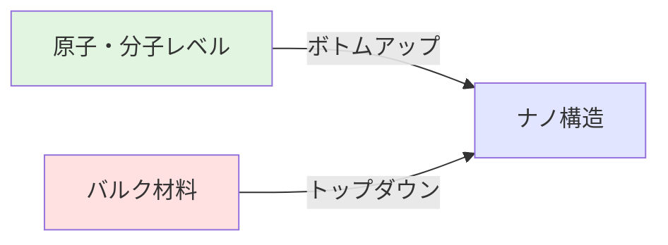

# Chapter 2: ナノ材料の基礎原理

合成法とキャラクタリゼーション技術

---

## 本章の学習目標

本章では、ナノ材料研究の基盤となる合成技術とキャラクタリゼーション手法について学びます。

- ✅ ボトムアップ法とトップダウン法の違いと、それぞれの代表的な合成手法を理解する
- ✅ TEM、SEM、XRDなどの主要なキャラクタリゼーション技術の原理と応用を習得する
- ✅ ナノスケールで発現するサイズ依存物性（融点降下、光学特性変化、超常磁性）を定量的に理解する
- ✅ 表面・界面効果がナノ材料の特性に与える影響を理解する
- ✅ 実験データの解釈方法と、適切な評価手法の選択基準を身につける
- ✅ 実際の研究現場で活用できる合成・評価の実践的知識を獲得する

---

## 2.1 ナノ材料の合成法

ナノ材料の合成法は、大きく**ボトムアップ法（Bottom-up）**と**トップダウン法（Top-down）**の2つのアプローチに分類されます。これらは物質構築の方向性が根本的に異なり、それぞれに適した応用分野があります。

### ボトムアップ法 vs トップダウン法



| 比較項目 | ボトムアップ法 | トップダウン法 |
|---------|--------------|--------------|
| **構築方向** | 原子・分子 → ナノ構造 | バルク材料 → ナノ構造 |
| **サイズ制御** | 優れている（原子レベル） | 限界あり（~10 nm） |
| **形状制御** | 多様な形態が可能 | 限定的 |
| **結晶性** | 高結晶性が得やすい | 欠陥が生じやすい |
| **スケーラビリティ** | 大量合成が可能 | 並列化で対応 |
| **コスト** | 比較的低コスト | 装置が高価 |
| **代表例** | CVD、液相合成、自己組織化 | リソグラフィー、エッチング |
| **適用分野** | 触媒、医療、エネルギー | 半導体、MEMS、センサー |

### 主要なボトムアップ合成法

#### 化学気相成長法（Chemical Vapor Deposition, CVD）

**原理**

CVDは、気相中の前駆体（precursor）を化学反応させることで基板上に薄膜やナノ構造を形成する手法です。典型的なプロセスは以下の段階で進行します：

1. **気相輸送**: 前駆体ガスが反応室に導入される
2. **表面拡散**: ガス分子が基板表面に吸着し拡散する
3. **化学反応**: 触媒表面または高温条件下で分解・反応する
4. **核生成・成長**: ナノ構造が形成・成長する
5. **副生成物除去**: 反応で生じたガスが排出される

**代表例：カーボンナノチューブ（CNT）合成**

触媒CVD法によるCNT合成は、鉄（Fe）、コバルト（Co）、ニッケル（Ni）などの金属ナノ粒子を触媒として、炭化水素ガス（エチレン、メタン、アセチレンなど）を800-1000℃で分解させることで実現します。

```
C₂H₄ (g) → 2C (CNT) + 2H₂ (g)  [触媒: Fe/Co/Ni, 800-1000℃]
```

**代表例：グラフェン合成**

銅箔上でのCVD法は、高品質な単層グラフェンを大面積で合成できる手法として確立されています。1000℃程度の高温でメタンガスを分解し、銅表面の触媒作用により単層グラフェンが成長します。

**利点と欠点**

✅ 利点：
- 高結晶性・高純度な材料が得られる
- 連続プロセスで大量生産が可能
- 成長条件（温度、ガス流量、圧力）で構造制御が可能
- 基板上への直接成長により複雑なプロセスが不要

❌ 欠点：
- 高温プロセス（500-1000℃以上）が必要
- 装置コストが高い
- 前駆体ガスに毒性・可燃性があることがある
- 基板材料が限定される（高温耐性必須）

#### 液相合成法

液相合成は、溶液中での化学反応を利用してナノ材料を作製する手法で、比較的低温（室温～300℃程度）で実施できることが特徴です。

**ゾルゲル法（Sol-gel Method）**

金属アルコキシドの加水分解と縮合反応を利用して、酸化物ナノ粒子や多孔質材料を合成します。

```
Si(OC₂H₅)₄ + 4H₂O → Si(OH)₄ + 4C₂H₅OH  (加水分解)
Si(OH)₄ → SiO₂ + 2H₂O                   (縮合)
```

応用例：SiO₂、TiO₂、ZrO₂ナノ粒子、メソポーラスシリカ

**水熱合成法（Hydrothermal Synthesis）**

密閉容器（オートクレーブ）内で、水溶液を高温高圧（100-300℃、数MPa）条件下で反応させる手法です。熱力学的に安定な結晶相が得られ、粒径や形状の制御が容易です。

応用例：ZnO、TiO₂、ゼオライト、金属酸化物ナノロッド

**共沈法（Co-precipitation）**

金属塩溶液にpH調整剤（NaOH、NH₃など）を加えて金属水酸化物を沈殿させ、焼成により酸化物ナノ粒子を得る手法です。

```
Fe²⁺ + 2Fe³⁺ + 8OH⁻ → Fe₃O₄ + 4H₂O
```

応用例：磁性ナノ粒子（Fe₃O₄、γ-Fe₂O₃）、スピネル型酸化物

**金属ナノ粒子の還元合成**

金属イオンを還元剤により還元し、保護剤（界面活性剤、高分子）存在下で金属ナノ粒子を合成します。

代表例：**Turkevich法による金ナノ粒子合成**

```
HAuCl₄ + C₆H₅O₇Na₃ → Au⁰ (nanoparticles) + 酸化生成物
```

クエン酸ナトリウムが還元剤と保護剤の両方の役割を果たし、10-50 nmの球状金ナノ粒子が得られます。サイズは金塩とクエン酸の濃度比で制御できます。

#### 気相合成法

**スパッタリング（Sputtering）**

高エネルギーイオン（通常Ar⁺）をターゲット材料に衝突させ、叩き出された原子を基板上に堆積させる物理的成膜法です。真空チャンバー内で実施され、薄膜やナノ粒子の作製に広く使用されます。

特徴：
- ほぼすべての材料に適用可能（金属、酸化物、窒化物、合金）
- 成膜速度と粒径の精密制御が可能
- 均一な膜厚分布
- 産業応用が確立（半導体、ディスプレイ、ハードコーティング）

**レーザーアブレーション（Laser Ablation）**

高出力パルスレーザーを固体ターゲットに照射し、瞬間的な蒸発により生成されたプラズマから気相成長させる手法です。

特徴：
- 高融点材料やセラミックスにも適用可能
- 化学量論組成が保持される
- ナノ粒子サイズ分布が狭い
- 小規模・研究用途向き

### 主要なトップダウン合成法

#### 機械的粉砕法（ボールミリング、Ball Milling）

硬質ボールを高速回転させることで、バルク材料を機械的に粉砕してナノ粒子を作製します。

**プロセス**

1. バルク材料と硬質ボール（ジルコニア、ステンレス、WCなど）を容器に投入
2. 高速回転（200-600 rpm）により衝撃・摩擦エネルギーを付与
3. 繰り返し粉砕により粒径が減少（通常数時間～数十時間）

**応用例**

- 金属・合金ナノ粒子
- セラミックスナノ粉末
- 機械的合金化（Mechanical Alloying）
- 薬物ナノ粒子（医薬品の溶解性向上）

**利点と欠点**

✅ 利点：
- シンプルな装置で低コスト
- スケールアップが容易
- 幅広い材料に適用可能

❌ 欠点：
- 粒径分布が広い（均一性に欠ける）
- 結晶欠陥や非晶質化が生じる
- 不純物混入のリスク（ボールやコンテナからの摩耗）
- 形状制御が困難

#### リソグラフィー法（Lithography）

フォトマスクやビームを用いて基板上にパターンを形成し、エッチングやリフトオフによりナノ構造を作製します。

**フォトリソグラフィー（Photo-lithography）**

- 解像度：~100 nm（最先端で5-7 nm EUVリソグラフィー）
- 応用：半導体集積回路、MEMS

**電子ビームリソグラフィー（Electron Beam Lithography, EBL）**

- 解像度：<10 nm
- 電子ビームで直接描画（マスク不要）
- 研究開発・プロトタイピング向き（スループット低い）

**ナノインプリントリソグラフィー（Nano-imprint Lithography, NIL）**

- モールド（鋳型）を用いた物理的転写
- 低コスト・高スループット
- バイオセンサー、メタマテリアル応用

#### エッチング法（Etching）

**ドライエッチング**

プラズマやイオンビームを用いた物理的・化学的除去。異方性エッチング（垂直方向に選択的）が可能で、半導体プロセスの標準技術です。

**ウェットエッチング**

化学溶液による化学的除去。等方性エッチングが基本ですが、結晶方位依存性を利用した異方性エッチングも可能（シリコンのKOHエッチングなど）。

---

## 2.2 キャラクタリゼーション技術

ナノ材料の特性を正確に評価するためには、複数の分析手法を組み合わせることが不可欠です。ここでは、形態観察、構造解析、組成分析、光学特性評価の各カテゴリーにおける主要技術を解説します。

### 形態観察技術

#### 透過型電子顕微鏡（Transmission Electron Microscopy, TEM）

**原理**

TEMは、加速電圧100-300 kVで加速された電子線を薄片試料（厚さ<100 nm）に透過させ、透過電子や散乱電子を検出して画像を形成します。電子の波長は可視光（400-700 nm）よりはるかに短い（200 kV加速電子で約2.5 pm）ため、原子レベルの分解能が実現できます。

**測定可能項目**

| 観察モード | 測定項目 | 分解能 |
|----------|---------|--------|
| **明視野像（BF）** | 形状、サイズ、分散状態 | <0.5 nm |
| **暗視野像（DF）** | 結晶粒界、欠陥観察 | <1 nm |
| **高分解能TEM（HRTEM）** | 結晶格子像、原子配列 | <0.1 nm |
| **電子回折（SAED）** | 結晶構造、格子定数 | 角度分解能 |
| **走査TEM（STEM）** | 元素マッピング（EELS、EDX併用） | <0.1 nm |

**典型的な分解能**: 0.2-0.5 nm（点分解能）、0.1 nm以下（最先端装置）

**応用例**

1. **金ナノ粒子のサイズ・形状評価**
   - 50個以上の粒子を測定してサイズ分布をヒストグラムで評価
   - 標準偏差（SD）や変動係数（CV = SD/平均 × 100%）で均一性を定量化

2. **カーボンナノチューブの構造解析**
   - 層数の決定（単層SWCNT、多層MWCNT）
   - 直径と長さの測定
   - 欠陥密度の評価

3. **量子ドットの結晶性評価**
   - HRTEM格子像から結晶構造を同定
   - 結晶面間隔の測定（例：CdSe (111)面 = 0.35 nm）

#### 走査型電子顕微鏡（Scanning Electron Microscopy, SEM）

**原理**

SEMは、細く絞った電子ビーム（プローブ径1-10 nm）を試料表面で走査し、放出される二次電子や反射電子を検出して表面形状を画像化します。

**TEMとの違い**

| 項目 | TEM | SEM |
|-----|-----|-----|
| **電子の検出** | 透過電子 | 二次電子・反射電子 |
| **試料要件** | 薄片（<100 nm） | バルク試料可 |
| **観察範囲** | 微小領域（数μm以下） | 広範囲（mm～cm） |
| **分解能** | <0.5 nm | 1-10 nm |
| **試料準備** | 困難（薄片化必要） | 容易（導電処理のみ） |
| **情報深さ** | 試料厚さ全体 | 表面～数μm |
| **適用** | 内部構造、原子配列 | 表面形状、粗さ |

**応用例**

1. **ナノワイヤー・ナノロッドの形態観察**
   - 長さと直径の測定
   - アスペクト比（長さ/直径）の算出
   - 配向性の評価

2. **ナノポーラス材料の細孔構造**
   - 細孔径分布
   - 表面粗さ

3. **ナノコンポジットの分散状態**
   - マトリックス中のナノ粒子分布
   - 凝集の有無

#### 原子間力顕微鏡（Atomic Force Microscopy, AFM）

**原理**

AFMは、先端半径10-100 nmの鋭利なカンチレバー（探針）を試料表面に近づけ、原子間力（ファンデルワールス力、静電気力など）による探針の変位をレーザー反射で検出して表面形状を画像化します。

**測定モード**

- **コンタクトモード**: 探針を試料に接触させて走査（高分解能だが試料損傷リスク）
- **タッピングモード**: 探針を共振振動させて間欠的に接触（ソフトサンプル向き）
- **ノンコンタクトモード**: 非接触で静電気力を検出（超高分解能）

**特徴**

✅ 利点：
- 真空不要（大気中、液中測定可）
- 絶縁体・導電体問わず測定可能
- 定量的な高さ情報（Z方向分解能 <0.1 nm）

❌ 欠点：
- 走査速度が遅い（数分～数十分/画像）
- 測定範囲が限定的（通常<100 μm角）
- 探針摩耗による画像劣化

**応用例**

- グラフェンの層数決定（層間距離0.34 nmを高さ測定で識別）
- DNAやタンパク質の構造観察
- 薄膜の表面粗さ評価（Ra、RMS算出）

### 構造解析技術

#### X線回折（X-ray Diffraction, XRD）

**原理（Braggの法則）**

結晶格子面でのX線の干渉により回折ピークが現れます。Braggの法則は、回折条件を以下の式で表します：

$$
n\lambda = 2d\sin\theta
$$

ここで、
- $n$：回折次数（整数）
- $\lambda$：X線波長（Cu Kα線で0.154 nm）
- $d$：格子面間隔
- $\theta$：入射角（Bragg角）

**結晶構造の同定**

回折パターン（2θ vs 強度）を標準データベース（ICDD PDF、COD）と照合することで、結晶相を同定します。

例：金ナノ粒子（FCC構造）
- (111)面: 2θ ≈ 38.2°
- (200)面: 2θ ≈ 44.4°
- (220)面: 2θ ≈ 64.6°
- (311)面: 2θ ≈ 77.5°

**結晶子サイズの推定（Scherrer式）**

ナノ結晶の粒径は、回折ピークの半値全幅（FWHM）から推定できます：

$$
D = \frac{K\lambda}{\beta\cos\theta}
$$

ここで、
- $D$：結晶子サイズ（nm）
- $K$：形状因子（球状粒子で0.9）
- $\beta$：FWHMの物理的広がり（ラジアン）= 測定FWHM - 装置広がり
- $\theta$：Bragg角

**注意点**：Scherrer式は結晶子サイズ（コヒーレント散乱領域）を与えるため、粒子サイズとは異なる場合があります（1粒子が複数の結晶子から成る多結晶構造など）。

**応用例**

```
金ナノ粒子のXRD測定結果：
(111)ピーク: 2θ = 38.2°, FWHM = 0.8° = 0.0140 rad

結晶子サイズ算出：
D = (0.9 × 0.154 nm) / (0.0140 × cos(19.1°))
  = 0.1386 / 0.0132
  ≈ 10.5 nm
```

#### ラマン分光法（Raman Spectroscopy）

**原理**

試料にレーザー光を照射すると、分子振動によりエネルギーが変化した散乱光（ラマン散乱光）が生じます。そのエネルギーシフト（ラマンシフト、単位：cm⁻¹）を測定することで、分子振動モードや結晶構造を同定します。

**グラフェン・CNTの評価**

カーボン系ナノ材料では、以下の特徴的なピークが観察されます：

| ピーク | 波数（cm⁻¹） | 由来 | 意味 |
|-------|------------|------|-----|
| **Dバンド** | ~1350 | 欠陥・乱れ | 構造欠陥の指標 |
| **Gバンド** | ~1580 | sp²炭素の伸縮振動 | 結晶性の指標 |
| **2Dバンド** | ~2700 | Dバンドの2次オーバートーン | 層数の指標 |

**欠陥密度の評価**

D/G強度比（$I_D/I_G$）が大きいほど欠陥密度が高くなります。

- 完全グラフェン：$I_D/I_G \approx 0$
- 高品質CVDグラフェン：$I_D/I_G < 0.1$
- 欠陥の多いグラフェン：$I_D/I_G > 0.5$

**単層グラフェンの識別**

2Dバンドの形状で層数を判別できます：
- **単層**：2Dバンドが単一の鋭いピーク、$I_{2D}/I_G > 2$
- **2層**：2Dバンドが4つのローレンツ関数で分離
- **多層**：2Dバンドが広がり、$I_{2D}/I_G < 1$

### 組成分析技術

#### X線光電子分光法（X-ray Photoelectron Spectroscopy, XPS）

**原理**

試料にX線を照射し、光電効果により放出される光電子の運動エネルギーを測定します。光電子の結合エネルギー（$E_B$）は以下の式で求まります：

$$
E_B = h\nu - E_K - \phi
$$

ここで、$h\nu$はX線のエネルギー、$E_K$は光電子の運動エネルギー、$\phi$は仕事関数です。

**表面化学組成**

XPSは表面から数nm（5-10 nm程度）の情報を与えるため、表面化学組成分析に適しています。検出される元素の原子%を定量できます。

**化学状態分析**

同一元素でも化学結合状態により結合エネルギーが変化する（**ケミカルシフト**）ため、酸化状態や結合形態を識別できます。

例：金ナノ粒子の表面修飾評価
- Au 4f₇/₂ピーク（Au⁰）: 84.0 eV
- Au-Sチオール結合のAu: 84.4 eV（0.4 eVシフト）
- S 2pピーク: 162 eV（チオール結合）

#### エネルギー分散型X線分光法（Energy Dispersive X-ray Spectroscopy, EDX/EDS）

**原理**

電子ビーム照射により試料から放出される特性X線のエネルギーを測定し、元素を同定します。各元素固有のX線エネルギーを持つため、定性・定量分析が可能です。

**元素マッピング**

SEM/TEM-EDXでは、電子ビームを走査しながらX線を検出することで、元素分布の2次元マップが得られます。

**応用例**

- 合金ナノ粒子（Au-Ag、Pt-Pd）の組成比定量
- コアシェルナノ粒子の構造確認（例：Fe₃O₄@SiO₂の元素マッピングでFe、Si、Oの分布を可視化）
- ナノコンポジット中の元素分散

**注意点**：軽元素（H、He、Li、Be、B、C、N、O）の検出感度は低く、定量精度も低下します。

### 光学特性評価

#### UV-Vis吸収分光法（Ultraviolet-Visible Absorption Spectroscopy）

**原理**

試料に紫外-可視光（波長200-800 nm）を照射し、透過光または反射光の強度を測定します。吸光度（$A$）はLambert-Beerの法則に従います：

$$
A = \varepsilon c l
$$

ここで、$\varepsilon$はモル吸光係数、$c$は濃度、$l$は光路長です。

**光吸収特性**

ナノ材料の吸収スペクトルから、電子状態や光学バンドギャップを評価できます。

**プラズモン共鳴の観察**

金属ナノ粒子では、自由電子の集団振動（**局在表面プラズモン共鳴、Localized Surface Plasmon Resonance, LSPR**）により特徴的な吸収ピークが現れます。

例：金ナノ粒子
- 粒径10-50 nm（球状）：λmax ≈ 520 nm（赤紫色）
- 粒径増加 → 長波長シフト
- 形状変化（ロッド、星形）→ 複数のピーク

**バンドギャップの推定（Tauc plot）**

半導体ナノ粒子のバンドギャップ（$E_g$）は、吸収端からTauc plotにより求められます：

$$
(\alpha h\nu)^{1/n} = B(h\nu - E_g)
$$

ここで、$\alpha$は吸光係数、$h\nu$は光子エネルギー、$n$は遷移の種類（直接遷移で2、間接遷移で1/2）、$B$は定数です。

$(αh\nu)^2$ vs $h\nu$（直接遷移の場合）または$(αh\nu)^{1/2}$ vs $h\nu$（間接遷移の場合）をプロットし、直線部分を外挿して横軸との交点から$E_g$を読み取ります。

**応用例**：CdSe量子ドット
- バルクCdSeのバンドギャップ：$E_g$ = 1.74 eV（λ ≈ 710 nm）
- 量子ドット（直径3 nm）：$E_g$ = 2.4 eV（λ ≈ 520 nm）→ 量子閉じ込め効果によるブルーシフト

#### 蛍光分光法（Fluorescence Spectroscopy）

**原理**

試料に励起光を照射し、蛍光物質から放出される蛍光の波長と強度を測定します。励起光より長波長の蛍光が観察されます（**Stokesシフト**）。

**量子ドットの発光特性**

半導体量子ドット（CdSe、CdTe、InP、PbS、カーボンドットなど）は、サイズ依存的な発光色を示します。

**サイズ-発光色の関係（CdSe量子ドット）**

| 粒径（nm） | バンドギャップ（eV） | 発光波長（nm） | 発光色 |
|----------|-------------------|-------------|-------|
| 2.0 | 2.7 | ~460 | 青 |
| 3.0 | 2.4 | ~520 | 緑 |
| 4.0 | 2.1 | ~590 | 黄橙 |
| 5.0 | 1.9 | ~650 | 赤 |

**量子収率（Quantum Yield, QY）**

蛍光体の発光効率を表す指標で、吸収した光子数に対する放出した光子数の比率です：

$$
QY = \frac{\text{放出光子数}}{\text{吸収光子数}} \times 100\%
$$

高品質な量子ドット：QY = 50-90%

**応用**：バイオイメージング、ディスプレイ（QLED）、太陽電池

---

## 2.3 サイズ依存物性

ナノスケールでは、バルク材料では見られない特異な物性が発現します。これらは表面積/体積比の増大、量子サイズ効果、表面エネルギーの寄与などに起因します。

### 融点降下（Melting Point Depression）

**Gibbs-Thomson効果**

ナノ粒子の融点（$T_m(r)$）は、粒径（$r$）の減少とともに低下します。これはGibbs-Thomson式で記述されます：

$$
T_m(r) = T_m(\infty) \left(1 - \frac{4\sigma_{sl}}{\rho \Delta H_f r}\right)
$$

ここで、
- $T_m(\infty)$：バルクの融点（K）
- $\sigma_{sl}$：固液界面エネルギー（J/m²）
- $\rho$：密度（kg/m³）
- $\Delta H_f$：融解エンタルピー（J/kg）
- $r$：粒子半径（m）

**物理的解釈**

ナノ粒子では表面原子の割合が増加し、表面エネルギーの寄与が大きくなります。表面原子は内部原子より結合が弱いため、熱的に不安定となり融点が低下します。

**金ナノ粒子の例**

金（Au）のバルク融点：$T_m(\infty)$ = 1337 K（1064℃）

パラメータ：
- $\sigma_{sl}$ = 0.132 J/m²
- $\rho$ = 19300 kg/m³
- $\Delta H_f$ = 6.3 × 10⁴ J/kg

粒径と融点の関係：

| 粒径（nm） | 融点（K） | 融点（℃） | 融点降下（K） |
|----------|---------|---------|------------|
| 100 | 1327 | 1054 | 10 |
| 50 | 1317 | 1044 | 20 |
| 20 | 1287 | 1014 | 50 |
| 10 | 1237 | 964 | 100 |
| 5 | 1137 | 864 | 200 |
| 2 | 870 | 597 | 467 |

**実験データ**

実際の測定では、2-5 nmの金ナノ粒子の融点は600-900℃に低下することが示差走査熱量測定（DSC）により確認されています。

### 光学特性の変化

#### 金属ナノ粒子の局在表面プラズモン共鳴（LSPR）

**原理**

金属ナノ粒子に光が入射すると、自由電子が集団的に振動し、共鳴現象（**プラズモン共鳴**）が生じます。この共鳴周波数では光吸収が極大となり、強い吸収バンドが現れます。

球状金属ナノ粒子のプラズモン共鳴周波数（$\omega_p$）は、Drude-Sommerfeldモデルにより以下で近似されます：

$$
\omega_p = \sqrt{\frac{ne^2}{m^* \varepsilon_0}}
$$

ここで、$n$は電子密度、$e$は電気素量、$m^*$は有効質量、$\varepsilon_0$は真空の誘電率です。

**サイズ依存性**

金ナノ粒子（球状）のLSPRピーク波長：

| 粒径（nm） | LSPR波長（nm） | 色 |
|----------|--------------|---|
| 10 | 517 | 赤紫 |
| 20 | 520 | 赤紫 |
| 40 | 525 | 赤 |
| 60 | 535 | 赤橙 |
| 80 | 550 | 橙 |
| 100 | 570 | 黄橙 |

粒径が増加すると、減衰の増大により長波長側へシフト（**red shift**）します。

**形状依存性**

非球形粒子では、異方性により複数のプラズモン共鳴モードが現れます。

例：金ナノロッド
- **横モード（transverse mode）**：短軸方向、~520 nm
- **縦モード（longitudinal mode）**：長軸方向、600-1200 nm（アスペクト比により変化）

アスペクト比（長さ/直径）が増加すると、縦モードが長波長側へシフトし、近赤外領域まで調整可能です。

**応用**

- バイオセンシング（抗体-抗原結合による波長シフト検出）
- 光熱治療（Photothermal Therapy, PTT）：近赤外光吸収→熱発生→がん細胞破壊
- 表面増強ラマン分散（SERS）：プラズモン増強効果で10⁶-10⁸倍の信号増強

#### 半導体量子ドットのバンドギャップ変化

**量子閉じ込め効果（Quantum Confinement Effect）**

半導体ナノ粒子の粒径が励起子Bohr半径（$a_B$）よりも小さくなると、電子と正孔の運動が空間的に制限され、エネルギー準位が離散化します。その結果、バンドギャップが拡大し、吸収・発光波長がブルーシフトします。

**Brusの式（有効質量近似モデル）**

量子ドットのバンドギャップ（$E_g(r)$）は、以下の式で記述されます：

$$
E_g(r) = E_g(\infty) + \frac{\hbar^2 \pi^2}{2r^2} \left(\frac{1}{m_e^*} + \frac{1}{m_h^*}\right) - \frac{1.8e^2}{4\pi\varepsilon\varepsilon_0 r}
$$

ここで、
- $E_g(\infty)$：バルクのバンドギャップ
- $\hbar$：プランク定数/2π
- $r$：量子ドット半径
- $m_e^*, m_h^*$：電子と正孔の有効質量
- $\varepsilon$：比誘電率

第2項（正）：量子閉じ込めによるエネルギー増大（主要項）
第3項（負）：クーロン相互作用によるエネルギー低下（補正項）

**サイズ-発光色の関係（CdSe量子ドット）**

CdSeの物性値：
- $E_g(\infty)$ = 1.74 eV
- $m_e^*$ = 0.13 $m_0$
- $m_h^*$ = 0.45 $m_0$
- $\varepsilon$ = 10.2
- 励起子Bohr半径：$a_B$ = 5.6 nm

粒径とバンドギャップの計算例：

| 粒径（nm） | バンドギャップ（eV） | 発光波長（nm） | 色 |
|----------|-------------------|-------------|---|
| 2.0 | 2.70 | 459 | 青 |
| 3.0 | 2.40 | 517 | 緑 |
| 4.0 | 2.15 | 577 | 黄 |
| 5.0 | 1.98 | 626 | 橙 |
| 6.0 | 1.86 | 667 | 赤 |

**応用**

- 生体イメージング：組織深達性の高い近赤外発光量子ドット（700-900 nm）
- ディスプレイ：サイズ調整で赤・緑・青の三原色を作製（QLED TV）
- 太陽電池：複数サイズの量子ドットで広波長域の光を吸収

### 磁気特性の変化

#### 超常磁性（Superparamagnetism）

**原理**

強磁性体のナノ粒子が臨界サイズ以下になると、熱エネルギー（$k_B T$）が磁気異方性エネルギー（$KV$）を上回り、磁化方向が頻繁に反転します。この状態を**超常磁性**と呼びます。

**臨界サイズ**

超常磁性が発現する臨界粒径（$d_c$）は、以下の条件で決まります：

$$
KV \approx 25 k_B T
$$

ここで、
- $K$：磁気異方性定数（J/m³）
- $V = \frac{\pi d^3}{6}$：粒子体積
- $k_B$：ボルツマン定数（1.38 × 10⁻²³ J/K）
- $T$：温度（K）

**マグネタイト（Fe₃O₄）の例**

- $K$ = 1.1 × 10⁴ J/m³
- 室温（$T$ = 300 K）での臨界粒径：

$$
d_c \approx \left(\frac{150 k_B T}{\pi K}\right)^{1/3} \approx 15 \text{ nm}
$$

**超常磁性の特徴**

✅ 利点：
- 磁場を切ると磁化がゼロになる（残留磁化なし）
- 凝集しにくい（磁気的引力がない）
- 再分散が容易

❌ 欠点：
- 保磁力がゼロ（磁気記録には不向き）

**医療応用：MRI造影剤**

超常磁性酸化鉄ナノ粒子（SPION, Superparamagnetic Iron Oxide Nanoparticles）は、MRIのT₂コントラスト剤として使用されます。

例：Feridex®（酸化鉄ナノ粒子、粒径4-6 nm）
- デキストランコーティングで生体適合性向上
- 肝臓・脾臓の病変部検出

その他の応用：
- 磁気ハイパーサーミア（がん治療）：交流磁場で発熱
- ドラッグデリバリー：磁場で標的部位へ誘導

### 機械的特性

#### サイズ強化効果（Hall-Petch関係）

**Hall-Petch関係**

多結晶材料の降伏応力（$\sigma_y$）は、結晶粒径（$d$）の減少とともに増加します：

$$
\sigma_y = \sigma_0 + \frac{k}{\sqrt{d}}
$$

ここで、$\sigma_0$は摩擦応力、$k$は材料定数です。

**物理的解釈**

結晶粒径が小さいほど粒界密度が増加し、転位（dislocation）の移動が粒界で阻害されるため、材料が硬化します。

**逆Hall-Petch効果（< 10 nm）**

結晶粒径が10 nm以下になると、粒界すべり（grain boundary sliding）が支配的となり、逆に軟化します。この現象を**逆Hall-Petch効果**と呼びます。

**応用例**

- ナノ結晶金属（nanocrystalline metals）：粒径10-100 nm、バルクの2-5倍の強度
- 超硬工具材料：WC-Coナノコンポジット

---

## 2.4 表面・界面効果

ナノ粒子では表面積/体積比（$S/V$）が急激に増大します。球状粒子の場合：

$$
\frac{S}{V} = \frac{4\pi r^2}{\frac{4}{3}\pi r^3} = \frac{3}{r}
$$

粒径が1/10になると表面積/体積比は10倍になります。

**表面原子の割合**

| 粒径（nm） | 全原子数 | 表面原子数 | 表面原子割合（%） |
|----------|---------|-----------|--------------|
| 100 | 3 × 10⁷ | 1 × 10⁵ | 0.3 |
| 10 | 3 × 10⁴ | 1 × 10³ | 3 |
| 3 | 900 | 300 | 33 |
| 1 | 30 | 20 | 67 |

粒径3 nmでは約1/3の原子が表面に存在し、表面エネルギーの寄与が無視できなくなります。

### 表面エネルギーと表面張力

**表面エネルギー**

表面を形成するために必要なエネルギーで、単位面積あたりのエネルギー（J/m²）または単位長さあたりの力（N/m）で表されます。

代表的な表面エネルギー値（室温）：

| 材料 | 表面エネルギー（J/m²） |
|-----|-------------------|
| 水 | 0.072 |
| 金 | 1.50 |
| 銀 | 1.25 |
| 白金 | 2.49 |
| 酸化アルミニウム（Al₂O₃） | 0.90 |

金属は高い表面エネルギーを持つため、ナノ粒子化により凝集しやすくなります。

### 表面修飾（Surface Functionalization）

表面修飾は、ナノ粒子の分散性、安定性、機能性を制御するための重要な技術です。

#### 有機分子による修飾

**チオール化合物（金ナノ粒子）**

チオール基（-SH）は金表面と強固なAu-S結合（結合エネルギー~200 kJ/mol）を形成します。

代表例：
- アルカンチオール（HS-(CH₂)ₙ-CH₃）：疎水性付与
- メルカプトウンデカン酸（HS-(CH₂)₁₀-COOH）：親水性付与、バイオコンジュゲーション
- チオール化DNA/ペプチド：バイオセンシング応用

**シランカップリング剤（酸化物ナノ粒子）**

シランカップリング剤（R-Si(OR')₃）は、酸化物表面のヒドロキシ基（-OH）と反応して共有結合を形成します。

代表例：
- APTES（3-アミノプロピルトリエトキシシラン）：アミノ基導入
- MPTMS（3-メルカプトプロピルトリメトキシシラン）：チオール基導入
- GPTMS（3-グリシジルオキシプロピルトリメトキシシラン）：エポキシ基導入

応用：TiO₂、SiO₂、Fe₃O₄ナノ粒子の表面修飾

#### 高分子コーティング

**PEG修飾（ポリエチレングリコール、Polyethylene Glycol）**

PEG修飾は、生体適合性向上と血中滞留時間延長のための標準的手法です。

効果：
- タンパク質吸着抑制（ステルス効果）
- 免疫系による認識回避
- 腎臓からの排出遅延

応用：ドラッグデリバリーシステム（DDS）、in vivoイメージング

**界面活性剤**

両親媒性分子（親水性頭部と疎水性尾部を持つ）により、ナノ粒子を水中に安定分散させます。

代表例：
- クエン酸（金ナノ粒子合成時に還元剤兼保護剤）
- CTAB（臭化セチルトリメチルアンモニウム）：金ナノロッド合成
- Triton X-100、Tween 20：非イオン性界面活性剤

#### 表面修飾の目的

1. **分散性向上**
   - 静電反発（荷電基導入：-COO⁻、-NH₃⁺）
   - 立体反発（高分子鎖の浸透圧）

2. **凝集防止**
   - DLVO理論：静電反発 vs ファンデルワールス引力
   - 修飾により反発力を増大

3. **機能付与**
   - バイオコンジュゲーション：抗体、DNA、ペプチド固定化
   - 標的指向性（ターゲティング）：葉酸、RGDペプチド
   - 刺激応答性：pH応答性、温度応答性

---

## まとめ

本章では、ナノ材料研究の基盤となる合成技術とキャラクタリゼーション手法、サイズ依存物性について学びました。

1. **ボトムアップ法とトップダウン法**は構築方向が異なり、CVD、液相合成、リソグラフィーなど多様な手法が用途に応じて使い分けられる

2. **キャラクタリゼーション**では、TEM（形態・内部構造）、XRD（結晶構造）、UV-Vis（光学特性）など複数の分析手法を組み合わせて総合的に評価することが重要

3. **サイズ依存物性**として、融点降下（Gibbs-Thomson効果）、LSPR、量子閉じ込め効果、超常磁性など、ナノスケール特有の現象が発現する

4. **表面・界面効果**は、ナノ粒子の安定性と機能性を支配し、適切な表面修飾により分散性・生体適合性・標的指向性を制御できる

5. **定量的理解**が重要で、Scherrer式、Brusの式、Hall-Petch関係などの数式により物性を予測・評価できる

### 次章の予告

次章（Chapter 3）では、Pythonを用いたナノ材料データの実践的解析手法を学びます。具体的には以下のテーマを扱います：

- ナノ粒子サイズ分布の統計解析とヒストグラム作成
- XRDデータからのScherrer式による結晶子サイズ推定
- UV-Visスペクトル解析とプラズモン共鳴ピーク検出
- 量子ドットのサイズ-バンドギャップ関係の可視化
- 機械学習によるナノ材料物性予測の入門

実際の実験データとPythonコードを用いて、データ駆動型ナノ材料研究の基礎を習得しましょう。

---

## 演習問題

### 問題1: 合成法の選択

以下の目的に最適なナノ材料合成法を選択し、その理由を説明してください。

**(a)** 粒径5 nmの単分散金ナノ粒子を100 mg合成したい
**(b)** 半導体基板上に配列制御されたナノドットパターン（ピッチ100 nm）を形成したい
**(c)** 10 nmの磁性ナノ粒子（Fe₃O₄）を低コストで大量生産（1 kg以上）したい
**(d)** 単層グラフェンを銅箔上に大面積（10 cm角）で合成したい

### 問題2: XRD解析

金ナノ粒子のXRD測定で、(111)面の回折ピークが2θ = 38.2°、FWHM = 1.2°で観測されました。Scherrer式を用いて結晶子サイズを推定してください。

**与えられた情報：**
- Cu Kα線：λ = 0.154 nm
- 形状因子：K = 0.9
- (111)面のBragg角：θ = 19.1°
- 装置の物理的広がり：0.1°（FWHMに含まれる）

**計算ステップ：**
1. 物理的広がり（β）を計算
2. βをラジアンに変換
3. Scherrer式に代入して結晶子サイズを算出

### 問題3: サイズ依存物性

CdSe量子ドット（粒径4.0 nm）について、以下の問いに答えてください。

**(a)** Brusの式の第2項（量子閉じ込め項）のみを用いて、バルクからのバンドギャップ増加分（ΔEg）を計算してください。
**(b)** この量子ドットの発光波長を推定してください。
**(c)** 粒径を3.0 nmに変えた場合、発光波長はどのように変化しますか？

**与えられた情報：**
- CdSeのバルクバンドギャップ：Eg(∞) = 1.74 eV
- 電子有効質量：me* = 0.13 m₀
- 正孔有効質量：mh* = 0.45 m₀
- プランク定数：ℏ = 1.055 × 10⁻³⁴ J·s
- 電子質量：m₀ = 9.109 × 10⁻³¹ kg
- 電気素量：e = 1.602 × 10⁻¹⁹ C

<details>
<summary>解答例</summary>

### 問題1の解答

**(a)** **液相還元合成（Turkevich法またはBrust-Schiffrin法）**

**理由：**
- サイズ制御が容易（還元剤濃度、反応温度で調整）
- 単分散性が高い（CV < 10%）
- 100 mg程度のスケールに適している
- 室温～100℃程度の温和な条件
- 保護剤（クエン酸、チオールなど）により長期安定性確保

**(b)** **電子ビームリソグラフィー（EBL）+ エッチング**

**理由：**
- 100 nmピッチの精密パターニングが可能
- マスクレス直接描画で任意形状に対応
- 基板上への直接形成
- 半導体プロセスとの整合性

代替案：ナノインプリントリソグラフィー（量産時）

**(c)** **共沈法**

**理由：**
- 1 kg以上の大量生産に対応可能
- 設備コストが低い（オートクレーブ不要）
- 室温～100℃の反応条件
- Fe₃O₄の合成に確立された手法（Fe²⁺ + Fe³⁺の共沈）
- 10 nm程度のサイズ制御が可能

製法：FeCl₂ + 2FeCl₃ + 8NaOH → Fe₃O₄ + 8NaCl + 4H₂O

**(d)** **化学気相成長法（CVD）**

**理由：**
- 単層グラフェンの大面積合成の標準手法
- 銅箔上での成長により単層が保証される
- 10 cm角以上のスケールに対応
- 転写により任意基板への移載可能

条件：メタンガス、1000℃、低圧CVD

---

### 問題2の解答

**Step 1: 物理的広がりの計算**

測定FWHM = 1.2°
装置広がり = 0.1°

物理的広がり（β）：
$$
\beta = \sqrt{(1.2)^2 - (0.1)^2} = \sqrt{1.44 - 0.01} = \sqrt{1.43} \approx 1.196°
$$

**Step 2: ラジアン変換**

$$
\beta_{\text{rad}} = 1.196° \times \frac{\pi}{180°} = 0.02087 \text{ rad}
$$

**Step 3: Scherrer式による結晶子サイズ計算**

$$
D = \frac{K\lambda}{\beta \cos\theta}
$$

$$
D = \frac{0.9 \times 0.154 \text{ nm}}{0.02087 \times \cos(19.1°)}
$$

$$
\cos(19.1°) = 0.9455
$$

$$
D = \frac{0.1386}{0.02087 \times 0.9455} = \frac{0.1386}{0.01973} \approx 7.02 \text{ nm}
$$

**結論：結晶子サイズは約7 nmです。**

**注意点：**
- これは結晶子サイズ（コヒーレント散乱領域）であり、粒子サイズとは異なる場合があります
- TEM観察と組み合わせて検証することが推奨されます
- 複数のピーク（(200)、(220)など）を解析して平均値を求めるとより正確です

---

### 問題3の解答

**(a) バンドギャップ増加分の計算**

Brusの式の量子閉じ込め項：

$$
\Delta E_g = \frac{\hbar^2 \pi^2}{2r^2} \left(\frac{1}{m_e^*} + \frac{1}{m_h^*}\right)
$$

粒径 d = 4.0 nm → 半径 r = 2.0 nm = 2.0 × 10⁻⁹ m

$$
\frac{1}{m_e^*} + \frac{1}{m_h^*} = \frac{1}{0.13 m_0} + \frac{1}{0.45 m_0} = \frac{1}{m_0}\left(\frac{1}{0.13} + \frac{1}{0.45}\right)
$$

$$
= \frac{1}{9.109 \times 10^{-31}} \times (7.692 + 2.222) = \frac{9.914}{9.109 \times 10^{-31}} = 1.088 \times 10^{31} \text{ kg}^{-1}
$$

$$
\Delta E_g = \frac{(1.055 \times 10^{-34})^2 \times \pi^2}{2 \times (2.0 \times 10^{-9})^2} \times 1.088 \times 10^{31}
$$

$$
= \frac{1.113 \times 10^{-68} \times 9.870}{8 \times 10^{-18}} \times 1.088 \times 10^{31}
$$

$$
= \frac{1.098 \times 10^{-67}}{8 \times 10^{-18}} \times 1.088 \times 10^{31} = 1.373 \times 10^{-50} \times 1.088 \times 10^{31}
$$

$$
= 1.494 \times 10^{-19} \text{ J}
$$

eV換算：

$$
\Delta E_g = \frac{1.494 \times 10^{-19}}{1.602 \times 10^{-19}} \approx 0.93 \text{ eV}
$$

**(b) 発光波長の推定**

バルクのバンドギャップ：Eg(∞) = 1.74 eV

量子ドットのバンドギャップ（第3項を無視）：

$$
E_g(r) = 1.74 + 0.93 = 2.67 \text{ eV}
$$

発光波長：

$$
\lambda = \frac{hc}{E_g} = \frac{1240 \text{ eV·nm}}{2.67 \text{ eV}} \approx 464 \text{ nm}
$$

**結論：発光波長は約464 nm（青色発光）です。**

**(c) 粒径3.0 nmでの変化**

半径 r = 1.5 nm = 1.5 × 10⁻⁹ m

量子閉じ込め項は r⁻² に比例するため：

$$
\Delta E_g(3.0 \text{ nm}) = \Delta E_g(4.0 \text{ nm}) \times \left(\frac{4.0}{3.0}\right)^2 = 0.93 \times (1.333)^2 = 0.93 \times 1.778 \approx 1.65 \text{ eV}
$$

$$
E_g(3.0 \text{ nm}) = 1.74 + 1.65 = 3.39 \text{ eV}
$$

$$
\lambda = \frac{1240}{3.39} \approx 366 \text{ nm}
$$

**結論：粒径3.0 nmでは発光波長が約366 nm（紫外域）にブルーシフトします。**

**波長変化：464 nm → 366 nm（約100 nm短波長側へシフト）**

**物理的解釈：**
- 粒径減少により量子閉じ込め効果が強まる
- バンドギャップが拡大し、短波長（高エネルギー）の光を放出
- この原理により、同一材料でサイズ調整のみで発光色を制御可能

</details>

---

## 参考文献

1. **Cao, G. & Wang, Y.** (2011). *Nanostructures and Nanomaterials: Synthesis, Properties, and Applications* (2nd ed.). World Scientific. [DOI: 10.1142/7885](https://doi.org/10.1142/7885)

2. **Buffat, P. & Borel, J.-P.** (1976). Size effect on the melting temperature of gold particles. *Physical Review A*, 13(6), 2287-2298. [DOI: 10.1103/PhysRevA.13.2287](https://doi.org/10.1103/PhysRevA.13.2287)

3. **Brus, L. E.** (1984). Electron–electron and electron‐hole interactions in small semiconductor crystallites: The size dependence of the lowest excited electronic state. *The Journal of Chemical Physics*, 80(9), 4403-4409. [DOI: 10.1063/1.447218](https://doi.org/10.1063/1.447218)

4. **Link, S. & El-Sayed, M. A.** (1999). Size and Temperature Dependence of the Plasmon Absorption of Colloidal Gold Nanoparticles. *The Journal of Physical Chemistry B*, 103(21), 4212-4217. [DOI: 10.1021/jp984796o](https://doi.org/10.1021/jp984796o)

5. **Gupta, A. K. & Gupta, M.** (2005). Synthesis and surface engineering of iron oxide nanoparticles for biomedical applications. *Biomaterials*, 26(18), 3995-4021. [DOI: 10.1016/j.biomaterials.2004.10.012](https://doi.org/10.1016/j.biomaterials.2004.10.012)

6. **Ferrari, A. C. & Basko, D. M.** (2013). Raman spectroscopy as a versatile tool for studying the properties of graphene. *Nature Nanotechnology*, 8(4), 235-246. [DOI: 10.1038/nnano.2013.46](https://doi.org/10.1038/nnano.2013.46)

---

[← 前章：ナノ材料入門](chapter1-introduction.html) | [次章：Python実践チュートリアル →](chapter3-hands-on.html)