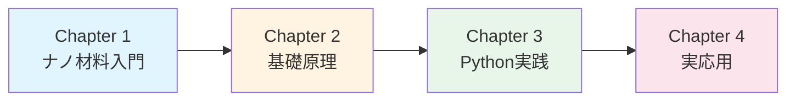

# ナノ材料入門シリーズ

Python実践で学ぶナノマテリアルサイエンス

---

## シリーズについて

本シリーズは、**ナノ材料（Nanomaterials）** の基礎から実践的なデータ解析・材料設計までを体系的に学ぶ教育コンテンツです。カーボンナノチューブ、グラフェン、量子ドット、金属ナノ粒子などの代表的なナノ材料を対象に、機械学習とデータ駆動型アプローチによる物性予測と材料設計の手法を習得できます。

### 対象読者

- 学部生・大学院生（工学、材料科学、化学、物理）
- ナノ材料研究の初学者
- 機械学習を材料開発に活用したい研究者・技術者
- ナノテクノロジー分野でのキャリアを考えている方

### 学習目標

本シリーズを完了すると、以下のスキルを習得できます：

✅ ナノ材料の基本原理とサイズ効果の理解
✅ ナノ粒子の合成・キャラクタリゼーション技術の知識
✅ Pythonによるナノ材料データの解析・可視化
✅ 機械学習によるナノ材料物性の予測
✅ ベイズ最適化によるナノ材料設計の実践
✅ 実応用事例を通じた問題解決能力

### 前提知識

- **必須**：高校数学（統計、微積分）、Python基礎
- **推奨**：大学1-2年レベルの物理・化学、線形代数、機械学習の基礎概念

---

## シリーズ構成

### 📘 Chapter 1: ナノ材料入門

**読了時間**: 20-25分 | **レベル**: 初級

ナノ材料の定義、サイズ効果、量子効果、分類（0次元〜3次元ナノ材料）について学びます。カーボンナノチューブ、グラフェン、量子ドット、金属ナノ粒子などの代表的なナノ材料の特徴と応用分野を理解します。

**学習内容**：
- ナノスケールの定義とサイズ効果
- 量子効果と量子閉じ込め効果
- ナノ材料の次元別分類
- 応用分野（エネルギー、エレクトロニクス、医療、環境）

[👉 Chapter 1を読む](chapter1-introduction.html)

---

### 📗 Chapter 2: ナノ材料の基礎原理

**読了時間**: 25-30分 | **レベル**: 初級〜中級

ナノ材料の合成法、キャラクタリゼーション技術、サイズ依存物性、表面・界面効果について学びます。TEM、SEM、XRD、UV-Visなどの測定技術と、ナノ材料特有の物性発現メカニズムを理解します。

**学習内容**：
- ボトムアップ・トップダウン合成法
- キャラクタリゼーション技術（TEM, SEM, XRD, UV-Vis, Raman）
- サイズ依存物性（融点降下、光学特性、磁気特性）
- 表面積/体積比と表面エネルギー

[👉 Chapter 2を読む](chapter2-fundamentals.html)

---

### 💻 Chapter 3: Python実践チュートリアル

**読了時間**: 30-40分 | **レベル**: 中級

Pythonを使ったナノ材料データの解析・可視化、機械学習による物性予測、ベイズ最適化による材料設計を実践します。**30-35個の実行可能なコード例**を通じて、実際のナノ材料研究で使える技術を習得します。

**学習内容**：
- ナノ粒子サイズ分布の解析と可視化
- 光学特性（プラズモン共鳴、量子ドット発光）の予測
- 5種類の回帰モデルによる物性予測
- ベイズ最適化によるナノ材料設計
- 分子動力学（MD）データの解析
- SHAP解析による予測解釈

**使用ライブラリ**：
```python
pandas, numpy, matplotlib, seaborn, scikit-learn,
lightgbm, scipy, scikit-optimize, shap
```

[👉 Chapter 3を読む](chapter3-hands-on.html)

---

### 🏭 Chapter 4: 実世界の応用とキャリア

**読了時間**: 20-25分 | **レベル**: 中級

ナノ材料研究の実際の成功事例を5つのケーススタディで学びます。カーボンナノチューブ複合材料、量子ドット、金ナノ粒子触媒、グラフェン、ナノ医薬の実用化事例を通じて、問題解決の流れを理解します。

**ケーススタディ**：
1. **カーボンナノチューブ（CNT）複合材料の機械特性最適化**
2. **量子ドットの発光波長制御**
3. **金ナノ粒子触媒の活性予測**
4. **グラフェンの電気特性制御**
5. **ナノ医薬（ドラッグデリバリー）の設計**

**キャリア情報**：
- アカデミア vs 産業界
- ナノ材料分野の職種と年収
- 必要なスキルセット

[👉 Chapter 4を読む](chapter4-real-world.html)

---

## 学習の進め方

### 推奨学習パス



### 学習方法

1. **Chapter 1-2（基礎編）**：まずは概念をしっかり理解
   - ナノ材料の基本原理とサイズ効果
   - 合成法とキャラクタリゼーション技術

2. **Chapter 3（実践編）**：手を動かしながら学ぶ
   - 全てのコード例を自分で実行
   - パラメータを変えて挙動を観察
   - 演習問題に取り組む

3. **Chapter 4（応用編）**：実問題への適用を考える
   - ケーススタディを自分の研究に置き換える
   - キャリアプランを具体化

### 環境構築

Chapter 3の実践には以下の環境が必要です：

**推奨環境**：
- Python 3.8以上
- Jupyter Notebook または Google Colab
- 主要ライブラリ：`pandas`, `scikit-learn`, `lightgbm`, `scipy`, `scikit-optimize`

**インストール方法**はChapter 3で詳しく解説します。

---

## シリーズの特徴

### 🎯 実践重視

30-35個の実行可能なPythonコード例を通じて、実際のナノ材料研究で使える技術を習得できます。

### 📊 データ駆動型アプローチ

機械学習とベイズ最適化によるナノ材料設計の最新手法を学びます。

### 🔬 実応用事例

5つの詳細なケーススタディで、実際の研究開発プロジェクトの流れを理解できます。

### 🌐 日本語で学べる

専門用語は英語も併記し、国際的な文献を読むための基礎も身につきます。

---

## 関連シリーズ

本サイトでは、他にも以下のシリーズを公開しています：

- **[マテリアルズ・インフォマティクス入門](../mi-introduction/)** - 材料科学全般へのAI/ML適用
- **[プロセス・インフォマティクス入門](../pi-introduction/)** - 化学プロセスの最適化とデジタルツイン

---

## 参考文献・リソース

### 主要教科書

1. **Cao, G. & Wang, Y.** (2011). *Nanostructures and Nanomaterials: Synthesis, Properties, and Applications* (2nd ed.). World Scientific. [DOI: 10.1142/7885](https://doi.org/10.1142/7885)

2. **Pokropivny, V. V. & Skorokhod, V. V.** (2007). Classification of nanostructures by dimensionality and concept of surface forms engineering in nanomaterial science. *Materials Science and Engineering: C*, 27(5-8), 990-993. [DOI: 10.1016/j.msec.2006.09.023](https://doi.org/10.1016/j.msec.2006.09.023)

3. **Roduner, E.** (2006). Size matters: why nanomaterials are different. *Chemical Society Reviews*, 35(7), 583-592. [DOI: 10.1039/B502142C](https://doi.org/10.1039/B502142C)

### オンラインリソース

- **MIT OpenCourseWare**: Nanomaterials courses
- **Coursera**: Nanotechnology specialization
- **Materials Project**: ナノ材料データベース（https://materialsproject.org）

---

## フィードバック・質問

本シリーズに関するご質問やフィードバックは、以下までお願いします：

**Dr. Yusuke Hashimoto**
Institute of Multidisciplinary Research for Advanced Materials (IMRAM)
Tohoku University
Email: yusuke.hashimoto.b8@tohoku.ac.jp

---

## ライセンス

本コンテンツは [Creative Commons Attribution 4.0 International License](https://creativecommons.org/licenses/by/4.0/) の下で公開されています。

教育・研究目的での自由な利用を歓迎します。引用の際は以下の形式をご利用ください：

```
橋本佑介（2025）『ナノ材料入門シリーズ v1.0』東北大学
https://yusukehashimotolab.github.io/wp/knowledge/nm-introduction/
```

---

**最終更新**: 2025年10月16日
**Version**: 1.0

[Chapter 1から始める →](chapter1-introduction.html)
