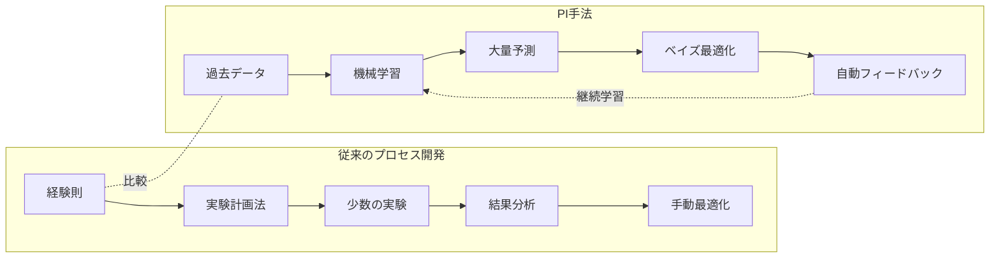
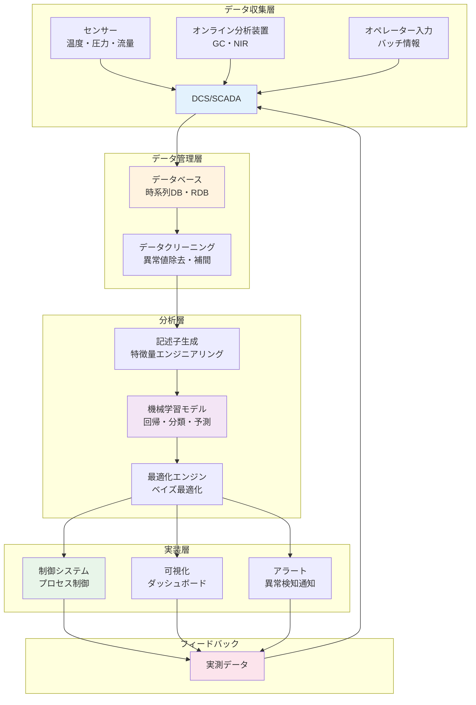
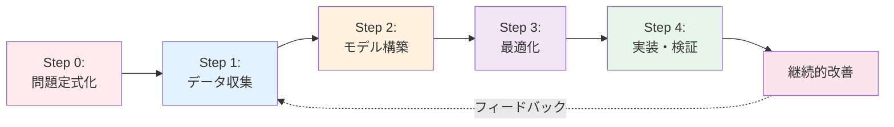

# 第2章：PIの基礎知識 - 概念・手法・エコシステム

## 学習目標

この章を読むことで、以下を習得できます：
- PIの定義と関連分野（品質工学、実験計画法等）との違いを説明できる
- 化学プロセスの主要データタイプ（時系列、バッチ、品質データ）を理解する
- PIの基本ワークフロー5ステップ（問題定式化から実装まで）を詳細に説明できる
- プロセス記述子（物理化学パラメータ、装置特性）の種類と重要性を理解する
- PI領域で頻出する専門用語20語を正しく使用できる

---

## 2.1 PIとは何か：定義と関連分野

### 2.1.1 Process Informaticsの語源と歴史

**プロセスインフォマティクス（Process Informatics, PI）**という用語は、2000年代初頭から使われるようになりました。特に**Industry 4.0**（第4次産業革命、2011年ドイツで提唱）の文脈で注目を集めました[1]。

**Industry 4.0の4つの柱:**
1. **IoT（Internet of Things）**: センサーネットワークによるデータ収集
2. **ビッグデータ**: 大量データの蓄積と管理
3. **AI/機械学習**: データからの知識抽出と予測
4. **サイバーフィジカルシステム**: デジタル空間と物理世界の統合

PIは、これらの技術を**化学プロセス産業に適用**したものと言えます。

### 2.1.2 定義

**プロセスインフォマティクス（Process Informatics, PI）**とは、化学プロセス工学とデータサイエンスを融合させた学問分野です。大量のプロセスデータと機械学習などの情報科学技術を活用して、プロセスの最適化、品質管理、異常検知、予測保全を実現する手法です。

**簡潔な定義:**
> 「データとAIの力で化学プロセスを最適化し、スマート化する科学」

**コア要素:**
1. **データ**: プロセスデータ、品質データ、運転データ
2. **モデリング**: 機械学習、統計モデル、物理モデル
3. **最適化**: ベイズ最適化、多目的最適化、進化計算
4. **実装**: プロセス制御、リアルタイム監視

### 2.1.3 関連分野との比較

PIは複数の分野と関連していますが、それぞれ異なる焦点を持っています。

| 分野 | 対象 | 主な手法 | 目的 | PIとの関係 |
|-----|------|---------|------|-----------|
| **品質工学<br>(Quality Engineering, QE)** | 製品品質の安定化 | タグチメソッド、SN比、ロバスト設計 | バラツキの最小化 | PIはQEのデータ分析を高度化 |
| **実験計画法<br>(Design of Experiments, DoE)** | 効率的な実験設計 | 直交表、応答曲面法 | 少ない実験で最適化 | PIはDoEと機械学習を組み合わせ |
| **統計的プロセス管理<br>(Statistical Process Control, SPC)** | プロセスの安定性監視 | 管理図、Cp/Cpk | 異常の早期検出 | PIはSPCに予測機能を追加 |
| **プロセス制御<br>(Process Control)** | プロセスの自動制御 | PID制御、MPC | 目標値への追従 | PIは制御パラメータを最適化 |
| **プロセスインフォマティクス<br>(PI)** | プロセス全体の最適化 | 機械学習、最適化、リアルタイム分析 | 収率・品質・コスト・環境の同時最適化 | - |

**PIの独自性:**
- **統合的アプローチ**: 品質、制御、最適化を統合
- **データ駆動**: 大量の実測データから学習
- **リアルタイム対応**: オンライン分析とフィードバック制御
- **多目的最適化**: 収率、品質、コスト、環境を同時に考慮

### 2.1.4 従来のプロセス開発 vs PI



---

## 2.2 PI用語集：必須の20用語

PIを学ぶ上で頻出する専門用語をカテゴリ別にまとめました。

### 基礎用語（1-7）

| 用語（日本語） | 用語（英語） | 説明 |
|--------------|------------|------|
| **1. プロセス変数** | Process Variable (PV) | プロセスの状態を表す測定可能な量。温度、圧力、流量、pH、濃度など。制御の対象となる。 |
| **2. 記述子** | Descriptor | プロセスの特徴を数値で表現したもの。機械学習モデルへの入力として使用される。例：反応温度、触媒量、滞留時間。 |
| **3. 目的関数** | Objective Function | 最適化の目標を数式で表現したもの。例：収率の最大化、コストの最小化。多目的最適化では複数の目的関数を同時に考慮。 |
| **4. 制約条件** | Constraints | 最適化において満たすべき条件。例：温度上限200°C、圧力下限1気圧、品質規格≥99%。 |
| **5. バッチプロセス** | Batch Process | 原料を一度に投入し、反応・処理後に製品を取り出すプロセス。医薬品、ファインケミカルに多い。 |
| **6. 連続プロセス** | Continuous Process | 原料を連続的に供給し、製品を連続的に取り出すプロセス。石油化学、大量生産に適する。 |
| **7. スケールアップ** | Scale-up | 実験室レベルから商業プラントへのプロセス拡大。反応器サイズが1,000倍以上になることも。 |

### 手法用語（8-14）

| 用語（日本語） | 用語（英語） | 説明 |
|--------------|------------|------|
| **8. ベイズ最適化** | Bayesian Optimization | 実験回数を最小限に抑えながら最適条件を探索する手法。ガウス過程を用いて次の実験候補を決定する。 |
| **9. 多目的最適化** | Multi-objective Optimization | 複数の目的（例：収率と純度、コストと品質）を同時に最適化する手法。通常トレードオフの関係にある。 |
| **10. 応答曲面法** | Response Surface Methodology (RSM) | 入力変数と出力の関係を曲面（多項式）で近似し、最適条件を探索する手法。実験計画法と組み合わせて使用。 |
| **11. 実験計画法** | Design of Experiments (DoE) | 効率的に情報を得るための実験の組み合わせを設計する手法。直交表、Box-Behnken設計など。 |
| **12. 異常検知** | Anomaly Detection | 正常運転からの逸脱を自動的に検出する手法。機械学習（One-Class SVM、Isolation Forestなど）を活用。 |
| **13. ソフトセンサー** | Soft Sensor | 測定困難な変数を、測定可能な変数から推定する技術。例：品質をオンライン推定（GC測定の代替）。 |
| **14. モデル予測制御** | Model Predictive Control (MPC) | プロセスモデルに基づき、将来の挙動を予測しながら制御する高度な制御手法。多変数制御に有効。 |

### 応用用語（15-20）

| 用語（日本語） | 用語（英語） | 説明 |
|--------------|------------|------|
| **15. デジタルツイン** | Digital Twin | 物理プロセスをデジタル空間上に再現したシミュレーションモデル。リアルタイムでプロセスを鏡のように模擬。 |
| **16. 予知保全** | Predictive Maintenance | 設備の故障を事前に予測し、計画的に保全を実施する手法。ダウンタイムの最小化。 |
| **17. DCS** | Distributed Control System | プラント全体を分散制御するシステム。温度、圧力、流量などを自動制御。 |
| **18. SCADA** | Supervisory Control and Data Acquisition | プロセスの監視と制御を行うシステム。オペレーターが状態を可視化。 |
| **19. パレートフロント** | Pareto Front | 多目的最適化において、どの目的も改善できない解の集合。最適な妥協点を示す。 |
| **20. オンライン分析** | Online Analysis | プロセス稼働中にリアルタイムで成分分析を行う技術。例：オンラインGC、NIR分光分析。 |

**用語学習のポイント:**
- まずは1-7（基礎用語）を優先的に理解
- 8-14（手法用語）は中級レベルで詳細を学習
- 15-20（応用用語）は実践プロジェクトで活用

---

## 2.3 プロセスデータの種類と特徴

化学プロセスでは、多様なタイプのデータが生成されます。それぞれの特徴を理解することが、PI手法を適用する上で重要です。

### 2.3.1 時系列データ（Time Series Data）

**特徴:**
- 時間軸に沿って連続的に測定されるデータ
- サンプリング頻度: 1秒〜1分ごと
- 膨大なデータ量（1センサー × 1日 = 86,400データポイント）

**典型例:**

| 測定項目 | サンプリング頻度 | データ量/日 | 用途 |
|---------|---------------|-----------|------|
| 反応器温度 | 1秒 | 86,400点 | リアルタイム制御 |
| 圧力 | 1秒 | 86,400点 | 安全監視 |
| 流量 | 5秒 | 17,280点 | 物質収支計算 |
| pH | 10秒 | 8,640点 | 反応進行監視 |

**分析手法:**
- **時系列予測**: ARIMA、Prophet、LSTM（ディープラーニング）
- **異常検知**: 管理図、One-Class SVM
- **トレンド分析**: 移動平均、季節性分解

**課題:**
- ノイズが多い（センサー精度、外部環境の影響）
- 欠損値（センサー故障、通信エラー）
- データ量が膨大（1プラント × 1年 = 数TB）

### 2.3.2 バッチデータ（Batch Data）

**特徴:**
- バッチごとに1つのデータポイント
- 各バッチは独立した製造単位
- バッチ間で条件が微妙に異なる

**典型例（医薬品バッチ）:**

| バッチID | 原料ロット | 反応温度(°C) | 反応時間(h) | 収率(%) | 純度(%) |
|---------|---------|------------|-----------|--------|--------|
| Batch001 | Lot-A | 85 | 4.5 | 92.3 | 99.2 |
| Batch002 | Lot-A | 87 | 4.3 | 91.8 | 99.1 |
| Batch003 | Lot-B | 85 | 4.6 | 90.5 | 99.3 |

**分析手法:**
- **回帰分析**: 線形回帰、ランダムフォレスト
- **バッチ間変動解析**: ANOVA、主成分分析（PCA）
- **最適化**: ベイズ最適化、応答曲面法

**課題:**
- サンプル数が少ない（年間数十〜数百バッチ）
- バッチ間の微妙な違いを捉える必要がある
- 原料ロット依存性

### 2.3.3 品質データ（Quality Data）

**特徴:**
- 製品の品質を表すデータ
- オフライン測定が多い（GC、HPLC、NMRなど）
- 測定に時間とコストがかかる

**典型例:**

| 測定項目 | 測定方法 | 頻度 | コスト/測定 | 測定時間 |
|---------|---------|------|-----------|---------|
| 主成分含量 | HPLC | 各バッチ | 5,000円 | 30分 |
| 不純物プロファイル | GC-MS | 各バッチ | 10,000円 | 1時間 |
| 分子量分布 | GPC | 各バッチ | 8,000円 | 45分 |
| 結晶構造 | XRD | 抜き取り（10%） | 20,000円 | 2時間 |

**分析手法:**
- **品質予測（ソフトセンサー）**: プロセス変数から品質を推定
- **品質管理**: 管理図、Cp/Cpk
- **規格外判定**: 分類モデル（SVM、ロジスティック回帰）

**課題:**
- 測定頻度が低い（リアルタイムではない）
- 測定誤差がある
- コストが高い

### 2.3.4 運転データ（Operational Data）

**特徴:**
- プラントの運転状態を表すデータ
- オペレーターの操作履歴、アラーム、イベントログ

**典型例:**

```
2025-10-16 09:15:32 | 高温アラーム | 反応器R-101 | 温度120°C（上限115°C）
2025-10-16 09:16:05 | オペレーター操作 | 冷却水流量増加 | 50 L/min → 70 L/min
2025-10-16 09:18:20 | アラーム解除 | 反応器R-101 | 温度112°C
```

**分析手法:**
- **イベントログ解析**: 異常発生パターンの抽出
- **アラーム頻度分析**: 真のアラーム vs 誤報の判別
- **根本原因分析**: アラームの連鎖を追跡

### 2.3.5 データの統合と前処理

PIでは、これらの異なるタイプのデータを**統合**して活用します。

**前処理のステップ:**

1. **データクリーニング**: 異常値、欠損値の除去
2. **時間軸の統一**: サンプリング頻度の異なるデータを同期
3. **正規化**: スケールの異なるデータを0-1または標準化
4. **特徴量エンジニアリング**: 新しい変数の導出（例：温度×時間）

```python
import pandas as pd
import numpy as np

# 時系列データの前処理例
def preprocess_process_data(df):
    # 1. 異常値除去（3σ法）
    df = df[(np.abs(df['temperature'] - df['temperature'].mean())
             <= 3 * df['temperature'].std())]

    # 2. 欠損値補間（線形補間）
    df = df.interpolate(method='linear')

    # 3. 移動平均（ノイズ除去）
    df['temperature_smooth'] = df['temperature'].rolling(window=10).mean()

    # 4. 正規化（0-1）
    df['temperature_norm'] = (df['temperature'] - df['temperature'].min()) / \
                             (df['temperature'].max() - df['temperature'].min())

    return df
```

---

## 2.4 PIエコシステム：データの流れ

PIは単独の技術ではなく、複数の要素が連携するエコシステムです。以下の図は、PIにおけるデータの流れを示しています。



**図の読み方:**
1. **データ収集層**: センサー、分析装置、オペレーターからデータを収集
2. **データ管理層**: データを保存し、前処理を実施
3. **分析層**: 機械学習モデルを構築し、最適化を実行
4. **実装層**: 予測結果をプロセス制御や可視化に活用
5. **フィードバック**: 実測データを再びシステムに戻し、継続的改善

**重要なポイント:**
- データは**循環**する（フィードバックループ）
- 各層が専門的な役割を担う
- リアルタイム性が重要（秒単位〜分単位）

---

## 2.5 PIの基本ワークフロー：詳細5ステップ

第1章では概要を紹介しましたが、ここでは実践的な**5ステップワークフロー**を詳しく解説します。

### 2.5.1 全体像



### 2.5.2 Step 0: 問題定式化

**何をするか:**
- 解決したい問題を明確に定義する
- 目的関数と制約条件を具体化する
- 成功の基準（KPI）を設定する

**具体例：化学反応プロセスの収率向上**

**悪い問題定式化:**
> 「収率を上げたい」

**良い問題定式化:**
> 「化学反応プロセスXの収率を以下の条件で最大化する：
> - **目的**: 収率を現状70%から80%以上に向上
> - **制約条件**:
>   - 温度: 80-120°C（安全範囲）
>   - 圧力: 1-5気圧
>   - 反応時間: ≤6時間（生産性維持）
>   - 純度: ≥98%（品質規格）
>   - コスト: 現状+10%以内
> - **KPI（成功基準）**:
>   - 収率≥80%を10バッチ連続で達成
>   - バッチ間変動≤2%
>   - 期限: 6ヶ月以内」

**問題定式化のチェックリスト:**
- [ ] 目的が定量的に定義されているか？
- [ ] 制約条件が明確か？
- [ ] KPIが測定可能か？
- [ ] 期限が現実的か？
- [ ] ステークホルダーが合意しているか？

**時間の目安:** 1〜2週間（関係者との議論を含む）

### 2.5.3 Step 1: データ収集

**何をするか:**
- 過去の運転データを収集
- データの品質を確認（欠損値、異常値）
- 必要に応じて追加実験を実施

**データソースの優先順位:**

1. **既存のプラントデータ**（最も効率的）
   - DCS/SCADAから時系列データをエクスポート
   - 通常、数ヶ月〜数年分のデータが蓄積されている

2. **実験室データ**（補完的）
   - ベンチスケールの実験結果
   - 詳細な品質分析データ

3. **新規実験**（必要に応じて）
   - 既存データで不足している条件を追加実験

**具体例：反応プロセスのデータ収集**

```python
import pandas as pd

# DCSからのデータエクスポート例
process_data = pd.read_csv('dcs_export.csv', parse_dates=['timestamp'])

print(f"データ期間: {process_data['timestamp'].min()} - {process_data['timestamp'].max()}")
print(f"データポイント数: {len(process_data):,}")
print(f"変数の数: {process_data.shape[1]}")

# 基本統計
print("\n基本統計:")
print(process_data[['temperature', 'pressure', 'flow_rate', 'yield']].describe())

# 欠損値の確認
print("\n欠損値:")
print(process_data.isnull().sum())
```

**期待される出力:**
```
データ期間: 2023-01-01 - 2024-12-31
データポイント数: 31,536,000
変数の数: 50

基本統計:
       temperature  pressure  flow_rate    yield
count    31536000  31536000   31536000  1200.0
mean         95.3      3.2       45.2    70.3
std           8.7      0.8       12.3     3.1
...

欠損値:
temperature        120
pressure            85
flow_rate          156
yield                0
```

**時間の目安:** 1週間（データの特定、エクスポート、品質確認）

### 2.5.4 Step 2: モデル構築

**何をするか:**
- 収集したデータを使って機械学習モデルを訓練
- 適切な記述子（特徴量）を選択
- モデルの性能を評価し、最適化

**サブステップ:**

**2.1 記述子の設計**

プロセス変数を機械学習モデルに適した形式に変換します。

**記述子の例:**

| カテゴリ | 記述子 | 説明 |
|---------|-------|------|
| **直接測定** | 温度、圧力、流量 | センサーから直接取得 |
| **導出変数** | 滞留時間 = 反応器体積 / 流量 | 計算で求める |
| **相互作用項** | 温度 × 圧力 | 非線形効果を捉える |
| **時系列特徴** | 温度の移動平均、変化率 | 動的挙動を捉える |

**2.2 モデルの選択**

| モデル | 適用場面 | 利点 | 欠点 |
|-------|---------|------|------|
| **線形回帰** | 線形関係が予想される場合 | シンプル、解釈容易 | 非線形関係を捉えられない |
| **ランダムフォレスト** | 非線形、複雑な関係 | 高精度、過学習に強い | ブラックボックス |
| **勾配ブースティング** | 最高精度を追求 | 非常に高精度 | チューニングが必要 |
| **SVR** | 小規模データ | 汎化性能が高い | 計算コスト高 |

**2.3 モデル訓練と評価**

```python
from sklearn.ensemble import RandomForestRegressor
from sklearn.model_selection import train_test_split, cross_val_score
from sklearn.metrics import mean_absolute_error, r2_score

# データ分割
X = df[['temperature', 'pressure', 'catalyst_conc', 'residence_time']]
y = df['yield']

X_train, X_test, y_train, y_test = train_test_split(
    X, y, test_size=0.2, random_state=42
)

# モデル訓練
model = RandomForestRegressor(n_estimators=100, random_state=42)
model.fit(X_train, y_train)

# 予測と評価
y_pred = model.predict(X_test)
mae = mean_absolute_error(y_test, y_pred)
r2 = r2_score(y_test, y_pred)

print(f"MAE: {mae:.2f}%")
print(f"R²: {r2:.3f}")

# 交差検証
cv_scores = cross_val_score(model, X, y, cv=5,
                            scoring='neg_mean_absolute_error')
print(f"CV MAE: {-cv_scores.mean():.2f} ± {cv_scores.std():.2f}%")
```

**性能の目安:**
- **R² > 0.8**: 良好
- **R² > 0.9**: 優秀
- **R² < 0.7**: モデルの見直しが必要

**時間の目安:** 2週間（記述子設計、モデル訓練、チューニング）

### 2.5.5 Step 3: 最適化

**何をするか:**
- 訓練したモデルを使って、最適な運転条件を探索
- ベイズ最適化、多目的最適化などの手法を適用

**ベイズ最適化の例:**

```python
from skopt import gp_minimize
from skopt.space import Real

# 目的関数（収率を最大化 = 負の収率を最小化）
def objective(params):
    temperature, pressure, catalyst_conc = params
    predicted_yield = model.predict([[temperature, pressure, catalyst_conc, 60]])
    return -predicted_yield[0]  # 最小化問題に変換

# 探索空間の定義
space = [
    Real(80, 120, name='temperature'),     # 温度範囲
    Real(1, 5, name='pressure'),           # 圧力範囲
    Real(0.5, 3, name='catalyst_conc'),    # 触媒濃度範囲
]

# ベイズ最適化の実行
result = gp_minimize(
    objective,
    space,
    n_calls=20,      # 20回の評価
    random_state=42
)

print(f"最適条件:")
print(f"  温度: {result.x[0]:.1f}°C")
print(f"  圧力: {result.x[1]:.2f}気圧")
print(f"  触媒濃度: {result.x[2]:.2f}%")
print(f"  予測収率: {-result.fun:.1f}%")
```

**多目的最適化の例（収率 vs コスト）:**

```python
from pymoo.algorithms.moo.nsga2 import NSGA2
from pymoo.optimize import minimize
from pymoo.core.problem import Problem

class ProcessOptimizationProblem(Problem):
    def __init__(self):
        super().__init__(
            n_var=3,           # 3つの変数
            n_obj=2,           # 2つの目的（収率、コスト）
            n_constr=0,
            xl=[80, 1, 0.5],   # 下限
            xu=[120, 5, 3]     # 上限
        )

    def _evaluate(self, X, out, *args, **kwargs):
        # 目的1: 収率の最大化（→ 負の収率を最小化）
        yield_pred = model_yield.predict(X)
        f1 = -yield_pred

        # 目的2: コストの最小化
        cost = X[:, 0] * 0.1 + X[:, 1] * 5 + X[:, 2] * 20  # 簡略化した例
        f2 = cost

        out["F"] = np.column_stack([f1, f2])

# NSGA-IIアルゴリズムで最適化
algorithm = NSGA2(pop_size=100)
problem = ProcessOptimizationProblem()

result = minimize(
    problem,
    algorithm,
    ('n_gen', 50),  # 50世代
    verbose=False
)

print(f"パレート最適解の数: {len(result.F)}")
```

**時間の目安:** 1〜2週間（最適化手法の選定、実行、結果分析）

### 2.5.6 Step 4: 実装・検証

**何をするか:**
- 最適化で得られた条件を実プラントで試験
- 予測と実測のズレを分析
- 段階的に実装（パイロット → 商業プラント）

**実装のステップ:**

1. **パイロット試験**（1-2バッチ）
   - 安全性の確認
   - 予測との一致度を確認

2. **小規模導入**（10バッチ）
   - 再現性の確認
   - バッチ間変動の評価

3. **全面展開**（継続運転）
   - 標準運転条件として採用
   - 継続的な監視

**検証のチェックリスト:**
- [ ] 安全基準を満たすか？
- [ ] 品質規格を満たすか？
- [ ] 予測収率±5%以内で実測値と一致するか？
- [ ] バッチ間変動は許容範囲内か？
- [ ] オペレーターが運転可能か？

**時間の目安:** 1〜2ヶ月（パイロット試験、段階的導入）

### 2.5.7 継続的改善

**何をするか:**
- 実装後のデータを収集
- モデルを定期的に再訓練
- さらなる最適化の余地を探索

**継続的改善のサイクル:**

```
初期モデル（R² = 0.85）
  ↓ 10バッチのデータ追加
モデル再訓練（R² = 0.88）
  ↓ 20バッチのデータ追加
モデル再訓練（R² = 0.91）
  ↓ 新たな最適化余地を発見
```

**時間の目安:** 継続的（3ヶ月ごとに再訓練を推奨）

---

## 2.6 プロセス記述子の詳細

### 2.6.1 記述子の種類

**1. 物理化学パラメータ**

| 記述子 | 単位 | 典型的な範囲 | 重要性 |
|-------|------|------------|--------|
| 温度 | °C | 50-200 | 反応速度、平衡定数に直接影響 |
| 圧力 | 気圧 | 1-10 | 気相反応の平衡、物質移動 |
| pH | - | 0-14 | 触媒活性、副反応 |
| 濃度 | mol/L | 0.1-5 | 反応速度、選択性 |
| 流量 | L/h | 10-100 | 滞留時間、混合 |

**2. 装置特性**

| 記述子 | 説明 | 影響 |
|-------|------|------|
| 反応器体積 | プロセスのスケール | 熱除去、混合効率 |
| 攪拌速度 | rpm | 物質移動、均一性 |
| 伝熱面積 | m² | 温度制御 |

**3. 操作条件**

| 記述子 | 説明 | 制御可能性 |
|-------|------|----------|
| 加熱速度 | °C/min | 制御容易 |
| 原料供給順序 | - | 制御容易 |
| 冷却開始時刻 | 反応開始からの時間 | 制御容易 |

### 2.6.2 記述子の自動生成

```python
import pandas as pd

# 基本的な記述子の計算
def generate_descriptors(df):
    # 導出変数
    df['residence_time'] = df['reactor_volume'] / df['flow_rate']  # 分

    # 相互作用項
    df['temp_pressure'] = df['temperature'] * df['pressure']

    # 時系列特徴（移動平均）
    df['temp_ma_10min'] = df['temperature'].rolling(window=10).mean()

    # 変化率
    df['temp_change_rate'] = df['temperature'].diff()

    return df
```

---

## 2.7 まとめ

### この章で学んだこと

1. **PIの定義と位置づけ**
   - データとAIで化学プロセスを最適化
   - 関連分野（QE、DoE、SPC、プロセス制御）との違い

2. **PI用語20語**
   - 基礎用語、手法用語、応用用語
   - 実践で頻出する専門用語の理解

3. **プロセスデータの種類**
   - 時系列データ、バッチデータ、品質データ、運転データ
   - 各データタイプの特徴と分析手法

4. **PIエコシステム**
   - データ収集 → 管理 → 分析 → 実装 → フィードバック
   - 各層の役割と連携

5. **PIの5ステップワークフロー**
   - Step 0: 問題定式化
   - Step 1: データ収集
   - Step 2: モデル構築
   - Step 3: 最適化
   - Step 4: 実装・検証
   - 継続的改善のサイクル

6. **プロセス記述子**
   - 物理化学パラメータ、装置特性、操作条件
   - 記述子の自動生成手法

### 次の章へ

第3章では、Pythonを使った実践的なPI手法を学びます：
- 環境構築（3つの選択肢）
- 35個の実行可能なコード例
- 化学反応器最適化プロジェクト

---

## 演習問題

### 問題1（難易度：easy）

PIと関連分野（品質工学、実験計画法、統計的プロセス管理）の違いを説明してください。

<details>
<summary>解答例</summary>

**品質工学（QE）**:
- 目的: 製品品質の安定化、バラツキの最小化
- 手法: タグチメソッド、SN比
- PIとの違い: PIはQEのデータ分析を機械学習で高度化

**実験計画法（DoE）**:
- 目的: 効率的な実験設計
- 手法: 直交表、応答曲面法
- PIとの違い: PIはDoEと機械学習を組み合わせ、より少ない実験で最適化

**統計的プロセス管理（SPC）**:
- 目的: プロセスの安定性監視
- 手法: 管理図、Cp/Cpk
- PIとの違い: PIはSPCに予測機能（機械学習）を追加

**PI（Process Informatics）**:
- 目的: プロセス全体の最適化（収率・品質・コスト・環境の同時最適化）
- 手法: 機械学習、ベイズ最適化、リアルタイム分析
- 特徴: 上記すべてを統合し、データ駆動で最適化

</details>

### 問題2（難易度：medium）

化学プロセスの時系列データ、バッチデータ、品質データの3つについて、それぞれの特徴と適した分析手法を説明してください。

<details>
<summary>解答例</summary>

**時系列データ**:
- 特徴: 時間軸に沿って連続測定、サンプリング頻度が高い（1秒〜1分）、データ量が膨大
- 典型例: 温度、圧力、流量、pH
- 分析手法:
  - 時系列予測（ARIMA、Prophet、LSTM）
  - 異常検知（管理図、One-Class SVM）
  - トレンド分析（移動平均）
- 課題: ノイズ、欠損値、膨大なデータ量

**バッチデータ**:
- 特徴: バッチごとに1データポイント、サンプル数が少ない、バッチ間で条件が微妙に異なる
- 典型例: 各バッチの収率、純度、反応時間
- 分析手法:
  - 回帰分析（線形回帰、ランダムフォレスト）
  - バッチ間変動解析（ANOVA、PCA）
  - 最適化（ベイズ最適化、応答曲面法）
- 課題: サンプル数が少ない、過学習のリスク

**品質データ**:
- 特徴: オフライン測定が多い、測定に時間とコストがかかる、頻度が低い
- 典型例: HPLC、GC-MS、XRD
- 分析手法:
  - 品質予測（ソフトセンサー、プロセス変数から推定）
  - 品質管理（管理図、Cp/Cpk）
  - 規格外判定（分類モデル）
- 課題: リアルタイムではない、測定誤差、コストが高い

</details>

### 問題3（難易度：medium）

PIワークフローのStep 0（問題定式化）がなぜ最も重要なのか、具体例を挙げて説明してください。

<details>
<summary>解答例</summary>

**重要性:**

問題定式化が不十分だと、後の全ステップに悪影響を及ぼし、プロジェクト全体が失敗する可能性があります。

**悪い例:**
> 「収率を上げたい」

**問題点:**
- 目標が曖昧（何%に上げるのか？）
- 制約条件がない（温度、圧力、コストの制限は？）
- 成功基準がない（いつまでに？何バッチで？）

**結果:**
1. データ収集で無駄な変数まで集めてしまう
2. モデルが間違った目的を最適化する（例：純度を犠牲にして収率だけ上げる）
3. 実装段階で「実は純度も重要だった」と判明し、やり直し

**良い例:**
> 「化学反応プロセスXの収率を現状70%から80%以上に向上し、以下の条件を満たす：
> - 温度: 80-120°C（安全範囲）
> - 純度: ≥98%（品質規格）
> - コスト: 現状+10%以内
> - 期限: 6ヶ月以内
> - KPI: 収率≥80%を10バッチ連続で達成」

**効果:**
1. データ収集が明確（温度、純度、コストのデータを優先）
2. モデルが正しい目的を最適化（多目的最適化: 収率 vs 純度 vs コスト）
3. 成功基準が明確で、プロジェクトの進捗を評価しやすい

**時間投資の価値:**
問題定式化に1〜2週間を費やすことで、後の数ヶ月の作業を無駄にするリスクを大幅に減らせます。

</details>

---

## 参考文献

1. Venkatasubramanian, V. (2019). "The promise of artificial intelligence in chemical engineering: Is it here, finally?" *AIChE Journal*, 65(2), 466-478.
   DOI: [10.1002/aic.16489](https://doi.org/10.1002/aic.16489)

2. Lee, J. H., Shin, J., & Realff, M. J. (2018). "Machine learning: Overview of the recent progresses and implications for the process systems engineering field." *Computers & Chemical Engineering*, 114, 111-121.
   DOI: [10.1016/j.compchemeng.2017.10.008](https://doi.org/10.1016/j.compchemeng.2017.10.008)

3. Seborg, D. E., Edgar, T. F., Mellichamp, D. A., & Doyle III, F. J. (2016). *Process Dynamics and Control* (4th ed.). Wiley.

4. 化学工学会編 (2020). 『化学工学便覧 第8版』. 丸善出版.

---

**著者情報**

この記事は、東北大学 Dr. Yusuke Hashimotoのもと、MI Knowledge Hubプロジェクトの一環として作成されました。

**更新履歴**
- 2025-10-16: v1.0 初版作成

**ライセンス**: CC BY 4.0
