# 第3章：Pythonで体験するPI - プロセス最適化実践

## 学習目標

この記事を読むことで、以下を習得できます：
- Python環境を構築し、PI用ライブラリをインストールできる
- プロセスデータの前処理と可視化ができる
- 5種類以上の回帰モデルでプロセス特性を予測できる
- ベイズ最適化によりプロセス条件を最適化できる
- 多目的最適化で複数の目標のトレードオフを解析できる
- エラーを自力でトラブルシューティングできる

---

## 1. 環境構築：3つの選択肢

化学プロセス最適化のPython環境を構築する方法は、状況に応じて3つあります。

### 1.1 Option 1: Anaconda（推奨初心者）

**特徴：**
- 科学計算ライブラリが最初から揃っている
- 環境管理が簡単（GUI利用可能）
- Windows/Mac/Linux対応

**インストール手順：**

```bash
# 1. Anacondaをダウンロード
# 公式サイト: https://www.anaconda.com/download
# Python 3.11以上を選択

# 2. インストール後、Anaconda Promptを起動

# 3. 仮想環境を作成（PI専用環境）
conda create -n pi-env python=3.11 numpy pandas matplotlib scikit-learn jupyter scipy

# 4. 環境を有効化
conda activate pi-env

# 5. 追加ライブラリのインストール
conda install -c conda-forge lightgbm scikit-optimize pymoo

# 6. 動作確認
python --version
# 出力: Python 3.11.x
```

**Anacondaの利点：**
- ✅ NumPy、SciPyなどが最初から含まれる
- ✅ 依存関係の問題が少ない
- ✅ Anaconda Navigatorで視覚的に管理可能
- ❌ ファイルサイズが大きい（3GB以上）

### 1.2 Option 2: venv（Python標準）

**特徴：**
- Python標準ツール（追加インストール不要）
- 軽量（必要なものだけインストール）
- プロジェクトごとに環境を分離

**インストール手順：**

```bash
# 1. Python 3.11以上がインストールされているか確認
python3 --version
# 出力: Python 3.11.x 以上が必要

# 2. 仮想環境を作成
python3 -m venv pi-env

# 3. 環境を有効化
# macOS/Linux:
source pi-env/bin/activate

# Windows (PowerShell):
pi-env\Scripts\Activate.ps1

# Windows (Command Prompt):
pi-env\Scripts\activate.bat

# 4. pipをアップグレード
pip install --upgrade pip

# 5. 必要なライブラリをインストール
pip install numpy pandas matplotlib scikit-learn scipy jupyter
pip install lightgbm scikit-optimize pymoo

# 6. インストール確認
pip list
```

**venvの利点：**
- ✅ 軽量（数十MB）
- ✅ Python標準ツール（追加インストール不要）
- ✅ プロジェクトごとに独立
- ❌ 依存関係を手動で解決する必要がある

### 1.3 Option 3: Google Colab（インストール不要）

**特徴：**
- ブラウザだけで実行可能
- インストール不要（クラウド実行）
- GPU/TPUが無料で使える

**使用方法：**

```
1. Google Colabにアクセス: https://colab.research.google.com
2. 新しいノートブックを作成
3. 以下のコードを実行（必要なライブラリは自動でインストール済み）
```

```python
# Google Colabでは最初から以下がインストール済み
import numpy as np
import pandas as pd
import matplotlib.pyplot as plt
from sklearn.model_selection import train_test_split
from sklearn.ensemble import RandomForestRegressor

# 追加インストールが必要なライブラリ
!pip install scikit-optimize pymoo lightgbm

print("ライブラリのインポートが成功しました！")
print(f"NumPy version: {np.__version__}")
print(f"Pandas version: {pd.__version__}")
```

**Google Colabの利点：**
- ✅ インストール不要（すぐ開始可能）
- ✅ 無料でGPU利用可能
- ✅ Google Driveと連携（データ保存が簡単）
- ❌ インターネット接続が必須
- ❌ セッションが12時間でリセットされる

### 1.4 環境選択ガイド

| 状況 | 推奨オプション | 理由 |
|------|----------------|------|
| 初めてのPython環境 | Anaconda | 環境構築が簡単、トラブルが少ない |
| 既にPython環境がある | venv | 軽量、プロジェクトごとに独立 |
| 今すぐ試したい | Google Colab | インストール不要、即座に開始可能 |
| 大規模最適化が必要 | Anaconda or venv | ローカル実行、計算リソース制限なし |
| オフライン環境 | Anaconda or venv | ローカル実行、インターネット不要 |

### 1.5 インストール検証とトラブルシューティング

**検証コマンド：**

```python
# すべての環境で実行可能
import sys
import numpy as np
import pandas as pd
import matplotlib.pyplot as plt
import sklearn
import scipy

print("===== 環境確認 =====")
print(f"Python version: {sys.version}")
print(f"NumPy version: {np.__version__}")
print(f"Pandas version: {pd.__version__}")
print(f"Matplotlib version: {plt.matplotlib.__version__}")
print(f"scikit-learn version: {sklearn.__version__}")
print(f"SciPy version: {scipy.__version__}")

# PI特有のライブラリ確認
try:
    import skopt
    print(f"scikit-optimize version: {skopt.__version__}")
except ImportError:
    print("⚠️ scikit-optimize未インストール（pip install scikit-optimize）")

try:
    import pymoo
    print(f"pymoo version: {pymoo.__version__}")
except ImportError:
    print("⚠️ pymoo未インストール（pip install pymoo）")

print("\n✅ 基本ライブラリが正常にインストールされています！")
```

**よくあるエラーと解決方法：**

| エラーメッセージ | 原因 | 解決方法 |
|------------------|------|----------|
| `ModuleNotFoundError: No module named 'skopt'` | scikit-optimize未インストール | `pip install scikit-optimize` を実行 |
| `ImportError: DLL load failed` (Windows) | C++再頒布可能パッケージ不足 | Microsoft Visual C++ Redistributableをインストール |
| `SSL: CERTIFICATE_VERIFY_FAILED` | SSL証明書エラー | `pip install --trusted-host pypi.org --trusted-host files.pythonhosted.org <package>` |
| `MemoryError` | メモリ不足 | データサイズを削減 or Google Colab利用 |

---

## 2. プロセスデータの準備と可視化

化学プロセスの実データを模擬し、前処理と可視化を行います。

### 2.1 Example 1: プロセスデータの生成と読み込み

**概要：**
化学反応プロセスの模擬データを生成します（温度、圧力、触媒量 → 収率）。

```python
import numpy as np
import pandas as pd
import matplotlib.pyplot as plt
from sklearn.model_selection import train_test_split
import time

# 化学反応プロセスの模擬データ生成
np.random.seed(42)
n_samples = 200

# プロセス条件（入力変数）
temperature = np.random.uniform(300, 500, n_samples)  # 温度 [K]
pressure = np.random.uniform(1, 10, n_samples)  # 圧力 [bar]
catalyst = np.random.uniform(0.1, 5.0, n_samples)  # 触媒量 [wt%]

# 収率のモデル（非線形関係 + ノイズ）
# 収率 = f(温度, 圧力, 触媒量) + ノイズ
yield_percentage = (
    20  # ベース収率
    + 0.15 * temperature  # 温度の効果（正の相関）
    - 0.0002 * temperature**2  # 温度の二次項（最適温度が存在）
    + 5.0 * pressure  # 圧力の効果（正の相関）
    + 3.0 * catalyst  # 触媒量の効果（正の相関）
    - 0.3 * catalyst**2  # 触媒量の二次項（過剰添加で効果減少）
    + 0.01 * temperature * pressure  # 温度-圧力の相互作用
    + np.random.normal(0, 3, n_samples)  # ノイズ（測定誤差）
)

# データをDataFrameに格納
process_data = pd.DataFrame({
    'temperature_K': temperature,
    'pressure_bar': pressure,
    'catalyst_wt%': catalyst,
    'yield_%': yield_percentage
})

print("===== プロセスデータの確認 =====")
print(process_data.head(10))
print(f"\nデータ数: {len(process_data)}件")
print(f"\n基本統計量:")
print(process_data.describe())

# CSV形式で保存（実際のプロセスではこのような形式でデータが提供される）
process_data.to_csv('process_data.csv', index=False)
print("\n✅ データを process_data.csv に保存しました")
```

**コード解説：**
1. **プロセス条件**：温度（300-500 K）、圧力（1-10 bar）、触媒量（0.1-5.0 wt%）
2. **収率モデル**：非線形関係（二次項、相互作用項）+ ノイズ
3. **実データ模擬**：化学反応の典型的な挙動（最適条件が存在、過剰添加で効果減少）

### 2.2 Example 2: データの可視化（散布図行列）

```python
import seaborn as sns

# 散布図行列で変数間の関係を確認
fig = plt.figure(figsize=(12, 10))
sns.pairplot(
    process_data,
    diag_kind='hist',  # 対角線にヒストグラム
    plot_kws={'alpha': 0.6, 's': 50},  # 散布図の設定
    diag_kws={'bins': 20, 'edgecolor': 'black'}  # ヒストグラムの設定
)
plt.suptitle('プロセスデータの散布図行列', y=1.01, fontsize=16)
plt.tight_layout()
plt.show()

print("===== 相関係数行列 =====")
correlation_matrix = process_data.corr()
print(correlation_matrix)

# ヒートマップで相関を可視化
plt.figure(figsize=(8, 6))
sns.heatmap(
    correlation_matrix,
    annot=True,  # 数値を表示
    fmt='.3f',  # 小数点3桁
    cmap='coolwarm',  # カラーマップ
    center=0,  # 0を中心にする
    square=True,  # 正方形のセル
    linewidths=1,  # セルの境界線
    cbar_kws={'label': '相関係数'}
)
plt.title('プロセス変数の相関ヒートマップ', fontsize=14)
plt.tight_layout()
plt.show()
```

**解釈のポイント：**
- 温度と収率の関係：曲線的（最適温度が存在）
- 圧力と収率の関係：正の相関（圧力↑ → 収率↑）
- 触媒量と収率の関係：曲線的（過剰添加で効果減少）

### 2.3 Example 3: データの前処理（欠損値・外れ値処理）

```python
# 欠損値の確認と処理
print("===== 欠損値の確認 =====")
print(process_data.isnull().sum())

# 人為的に欠損値を追加（実データでは頻繁に発生）
process_data_with_missing = process_data.copy()
missing_indices = np.random.choice(process_data.index, size=10, replace=False)
process_data_with_missing.loc[missing_indices, 'catalyst_wt%'] = np.nan

print(f"\n欠損値を追加後: {process_data_with_missing.isnull().sum()['catalyst_wt%']}件")

# 欠損値の補完（平均値で補完）
process_data_filled = process_data_with_missing.copy()
process_data_filled['catalyst_wt%'].fillna(
    process_data_filled['catalyst_wt%'].mean(),
    inplace=True
)

print("✅ 欠損値を平均値で補完しました")

# 外れ値の検出（Zスコア法）
from scipy import stats

z_scores = np.abs(stats.zscore(process_data[['yield_%']]))
outliers = (z_scores > 3).any(axis=1)

print(f"\n===== 外れ値の検出 =====")
print(f"外れ値の数: {outliers.sum()}件")
print(f"外れ値の割合: {outliers.sum() / len(process_data) * 100:.1f}%")

# 外れ値を除去
process_data_clean = process_data[~outliers].copy()
print(f"除去後のデータ数: {len(process_data_clean)}件")
```

### 2.4 Example 4: 特徴量エンジニアリング（相互作用項）

```python
# プロセス特有の特徴量を作成
process_data_enhanced = process_data_clean.copy()

# 相互作用項（温度×圧力、温度×触媒量）
process_data_enhanced['temp_pressure'] = (
    process_data_enhanced['temperature_K'] * process_data_enhanced['pressure_bar']
)
process_data_enhanced['temp_catalyst'] = (
    process_data_enhanced['temperature_K'] * process_data_enhanced['catalyst_wt%']
)

# 二次項（温度², 触媒量²）
process_data_enhanced['temp_squared'] = process_data_enhanced['temperature_K'] ** 2
process_data_enhanced['catalyst_squared'] = process_data_enhanced['catalyst_wt%'] ** 2

# 比率（触媒/圧力）
process_data_enhanced['catalyst_pressure_ratio'] = (
    process_data_enhanced['catalyst_wt%'] / (process_data_enhanced['pressure_bar'] + 1e-10)
)

print("===== 特徴量エンジニアリング後のデータ =====")
print(process_data_enhanced.head())
print(f"\n特徴量数: {len(process_data_enhanced.columns) - 1}個（元の3個 → 8個）")
```

### 2.5 Example 5: データ分割（訓練・テスト）

```python
# 特徴量と目的変数の分離
X = process_data_enhanced.drop('yield_%', axis=1)  # 入力：プロセス条件
y = process_data_enhanced['yield_%']  # 出力：収率

# 訓練データとテストデータに分割（80% vs 20%）
X_train, X_test, y_train, y_test = train_test_split(
    X, y, test_size=0.2, random_state=42
)

print("===== データ分割 =====")
print(f"訓練データ: {len(X_train)}件")
print(f"テストデータ: {len(X_test)}件")
print(f"\n特徴量の列名:")
print(list(X.columns))
```

### 2.6 Example 6: データの標準化

```python
from sklearn.preprocessing import StandardScaler

# 標準化器の作成（平均0、標準偏差1に変換）
scaler = StandardScaler()

# 訓練データで標準化パラメータを学習
X_train_scaled = scaler.fit_transform(X_train)
X_test_scaled = scaler.transform(X_test)  # 同じパラメータでテストデータを変換

print("===== 標準化 =====")
print("訓練データ（標準化前）:")
print(f"  温度の平均: {X_train['temperature_K'].mean():.1f} K")
print(f"  温度の標準偏差: {X_train['temperature_K'].std():.1f} K")

print("\n訓練データ（標準化後）:")
print(f"  温度の平均: {X_train_scaled[:, 0].mean():.3f}")
print(f"  温度の標準偏差: {X_train_scaled[:, 0].std():.3f}")

print("\n✅ 標準化により、すべての特徴量が平均0、標準偏差1になりました")
```

### 2.7 Example 7: 時系列プロセスデータの可視化

```python
# 時系列プロセスデータを生成（バッチプロセスの例）
np.random.seed(42)
time_hours = np.arange(0, 24, 0.5)  # 24時間、0.5時間間隔
n_points = len(time_hours)

# プロセス変数の時系列変化
temp_time = 350 + 50 * np.sin(2 * np.pi * time_hours / 24) + np.random.normal(0, 2, n_points)
pressure_time = 5 + 2 * np.sin(2 * np.pi * time_hours / 12 + np.pi/4) + np.random.normal(0, 0.3, n_points)
yield_time = 60 + 10 * np.sin(2 * np.pi * time_hours / 24 - np.pi/2) + np.random.normal(0, 1.5, n_points)

# 可視化
fig, axes = plt.subplots(3, 1, figsize=(12, 10))

axes[0].plot(time_hours, temp_time, 'r-', linewidth=2, label='温度')
axes[0].set_ylabel('温度 [K]', fontsize=12)
axes[0].legend()
axes[0].grid(True, alpha=0.3)

axes[1].plot(time_hours, pressure_time, 'b-', linewidth=2, label='圧力')
axes[1].set_ylabel('圧力 [bar]', fontsize=12)
axes[1].legend()
axes[1].grid(True, alpha=0.3)

axes[2].plot(time_hours, yield_time, 'g-', linewidth=2, label='収率')
axes[2].set_xlabel('時間 [h]', fontsize=12)
axes[2].set_ylabel('収率 [%]', fontsize=12)
axes[2].legend()
axes[2].grid(True, alpha=0.3)

plt.suptitle('バッチプロセスの時系列データ', fontsize=16)
plt.tight_layout()
plt.show()
```

---

## 3. 回帰モデルによる収率予測

プロセス条件から収率を予測する5つの機械学習モデルを実装します。

### 3.1 Example 8: 線形回帰（Baseline）

```python
from sklearn.linear_model import LinearRegression
from sklearn.metrics import mean_absolute_error, mean_squared_error, r2_score

# 線形回帰モデルの構築
start_time = time.time()
model_lr = LinearRegression()
model_lr.fit(X_train, y_train)
training_time_lr = time.time() - start_time

# 予測
y_pred_lr = model_lr.predict(X_test)

# 評価
mae_lr = mean_absolute_error(y_test, y_pred_lr)
rmse_lr = np.sqrt(mean_squared_error(y_test, y_pred_lr))
r2_lr = r2_score(y_test, y_pred_lr)

print("===== 線形回帰モデルの性能 =====")
print(f"訓練時間: {training_time_lr:.4f} 秒")
print(f"平均絶対誤差 (MAE): {mae_lr:.2f} %")
print(f"二乗平均平方根誤差 (RMSE): {rmse_lr:.2f} %")
print(f"決定係数 (R²): {r2_lr:.4f}")

# 学習した係数を表示
print("\n===== 学習した係数（トップ3） =====")
coefficients = pd.DataFrame({
    '特徴量': X.columns,
    '係数': model_lr.coef_
}).sort_values('係数', key=abs, ascending=False)
print(coefficients.head(3))
```

### 3.2 Example 9: ランダムフォレスト回帰

```python
from sklearn.ensemble import RandomForestRegressor

# ランダムフォレストモデルの構築
start_time = time.time()
model_rf = RandomForestRegressor(
    n_estimators=100,
    max_depth=15,
    min_samples_split=5,
    min_samples_leaf=2,
    random_state=42,
    n_jobs=-1
)
model_rf.fit(X_train, y_train)
training_time_rf = time.time() - start_time

# 予測と評価
y_pred_rf = model_rf.predict(X_test)
mae_rf = mean_absolute_error(y_test, y_pred_rf)
rmse_rf = np.sqrt(mean_squared_error(y_test, y_pred_rf))
r2_rf = r2_score(y_test, y_pred_rf)

print("\n===== ランダムフォレストの性能 =====")
print(f"訓練時間: {training_time_rf:.4f} 秒")
print(f"平均絶対誤差 (MAE): {mae_rf:.2f} %")
print(f"二乗平均平方根誤差 (RMSE): {rmse_rf:.2f} %")
print(f"決定係数 (R²): {r2_rf:.4f}")

# 特徴量重要度
feature_importance = pd.DataFrame({
    '特徴量': X.columns,
    '重要度': model_rf.feature_importances_
}).sort_values('重要度', ascending=False)

print("\n===== 特徴量重要度（トップ3） =====")
print(feature_importance.head(3))
```

### 3.3 Example 10: LightGBM回帰

```python
import lightgbm as lgb

# LightGBMモデルの構築
start_time = time.time()
model_lgb = lgb.LGBMRegressor(
    n_estimators=100,
    learning_rate=0.1,
    max_depth=10,
    num_leaves=31,
    subsample=0.8,
    colsample_bytree=0.8,
    random_state=42,
    verbose=-1
)
model_lgb.fit(
    X_train, y_train,
    eval_set=[(X_test, y_test)],
    eval_metric='rmse',
    callbacks=[lgb.early_stopping(stopping_rounds=10, verbose=False)]
)
training_time_lgb = time.time() - start_time

# 予測と評価
y_pred_lgb = model_lgb.predict(X_test)
mae_lgb = mean_absolute_error(y_test, y_pred_lgb)
rmse_lgb = np.sqrt(mean_squared_error(y_test, y_pred_lgb))
r2_lgb = r2_score(y_test, y_pred_lgb)

print("\n===== LightGBMの性能 =====")
print(f"訓練時間: {training_time_lgb:.4f} 秒")
print(f"平均絶対誤差 (MAE): {mae_lgb:.2f} %")
print(f"二乗平均平方根誤差 (RMSE): {rmse_lgb:.2f} %")
print(f"決定係数 (R²): {r2_lgb:.4f}")
```

### 3.4 Example 11: サポートベクター回帰（SVR）

```python
from sklearn.svm import SVR

# SVRモデルの構築（標準化済みデータを使用）
start_time = time.time()
model_svr = SVR(
    kernel='rbf',
    C=100,
    gamma='scale',
    epsilon=0.1
)
model_svr.fit(X_train_scaled, y_train)
training_time_svr = time.time() - start_time

# 予測と評価
y_pred_svr = model_svr.predict(X_test_scaled)
mae_svr = mean_absolute_error(y_test, y_pred_svr)
rmse_svr = np.sqrt(mean_squared_error(y_test, y_pred_svr))
r2_svr = r2_score(y_test, y_pred_svr)

print("\n===== SVRの性能 =====")
print(f"訓練時間: {training_time_svr:.4f} 秒")
print(f"平均絶対誤差 (MAE): {mae_svr:.2f} %")
print(f"二乗平均平方根誤差 (RMSE): {rmse_svr:.2f} %")
print(f"決定係数 (R²): {r2_svr:.4f}")
```

### 3.5 Example 12: ニューラルネットワーク（MLP）

```python
from sklearn.neural_network import MLPRegressor

# MLPモデルの構築
start_time = time.time()
model_mlp = MLPRegressor(
    hidden_layer_sizes=(64, 32, 16),
    activation='relu',
    solver='adam',
    alpha=0.001,
    learning_rate_init=0.01,
    max_iter=500,
    random_state=42,
    early_stopping=True,
    validation_fraction=0.2,
    verbose=False
)
model_mlp.fit(X_train_scaled, y_train)
training_time_mlp = time.time() - start_time

# 予測と評価
y_pred_mlp = model_mlp.predict(X_test_scaled)
mae_mlp = mean_absolute_error(y_test, y_pred_mlp)
rmse_mlp = np.sqrt(mean_squared_error(y_test, y_pred_mlp))
r2_mlp = r2_score(y_test, y_pred_mlp)

print("\n===== MLPの性能 =====")
print(f"訓練時間: {training_time_mlp:.4f} 秒")
print(f"平均絶対誤差 (MAE): {mae_mlp:.2f} %")
print(f"二乗平均平方根誤差 (RMSE): {rmse_mlp:.2f} %")
print(f"決定係数 (R²): {r2_mlp:.4f}")
print(f"イテレーション数: {model_mlp.n_iter_}")
```

### 3.6 Example 13: モデル性能の比較

```python
# モデル性能の比較表
comparison = pd.DataFrame({
    'モデル': ['線形回帰', 'ランダムフォレスト', 'LightGBM', 'SVR', 'MLP'],
    'MAE (%)': [mae_lr, mae_rf, mae_lgb, mae_svr, mae_mlp],
    'RMSE (%)': [rmse_lr, rmse_rf, rmse_lgb, rmse_svr, rmse_mlp],
    'R²': [r2_lr, r2_rf, r2_lgb, r2_svr, r2_mlp],
    '訓練時間 (秒)': [training_time_lr, training_time_rf, training_time_lgb,
                  training_time_svr, training_time_mlp]
})

print("\n===== モデル性能の総合比較 =====")
print(comparison.to_string(index=False))

# 可視化
fig, axes = plt.subplots(1, 3, figsize=(18, 5))

# MAE比較
axes[0].bar(comparison['モデル'], comparison['MAE (%)'],
            color=['blue', 'green', 'orange', 'purple', 'red'])
axes[0].set_ylabel('MAE (%)', fontsize=12)
axes[0].set_title('平均絶対誤差（小さいほど良い）', fontsize=14)
axes[0].tick_params(axis='x', rotation=45)
axes[0].grid(True, alpha=0.3, axis='y')

# R²比較
axes[1].bar(comparison['モデル'], comparison['R²'],
            color=['blue', 'green', 'orange', 'purple', 'red'])
axes[1].set_ylabel('R²', fontsize=12)
axes[1].set_title('決定係数（1に近いほど良い）', fontsize=14)
axes[1].tick_params(axis='x', rotation=45)
axes[1].grid(True, alpha=0.3, axis='y')

# 訓練時間比較
axes[2].bar(comparison['モデル'], comparison['訓練時間 (秒)'],
            color=['blue', 'green', 'orange', 'purple', 'red'])
axes[2].set_ylabel('訓練時間 (秒)', fontsize=12)
axes[2].set_title('訓練時間（短いほど良い）', fontsize=14)
axes[2].tick_params(axis='x', rotation=45)
axes[2].grid(True, alpha=0.3, axis='y')

plt.tight_layout()
plt.show()
```

### 3.7 Example 14: 予測vs実測のプロット

```python
# 最良モデル（LightGBM）の予測結果を可視化
plt.figure(figsize=(10, 8))
plt.scatter(y_test, y_pred_lgb, alpha=0.6, s=100, c='green', edgecolors='k', linewidth=0.5)
plt.plot([y_test.min(), y_test.max()], [y_test.min(), y_test.max()],
         'r--', lw=2, label='完全な予測')
plt.xlabel('実測収率 (%)', fontsize=14)
plt.ylabel('予測収率 (%)', fontsize=14)
plt.title('LightGBM: 収率予測の精度', fontsize=16)
plt.legend(fontsize=12)
plt.grid(True, alpha=0.3)

# 性能指標をテキストで追加
textstr = f'R² = {r2_lgb:.3f}\nMAE = {mae_lgb:.2f} %\nRMSE = {rmse_lgb:.2f} %'
plt.text(0.05, 0.95, textstr, transform=plt.gca().transAxes,
         fontsize=12, verticalalignment='top',
         bbox=dict(boxstyle='round', facecolor='wheat', alpha=0.5))

plt.tight_layout()
plt.show()
```

---

## 4. プロセス最適化

### 4.1 Example 15: グリッドサーチによる最適条件探索

```python
from scipy.optimize import minimize

# 目的関数：収率を最大化（負の収率を最小化）
def objective_yield(params):
    """
    params = [temperature, pressure, catalyst]
    """
    # パラメータを展開
    temp = params[0]
    press = params[1]
    cat = params[2]

    # 特徴量を構築（訓練時と同じ順序）
    features = np.array([[
        temp, press, cat,
        temp * press,  # temp_pressure
        temp * cat,    # temp_catalyst
        temp**2,       # temp_squared
        cat**2,        # catalyst_squared
        cat / (press + 1e-10)  # catalyst_pressure_ratio
    ]])

    # モデルで予測（LightGBMを使用）
    predicted_yield = model_lgb.predict(features)[0]

    # 最大化するため、負の値を返す
    return -predicted_yield

# 制約条件（プロセスの操作範囲）
bounds = [
    (300, 500),  # 温度 [K]
    (1, 10),     # 圧力 [bar]
    (0.1, 5.0)   # 触媒量 [wt%]
]

# 初期推測値
x0 = [400, 5, 2.5]

# 最適化実行
result = minimize(
    objective_yield,
    x0,
    method='L-BFGS-B',
    bounds=bounds
)

print("===== グリッドサーチによる最適化結果 =====")
print(f"最適条件:")
print(f"  温度: {result.x[0]:.1f} K")
print(f"  圧力: {result.x[1]:.2f} bar")
print(f"  触媒量: {result.x[2]:.2f} wt%")
print(f"\n最大予測収率: {-result.fun:.2f} %")
print(f"最適化成功: {result.success}")
print(f"繰り返し回数: {result.nit}")
```

### 4.2 Example 16: ベイズ最適化（効率的な探索）

```python
from skopt import gp_minimize
from skopt.space import Real
from skopt.utils import use_named_args

# 探索空間を定義
space = [
    Real(300, 500, name='temperature'),
    Real(1, 10, name='pressure'),
    Real(0.1, 5.0, name='catalyst')
]

# 目的関数（ベイズ最適化用）
@use_named_args(space)
def objective_bayes(**params):
    temp = params['temperature']
    press = params['pressure']
    cat = params['catalyst']

    # 特徴量を構築
    features = np.array([[
        temp, press, cat,
        temp * press,
        temp * cat,
        temp**2,
        cat**2,
        cat / (press + 1e-10)
    ]])

    # 予測収率（最大化のため負の値）
    predicted_yield = model_lgb.predict(features)[0]
    return -predicted_yield

# ベイズ最適化を実行
result_bayes = gp_minimize(
    objective_bayes,
    space,
    n_calls=30,  # 30回の評価
    random_state=42,
    verbose=False
)

print("\n===== ベイズ最適化結果 =====")
print(f"最適条件:")
print(f"  温度: {result_bayes.x[0]:.1f} K")
print(f"  圧力: {result_bayes.x[1]:.2f} bar")
print(f"  触媒量: {result_bayes.x[2]:.2f} wt%")
print(f"\n最大予測収率: {-result_bayes.fun:.2f} %")

# 最適化の収束履歴
plt.figure(figsize=(10, 6))
plt.plot(range(1, len(result_bayes.func_vals) + 1),
         -result_bayes.func_vals, 'b-o', linewidth=2, markersize=6)
plt.axhline(y=-result_bayes.fun, color='r', linestyle='--',
            label=f'最良値: {-result_bayes.fun:.2f}%')
plt.xlabel('評価回数', fontsize=12)
plt.ylabel('予測収率 (%)', fontsize=12)
plt.title('ベイズ最適化の収束履歴', fontsize=14)
plt.legend()
plt.grid(True, alpha=0.3)
plt.tight_layout()
plt.show()
```

### 4.3 Example 17: 実験計画法（DoE）

```python
from itertools import product

# 2水準実験計画（2^3 = 8実験）
levels = {
    'temperature': [350, 450],  # 低水準、高水準
    'pressure': [3, 8],
    'catalyst': [1.0, 4.0]
}

# すべての組み合わせを生成
experiments = list(product(levels['temperature'], levels['pressure'], levels['catalyst']))

# 各実験の予測収率を計算
results_doe = []
for temp, press, cat in experiments:
    features = np.array([[
        temp, press, cat,
        temp * press,
        temp * cat,
        temp**2,
        cat**2,
        cat / (press + 1e-10)
    ]])
    predicted_yield = model_lgb.predict(features)[0]
    results_doe.append({
        '温度 [K]': temp,
        '圧力 [bar]': press,
        '触媒量 [wt%]': cat,
        '予測収率 [%]': predicted_yield
    })

# 結果をDataFrameに変換
df_doe = pd.DataFrame(results_doe).sort_values('予測収率 [%]', ascending=False)

print("\n===== 実験計画法（2^3 DoE）結果 =====")
print(df_doe.to_string(index=False))

# 最良条件を抽出
best_condition = df_doe.iloc[0]
print(f"\n最良条件:")
print(f"  温度: {best_condition['温度 [K]']:.0f} K")
print(f"  圧力: {best_condition['圧力 [bar]']:.0f} bar")
print(f"  触媒量: {best_condition['触媒量 [wt%]']:.1f} wt%")
print(f"  予測収率: {best_condition['予測収率 [%]']:.2f} %")
```

### 4.4 Example 18: 応答曲面法（Response Surface）

```python
from scipy.interpolate import griddata

# 温度と圧力の範囲でグリッドを作成（触媒量は固定）
temp_range = np.linspace(300, 500, 50)
press_range = np.linspace(1, 10, 50)
temp_grid, press_grid = np.meshgrid(temp_range, press_range)

# 各グリッドポイントで収率を予測（触媒量は最適値に固定）
catalyst_fixed = result_bayes.x[2]
yield_grid = np.zeros_like(temp_grid)

for i in range(len(temp_range)):
    for j in range(len(press_range)):
        temp = temp_grid[j, i]
        press = press_grid[j, i]
        cat = catalyst_fixed

        features = np.array([[
            temp, press, cat,
            temp * press,
            temp * cat,
            temp**2,
            cat**2,
            cat / (press + 1e-10)
        ]])

        yield_grid[j, i] = model_lgb.predict(features)[0]

# 応答曲面を可視化
fig = plt.figure(figsize=(14, 6))

# 等高線図
ax1 = fig.add_subplot(1, 2, 1)
contour = ax1.contourf(temp_grid, press_grid, yield_grid, levels=20, cmap='viridis')
ax1.set_xlabel('温度 [K]', fontsize=12)
ax1.set_ylabel('圧力 [bar]', fontsize=12)
ax1.set_title(f'応答曲面（触媒量 = {catalyst_fixed:.2f} wt%）', fontsize=14)
plt.colorbar(contour, ax=ax1, label='予測収率 [%]')

# 3D表面
ax2 = fig.add_subplot(1, 2, 2, projection='3d')
surf = ax2.plot_surface(temp_grid, press_grid, yield_grid,
                        cmap='viridis', alpha=0.8)
ax2.set_xlabel('温度 [K]', fontsize=10)
ax2.set_ylabel('圧力 [bar]', fontsize=10)
ax2.set_zlabel('予測収率 [%]', fontsize=10)
ax2.set_title('3D応答曲面', fontsize=14)
plt.colorbar(surf, ax=ax2, label='予測収率 [%]', shrink=0.5)

plt.tight_layout()
plt.show()
```

### 4.5 Example 19: 制約付き最適化

```python
from scipy.optimize import NonlinearConstraint

# 目的関数（収率を最大化）
def objective_constrained(params):
    temp, press, cat = params
    features = np.array([[
        temp, press, cat,
        temp * press,
        temp * cat,
        temp**2,
        cat**2,
        cat / (press + 1e-10)
    ]])
    predicted_yield = model_lgb.predict(features)[0]
    return -predicted_yield

# 制約関数：エネルギーコスト < 100 [任意単位]
# コスト = 0.1 * 温度 + 2.0 * 圧力
def energy_cost_constraint(params):
    temp, press, cat = params
    cost = 0.1 * temp + 2.0 * press
    return cost

# 制約: エネルギーコスト <= 100
constraint = NonlinearConstraint(energy_cost_constraint, -np.inf, 100)

# 最適化実行
result_constrained = minimize(
    objective_constrained,
    x0=[400, 5, 2.5],
    method='SLSQP',
    bounds=bounds,
    constraints=constraint
)

print("\n===== 制約付き最適化結果 =====")
print(f"最適条件（エネルギーコスト制約下）:")
print(f"  温度: {result_constrained.x[0]:.1f} K")
print(f"  圧力: {result_constrained.x[1]:.2f} bar")
print(f"  触媒量: {result_constrained.x[2]:.2f} wt%")
print(f"\n最大予測収率: {-result_constrained.fun:.2f} %")
print(f"エネルギーコスト: {energy_cost_constraint(result_constrained.x):.2f}")
print(f"制約満足: {energy_cost_constraint(result_constrained.x) <= 100}")
```

### 4.6 Example 20: 多目的最適化（収率 vs コスト）

```python
from pymoo.algorithms.moo.nsga2 import NSGA2
from pymoo.core.problem import Problem
from pymoo.optimize import minimize as pymoo_minimize

# 多目的最適化問題の定義
class ProcessOptimizationProblem(Problem):
    def __init__(self):
        super().__init__(
            n_var=3,  # 変数の数（温度、圧力、触媒量）
            n_obj=2,  # 目的関数の数（収率、コスト）
            xl=np.array([300, 1, 0.1]),  # 下限
            xu=np.array([500, 10, 5.0])  # 上限
        )

    def _evaluate(self, X, out, *args, **kwargs):
        # X: (n_samples, 3) の配列
        n_samples = X.shape[0]
        f1 = np.zeros(n_samples)  # 目的1: -収率（最小化）
        f2 = np.zeros(n_samples)  # 目的2: コスト（最小化）

        for i in range(n_samples):
            temp, press, cat = X[i]

            # 収率を予測
            features = np.array([[
                temp, press, cat,
                temp * press,
                temp * cat,
                temp**2,
                cat**2,
                cat / (press + 1e-10)
            ]])
            predicted_yield = model_lgb.predict(features)[0]

            # 目的1: 収率を最大化 → -収率を最小化
            f1[i] = -predicted_yield

            # 目的2: コストを最小化
            # コスト = エネルギーコスト + 触媒コスト
            energy_cost = 0.1 * temp + 2.0 * press
            catalyst_cost = 5.0 * cat
            f2[i] = energy_cost + catalyst_cost

        out["F"] = np.column_stack([f1, f2])

# NSGA-IIアルゴリズムで最適化
problem = ProcessOptimizationProblem()
algorithm = NSGA2(pop_size=50)

result_nsga2 = pymoo_minimize(
    problem,
    algorithm,
    ('n_gen', 100),  # 100世代
    verbose=False
)

# パレート最適解を取得
pareto_front = result_nsga2.F
pareto_solutions = result_nsga2.X

print("\n===== 多目的最適化（NSGA-II）結果 =====")
print(f"パレート最適解の数: {len(pareto_solutions)}")
print(f"\nパレート最適解の例（最初の3つ）:")
for i in range(min(3, len(pareto_solutions))):
    temp, press, cat = pareto_solutions[i]
    yield_val = -pareto_front[i, 0]
    cost_val = pareto_front[i, 1]
    print(f"\n解 {i+1}:")
    print(f"  温度: {temp:.1f} K, 圧力: {press:.2f} bar, 触媒量: {cat:.2f} wt%")
    print(f"  収率: {yield_val:.2f} %, コスト: {cost_val:.2f}")

# パレートフロントを可視化
plt.figure(figsize=(10, 6))
plt.scatter(-pareto_front[:, 0], pareto_front[:, 1],
            c='blue', s=50, alpha=0.6, edgecolors='k', linewidth=0.5)
plt.xlabel('収率 [%]', fontsize=12)
plt.ylabel('コスト [任意単位]', fontsize=12)
plt.title('パレートフロント（収率 vs コスト）', fontsize=14)
plt.grid(True, alpha=0.3)
plt.tight_layout()
plt.show()
```

### 4.7 Example 21: 最適化結果の比較

```python
# すべての最適化手法の結果を比較
optimization_results = pd.DataFrame({
    '手法': [
        'グリッドサーチ',
        'ベイズ最適化',
        'DoE（2^3）',
        '制約付き最適化'
    ],
    '温度 [K]': [
        result.x[0],
        result_bayes.x[0],
        best_condition['温度 [K]'],
        result_constrained.x[0]
    ],
    '圧力 [bar]': [
        result.x[1],
        result_bayes.x[1],
        best_condition['圧力 [bar]'],
        result_constrained.x[1]
    ],
    '触媒量 [wt%]': [
        result.x[2],
        result_bayes.x[2],
        best_condition['触媒量 [wt%]'],
        result_constrained.x[2]
    ],
    '予測収率 [%]': [
        -result.fun,
        -result_bayes.fun,
        best_condition['予測収率 [%]'],
        -result_constrained.fun
    ]
})

print("\n===== 最適化手法の比較 =====")
print(optimization_results.to_string(index=False))
```

### 4.8 Example 22: 最適化手法のフローチャート

```python
# Mermaidフローチャート（Markdownで表示）
print("""

```mermaid
graph TD
    A[プロセス最適化タスク] --> B{目的の数は?}
    B -->|単一目的| C{制約条件は?}
    B -->|多目的| D[NSGA-II/遺伝的アルゴリズム]

    C -->|なし| E{評価コストは?}
    C -->|あり| F[制約付き最適化<br/>SLSQP/COBYLA]

    E -->|低い| G[グリッドサーチ<br/>or DoE]
    E -->|高い| H[ベイズ最適化<br/>Gaussian Process]

    D --> I[パレートフロント取得]
    F --> J[最適条件取得]
    G --> J
    H --> J
    I --> K[トレードオフ解析]
    J --> L[実験検証]
    K --> L

    style A fill:#e3f2fd
    style D fill:#c8e6c9
    style F fill:#fff9c4
    style H fill:#ffccbc
    style I fill:#f3e5f5
```

""")
```

---

## 5. 高度な手法

### 5.9 Example 23: ハイパーパラメータチューニング（Grid Search）

```python
from sklearn.model_selection import GridSearchCV

# ランダムフォレストのハイパーパラメータ候補
param_grid = {
    'n_estimators': [50, 100, 200],
    'max_depth': [10, 15, 20],
    'min_samples_split': [2, 5, 10]
}

# Grid Searchの設定
grid_search = GridSearchCV(
    estimator=RandomForestRegressor(random_state=42),
    param_grid=param_grid,
    cv=5,  # 5-fold交差検証
    scoring='neg_mean_absolute_error',
    n_jobs=-1,
    verbose=1
)

# Grid Search実行
print("===== Grid Search開始 =====")
grid_search.fit(X_train, y_train)

print(f"\n===== 最良のハイパーパラメータ =====")
for param, value in grid_search.best_params_.items():
    print(f"{param}: {value}")

print(f"\n交差検証MAE: {-grid_search.best_score_:.2f} %")

# 最良モデルでテストデータを評価
best_model_gs = grid_search.best_estimator_
y_pred_gs = best_model_gs.predict(X_test)
mae_gs = mean_absolute_error(y_test, y_pred_gs)
r2_gs = r2_score(y_test, y_pred_gs)

print(f"\nテストデータでの性能:")
print(f"  MAE: {mae_gs:.2f} %")
print(f"  R²: {r2_gs:.4f}")
```

### 5.10 Example 24: 時系列プロセスの異常検知

```python
from sklearn.ensemble import IsolationForest

# 時系列プロセスデータ（Example 7で生成したデータを使用）
process_time_series = pd.DataFrame({
    'time_h': time_hours,
    'temperature_K': temp_time,
    'pressure_bar': pressure_time,
    'yield_%': yield_time
})

# Isolation Forestで異常検知
iso_forest = IsolationForest(
    contamination=0.1,  # 異常の割合を10%と仮定
    random_state=42
)

# 特徴量（温度、圧力、収率）
X_anomaly = process_time_series[['temperature_K', 'pressure_bar', 'yield_%']]

# 異常スコアを計算
anomaly_scores = iso_forest.fit_predict(X_anomaly)
process_time_series['anomaly'] = anomaly_scores

# 異常データを抽出
anomalies = process_time_series[process_time_series['anomaly'] == -1]

print(f"\n===== 異常検知結果 =====")
print(f"異常データ数: {len(anomalies)}件 / {len(process_time_series)}件")
print(f"異常割合: {len(anomalies) / len(process_time_series) * 100:.1f}%")

# 可視化
plt.figure(figsize=(14, 5))
plt.plot(process_time_series['time_h'], process_time_series['yield_%'],
         'b-', linewidth=1.5, label='正常データ')
plt.scatter(anomalies['time_h'], anomalies['yield_%'],
            c='red', s=100, marker='x', linewidth=2, label='異常データ')
plt.xlabel('時間 [h]', fontsize=12)
plt.ylabel('収率 [%]', fontsize=12)
plt.title('時系列プロセスの異常検知', fontsize=14)
plt.legend()
plt.grid(True, alpha=0.3)
plt.tight_layout()
plt.show()
```

### 5.11 Example 25: SHAP値による解釈性分析

```python
# SHAP（SHapley Additive exPlanations）で特徴量の影響を分析
try:
    import shap

    # SHAPのExplainerを作成（LightGBM用）
    explainer = shap.TreeExplainer(model_lgb)
    shap_values = explainer.shap_values(X_test)

    # SHAP値のサマリープロット
    plt.figure(figsize=(10, 6))
    shap.summary_plot(shap_values, X_test, feature_names=X.columns, show=False)
    plt.title('SHAP値サマリープロット（特徴量の影響度）', fontsize=14)
    plt.tight_layout()
    plt.show()

    print("\n✅ SHAP値分析完了")
    print("各特徴量が予測にどう影響するかを可視化しました。")

except ImportError:
    print("\n⚠️ SHAPライブラリ未インストール")
    print("pip install shap でインストールしてください。")
```

### 5.12 Example 26: プロセスシミュレーション（PID制御）

```python
# 簡易PIDコントローラのシミュレーション
class PIDController:
    def __init__(self, Kp, Ki, Kd, setpoint):
        self.Kp = Kp  # 比例ゲイン
        self.Ki = Ki  # 積分ゲイン
        self.Kd = Kd  # 微分ゲイン
        self.setpoint = setpoint  # 目標値
        self.integral = 0
        self.prev_error = 0

    def update(self, measured_value, dt):
        # 誤差を計算
        error = self.setpoint - measured_value

        # 積分項
        self.integral += error * dt

        # 微分項
        derivative = (error - self.prev_error) / dt

        # PID出力
        output = (
            self.Kp * error +
            self.Ki * self.integral +
            self.Kd * derivative
        )

        # 次のステップのために誤差を保存
        self.prev_error = error

        return output

# プロセスモデル（1次遅れ系）
def process_model(input_val, current_temp, tau=5.0, K=1.0, dt=0.1):
    """
    1次遅れ系のプロセスモデル
    tau: 時定数, K: ゲイン
    """
    dT = (K * input_val - current_temp) / tau
    new_temp = current_temp + dT * dt
    return new_temp

# シミュレーション設定
dt = 0.1  # 時間刻み [秒]
t_end = 50  # シミュレーション時間 [秒]
time_sim = np.arange(0, t_end, dt)

# PIDコントローラの初期化（目標温度: 400 K）
pid = PIDController(Kp=2.0, Ki=0.5, Kd=1.0, setpoint=400)

# シミュレーション実行
temperature = 350  # 初期温度 [K]
temperatures = []
inputs = []

for t in time_sim:
    # PID制御入力を計算
    control_input = pid.update(temperature, dt)

    # プロセスモデルで温度を更新
    temperature = process_model(control_input, temperature, dt=dt)

    # 記録
    temperatures.append(temperature)
    inputs.append(control_input)

# 可視化
fig, axes = plt.subplots(2, 1, figsize=(12, 8))

# 温度の推移
axes[0].plot(time_sim, temperatures, 'b-', linewidth=2, label='プロセス温度')
axes[0].axhline(y=400, color='r', linestyle='--', linewidth=1.5, label='目標温度')
axes[0].set_ylabel('温度 [K]', fontsize=12)
axes[0].set_title('PID制御シミュレーション', fontsize=14)
axes[0].legend()
axes[0].grid(True, alpha=0.3)

# 制御入力の推移
axes[1].plot(time_sim, inputs, 'g-', linewidth=2, label='制御入力')
axes[1].set_xlabel('時間 [秒]', fontsize=12)
axes[1].set_ylabel('制御入力', fontsize=12)
axes[1].legend()
axes[1].grid(True, alpha=0.3)

plt.tight_layout()
plt.show()

print(f"\n===== PID制御シミュレーション結果 =====")
print(f"最終温度: {temperatures[-1]:.2f} K（目標: 400 K）")
print(f"定常偏差: {abs(400 - temperatures[-1]):.2f} K")
```

---

## 6. トラブルシューティングガイド

### 6.1 よくあるエラー一覧

| エラーメッセージ | 原因 | 解決方法 |
|------------------|------|----------|
| `ModuleNotFoundError: No module named 'skopt'` | scikit-optimize未インストール | `pip install scikit-optimize` |
| `ValueError: Input contains NaN` | データに欠損値 | `df.dropna()` で削除 or `df.fillna()` で補完 |
| `ConvergenceWarning` | 最適化が収束せず | `max_iter`を増やす、学習率調整 |
| `MemoryError` | メモリ不足 | データサイズ削減、バッチ処理 |
| `LinAlgError: Singular matrix` | 行列が特異 | 特徴量の多重共線性を確認、正則化追加 |

### 6.2 デバッグチェックリスト

**ステップ1: データの確認**
```python
# データの基本統計
print(process_data.describe())

# 欠損値の確認
print(process_data.isnull().sum())

# データ型の確認
print(process_data.dtypes)
```

**ステップ2: モデルの簡略化**
```python
# 複雑なモデルで失敗したら、まず線形回帰で試す
model_simple = LinearRegression()
model_simple.fit(X_train, y_train)
print(f"線形回帰のR²: {model_simple.score(X_test, y_test):.4f}")
```

**ステップ3: スケーリングの確認**
```python
# SVRやMLPでは標準化が必須
from sklearn.preprocessing import StandardScaler
scaler = StandardScaler()
X_train_scaled = scaler.fit_transform(X_train)
X_test_scaled = scaler.transform(X_test)
```

---

## 7. プロジェクトチャレンジ：化学反応器の最適化

学んだことを統合し、実践的なプロジェクトに取り組みましょう。

### 7.1 プロジェクト概要

**目標：**
化学反応器の操作条件を最適化し、収率を最大化する

**目標性能：**
- 予測モデル: R² > 0.85
- 最適化: 収率 > 90%

### 7.2 ステップバイステップガイド

**Step 1: データ生成（より現実的なデータ）**
```python
# より複雑な反応器データを生成
np.random.seed(42)
n_reactor = 300

temp_reactor = np.random.uniform(320, 480, n_reactor)
press_reactor = np.random.uniform(2, 12, n_reactor)
cat_reactor = np.random.uniform(0.5, 6.0, n_reactor)
residence_time = np.random.uniform(5, 30, n_reactor)  # 滞留時間 [min]

# より複雑な収率モデル（4変数、相互作用、最適値あり）
yield_reactor = (
    25
    + 0.18 * temp_reactor
    - 0.00025 * temp_reactor**2
    + 6.0 * press_reactor
    - 0.3 * press_reactor**2
    + 4.0 * cat_reactor
    - 0.4 * cat_reactor**2
    + 1.5 * residence_time
    - 0.03 * residence_time**2
    + 0.015 * temp_reactor * press_reactor
    + 0.008 * cat_reactor * residence_time
    + np.random.normal(0, 2.5, n_reactor)
)

reactor_data = pd.DataFrame({
    'temperature': temp_reactor,
    'pressure': press_reactor,
    'catalyst': cat_reactor,
    'residence_time': residence_time,
    'yield': yield_reactor
})

print("===== 反応器データ =====")
print(reactor_data.describe())
```

**Step 2: 特徴量エンジニアリング**
```python
# 特徴量を追加
reactor_data['temp_press'] = reactor_data['temperature'] * reactor_data['pressure']
reactor_data['cat_time'] = reactor_data['catalyst'] * reactor_data['residence_time']
reactor_data['temp_sq'] = reactor_data['temperature'] ** 2
reactor_data['press_sq'] = reactor_data['pressure'] ** 2

X_reactor = reactor_data.drop('yield', axis=1)
y_reactor = reactor_data['yield']

X_train_r, X_test_r, y_train_r, y_test_r = train_test_split(
    X_reactor, y_reactor, test_size=0.2, random_state=42
)
```

**Step 3: モデル訓練（LightGBM）**
```python
model_reactor = lgb.LGBMRegressor(
    n_estimators=200,
    learning_rate=0.05,
    max_depth=15,
    random_state=42,
    verbose=-1
)
model_reactor.fit(X_train_r, y_train_r)

y_pred_r = model_reactor.predict(X_test_r)
r2_reactor = r2_score(y_test_r, y_pred_r)
mae_reactor = mean_absolute_error(y_test_r, y_pred_r)

print(f"\n===== 反応器モデル性能 =====")
print(f"R²: {r2_reactor:.3f}")
print(f"MAE: {mae_reactor:.2f}%")

if r2_reactor > 0.85:
    print("🎉 目標達成！（R² > 0.85）")
```

**Step 4: ベイズ最適化で条件探索**
```python
# 最適条件を探索
space_reactor = [
    Real(320, 480, name='temperature'),
    Real(2, 12, name='pressure'),
    Real(0.5, 6.0, name='catalyst'),
    Real(5, 30, name='residence_time')
]

@use_named_args(space_reactor)
def objective_reactor(**params):
    temp = params['temperature']
    press = params['pressure']
    cat = params['catalyst']
    res_time = params['residence_time']

    features = np.array([[
        temp, press, cat, res_time,
        temp * press,
        cat * res_time,
        temp**2,
        press**2
    ]])

    predicted_yield = model_reactor.predict(features)[0]
    return -predicted_yield

result_reactor = gp_minimize(
    objective_reactor,
    space_reactor,
    n_calls=50,
    random_state=42,
    verbose=False
)

print(f"\n===== 最適条件 =====")
print(f"温度: {result_reactor.x[0]:.1f} K")
print(f"圧力: {result_reactor.x[1]:.2f} bar")
print(f"触媒量: {result_reactor.x[2]:.2f} wt%")
print(f"滞留時間: {result_reactor.x[3]:.1f} min")
print(f"\n最大予測収率: {-result_reactor.fun:.2f}%")

if -result_reactor.fun > 90:
    print("🎉 目標達成！（収率 > 90%）")
```

---

## 8. まとめ

### この章で学んだこと

1. **環境構築**
   - Anaconda、venv、Google Colabの3つの選択肢
   - PI特有のライブラリ（scikit-optimize、pymoo）のインストール

2. **プロセスデータ処理**
   - データ生成と可視化（散布図行列、ヒートマップ）
   - 前処理（欠損値補完、外れ値除去、標準化）
   - 特徴量エンジニアリング（相互作用項、二次項）

3. **5つの回帰モデル**
   - 線形回帰、ランダムフォレスト、LightGBM、SVR、MLP
   - モデル性能の比較（MAE、RMSE、R²）

4. **プロセス最適化手法**
   - グリッドサーチ、ベイズ最適化、DoE、応答曲面法
   - 制約付き最適化、多目的最適化（NSGA-II）

5. **高度な手法**
   - ハイパーパラメータチューニング
   - 異常検知（Isolation Forest）
   - 解釈性分析（SHAP値）
   - PID制御シミュレーション

### 次のステップ

**このチュートリアルを終えたあなたは：**
- ✅ プロセスデータの前処理と可視化ができる
- ✅ 5種類以上の回帰モデルを使い分けられる
- ✅ ベイズ最適化でプロセス条件を最適化できる
- ✅ 多目的最適化でトレードオフを解析できる

**次に学ぶべき内容：**
1. **実プロセスへの適用**
   - DCS（分散制御システム）からのデータ取得
   - リアルタイム最適化

2. **深層学習の応用**
   - LSTM（時系列予測）
   - オートエンコーダ（異常検知）

3. **自律プロセス制御**
   - 強化学習による制御
   - Model Predictive Control（MPC）

---

## 演習問題

### 問題1（難易度：easy）

プロセス最適化で、ベイズ最適化がグリッドサーチより優れている理由を3つ挙げてください。

<details>
<summary>解答例</summary>

**ベイズ最適化の利点：**

1. **評価回数が少ない**
   - グリッドサーチ: すべての組み合わせを試す（例: 10×10×10 = 1000回）
   - ベイズ最適化: 30-50回程度で最適解に到達

2. **探索が賢い**
   - 過去の評価結果を活用し、有望な領域を優先的に探索
   - グリッドサーチは盲目的に全探索

3. **実験コストの削減**
   - 化学プロセスでは1回の実験に数時間-数日かかる
   - 評価回数が少ないため、総実験時間を大幅に削減

**実例：**
- グリッドサーチ: 1000実験 × 3時間 = 3000時間（125日）
- ベイズ最適化: 50実験 × 3時間 = 150時間（6.25日）

**約20倍の時間短縮！**

</details>

### 問題2（難易度：medium）

多目的最適化（NSGA-II）で得られるパレートフロントとは何か説明し、化学プロセスでの応用例を1つ挙げてください。

<details>
<summary>解答例</summary>

**パレートフロントとは：**

複数の目的関数を同時に最適化する際、一方を改善すると他方が悪化する関係（トレードオフ）が存在します。パレートフロントは、「どの目的も改善できない解の集合」です。

**特徴：**
- パレートフロント上の解はすべて「最適解」
- どの解を選ぶかは、意思決定者の優先度による

**化学プロセスでの応用例：蒸留塔の最適化**

**目的1**: エネルギーコストを最小化
**目的2**: 製品純度を最大化

**パレートフロントの例：**

| 解 | エネルギーコスト | 製品純度 |
|----|------------------|----------|
| A  | 低（100円/kg）   | 低（95%） |
| B  | 中（150円/kg）   | 中（98%） |
| C  | 高（200円/kg）   | 高（99.5%） |

**選択基準：**
- コスト重視 → 解A（エネルギーコスト最小）
- 品質重視 → 解C（純度最高）
- バランス重視 → 解B（中間）

NSGA-IIはこのようなパレートフロントを自動的に発見します。

</details>

### 問題3（難易度：hard）

PID制御のパラメータ（Kp, Ki, Kd）が温度制御の挙動に与える影響を説明し、それぞれを大きくした場合の利点と欠点を述べてください。

<details>
<summary>解答例</summary>

**PIDパラメータの影響：**

**1. Kp（比例ゲイン）を大きくした場合**

**利点：**
- 応答が速くなる（目標値に早く到達）
- 定常偏差が小さくなる

**欠点：**
- オーバーシュートが大きくなる（目標値を超えて振動）
- 安定性が低下（振動的な挙動）

**2. Ki（積分ゲイン）を大きくした場合**

**利点：**
- 定常偏差を完全に除去できる
- 長期的な精度が向上

**欠点：**
- 応答が遅くなる（積分項の蓄積に時間がかかる）
- ワインドアップ現象（積分項が異常に大きくなる）
- オーバーシュートが増加

**3. Kd（微分ゲイン）を大きくした場合**

**利点：**
- オーバーシュートを抑制（変化を先読みして制御）
- 安定性が向上
- 振動を減衰

**欠点：**
- ノイズに敏感（測定値の小さな変動を増幅）
- 高周波振動が発生する可能性

**最適なチューニング手法：**

1. **Ziegler-Nichols法**（古典的）
2. **自動チューニング**（現代的）
3. **シミュレーションベース最適化**（本章で学んだベイズ最適化を応用）

**実装例：**
```python
# ベイズ最適化でPIDパラメータを自動調整
space_pid = [
    Real(0.1, 10.0, name='Kp'),
    Real(0.01, 1.0, name='Ki'),
    Real(0.01, 5.0, name='Kd')
]

@use_named_args(space_pid)
def objective_pid(**params):
    # PIDシミュレーションを実行
    # 目標: オーバーシュート最小 + 整定時間最短
    overshoot, settling_time = simulate_pid(
        Kp=params['Kp'],
        Ki=params['Ki'],
        Kd=params['Kd']
    )
    return overshoot + 0.1 * settling_time

# 最適化実行
result_pid = gp_minimize(objective_pid, space_pid, n_calls=50)
```

</details>

---

## 参考文献

1. Pedregosa, F., et al. (2011). "Scikit-learn: Machine Learning in Python." *Journal of Machine Learning Research*, 12, 2825-2830.
   URL: https://scikit-learn.org

2. Brochu, E., Cora, V. M., & de Freitas, N. (2010). "A Tutorial on Bayesian Optimization of Expensive Cost Functions." arXiv:1012.2599.
   URL: https://arxiv.org/abs/1012.2599

3. Deb, K., et al. (2002). "A fast and elitist multiobjective genetic algorithm: NSGA-II." *IEEE Transactions on Evolutionary Computation*, 6(2), 182-197.
   DOI: [10.1109/4235.996017](https://doi.org/10.1109/4235.996017)

4. Shahriari, B., et al. (2016). "Taking the Human Out of the Loop: A Review of Bayesian Optimization." *Proceedings of the IEEE*, 104(1), 148-175.
   DOI: [10.1109/JPROC.2015.2494218](https://doi.org/10.1109/JPROC.2015.2494218)

5. Lundberg, S. M., & Lee, S. I. (2017). "A Unified Approach to Interpreting Model Predictions." *Advances in Neural Information Processing Systems*, 30.
   URL: https://github.com/slundberg/shap

6. Åström, K. J., & Hägglund, T. (2006). *Advanced PID Control*. ISA-The Instrumentation, Systems, and Automation Society.
   ISBN: 978-1556179426

7. scikit-optimize Documentation. (2024). "Bayesian Optimization."
   URL: https://scikit-optimize.github.io/stable/

8. pymoo Documentation. (2024). "Multi-objective Optimization."
   URL: https://pymoo.org/

---

**作成日**: 2025-10-16
**バージョン**: 1.0
**シリーズ**: PI入門シリーズ v1.0
**著者**: MI Knowledge Hub プロジェクト